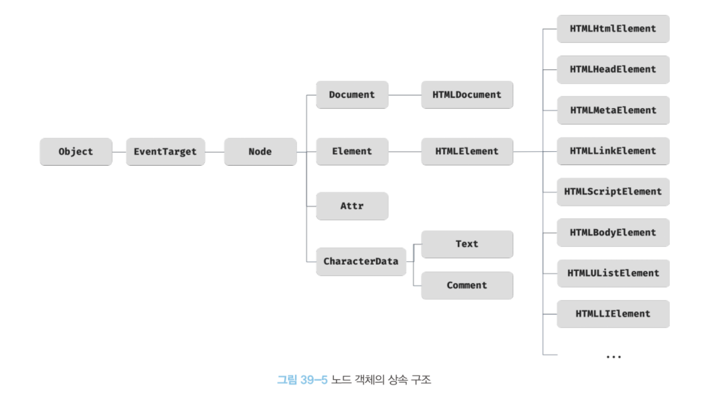
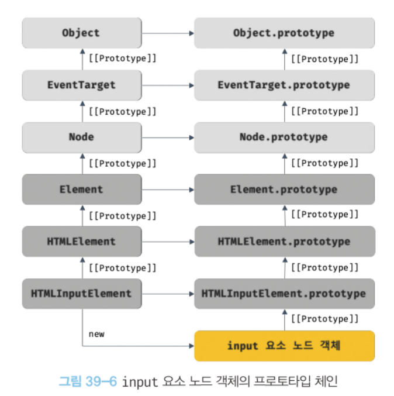
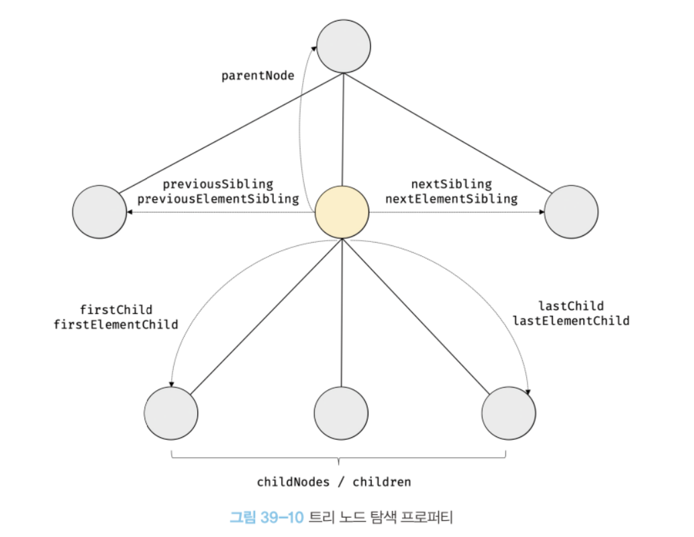
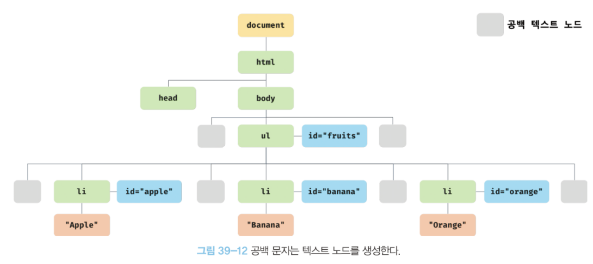

> DOM(Document Object Model)은 **HTML 문서의 계층적 구조와 정보를 표현**하여 이를 제어할 수 있는 API, 즉 **프로퍼티와 메서드를 제공**하는 트리 자료구조이다.

# 노드

## 1. HTML 요소와 노드 객체

HTML 요소는 HTML 문서를 구성하는 개별적인 요소를 의미한다.

HTML 요소는 렌더링 엔진에 의해 파싱되어 DOM을 구성하는 요소 노드 객체로 변환된다.

- HTML 요소의 어트리뷰트 → 어트리뷰트 노드
- HTML 요소의 텍스트 콘텐츠 → 텍스트 노드

HTML 요소 간 부자 관계를 반영하여 HTML 요소를 객체화한 모든 노드 객체들을 트리 자료구조로 구성한다.

이것을 **DOM**이라 하고 **DOM 트리**라고 부르기도 한다.

## 2. 노드 객체의 타입

노드 객체는 총 12개의 종류가 있다.

그 중에서 중요한 노드 타입은 다음과 같이 4가지이다.

- `문서 노드`
  - DOM 트리의 최상위에 존재하는 루트 노드로서 document 객체(브라우저가 렌더링한 HTML 문서 전체를 가리키는 객체)를 가리킨다.
  - 모든 자바스크립트 코드가 script 태그에 의해 분리되어 있더라도 window의 document 프로퍼티에 바인딩 된 하나의 document 객체를 바라본다. 즉, HTML 문서당 document 객체는 유일하다.
  - DOM 트리의 노드들에 접근하기 위한 진입점 역할을 담당한다.
- `요소 노드`
  - HTML 요소를 가리키는 객체
  - HTML 요소 간의 부자 관계를 통해 정보를 구조화 한다.
- `어트리뷰트 노드`
  - HTML 요소의 어트리뷰트를 가리키는 객체
  - 어트리뷰트 노드는 요소 노드에만 연결되어 있다.
- `텍스트 노드`
  - HTML 요소의 텍스트를 가리키는 객체
  - 요소 노드의 자식 노드이며, 자식 노드를 가질 수 없는 리프 노드다.

## 3. 노드 객체의 상속 구조

DOM을 구성하는 노드 객체는 ECMAScript 사양에 정의된 표준 빌트인 객체가 아니라 브라우저 환경에서 추가적으로 제공하는 호스트 객체이다.

하지만 노드 객체도 자바스크립트 객체이므로 프로토타입에 의한 상속 구조를 갖는다.





노드 객체의 상속 구조는 개발자 도구의 Elements 패널 우측의 Properties 패널에서 확인할 수 있다.


노드 객체는 노드 객체의 타입에 상관없이 공통으로 갖는 기능도 있고, 노드 타입에 따라 고유한 기능도 있다.

공통된 기능일수록 프로토타입 체인의 상위에, 개별적인 고유 기능일수록 프로토타입 체인의 하위에 프로토타입 체인을 구축한다.

---

# 요소 노드 취득

HTML의 구조나 내용 또는 스타일 등을 동적으로 조작하려면 먼저 요소 노드를 취득해야 한다.

## 1. id를 이용한 요소 노드 취득

`Document.prototype.getElementById` 메서드는 인수로 전달한 id 어트리뷰트 값을 갖는 **하나의 요소 노드**를 탐색하여 반환한다.

id 값은 HTML 문서 내에서 유일한 값이어야 한다.

만약 중복된 id를 갖는 HTML 요소가 여러 개 존재하더라도 첫 번째 요소 노드만 반환한다.

인수로 전달된 id 값을 갖는 노드가 없으면 null을 반환한다.

HTML 요소에 id 어트리뷰트를 부여하면 id 값과 동일한 이름의 전역 변수가 암묵적으로 선언되고 해당 노드 객체가 할당되는 부수 효과가 있다.

```jsx
<!DOCTYPE html>
<html>
  <body>
    <div id="foo"></div>
    <script>
      // id 값과 동일한 이름의 전역 변수가 암묵적으로 선언되고 해당 노드 객체가 할당된다.
      console.log(foo === document.getElementById('foo')); // true

      // 암묵적 전역으로 생성된 전역 프로퍼티는 삭제되지만 전역 변수는 삭제되지 않는다.
      delete foo;
      console.log(foo); // <div id="foo"></div>
    </script>
  </body>
</html>
```

단, id 값과 동일한 이름의 전역 변수가 이미 선언되어 있다면 이 전역 변수에 노드 객체가 재할당되지 않는다.

```jsx
<!DOCTYPE html>
<html>
  <body>
    <div id="foo"></div>
    <script>
      let foo = 1;

      // id 값과 동일한 이름의 전역 변수가 이미 선언되어 있으면 노드 객체가 재할당되지 않는다.
      console.log(foo); // 1
    </script>
  </body>
</html>
```

## 2. 태그 이름을 이용한 요소 노드 취득

`Document.prototype/Element.prototype.getElementsByTagName` 메서드는 인수로 전달한 태그 이름을 갖는 **모든 요소 노드**들을 탐색하여 반환한다.

`getElementsByTagName` 메서드가 반환하는 DOM 컬렉션 객체인 HTMLCollection 객체는 유사 배열 객체이면서 이터러블이다.

함수는 하나의 값만 반환할 수 있으므로 이 유사 배열 객체에 여러 개의 값을 담아 반환한다.

HTML 문서의 모든 요소 노드를 취득하려면 인수로 `*` 을 전달한다.

```jsx
// 모든 요소 노드를 탐색하여 반환한다.
const $all = document.getElementsByTagName("*");
// -> HTMLCollection(8) [html, head, body, ul, li#apple, li#banana, li#orange, script, apple: li#apple, banana: li#banana, orange: li#orange]
```

인수로 전달된 태그 이름을 갖는 요소가 존재하지 않는 경우 빈 HTMLCollection 객체를 반환한다.

## 3. class를 이용한 요소 노드 취득

`Document.prototype/Element.prototype.getElementsByClassName` 메서드는 인수로 전달한 class 어트리뷰트 값을 갖는 **모든 요소 노드**들을 탐색하여 반환한다.

인수로 전달할 class 값은 공백으로 구분하여 여러 개의 class를 지정할 수 있다.

`getElementsByTagName` 메서드와 마찬가지로 여러 개의 요소 노드 객체를 갖는 HTMLCollection 객체를 반환한다.

만약 인수로 전달된 class 값을 갖는 요소가 존재하지 않는 경우 빈 HTMLCollection 객체를 반환한다.

## 4. CSS 선택자를 이용한 요소 노드 취득

`Document.prototype/Element.prototype.querySelector` 메서드는 인수로 전달한 css 선택자를 만족시키는 **하나의 요소 노드**를 탐색하여 반환한다.

1. 인수로 전달한 CSS 선택자를 만족시키는 요소 노드가 여러 개인 경우 첫 번째 요소 노드만 반환한다.
2. 인수로 전달한 CSS 선택자를 만족시키는 요소 노드가 존재하지 않는 경우 null을 반환한다.
3. 인수로 전달한 CSS 선택자가 문법에 맞지 않는 경우 DOMException 에러가 발생한다.

`Document.prototype/Element.prototype.querySelectorAll` 메서드는 인수로 전달한 css 선택자를 만족시키는 모든 **요소 노드**를 탐색하여 반환한다.

`querySelectorAll` 메서드는 여러 개의 요소 노드 객체를 갖는 DOM 컬렉션 객체인 NodeList 객체를 반환한다.

NodeList 객체는 유사 배열 객체이면서 이터러블이다.

1. 인수로 전달한 CSS 선택자를 만족시키는 요소 노드가 존재하지 않는 경우 빈 NodeList 객체를 반환한다.
2. 인수로 전달한 CSS 선택자가 문법에 맞지 않는 경우 DOMException 에러가 발생한다.

HTML 문서의 모든 요소 노드를 취득하려면 querySelectorAll 메서드의 인수로 `*` 을 전달한다.

```jsx
// 모든 요소 노드를 탐색하여 반환한다.
const $all = document.querySelectorAll("*");
// -> NodeList(8) [html, head, body, ul, li#apple, li#banana, li#orange, script]
```

`querySelector`, `querySelectorAll` 메서드는 `getElementById`, `getElementsBy***` 메서드보다 다소 느린 것으로 알려져 있다.

하지만 CSS 선택자 문법을 사용하여 좀 더 구체적인 조건으로 요소 노드를 취득할 수 있고 일관된 방식으로 요소 노드를 취득할 수 있다.

## 5. 특정 요소 노드를 취득할 수 있는지 확인

`Element.prototype.matches` 메서드는 인수로 전달한 CSS 선택자를 통해 특정 요소 노드를 취득할 수 있는지 확인한다.

```jsx
<!DOCTYPE html>
<html>
  <body>
    <ul id="fruits">
      <li class="apple">Apple</li>
      <li class="banana">Banana</li>
      <li class="orange">Orange</li>
    </ul>
  </body>
  <script>
    const $apple = document.querySelector('.apple');

    // $apple 노드는 '#fruits > li.apple'로 취득할 수 있다.
    console.log($apple.matches('#fruits > li.apple'));  // true

    // $apple 노드는 '#fruits > li.banana'로 취득할 수 없다.
    console.log($apple.matches('#fruits > li.banana')); // false
  </script>
</html>
```

## 6. HTMLCollection과 NodeList

DOM 컬렉션 객체인 HTMLCollection과 NodeList는 DOM API가 여러 개의 결과값을 반환하기 위한 DOM 컬렉션 객체다.

둘 다 모두 유사 배열 객체이면서 이터러블이다. 따라서 `for...of` 문으로 순회할 수 있으며 스프레드 문법을 사용하여 간단히 배열로 변환할 수 있다.

HTMLCollection과 NodeList의 특징은 **노드 객체의 상태 변화를 실시간으로 반영**하는 살아있는(live) 객체라는 것이다.

### 1. HTMLCollection

`getElementsByTagName`, `getElementsByClassName` 메서드가 반환하는 살아있는 DOM 컬렉션 객체

**언제나** 노드 객체의 상태 변화를 실시간으로 반영한다.

```jsx
<!DOCTYPE html>
<head>
  <style>
    .red { color: red; }
    .blue { color: blue; }
  </style>
</head>
<html>
  <body>
    <ul id="fruits">
      <li class="red">Apple</li>
      <li class="red">Banana</li>
      <li class="red">Orange</li>
    </ul>
    <script>
      // class 값이 'red'인 요소 노드를 모두 탐색하여 HTMLCollection 객체에 담아 반환한다.
      const $elems = document.getElementsByClassName('red');
      // 이 시점에 HTMLCollection 객체에는 3개의 요소 노드가 담겨 있다.
      console.log($elems); // HTMLCollection(3) [li.red, li.red, li.red]

      // HTMLCollection 객체의 모든 요소의 class 값을 'blue'로 변경한다.
      for (let i = 0; i < $elems.length; i++) {
        $elems[i].className = 'blue';
      }

      // HTMLCollection 객체의 요소가 3개에서 1개로 변경되었다.
      console.log($elems); // HTMLCollection(1) [li.red]
    </script>
  </body>
</html>
```

위 코드의 결과로 모든 li 요소가 파란색으로 출력되어야 할 것 같은데 실제 결과는 두 번째 요소만 class 값이 변경되지 않는다.

그 이유는 HTMLCollection 객체가 실시간으로 노드 객체의 상태를 변경하므로 `$elems.length` 값도 변경되기 때문이다.

두 번째 반복에서 `$elems[i]`는 세 번째 li 요소를 가리킨다.

**해결법**

1. for 문을 역방향으로 순회
2. while 문으로 노드 객체가 남아있지 않을 때까지 순회
3. HTMLCollection 객체를 배열로 변환하여 순회

### 2. NodeList

`querySelectorAll` 메서드가 반환하는 DOM 컬렉션 객체

실시간으로 노드 객체의 상태 변경을 반영하지 않는(non-live) 객체다. 그러나 chileNodes 프로퍼티가 반환하는 NodeList 객체는 live 객체로 동작한다.

```jsx
<!DOCTYPE html>
<html>
  <body>
    <ul id="fruits">
      <li>Apple</li>
      <li>Banana</li>
    </ul>
  </body>
  <script>
    const $fruits = document.getElementById('fruits');

    // childNodes 프로퍼티는 NodeList 객체(live)를 반환한다.
    const { childNodes } = $fruits;
    console.log(childNodes instanceof NodeList); // true

    // $fruits 요소의 자식 노드는 공백 텍스트 노드(39.3.1절 "공백 텍스트 노드" 참고)를 포함해 모두 5개다.
    console.log(childNodes); // NodeList(5) [text, li, text, li, text]

    for (let i = 0; i < childNodes.length; i++) {
      // removeChild 메서드는 $fruits 요소의 자식 노드를 DOM에서 삭제한다.
      // (39.6.9절 "노드 삭제" 참고)
      // removeChild 메서드가 호출될 때마다 NodeList 객체인 childNodes가 실시간으로 변경된다.
      // 따라서 첫 번째, 세 번째 다섯 번째 요소만 삭제된다.
      $fruits.removeChild(childNodes[i]);
    }

    // 예상과 다르게 $fruits 요소의 모든 자식 노드가 삭제되지 않는다.
    console.log(childNodes); // NodeList(2) [li, li]
  </script>
</html>
```

따라서 노드 객체의 상태 변경과 상관없이 안전하게 DOM 컬렉션을 사용하려면 HTMLCollection이나 NodeList 객체를 배열로 변환하여 사용하는 것을 권장한다.

HTMLCollection이나 NodeList 객체를 배열로 변환하면 배열의 유용한 고차 함수를 사용할 수 있다.

---

# 노드 탐색



DOM 트리 상의 노드를 탐색할 수 있도록 Node, Element 인터페이스는 트리 탐색 프로퍼티를 제공한다.

노드 탐색 프로퍼티는 setter 없이 getter만 존재하여 참조만 가능한 읽기 전용 접근자 프로퍼티이다. 읽기 전용 접근자 프로퍼티에 값을 할당하면 아무런 에러 없이 무시된다.

## 1. 공백 텍스트 노드

HTML 요소 사이의 스페이스, 탭, 줄바꿈 등의 공백 문자는 텍스트 노드를 생성한다. 이를 공백 텍스트 노드라 한다.

```jsx
<!DOCTYPE html>
<html>
  <body>
    <ul id="fruits">
      <li class="apple">Apple</li>
      <li class="banana">Banana</li>
      <li class="orange">Orange</li>
    </ul>
  </body>
</html>
```

위의 코드는 파싱되어 다음과 같은 DOM을 생성한다.



이처럼 공백 문자는 공백 텍스트 노드를 생성하기 때문에 노드를 탐색할 때 주의하여야 한다.

## 2. 자식 노드 탐색

- `Node.prototype.childNodes`
  - 자식 노드를 모두 탐색하여 NodeList에 담아 반환한다.
  - 요소 노드뿐만 아니라 텍스트 노드도 포함되어 있을 수 있다.
- `Element.prototype.children`
  - 자식 노드 중에서 **요소 노드만** 모두 탐색하여 HTMLCollection에 담아 반환한다.
- `Node.prototype.firstChild`
  - 첫 번째 자식 노드를 반환한다.
  - 반환한 노드는 텍스트 노드이거나 요소노드다.
- `Node.prototype.lastChild`
  - 마지막 자식 노드를 반환한다.
  - 반환한 노드는 텍스트 노드이거나 요소노드다.
- `Element.prototype.firstElementChild`
  - 첫 번째 자식 **요소 노드**를 반환한다.
- `Element.prototype.lastElementChild`
  - 마지막 자식 **요소 노드**를 반환한다.

## 3. 자식 노드 존재 확인

자식 노드가 존재하는지 확인하려면 `Node.prototype.hasChildNodes` 메서드를 사용한다.

- 자식 노드가 존재하면 true, 존재하지 않으면 false를 반환한다.
- 텍스트 노드를 포함하여 자식 노드의 존재를 확인한다.
- 자식 노드 중에 텍스트 노드가 아닌 요소 노드가 존재하는지 확인하려면 `hasChildNodes` 메서드 대신 `children.length` 또는 Element 인터페이스의 `childElementCount` 프로퍼티를 사용한다.

## 4. 요소 노드의 텍스트 노드 탐색

요소 노드의 텍스트 노드는 요소 노드의 자식 노드다.

따라서 요소 노드의 텍스트 노드는 `firstChild` 프로퍼티로 접근할 수 있다.

`firstChild` 프로퍼티가 반환한 노드는 텍스트 노드이거나 요소 노드다.

```jsx
<!DOCTYPE html>
<html>
<body>
  <div id="foo">Hello</div>
  <script>
    // 요소 노드의 텍스트 노드는 firstChild 프로퍼티로 접근할 수 있다.
    console.log(document.getElementById('foo').firstChild); // #text
  </script>
</body>
</html>
```

## 5. 부모 노드 탐색

부모 노드를 탐색하려면 `Node.prototype.parentNode` 프로퍼티를 사용한다.

텍스트 노드는 DOM 트리의 리프 노드이므로 부모 노드가 텍스트 노드인 경우는 없다.

```jsx
<!DOCTYPE html>
<html>
  <body>
    <ul id="fruits">
      <li class="apple">Apple</li>
      <li class="banana">Banana</li>
      <li class="orange">Orange</li>
    </ul>
  </body>
  <script>
    // 노드 탐색의 기점이 되는 .banana 요소 노드를 취득한다.
    const $banana = document.querySelector('.banana');

    // .banana 요소 노드의 부모 노드를 탐색한다.
    console.log($banana.parentNode); // ul#fruits
  </script>
</html>
```

## 6. 형제 노드 탐색

- `Node.prototype.previousSibling`
  - 자신의 이전 형제 노드를 탐색하여 반환한다.
  - 반환하는 형제 노드는 요소 노드뿐만 아니라 텍스트 노드일 수도 있다.
- `Node.prototype.nextSibling`
  - 자신의 다음 형제 노드를 탐색하여 반환한다.
  - 반환하는 형제 노드는 요소 노드뿐만 아니라 텍스트 노드일 수도 있다.
- `Element.prototype.previousElementSibling`
  - 자신의 이전 형제 **요소 노드**를 탐색하여 반환한다.
- `Element.prototype.nextElementSibling`
  - 자신의 다음 형제 **요소 노드**를 탐색하여 반환한다.

---

# 노드 정보 취득

- `Node.prototype.nodeType`
  - 노드 타입을 나타내는 상수 반환
  - `Node.ELEMENT_NODE`: 요소 노드 타입 (상수 1)
  - `Node.TEXT_NODE`: 텍스트 노드 타입 (상수 3)
  - `Node.DOCUMENT_NODE`: 문서 노드 타입 (상수 9)
- `Node.prototype.nodeName`
  - 노드 이름을 문자열로 반환
  - 요소 노드: 대문자 문자열로 태그 이름 (”UL”, “LI” 등)을 반환
  - 텍스트 노드: 문자열 “#text” 반환
  - 문서 노드: 문자열 “#document” 반환

---

# 요소 노드의 텍스트 조작

## 1. nodeValue

`Node.prototype.nodeValue` 프로퍼티는 setter와 getter 모두 존재하는 접근자 프로퍼티다.

노드 객체의 nodeValue 프로퍼티를 참조하면 노드 객체의 값(텍스트 노드의 텍스트)을 반환한다.

텍스트 노드가 아닌 문서노드나 요소 노드의 nodeValue 프로퍼티를 참조하면 null을 반환한다.

```jsx
<!DOCTYPE html>
<html>
  <body>
    <div id="foo">Hello</div>
  </body>
  <script>
    // 문서 노드의 nodeValue 프로퍼티를 참조한다.
    console.log(document.nodeValue); // null

    // 요소 노드의 nodeValue 프로퍼티를 참조한다.
    const $foo = document.getElementById('foo');
    console.log($foo.nodeValue); // null

    // 텍스트 노드의 nodeValue 프로퍼티를 참조한다.
    const $textNode = $foo.firstChild;
    console.log($textNode.nodeValue); // Hello
  </script>
</html>
```

텍스트 노드의 nodeValue 프로퍼티에 값을 할당하면 텍스트 노드의 텍스트를 변경할 수 있다.

```jsx
<!DOCTYPE html>
<html>
  <body>
    <div id="foo">Hello</div>
  </body>
  <script>
    // 1. #foo 요소 노드의 자식 노드인 텍스트 노드를 취득한다.
    const $textNode = document.getElementById('foo').firstChild;

    // 2. nodeValue 프로퍼티를 사용하여 텍스트 노드의 값을 변경한다.
    $textNode.nodeValue = 'World';

    console.log($textNode.nodeValue); // World
  </script>
</html>
```

## 2. textContent

`Node.prototype.textContent` 프로퍼티는 setter와 getter 모두 존재하는 접근자 프로퍼티로서 요소 노드의 텍스트와 모든 자손 노드의 텍스트를 모두 취득하거나 변경한다.

요소 노드의 textContent 프로퍼티를 참조하면 요소 노드의 콘텐츠 영역(시작 태그와 종료 태그 사이) 내의 텍스트를 모두 반환한다.

즉, 요소 노드의 childNodes 프로퍼티가 반환한 모든 노드들의 텍스트 노드의 값을 반환한다. HTML 마크업은 무시된다.

```jsx
<!DOCTYPE html>
<html>
  <body>
    <div id="foo">Hello <span>world!</span></div>
  </body>
  <script>
    // #foo 요소 노드의 텍스트를 모두 취득한다. 이때 HTML 마크업은 무시된다.
    console.log(document.getElementById('foo').textContent); // Hello world!
  </script>
</html>
```

요소 노드의 textContent 프로퍼티에 문자열을 할당하면 요소 노드의 모든 자식 노드가 제거되고 할당한 문자열이 텍스트로 추가된다.

이때 할당한 문자열에 HTML 마크업이 포함되어 있더라도 문자열 그대로 인식되어 텍스트로 취급된다.

```jsx
<!DOCTYPE html>
<html>
  <body>
    <div id="foo">Hello <span>world!</span></div>
  </body>
  <script>
    // #foo 요소 노드의 모든 자식 노드가 제거되고 할당한 문자열이 텍스트로 추가된다.
    // 이때 HTML 마크업이 파싱되지 않는다.
    document.getElementById('foo').textContent = 'Hi <span>there!</span>';
  </script>
</html>
```

`nodeValue`를 사용하는 경우 텍스트 노드가 아닌 경우에는 null을 반환하므로 `textContent`보다 코드가 복잡해진다.

`textContent`와 비슷한 동작을 하는 `innerText` 프로퍼티가 있는데 다음과 같은 이유로 사용하지 않는 것이 좋다.

- innerText 프로퍼티는 CSS에 순종적이므로 `visibility: hidden;`과 같이 비표시로 지정된 요소 노드의 텍스트는 반환하지 않는다.
- innerText 프로퍼티는 CSS를 고려해야 하므로 textContent 프로퍼티보다 느리다.
