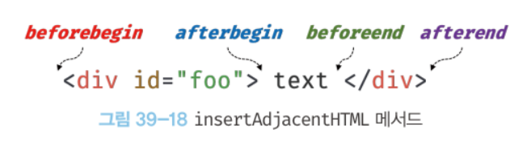
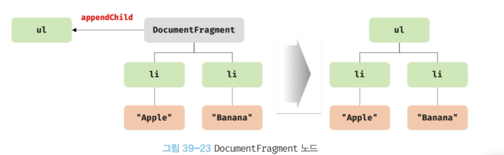
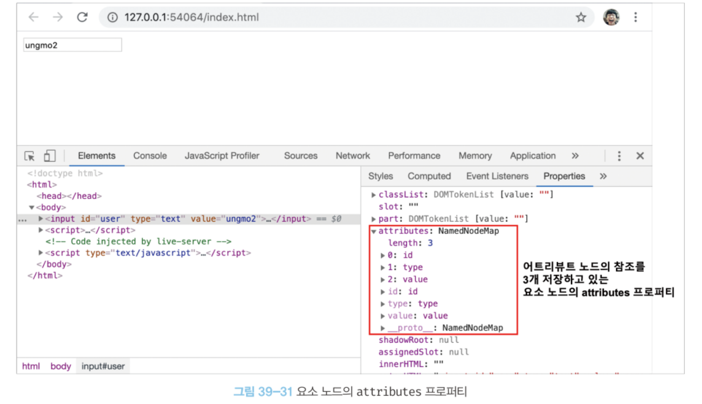
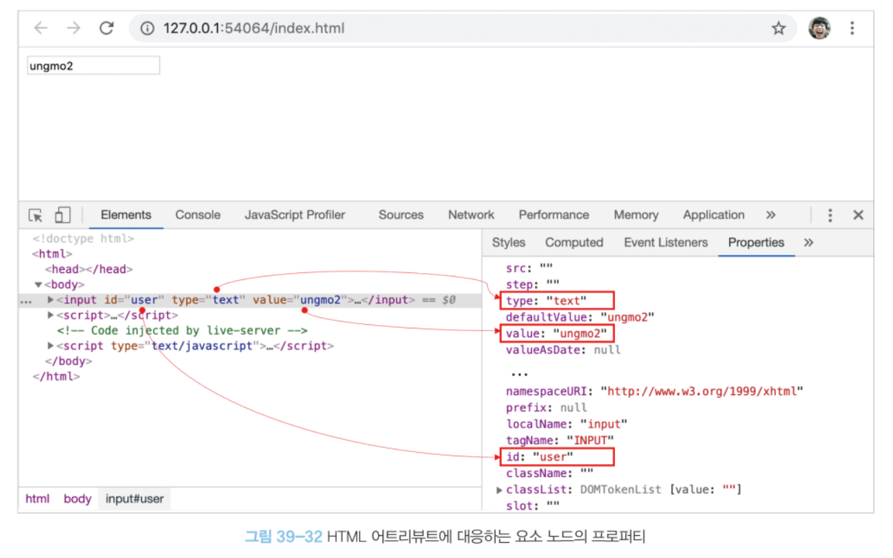
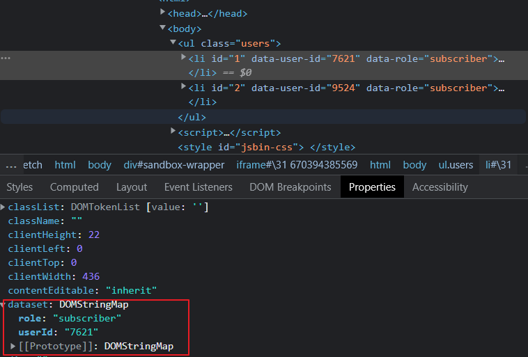

# DOM 조작

새로운 노드를 생성하여 DOM에 추가하거나 기존 노드를 삭제 또는 교체하는 것

DOM 조작에 의해 DOM에 새로운 노드가 추가되거나 삭제되면 리플로우와 리페인트가 발생한다.

## 1. innerHTML

`Element.prototype.innerHTML`은 setter와 getter 모두 존재하는 접근자 프로퍼티

- 요소 노드의 HTML 마크업을 취득하거나 변경한다.
- 요소 노드의 innerHTML 프로퍼티를 참조하면 요소 노드의 콘텐츠 영역 내에 포함된 모든 HTML 마크업을 문자열로 반환한다.

```jsx
<!DOCTYPE html>
<html>
  <body>
    <div id="foo">Hello <span>world!</span></div>
  </body>
  <script>
    // #foo 요소의 콘텐츠 영역 내의 HTML 마크업을 문자열로 취득한다.
    console.log(document.getElementById('foo').innerHTML);
    // "Hello <span>world!</span>"
  </script>
</html>
```

사용자로부터 입력받은 데이터를 그대로 innerHTML 프로퍼티에 할당하는 것은 <strong>크로스 사이트 스크립팅 공격(XSS)</strong>에 취약하므로 위험하다.

### 💡XSS: 크로스 사이트 스크립팅 공격

웹 사이트 관리자가 아닌 이가 웹 페이지에 악성 스크립트를 삽입하는 것.

해커가 사용자의 정보를 탈취하거나 자동으로 비정상적인 기능을 수행하게 할 수 있다.

```jsx
<!DOCTYPE html>
<html>
  <body>
    <div id="foo">Hello</div>
  </body>
  <script>
    // 에러 이벤트를 강제로 발생시켜서 자바스크립트 코드가 실행되도록 한다.
    document.getElementById('foo').innerHTML
      = ``;
  </script>
</html>
```

### 💡HTML 새니티제이션

크로스 사이트 스크립팅 공격을 예방하기 위해 잠재적 위험을 제거하는 기능

`DOMPurify`는 잠재적 위험을 내포한 HTML 마크업을 새니티제이션하여 잠재적 위험을 제거한다.

```jsx
DOMPurify.sanitize('');
// => 
```

innerHTML 프로퍼티에 HTML 마크업 문자열을 할당하는 경우 요소 노드의 모든 자식 노드를 제거하고 할당한 HTML 마크업 문자열을 파싱하여 DOM을 변경한다.

```jsx
<!DOCTYPE html>
<html>
  <body>
    <ul id="fruits">
      <li class="apple">Apple</li>
    </ul>
  </body>
  <script>
    const $fruits = document.getElementById('fruits');

    // 노드 추가
    $fruits.innerHTML += '<li class="banana">Banana</li>';
  </script>
</html>
```

위 코드의 경우 li.apple이 제거될 필요가 없지만 li.apple 요소를 제거하고 다시 li.apple과 li.banana를 생성하여 #fruits 요소의 자식 요소로 추가한다. (비효율적)

innerHTML 프로퍼티는 새로운 요소를 삽입할 때 삽입될 위치를 지정할 수 없다.

```jsx
<ul id="fruits">
  <li class="apple">Apple</li>
  <li class="orange">Orange</li>
</ul>
```

li.apple과 li.orange 사이에 요소를 추가할 수 없다.

## 2. insertAdjacentHTML 메서드

`Element.prototype.insertAdjacentHTML(position, DOMString)` 메서드는 **기존 요소를 제거하지 않으면서** 위치를 지정해 새로운 요소를 삽입한다.

- position: beforebegin, afterbegin, beforeend, afterend



기존 요소에는 영향을 주지 않고 새롭게 삽입될 요소만을 파싱하여 자식 요소로 추가하므로 innerHTML 프로퍼티보다 효율적이고 빠르다.

단, innerHTML과 마찬가지로 HTML 마크업 문자열을 파싱하므로 XSS 공격에 취약하다.

## 3. 노드 생성과 추가

```jsx
<!DOCTYPE html>
<html>
  <body>
    <ul id="fruits">
      <li>Apple</li>
    </ul>
  </body>
  <script>
    const $fruits = document.getElementById('fruits');

    // 1. 요소 노드 생성
    const $li = document.createElement('li');

    // 2. 텍스트 노드 생성
    const textNode = document.createTextNode('Banana');

    // 3. 텍스트 노드를 $li 요소 노드의 자식 노드로 추가
    $li.appendChild(textNode);

    // 4. $li 요소 노드를 #fruits 요소 노드의 마지막 자식 노드로 추가
    $fruits.appendChild($li);
  </script>
</html>
```

DOM은 노드를 직접 생성/삽입/삭제/치환하는 메서드도 제공한다.

### 과정

- **요소 노드 생성**
  - `Document.prototype.createElement(tagName)` 메서드는 요소 노드를 생성하여 반환한다.
  - 요소 노드를 생성할 뿐이므로 DOM에 추가하는 처리가 별도로 필요하다.
- **텍스트 노드 생성**
  - `Document.prototype.createTextNode(text)` 메서드는 텍스트 노드를 생성하여 반환한다.
  - 텍스트 노드를 생성할 뿐이므로 요소 노드에 추가하는 처리가 별도로 필요하다.
- **텍스트 노드를 요소 노드의 자식 노드로 추가**
  - `Node.prototype.appendChild(childNode)` 메서드는 childNode를 appendChild 메서드를 호출한 노드의 마지막 자식 노드로 추가한다.
  - 요소 노드에 자식 노드가 하나도 없는 경우, textContent 프로퍼티를 사용하는 편이 더욱 간편하다.
- **요소 노드를 DOM에 추가**

## 4. 복수의 노드 생성과 추가

```jsx
<!DOCTYPE html>
<html>
  <body>
    <ul id="fruits"></ul>
  </body>
  <script>
    const $fruits = document.getElementById('fruits');

    ['Apple', 'Banana', 'Orange'].forEach(text => {
      // 1. 요소 노드 생성
      const $li = document.createElement('li');

      // 2. 텍스트 노드 생성
      const textNode = document.createTextNode(text);

      // 3. 텍스트 노드를 $li 요소 노드의 자식 노드로 추가
      $li.appendChild(textNode);

      // 4. $li 요소 노드를 #fruits 요소 노드의 마지막 자식 노드로 추가
      $fruits.appendChild($li);
    });
  </script>
</html>
```

위 코드는 리플로우와 리페인트가 3번 발생하여 비효율적이다.

DOM을 여러 번 변경하는 문제를 회피하기 위해 컨테이너 요소를 사용할 수 있다.

```jsx
<!DOCTYPE html>
<html>
  <body>
    <ul id="fruits"></ul>
  </body>
  <script>
    const $fruits = document.getElementById('fruits');

    // 컨테이너 요소 노드 생성
    const $container = document.createElement('div');

    ['Apple', 'Banana', 'Orange'].forEach(text => {
      // 1. 요소 노드 생성
      const $li = document.createElement('li');

      // 2. 텍스트 노드 생성
      const textNode = document.createTextNode(text);

      // 3. 텍스트 노드를 $li 요소 노드의 자식 노드로 추가
      $li.appendChild(textNode);

      // 4. $li 요소 노드를 컨테이너 요소의 마지막 자식 노드로 추가
      $container.appendChild($li);
    });

    // 5. 컨테이너 요소 노드를 #fruits 요소 노드의 마지막 자식 노드로 추가
    $fruits.appendChild($container);
  </script>
</html>
```

컨테이너 요소를 미리 생성한 다음 추가해야 할 3개의 요소를 컨테이너 요소의 자식 노드로 추가하고 컨테이너 요소를 #fruits 요소에 자식으로 추가하면 DOM은 한 번만 변경된다.

그러나 이 방법은 불필요한 컨테이너 요소(div)가 추가되는 부작용이 있다.

이러한 문제는 DocumentFragment 노드를 통해 해결할 수 있다.

### DocumentFragment

- 노드 객체의 일종으로, **별도의 서브 DOM을 구성**하여 기존 DOM에 추가하기 위한 용도로 사용한다.
- 부모 노드가 없어 기존 DOM과는 별도로 존재한다.
  ⇒ 자식 노드를 추가하여도 기존 DOM에는 어떠한 변경도 발생하지 않는다.
- DocumentFragment 노드를 DOM에 추가하면 자신은 제거되고 자신의 자식 노드만 DOM에 추가된다.



## 5. 노드 삽입

### 마지막 노드로 추가

`Node.prototype.appendChild(childNode)`

노드를 추가할 위치를 지정할 수 없고 언제나 마지막 자식 노드로 추가된다.

### 지정한 위치에 노드 삽입

`Node.prototype.insertBefore(newNode, childNode)`

첫 번째 인수로 전달받은 노드를 두 번째 인수로 전달받은 노드 앞에 삽입한다.

- 두 번째 인수로 전달받은 노드는 메서드를 호출한 노드의 자식 노드여야 한다.
- 두 번째 인수로 전달받은 노드가 null이면 appendChild처럼 동작한다.

## 6. 노드 이동

이미 존재하는 노드를 `appendChild` 또는 `insertBefore` 메서드를 사용하여 DOM에 다시 추가하면 노드가 이동한다.

```jsx
<!DOCTYPE html>
<html>
  <body>
    <ul id="fruits">
      <li>Apple</li>
      <li>Banana</li>
      <li>Orange</li>
    </ul>
  </body>
  <script>
    const $fruits = document.getElementById('fruits');

    // 이미 존재하는 요소 노드를 취득
    const [$apple, $banana, ] = $fruits.children;

    // 이미 존재하는 $apple 요소 노드를 #fruits 요소 노드의 마지막 노드로 이동
    $fruits.appendChild($apple); // Banana - Orange - Apple

    // 이미 존재하는 $banana 요소 노드를 #fruits 요소의 마지막 자식 노드 앞으로 이동
    $fruits.insertBefore($banana, $fruits.lastElementChild);
    // Orange - Banana - Apple
  </script>
</html>
```

## 7. 노드 복사

`Node.prototype.cloneNode([deep: true | false])` 메서드는 노드의 사본을 생성하여 반환한다.

- deep: true
  - 노드를 깊은 복사하여 모든 자손 노드가 포함된 사본 생성
- deep: false
  - 노드를 얕은 복사하여 노드 자신만의 사본 생성
  - 자손 노드를 복사하지 않으므로 텍스트 노드도 없다.

## 8. 노드 교체

`Node.prototype.replaceChild(newChild, oldChild)` 메서드는 자신을 호출한 노드의 자식 노드를 다른 노드로 교체한다.

- oldChild: 이미 존재하는 교체될 노드

## 9. 노드 삭제

`Node.prototype.removeChild(child)` 메서드는 child 매개변수에 인수로 전달한 노드를 DOM에서 삭제한다.

---

# 어트리뷰트

## 1. 어트리뷰트 노드와 attributes 프로퍼티

HTML 어트리뷰트는 HTML 요소의 시작 태그에 `어트리뷰트 이름="어트리뷰트 값"` 형식으로 정의한다.

```jsx
<input id="user" type="text" value="HELLO">
```

- 글로벌 어트리뷰트
  - id, class, style, title, lang, tabindex, draggable, hidden
- 이벤트 핸들러 어트리뷰트
  - onclick, onchange, onfocus, onblur, oninput, onkeypress …

HTML 문서가 파싱될 때 HTML 요소의 어트리뷰트는 어트리뷰트 노드로 변환되어 요소 노드와 연결된다.

모든 어트리뷰트 노드의 참조는 유사 배열 객체이자 이터러블은 `NamedNodeMap` 객체에 담겨서 요소 노드의 attributes 프로퍼티에 저장된다.



attributes 프로퍼티는 getter만 존재하는 접근자 프로퍼티이다.

```jsx
<!DOCTYPE html>
<html>
<body>
  <input id="user" type="text" value="ungmo2">
  <script>
    // 요소 노드의 attribute 프로퍼티는 요소 노드의 모든 어트리뷰트 노드의 참조가 담긴 NamedNodeMap 객체를 반환한다.
    const { attributes } = document.getElementById('user');
    console.log(attributes);
    // NamedNodeMap {0: id, 1: type, 2: value, id: id, type: type, value: value, length: 3}

    // 어트리뷰트 값 취득
    console.log(attributes.id.value); // user
    console.log(attributes.type.value); // text
    console.log(attributes.value.value); // ungmo2
  </script>
</body>
</html>
```

## 2. HTML 어트리뷰트 조작

attributes 프로퍼티는 getter만 존재하는 읽기 전용 접근자 프로퍼티이므로 값을 취득할 수 있지만 변경할 수는 없다.

`Element.prototype.getAttribute/setAttribute` 메서드를 사용하면 attributes 프로퍼티를 통하지 않고 직접 HTML 어트리뷰트 값을 취득하거나 변경할 수 있다.

```jsx
<!DOCTYPE html>
<html>
<body>
  <input id="user" type="text" value="ungmo2">
  <script>
    const $input = document.getElementById('user');

    // value 어트리뷰트 값을 취득
    const inputValue = $input.getAttribute('value');
    console.log(inputValue); // ungmo2

    // value 어트리뷰트 값을 변경
    $input.setAttribute('value', 'foo');
    console.log($input.getAttribute('value')); // foo
  </script>
</body>
</html>
```

특정 HTML 어트리뷰트가 존재하는지 확인하려면 `Element.prototype.hasAttribute(attributeName)` 메서드를 사용하고,

특정 HTML 어트리뷰트를 삭제하려면 `Element.prototype.removeAttribute(attributeName)` 메서드를 사용한다.

## 3. HTML 어트리뷰트 vs DOM 프로퍼티

요소 노드 객체에는 HTML 어트리뷰트에 대응하는 DOM 프로퍼티(요소 노드의 프로퍼티)가 존재한다.

DOM 프로퍼티는 HTML 어트리뷰트 값을 초기값으로 갖는다.



DOM 프로퍼티는 getter와 setter 모두 존재하는 접근자 프로퍼티이므로 참조와 변경이 가능하다.

HTML 어트리뷰트는 DOM에서 중복 관리되고 있는 것처럼 보인다.

- 요소 노드의 attributes 프로퍼티에서 관리하는 어트리뷰트 노드
- HTML 어트리뷰트에 대응하는 요소 노드의 프로퍼티(DOM 프로퍼티)

그러나 **HTML 어트리뷰트의 역할은 HTML 요소의 초기 상태를 지정하는 것**이다.

```jsx
<input id="user" type="text" value="HELLO">
```

input 요소의 value 어트리뷰트는 어트리뷰트 노드로 변환되어 요소 노드의 attributes 프로퍼티에 저장된다.

이와는 별도로 value 어트리뷰트 값은 요소 노드의 value 프로퍼티에 할당된다.

하지만 첫 렌더링 이후 사용자가 input 요소에 무언가를 입력하기 시작하면 상황이 달라진다.

요소 노드는 **상태(state)**를 가지고 있으며 사용자의 입력에 의해 변경된 **최신 상태**와 **초기 상태**를 관리해야한다. 새로고침을 했을 때 초기 상태를 표시해야 하기 때문이다.

요소 노드의 초기 상태는 어트리뷰트 노드가 관리하며, 요소 노드의 최신 상태는 DOM 프로퍼티가 관리한다.

### 어트리뷰트 노드

사용자의 입력에 의해 상태가 변경되어도 변하지 않고 HTML 어트리뷰트로 지정한 초기 상태를 그대로 유지한다.

- 어트리뷰트 초기 상태 값 취득
  - `getAttribute`
- 어트리뷰트 초기 상태 값 변경
  - `setAttribute`

### DOM 프로퍼티

사용자의 입력에 의한 상태 변화에 반응하여 언제나 최신 상태를 유지한다.

```jsx
<!DOCTYPE html>
<html>
<body>
  <input id="user" type="text" value="ungmo2">
  <script>
    const $input = document.getElementById('user');

    // 사용자가 input 요소의 입력 필드에 값을 입력할 때마다 input 요소 노드의
    // value 프로퍼티 값, 즉 최신 상태 값을 취득한다. value 프로퍼티 값은 사용자의 입력에
    // 의해 동적으로 변경된다.
    $input.oninput = () => {
      console.log('value 프로퍼티 값', $input.value);
    };

    // getAttribute 메서드로 취득한 HTML 어트리뷰트 값, 즉 초기 상태 값은 변하지 않고 유지된다.
    console.log('value 어트리뷰트 값', $input.getAttribute('value'));
  </script>
</body>
</html>
```

그러나 사용자 입력에 의한 상태 변화와 관계없는 id 어트리뷰트와 id 프로퍼티는 항상 동일한 값을 유지한다.

### HTML 어트리뷰트와 DOM 프로퍼티의 대응 관계

대부분의 HTML 어트리뷰트는 HTML 어트리뷰트 이름과 동일한 DOM 프로퍼티와 1:1로 대응한다.

그러나 언제나 1:1로 대응하는 것은 아니다.

- id 어트리뷰트 - id 프로퍼티
- value 어트리뷰트(초기 상태) - value 프로퍼티(최신 상태)
- class 어트리뷰트 - className, classList 프로퍼티
- for 어트리뷰트 - htmlFor 프로퍼티
- colspan 어트리뷰트 - 프로퍼티 x
- textContent 프로퍼티 - 어트리뷰트 x
- 어트리뷰트 이름은 대소문자를 구별하지 않지만 대응하는 프로퍼티 키는 카멜 케이스를 따른다.

### DOM 프로퍼티 값의 타입

`getAttribute` 메서드로 취득한 어트리뷰트 값은 언제나 문자열이다.

DOM 프로퍼티로 취득한 최신 상태 값은 문자열이 아닐 수도 있다. (checked: 불리언)

## 4. data 어트리뷰트와 dataset 프로퍼티

data 어트리뷰트와 dataset 프로퍼티를 사용하면 HTML 요소에 정의한 사용자 정의 어트리뷰트와 자바스크립트 간에 데이터를 교환할 수 있다.

data 어트리뷰트의 값은 HTMLElement.dataset 프로퍼티로 취득할 수 있다.

dataset 프로퍼티는 HTML 요소의 모든 data 어트리뷰트 정보를 제공하는 DOMStringMap 객체를 반환한다.

```jsx
<!DOCTYPE html>
<html>
<body>
  <ul class="users">
    <li id="1" data-user-id="7621" data-role="admin">Lee</li>
    <li id="2" data-user-id="9524" data-role="subscriber">Kim</li>
  </ul>
  <script>
    const users = [...document.querySelector('.users').children];

    // user-id가 '7621'인 요소 노드를 취득한다.
    const user = users.find(user => user.dataset.userId === '7621');
    // user-id가 '7621'인 요소 노드에서 data-role의 값을 취득한다.
    console.log(user.dataset.role); // "admin"

    // user-id가 '7621'인 요소 노드의 data-role 값을 변경한다.
    user.dataset.role = 'subscriber';
    // dataset 프로퍼티는 DOMStringMap 객체를 반환한다.
    console.log(user.dataset); // DOMStringMap {userId: "7621", role: "subscriber"}
  </script>
</body>
</html>
```



data 어트리뷰트는 `data-` 접두사 다음에 임의의 이름을 붙여 사용한다.

dataset 프로퍼티에 카멜케이스 형식으로 추가한 프로퍼티 키(fooBar)는 data 어트리뷰트의 `data-` 접두사 다음에 케밥케이스(data-foo-bar)로 자동 변경되어 추가된다.

---

# 스타일

## 1. 인라인 스타일 조작

`HTMLElement.prototype.style` 프로퍼티는 setter와 getter 모두 존재하는 접근자 프로퍼티로서 요소 노드의 **인라인 스타일**을 취득하거나 추가 또는 변경한다.

```jsx
<!DOCTYPE html>
<html>
<body>
  <div style="color: red">Hello World</div>
  <script>
    const $div = document.querySelector('div');

    // 인라인 스타일 취득
    console.log($div.style); // CSSStyleDeclaration { 0: "color", ... }

    // 인라인 스타일 변경
    $div.style.color = 'blue';

    // 인라인 스타일 추가
    $div.style.width = '100px';
    $div.style.height = '100px';
    $div.style.backgroundColor = 'yellow';
  </script>
</body>
</html>
```

- style 프로퍼티를 참조하면 CSSStyleDeclaration 타입의 객체를 반환한다.
- CSS 프로퍼티는 케밥 케이스를 따르며 CSSStyleDeclaration 객체의 프로퍼티는 카멜 케이스를 따른다.
  - ‘background-color’ → ‘backgroundColor’
- 케밥 케이스를 그대로 사용하려면 대괄호 표기법 사용

```jsx
$div.style["background-color"] = "yellow";
```

- 단위 지정이 필요한 CSS 프로퍼티의 값은 반드시 단위를 지정해야 한다.

## 2. 클래스 조작

class 어트리뷰트에 대응하는 DOM 프로퍼티는 className과 classList이다.

### className

`Element.prototype.className` 프로퍼티는 setter와 getter 모두 존재하는 접근자 프로퍼티로서 HTML 요소의 class 어트리뷰트 값을 취득하거나 변경한다.

- 요소 노드의 className 프로퍼티를 참조하면 class 어트리뷰트 값을 문자열로 반환하고,
- 요소 노드의 className 프로퍼티에 문자열을 할당하면 class 어트리뷰트 값을 할당한 문자열로 변경한다.

className 프로퍼티는 문자열을 반환하므로 공백으로 구분된 여러 개의 클래스를 반환하는 경우 다루기가 불편하다.

```jsx
console.log($box.className); // 'box red'
```

### classList

`Element.prototype.classList` 프로퍼티는 class 어트리뷰트의 정보를 담은 DOMTokenList 객체를 반환한다.

DOMTokenList 객체는 class 어트리뷰트의 정보를 나타내는 컬렉션 객체로서 유사 배열 객체이면서 이터러블이다.

```jsx
console.log($box.classList);
// DOMTokenList(2) [length: 2,  value: "box blue", 0: "box", 1: "blue"]
```

DOMTokenList 객체가 제공하는 유용한 메서드

- add(… className)
  - 인수로 전달한 1개 이상의 문자열을 class 어트리뷰트 값으로 추가한다.
- remove(… className)
  - 인수로 전달한 1개 이상의 문자열과 일치하는 클래스를 class 어트리뷰트에서 삭제한다.
  - 일치하는 클래스가 없으면 무시
- item(index)
  - index에 해당하는 클래스를 class 어트리뷰트에서 반환한다.
- contains(className)
  - 인수로 전달한 문자열과 일치하는 클래스가 class 어트리뷰트에 포함되어 있는지 확인한다.
- replace(oldClassName, newClassName)
  - 첫 번째 인수로 전달한 문자열을 두 번째 인수로 전달한 문자열로 변경한다.
- toggle(className[, force])
  - 인수로 전달한 문자열과 일치하는 클래스가 존재하면 제거하고, 존재하지 않으면 추가한다.
  - force: 불리언 값으로 평가되는 조건식 전달
    ```jsx
    // class 어트리뷰트에 강제로 'foo' 클래스를 추가
    $box.classList.toggle("foo", true); // -> class="box blue foo"
    // class 어트리뷰트에서 강제로 'foo' 클래스를 제거
    $box.classList.toggle("foo", false); // -> class="box blue"
    ```
    ```jsx
    span.classList.toggle("c", window.innerWidth > 1000);
    ```
    브라우저 윈도우 크기가 1000픽셀 이상일 때만 추가된다.
- 그 외에 forEach, entries, keys, value, supports 메서드 제공

## 3. 요소에 적용되어 있는 CSS 스타일 참조

style 프로퍼티는 인라인 스타일만 반환하여, 클래스를 적용한 스타일이나 상속을 통해 암묵적으로 적용된 스타일은 참조할 수 없다.

`window.getComputedStyle(element[, pseudo])` 메서드는 인수로 전달한 element 요소 노드에 적용되어 있는 스타일을 CSSStyleDeclaration 객체에 담아 반환한다.

```jsx
<!DOCTYPE html>
<html>
<head>
  <style>
    body {
      color: red;
    }
    .box {
      width: 100px;
      height: 50px;
      background-color: cornsilk;
      border: 1px solid black;
    }
  </style>
</head>
<body>
  <div class="box">Box</div>
  <script>
    const $box = document.querySelector('.box');

    // .box 요소에 적용된 모든 CSS 스타일을 담고 있는 CSSStyleDeclaration 객체를 취득
    const computedStyle = window.getComputedStyle($box);
    console.log(computedStyle); // CSSStyleDeclaration

    // 임베딩 스타일
    console.log(computedStyle.width); // 100px
    console.log(computedStyle.height); // 50px
    console.log(computedStyle.backgroundColor); // rgb(255, 248, 220)
    console.log(computedStyle.border); // 1px solid rgb(0, 0, 0)

    // 상속 스타일(body -> .box)
    console.log(computedStyle.color); // rgb(255, 0, 0)

    // 기본 스타일
    console.log(computedStyle.display); // block
  </script>
</body>
</html>
```

두 번째 인수 pseudo로 :after, :before와 같은 의사 요소를 지정하는 문자열을 전달할 수 있다.

```jsx
<!DOCTYPE html>
<html>
<head>
  <style>
    .box:before {
      content: 'Hello';
    }
  </style>
</head>
<body>
  <div class="box">Box</div>
  <script>
    const $box = document.querySelector('.box');

    // 의사 요소 :before의 스타일을 취득한다.
    const computedStyle = window.getComputedStyle($box, ':before');
    console.log(computedStyle.content); // "Hello"
  </script>
</body>
</html>
```

---

DOM 표준은 생략
