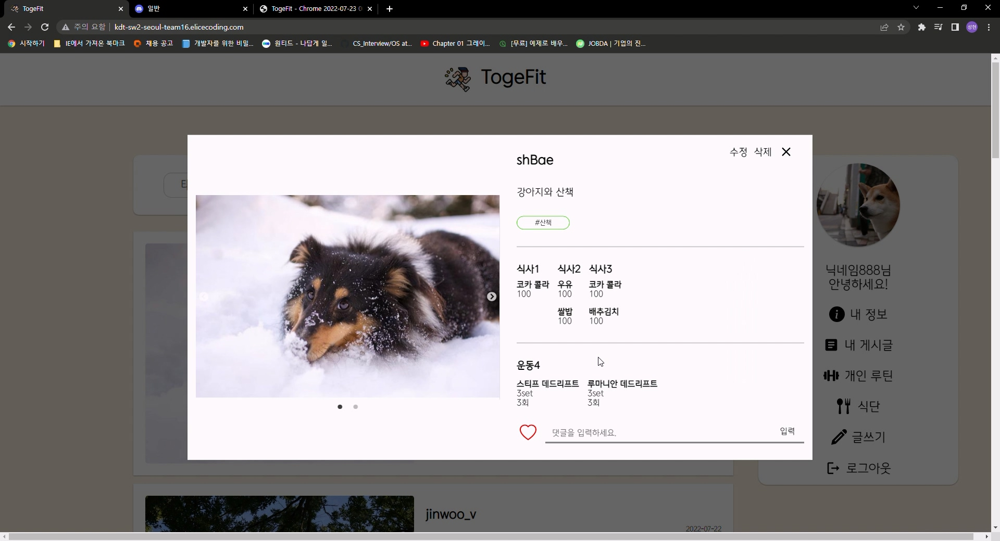

# TogeFit ?

식단과 운동 등 건강 관리에 관련된 정보들을 공유할 수 있는 커뮤니티 프로젝트입니다.

자신의 운동, 식단 기록을 관리하고, 다른 사람과 공유할 수 있습니다.

본인의 기록을 남과 공유함으로써 커뮤니케이션이 가능하고, 다른 사람의 기록을 확인하면서 정보 또한 쉽게 얻을 수 있는 커뮤니티를 제작하고자 하였습니다.

# 사용한 프레임워크/라이브러리

- DB - `mongoDB`
- server - `node.js` `express.js` `mongoose`
- test code - `Jest`

# 담당

**백엔드 포지션**을 담당했습니다.

프론트엔드 포지션을 희망했지만 백엔드 팀원이 1명이라 프로젝트 진행이 더뎌질 것을 우려하여 백엔드 포지션으로 프로젝트에 참여하게 되었습니다.

기간 내 프로젝트를 완성시키는 것이 중요하기도 하고 백엔드 개발자와의 원활한 커뮤니케이션을 위해 백엔드 지식을 알아두는 것도 좋을 것 같다 생각하여 포지션 변경을 결심하게 되었습니다.

- 회원, 음식, 식단, 게시글 CRUD API 작성
- Jest를 이용하여 약 80개의 테스트 코드 작성
  - 각 기능마다 성공하는 테스트 케이스와 실패하는 테스트 케이스 작성

# 어려웠던 점

게시글을 눌렀을 때 게시글을 상세보기 하게 되는데, 이 경우 회원의 오늘 식단과 운동 루틴을 화면에 그리기 위해 클라이언트가 게시글 ID를 이용하여 게시글을 가져오려는 작업을 하는 경우 서버에서 식단 ID와 운동 루틴 ID를 이용하여 식단의 정보와 운동 루틴의 정보를 가져와야 합니다.

즉, 데이터베이스에 담긴 정보 중 meal, routine에 저장된 ID를 가지고 DB의 meals, routines 컬렉션에서그 ID에 해당하는 데이터를 가져와야 합니다.

```jsx
async findById(id: string) {
    const post = await Post.aggregate([
      // 1. id로 해당 데이터 검색
      { $match: { _id: new mongoose.Types.ObjectId(id) } },

      // 2. meal object ID로 meal 데이터 찾기
      {
        $lookup: {
          from: 'meals',
          localField: 'meal',
          foreignField: '_id',
          as: 'meal_info',
        },
      },
      { $addFields: { meal_createdAt: '$meal_info.createdAt' } },
      {
        $unwind: { path: '$meal_createdAt', preserveNullAndEmptyArrays: true },
      },
      { $set: { meal_info: '$meal_info.meals.meal_list' } },

      // 3. routine object ID로 routine 데이터 찾기
      {
        $lookup: {
          from: 'routines',
          localField: 'routine',
          foreignField: 'routines._id',
          as: 'routine_info',
        },
      },
      { $set: { routine_info: '$routine_info.routines' } },
      { $unwind: { path: '$routine_info', preserveNullAndEmptyArrays: true } },
      { $unwind: { path: '$meal_info', preserveNullAndEmptyArrays: true } },

      // 4. meal object ID, routine object ID가 필요 없으므로 표시하지 않음.
      {
        $project: {
          meal: 0,
        },
      },
    ]);

    // meal, routine 데이터를 찾지 못하는 경우 빈 배열 반환
    if (post[0] && !post[0].meal_info) {
      post[0].meal_info = [];
    }

    if (post[0] && !post[0].routine_info) {
      post[0].routine_info = [];
    }

    return post[0];
  }
```

이 작업을 하기 위해 Aggregation Pipeline을 써야 했는데, 처음 써보는 메서드이기도 하고 반환하는 데이터 형태를 프론트엔드 개발자가 원하는 형태로 조작해야 했기 때문에 복잡한 과정이 필요했습니다.

mongoDB의 document를 읽으며

- `$match` 옵션을 사용해 postId에 해당하는 게시글 찾기
- `$lookup` 옵션을 사용해 meals 컬렉션에서 해당 meal ID를 갖는 데이터 찾기
- `$addField` 옵션을 사용해 meal_createdAt 필드 추가
- `$set` 옵션을 통해 meal_info 필드 세팅
- 루틴에 대하여 동일 작업

위 작업을 실행하였습니다.

### 변환 결과

```json
{
  "_id": "62da3116475a700c55eb12a4",
  "userId": "new1",
  "nickname": "새로운회원",
  "contents": "수정 테스트~",
  "post_image": [
    "https://team-16-s3.s3.ap-northeast-2.amazonaws.com/_qR8rkrue.png"
  ],
  "is_open": false,
  "tag_list": [
    {
      "tag": "심박수",
      "_id": "62da3116475a700c55eb12a5"
    }
  ],
  "like": 0,
  "meal": "62da2fbe475a700c55eb1284",
  "routine": "62da3107475a700c55eb129f",
  "comments": [],
  "createdAt": "2022-07-22T05:09:42.585Z",
  "updatedAt": "2022-07-22T05:10:35.796Z",
  "__v": 0
}
```

이 데이터가 aggregation 작업에 의하여 아래와 같이 변환되었습니다.

```json
{
  "_id": "62da3116475a700c55eb12a4",
  "userId": "new1",
  "nickname": "새로운회원",
  "contents": "수정 테스트~",
  "post_image": [
    "https://team-16-s3.s3.ap-northeast-2.amazonaws.com/_qR8rkrue.png"
  ],
  "is_open": false,
  "tag_list": [
    {
      "tag": "심박수",
      "_id": "62da3116475a700c55eb12a5"
    }
  ],
  "like": 0,
  "routine": "62da3107475a700c55eb129f",
  "comments": [],
  "createdAt": "2022-07-22T05:09:42.585Z",
  "updatedAt": "2022-07-22T05:10:35.796Z",
  "__v": 0,
  "meal_info": [
    [
      {
        "foodName": "치킨",
        "quantity": 250,
        "_id": "62da3017475a700c55eb1294"
      },
      {
        "foodName": "아메리카노",
        "quantity": 150,
        "_id": "62da3017475a700c55eb1295"
      }
    ],
    [
      {
        "foodName": "그래놀라",
        "quantity": 200,
        "_id": "62da2ff7475a700c55eb128f"
      },
      {
        "foodName": "우유",
        "quantity": 100,
        "_id": "62da2ff7475a700c55eb1290"
      }
    ]
  ],
  "meal_createdAt": "2022-07-22T05:03:58.838Z",
  "routine_info": [
    {
      "routine_name": "내일 운동 루틴",
      "routine_list": [
        {
          "name": "턱걸이",
          "count": 2,
          "weight": 4,
          "_id": "62da3107475a700c55eb12a0"
        },
        {
          "name": "팔굽혀펴기",
          "_id": "62da3107475a700c55eb12a1"
        }
      ],
      "_id": "62da3107475a700c55eb129f"
    },
    {
      "routine_name": "근육 만들기 프로젝트",
      "routine_list": [
        {
          "name": "스쿼트",
          "set": 13,
          "weight": 1,
          "_id": "62da318f03a15211b25ff626"
        }
      ],
      "_id": "62da311203a15211b25ff613"
    }
  ]
}
```



렌더링 결과물

# 배운 점

1. 그 동안 document를 읽는 것보다 stackoverflow와 같은 커뮤니티 글에 의존하며 개발을 해왔었는데 직접 document를 읽으면서 각 메서드와 옵션의 기능을 이해하고 코드로 작성하는 것의 중요성을 깨닫게 되었습니다.
2. 테스트 코드를 작성함에 있어 좀 더 견고한 어플리케이션을 만들기 위해 성공하는 케이스보다 실패하는 케이스에 대하여 더 많이 생각해보는 것이 중요하다는 것을 알게 되었습니다.
3. 일일이 코드를 테스트 하는 것보다 더 완전한 테스트를 할 수 있게 하고 발생할 수 있는 여러가지 예외에 대하여 대처할 수 있다는 점에서 테스트 코드를 작성해야 하는 이유에 대해 느껴볼 수 있었습니다.
