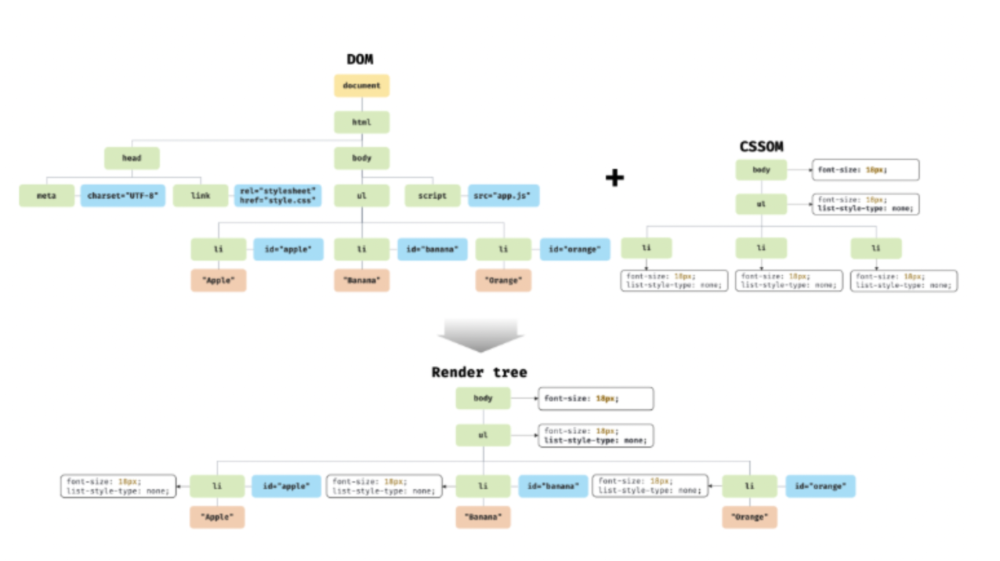
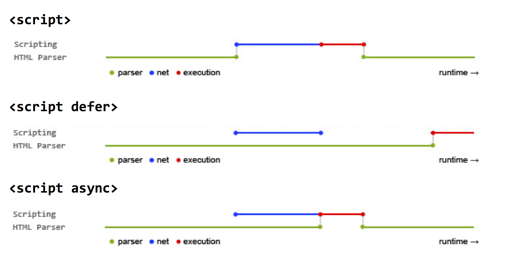

더 효율적인 클라이언트 사이드 자바스크립트 프로그래밍을 하기 위해 브라우저 환경에 대해 고려해야 한다.

따라서, 브라우저가 HTML, CSS, 자바스크립트로 작성된 텍스트 문서를 어떻게 파싱하여 렌더링하는지 알 필요가 있다.

# 파싱(parsing)?

프로그래밍 언어의 문법에 맞게 작성된 **텍스트 문서**를 읽어 **토큰**으로 분해하고, 토큰에 문법적 의미와 구조를 반영하여 **파스 트리**를 생성하는 과정을 말한다. 파싱이 완료된 이후에는 파스 트리를 기반으로 **바이트코드**를 생성하고 실행한다.

> 텍스트 문서 → 토큰 → 파스 트리 → 바이트코드

💡 바이트코드: 가상 컴퓨터에서 돌아가는 실행 프로그램을 위한 이진 표현법

# 렌더링(rendering)?

HTML, CSS, 자바스크립트로 작성된 문서를 파싱하여 **브라우저에 시각적으로 출력**하는 것

# 브라우저의 렌더링 과정

1. 브라우저는 HTML, CSS, 자바스크립트, 이미지, 폰트 파일 등 렌더링에 필요한 리소스를 요청하고 서버로부터 응답을 받는다.
2. 브라우저 렌더링 엔진은 서버로부터 응답된 HTML과 CSS를 파싱하여 DOM과 CSSOM을 생성하고 이들을 결합하여 렌더 트리를 생성한다.
3. 브라우저의 자바스크립트 엔진은 서버로부터 응답된 자바스크립트를 파싱하여 AST(Abstract Syntax Tree)를 생성하고 바이트코드로 변환하여 실행한다. 이때 자바스크립트는 DOM API를 통해 DOM이나 CSSOM을 변경할 수 있다. 변경된 DOM과 CSSOM은 다시 렌더 트리로 결합된다.
4. 렌더 트리를 기반으로 HTML 요소의 레이아웃(위치와 크기)을 계산하고 브라우저 화면에 HTML 요소를 페인팅한다.

## 1. 요청과 응답

렌더링이 필요한 리소스는 모두 서버에 존재하므로 ①필요한 리소스를 서버에 요청하고 서버가 응답한 ②리소스를 파싱하여 렌더링한다.

서버에 요청을 전송하기 위해 브라우저는 주소창을 제공한다.

**브라우저의 주소창에 URL를 입력하고 엔터 키를 누르면 URL의 호스트 이름이 DNS를 통해 IP 주소로 변환되고 이 IP 주소를 갖는 서버에게 요청을 전송한다.**

예를 들어,

`https://poiemaweb.com`을 입력하고 엔터 키를 누르면 루트 요청이 poiemaweb.com 서버로 전송된다.

**루트 요청**에는 명확히 리소스를 요청하는 내용은 없지만 서버가 암묵적으로 index.html을 응답하도록 기본적으로 설정되어 있다.

만약 **특정 정적 파일**을 서버에 요청하려면 브라우저의 주소창에 요청할 정적 파일 경로와 파일 이름을 URI의 호스트 뒤의 path에 기술하여 요청해야 한다.

예) `https://poiemaweb.com/assets/data/data.json`

서버에 동적으로 정적/동적 파일을 요청하기 위해서 Ajax와 REST API를 사용하기도 한다.

브라우저의 렌더링 엔진은 HTML을 파싱하는 도중 외부 리소스를 로드하는 태그(`link`, `img`, `script` 등)를 만나면 HTML 파싱을 일시 중단하고 해당 리소스 파일을 서버로 요청한다.

## 2. HTML 파싱과 DOM 생성

1. 서버는 브라우저가 요청한 HTML 파일을 읽어 메모리에 바이트(2진수)로 저장하고 인터넷을 경유하여 클라이언트에 응답한다.
2. 브라우저는 응답된 바이트 형태의 HTML 문서를 meta 태그의 charset 어트리뷰트에 지정된 인코딩 방식에 따라 문자열로 변환시킨다.
   - charset 어트리뷰트에 선언된 인코딩 방식은 content-type: text/html; charset=utf-8 과같이 응답 헤더에 담겨 응답된다.
3. 문자열로 변환된 HTML 문서를 읽어들여 문법적 의미를 갖는 최소 단위인 **토큰(token)**들로 분해한다.
4. 각 토큰들을 객체로 변환하여 노드(node)들을 생성한다.
   - 문서 노드, 요소 노드, 어트리뷰트 노드, 텍스트 노드
5. HTML 문서는 HTML 요소들의 집합으로 이루어지며 **HTML 요소는 중첩 관계**를 갖는다. 따라서 HTML 요소 간 부자 관계가 형성되고 이 부자 관계를 반영하여 모든 노드들을 **트리 자료구조**로 구성한다. 이 트리 자료구조를 <strong>DOM(Document Object Model)</strong>이라 부른다.

## 3. CSS 파싱과 CSSOM 생성

1. 렌더링 엔진은 DOM을 생성해 나가다가 CSS를 로드하는 link 태그나 style 태그를 만나면 DOM 생성을 중단한다.
2. link 태그의 href 어트리뷰트에 지정된 CSS파일을 서버에 요청하여 로드한 CSS파일이나 style 태그 내의 CSS를 HTML과 동일한 파싱 과정을 거치며 해석하여 CSSOM을 생성한다.
   - 바이트 → 문자 → 토큰 → 노드 → CSSOM
   - CSSOM은 CSS의 상속을 반영하여 생성된다.
3. CSS 파싱을 완료하면 HTML 파싱이 중단된 지점부터 다시 HTML을 파싱하기 시작하여 DOM 생성을 재개한다.

## 4. 렌더 트리 생성

렌더링 엔진에 의해 생성된 DOM과 CSSOM은 렌더 트리로 결합된다.

렌더 트리는 렌더링을 위한 자료구조로 **화면에 렌더링되는 노드만으로** 구성된다.

- 화면에 렌더링 되지 않는 노드: `meta`, `script` 태그 등

완성된 렌더 트리는 HTML 요소의 레이아웃(위치와 크기)을 계산하는 데 사용되며 브라우저 화면에 픽셀을 렌더링하는 페인팅 처리에 입력된다.

### 레이아웃 계산과 페인팅이 재차 실행되는 경우

- 자바스크립트에 의한 노드 추가 또는 삭제
- 브라우저 창의 리사이징에 의한 뷰포트 크기 변경
- HTML 요소의 레이아웃에 변경을 발생 시키는 스타일 변경
  - `width/height`, `margin`, `padding`, `border`, `display`, `position`, `top/right/bottom/left` 등

레이아웃 계산과 페인팅을 다시 실행하는 것은 성능에 악영향을 주므로 빈번하게 발생하지 않도록 주의할 필요가 있다.

## 5. 자바스크립트 파싱과 실행

1. 렌더링 엔진은 HTML을 한 줄씩 순차적으로 파싱하며 DOM을 생성해 나가다가 script 태그를 만나면 DOM 생성을 중단한다.
2. 자바스크립트 코드를 파싱하기 위해 자바스크립트 엔진에 제어권을 넘긴다.
3. 자바스크립트 파싱과 실행이 종료되면 렌더링 엔진으로 다시 제어권을 넘겨 HTML 파싱이 중단된 지점부터 다시 HTML 파싱을 시작한다.
4. 자바스크립트 엔진은 자바스크립트 코드를 파싱하여 저수준 언어로 변환하고 실행하는 역할을 한다.

자바스크립트 엔진은 자바스크립트 코드를 해석하여 AST(abstract syntax tree)를 생성한다. AST를 기반으로 인터프리터가 실행할 수 있는 중간 코드인 바이트코드를 생성하여 실행한다.

### 토크나이징

자바스크립트 소스코드를 문법적 의미를 갖는 코드의 최소 단위인 토큰들로 분해하는 것

### 파싱

토큰들의 집합을 구문 분석하여 AST(추상적 구문 트리)를 생성하는 것

AST는 토큰에 문법적 의미와 구조를 반영한 트리

### 바이트코드 생성과 실행

AST는 바이트코드로 변환되고 인터프리터에 의해 실행된다.

V8 엔진의 경우, 자주 사용되는 코드는 최적화된 머신 코드로 컴파일되어 성능을 최적화하고 코드의 사용 빈도가 적어지면 다시 디옵티마이징 하기도 한다.

## 6. 리플로우와 리페인트

자바스크립트 코드에 DOM이나 CSSOM을 변경하는 DOM API가 사용된 경우 DOM이나 CSSOM이 변경된다.

이때 변경된 DOM과 CSSOM은 다시 렌더 트리로 결합되고 변경된 렌더 트리를 기반으로 레이아웃(리플로우)과 페인트(리페인트) 과정을 거쳐 화면에 다시 렌더링 된다.

> 리플로우: 레이아웃을 다시 계산하는 것

> 리페인트: 재결합된 렌더 트리를 기반으로 다시 페인트하는 것

레이아웃에 영향이 없는 변경은 리플로우 없이 리페인트만 실행된다.

## 7. 자바스크립트 파싱에 의한 HTML 파싱 중단

렌더링 엔진과 자바스크립트 엔진은 직렬적으로 파싱을 수행한다.

위에서 아래로 순차적으로 HTML, CSS, 자바스크립트를 파싱하고 실행하기 때문에 script 태그의 위치에 따라 DOM 생성이 지연될 수 있다.

### script 태그는 body 요소의 가장 아래에 두는 것이 좋다.

그 이유는

- DOM이 완성되지 않은 상태에서 자바스크립트가 DOM을 조작하면 에러가 발생할 수 있다.
  - script 태그를 body 요소의 가장 아래에 두면 DOM이 완성된 이후에 조작하기 때문에 이러한 문제가 발생할 우려가 없다.
- 자바스크립트 로딩/파싱/실행으로 인해 HTML 요소들의 렌더링에 지장받는 일이 발생하지 않아 페이지 로딩 시간이 단축된다.
  - 자바스크립트 실행 전에 DOM 생성이 완료되어 렌더링 되므로 페이지 로딩 시간이 단축된다.

## 8. script 태그의 async/defer 어트리뷰트

자바스크립트 파싱에 의한 DOM 생성이 중단되는 문제를 해결하기 위해 추가된 어트리뷰트

- async와 defer 어트리뷰트는 외부 자바스크립트 파일을 로드하는 경우에만 사용할 수 있다.
- async와 defer 어트리뷰트를 사용하면 외부 자바스크립트 파일의 로드가 비동기적으로 동시에 진행된다.

### async 어트리뷰트

- HTML 파싱과 외부 자바스크립트 파일의 로드가 비동기적으로 동시에 진행
- 자바스크립트의 파싱과 실행은 파일의 로드가 완료된 직후에 진행 → HTML 파싱 중단
- 로드가 완료된 자바스크립트부터 먼저 실행되므로 순서가 보장되지 않는다.

### defer 어트리뷰트

- HTML 파싱과 외부 자바스크립트 파일의 로드가 비동기적으로 동시에 진행
- 자바스크립트의 파싱과 실행은 HTML 파싱이 완료된 직후에 진행된다.
- HTML에 추가된 순(상대순, 요소순)으로 실행
