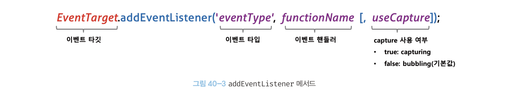

# 이벤트 드리븐 프로그래밍

> 프로그램의 흐름을 이벤트 중심으로 제어하는 프로그래밍 방식

브라우저는 처리해야 할 특정 사건이 발생하면 이를 감지하여 이벤트를 발생시킨다.

- ex) 클릭, 키보드 입력, 마우스 이동

> 이벤트 핸들러: 이벤트가 발생했을 때 호출될 함수

특정 이벤트가 발생했을 때 브라우저가 반응하여 해당 이벤트 핸들러를 호출한다.

## 언제 함수를 호출해야 하는가?

함수를 언제 호출할지 알 수 없으므로 개발자가 명시적으로 함수를 호출하는것이 아니라 브라우저에게 함수 호출을 위임한다.

```jsx
<!DOCTYPE html>
<html>
<body>
	<button>Click me!</button>
	<script>
		const $button = document.querySelector('button');
		// 사용자가 버튼을 클릭하면 함수를 호출하도록 요청
		$button.onclick = () => { alert('button click'); };
	</script>
</body>
</html>
```

이처럼 이벤트와 그에 대응하는 함수(이벤트 핸들러)를 통해 사용자와 애플리케이션이 상호작용할 수 있다.

---

# 이벤트 타입

1. 마우스 이벤트
2. 키보드 이벤트
3. 포커스 이벤트
4. 폼 이벤트
5. 값 변경 이벤트
6. DOM 뮤테이션 이벤트
7. 뷰 이벤트
8. 리소스 이벤트

자세한 사항은 책 참고

---

# 이벤트 핸들러 등록

## 1. 이벤트 핸들러 어트리뷰트 방식

`on이벤트타입` 과 같은 형식으로 이루어진 이벤트 핸들러 어트리뷰트를 이용하는 방식이다.

```jsx
<!DOCTYPE html>
<html>
<body>
	<button onclick="sayHi('Lee')">Click me!</button>
	<script>
		function sayHi(name) {
			console.log('Hi! ${name}.`);
		}
	</script>
</body>
</html>
```

이벤트 핸들러 어트리뷰트 값으로 함수 참조가 아닌 함수 호출문을 할당한다.

이벤트 핸들러 어트리뷰트 값은 **암묵적으로 생성될 이벤트 핸들러의 함수 몸체**를 의미한다.

`onclick="sayHi('Lee')"` 는 다음과 같이 파싱된다.

```jsx
function onclick(event) {
  sayHi("Lee");
}
```

이처럼 동작하는 이유는 이벤트 핸들러에 인수를 전달하기 위해서다.

이벤트 핸들러 어트리뷰트 값으로 함수 참조를 할당하는 경우, 인수를 전달하기 곤란해진다.

```jsx
// 인수를 전달하기 곤란
<button onclick="sayHi">Click me!</button>
```

이벤트 핸들러 어트리뷰트 값으로 할당한 문자열은 암묵적으로 생성되는 이벤트 핸들러의 함수 몸체이기 때문에 여러 개의 문을 할당할 수 있다.

```jsx
<button onclick="console.log(`Hi: `); console.log('Lee');">Click me!</button>
```

## 2. 이벤트 핸들러 프로퍼티 방식

window 객체와 Document, HTMLElement 타입의 DOM 노드 객체는 이벤트에 대응하는 이벤트 핸들러 프로퍼티를 가지고 있다.

이벤트 핸들러 어트리뷰트와 마찬가지로 `on이벤트타입` 의 형식으로 이루어져 있다.

```jsx
<!DOCTYPE html>
<html>
<body>
	<button>Click me!</button>
	<script>
		const $button = document.querySelector('button');

		// 이벤트 핸들러 프로퍼티에 이벤트 핸들러를 바인딩
		$button.onclick = function() {
			console.log('button click');
		}
	</script>
</body>
</html>
```

이벤트 핸들러를 등록하기 위해서는

- 이벤트 타깃: 이벤트를 발생시킬 객체
- 이벤트 타입: 이벤트의 종류를 나타내는 문자열
- 이벤트 핸들러

를 지정할 필요가 있다.


이벤트 핸들러는 대부분 이벤트를 이벤트 타깃에 바인딩한다.

또는 전파된 이벤트를 캐치할 DOM 노드 객체에 바인딩한다.

“이벤트 핸들러 어트리뷰트 방식”도 결국 DOM 노드 객체의 이벤트 핸들러 프로퍼티로 변환된다.

그러나 “이벤트 핸들러 프로퍼티 방식”은

- “이벤트 핸들러 어트리뷰트 방식”의 HTML과 자바스크립트가 뒤섞이는 문제를 해결할 수 있다.
- 이벤트 핸들러 프로퍼티에 하나의 이벤트 핸들러만 바인딩할 수 있다는 단점이 있다.

```jsx
<!DOCTYPE html>
<html>
<body>
	<button>Click me!</button>
	<script>
		const $button = document.querySelector('button');

		/*
			하나의 이벤트에 하나의 이벤트 핸들러만 바인딩 할 수 있다.

			첫 번째로 바인딩 된 이벤트 핸들러는 두 번째 바인딩된 이벤트 핸들러에 의해
			재할당되어 실행되지 않는다.
		*/
		$button.onclick = function() {
			console.log('button clicked 1');
		}

		$button.onclick = function() {
			console.log('button clicked 2');
		}
	</script>
</body>
</html>
```

## 3. addEventListener 메서드 방식



- 이벤트 타입 (on 접두사 없이)
- 이벤트 핸들러
- 이벤트 전파 단계 (캡처링 또는 버블링)
  - true: 캡처링
  - false: 버블링 (기본 값)

```jsx
<!DOCTYPE html>
<html>
<body>
	<button>Click me!</button>
	<script>
		const $button = document.querySelector('button');

		/*
			이벤트 핸들러 프로퍼티 방식

			$button.onclick = function() {
				console.log('button click');
			}
		*/

		// addEventListener 메서드 방식
		$button.addEventListener('click', function() {
			console.log('button click');
		});
	</script>
</body>
</html>
```

이벤트 핸들러 프로퍼티 방식과 addEventListener 방식을 모두 사용하여 이벤트 핸들러를 등록하면

```jsx
<!DOCTYPE html>
<html>
<body>
	<button>Click me!</button>
	<script>
		const $button = document.querySelector('button');

		$button.onclick = function() {
			console.log('[이벤트 핸들러 프로퍼티 방식]button click');
		}

		// addEventListener 메서드 방식
		$button.addEventListener('click', function() {
			console.log('[addEventListener 메서드 방식]button click');
		});
	</script>
</body>
</html>
```

addEventListener 메서드 방식은 이벤트 핸들러 프로퍼티에 바인딩된 이벤트 핸들러에 아무런 영향을 주지 않는다.

따라서 2개의 이벤트 핸들러가 모두 호출된다.

```jsx
<!DOCTYPE html>
<html>
<body>
	<button>Click me!</button>
	<script>
		const $button = document.querySelector('button');

		$button.addEventListener('click', function() {
			console.log('[1]button click');
		});

		$button.addEventListener('click', function() {
			console.log('[2]button click');
		});
	</script>
</body>
</html>
```

addEventListener 메서드 방식은 하나 이상의 이벤트 핸들러를 등록할 수 있다.

이벤트 핸들러는 등록된 순서대로 호출된다.

```jsx
<!DOCTYPE html>
<html>
<body>
	<button>Click me!</button>
	<script>
		const $button = document.querySelector('button');

		const handleClick = () => console.log('button click');

		$button.addEventListener('click', handleClick);
		$button.addEventListener('click', handleClick);
	</script>
</body>
</html>
```

그러나 참조가 동일한 이벤트 핸들러를 중복 등록하면 하나의 이벤트 핸들러만 등록된다.

---

# 이벤트 핸들러 제거

addEventListener 메서드로 등록한 이벤트 핸들러는 EventTarget.prototype.removeEventListener 메서드를 사용하면 제거할 수 있다.

removeEventListener 메서드에 전달할 인수는 addEventListener 메서드와 동일하며, 전달한 인수가 일치하지 않으면 이벤트 핸들러가 제거되지 않는다.

```jsx
<!DOCTYPE html>
<html>
<body>
	<button>Click me!</button>
	<script>
		const $button = document.querySelector('button');

		const handleClick = () => console.log('button click');

		$button.addEventListener('click', handleClick);

		$button.removeEventListener('click', handleClick, true);  // 실패
		$button.removeEventListener('click', handleClick);  // 성공
	</script>
</body>
</html>
```

무명 함수를 이벤트 핸들러로 등록한 경우에는 제거할 수 없다.

removeEventListener 메서드에 전달한 이벤트 핸들러와 addEventListener 메서드에 전달한 이벤트 핸들러가 동일한 함수여야 하기 때문이다.

단, 가명 이벤트 핸들러 내부에서 removeEventListener 메서드를 호출하여 이벤트 핸들러를 제거하는 것은 가능하다.

```jsx
$button.addEventListener("click", function foo() {
  console.log("button click");
  // 이벤트 핸들러 제거 -> 여러번 클릭해도 이벤트 핸들러는 단 한 번만 호출
  $button.removeEventListener("click", foo);
});
```

무명 함수를 이벤트 핸들러로 등록한 경우에는 내부에서 함수 자신을 가리키는 `arguments.callee` 를 사용하여 제거할 수 있다.

```jsx
$button.addEventListener("click", function () {
  console.log("button click");
  // 이벤트 핸들러 제거
  $button.removeEventListener("click", arguments.callee);
});
```

그러나 `arguments.callee`는 코드 최적화를 방해하므로 strict mode에서 금지된다.

따라서 가급적 이벤트 핸들러의 참조를 변수나 자료구조에 저장하여 제거하는 편이 좋다.

이벤트 핸들러 프로퍼티 방식으로 등록한 이벤트 핸들러는 이벤트 핸들러 프로퍼티에 null을 할당하여 제거할 수 있다.

---

# 이벤트 객체

이벤트에 관련한 다양한 정보를 담고 있는 객체

이벤트 핸들러의 첫 번째 인수로 전달된다.

```jsx
<!DOCTYPE html>
<html>
<body>
	<p>클릭하세요. 클릭한 곳의 좌표가 표시됩니다.</p>
	<em class="message"></em>
	<script>
		const $msg = document.querySelector('.message');

		// 이벤트 객체가 이벤트 핸들러의 첫 번째 매개변수로 전달된다.
		function showCoords(e) {
			$msg.textContent = `clientX: ${e.clientX}, clientY: ${e.clientY}`;
		}

		document.onclick = showCoords;
	</script>
</body>
</html>
```

클릭 이벤트에 의해 생성된 이벤트 객체는 이벤트 핸들러의 첫 번째 인수로 전달되어 매개변수 e에 암묵적으로 할당된다.

이벤트 객체를 전달받기 위해, 이벤트 핸들러를 정의할 때 이벤트 객체를 전달받을 매개변수를 명시적으로 선언해야한다.

- 이벤트 핸들러 어트리뷰트 방식

```jsx
<!DOCTYPE html>
<html>
<head>
	<style>
		html, body { height: 100%; }
	</style>
</head>
<!-- 이벤트 핸들러 어트리뷰트 방식: event가 아닌 다른 이름으로는 이벤트 객체 전달 불가 -->
<body onClick="showCoords(event)">
	<p>클릭하세요. 클릭한 곳의 좌표가 표시됩니다.</p>
	<em class="message"></em>
	<script>
		const $msg = document.querySelector('.message');

		function showCoords(e) {
			$msg.textContent = `clientX: ${e.clientX}, clientY: ${e.clientY}`;
		}
	</script>
</body>
</html>
```

이벤트 핸들러 어트리뷰트 방식의 경우

이벤트 객체를 전달받으려면 **이벤트 핸들러의 첫 번째 매개변수 이름이 반드시 event**여야 한다.

이벤트 핸들러 어트리뷰트 값은 사실 **암묵적으로 생성되는 이벤트 핸들러의 함수 몸체**를 의미하기 때문이다.

```jsx
function onclick(event) {
  showCoords(event);
}
```

onclick 이벤트 핸들러의 첫 번째 매개변수의 이름이 event로 암묵적으로 명명되기 때문에 event가 아닌 다른 이름으로는 이벤트 객체를 전달받지 못한다.

## 이벤트 객체의 상속 구조


위 그림의 Event, UIEvent, MouseEvent 등 모두가 생성자 함수이다.

`new` 연산자와 함께 생성자 함수를 호출하면 이벤트 객체를 생성할 수 있다.

```jsx
let e = new Event('foo');
console.log(e.type);  // foo
console.log(e instanceOf Event);  // true
console.log(e instanceOf Object);  // true

e = new FocusEvent('focus');
e = new MouseEvent('click');
e = new KeyboardEvent('keyup');
e = new InputEvent('change');
```

이벤트가 발생하면 암묵적으로 생성되는 이벤트 객체도 생성자 함수에 의해 생성된다.

생성된 이벤트 객체는 생성자 함수와 더불어 생성되는 프로토타입으로 구성된 프로토타입 체인의 일원이 된다.

이벤트 객체의 프로퍼티는 발생한 이벤트의 타입에 따라 달라진다.

```jsx
<!DOCTYPE html>
<html>
  <body>
    <input type="text" />
    <input type="checkbox" />
    <button>Click me!</button>
    <script>
      const $input = document.querySelector('input[type=text]');
      const $checkbox = document.querySelector('input[type=checkbox]');
      const $button = document.querySelector('button');

      // load 이벤트 발생 -> Event 타입의 이벤트 객체
      window.onload = console.log;

      // change 이벤트 -> Event 타입의 이벤트 객체
      $checkbox.onchange = console.log;

      // focus 이벤트 -> FocusEvent 타입의 이벤트 객체
      $input.onfocus = console.log;

      // input 이벤트 -> InputEvent 타입의 이벤트 객체
      $input.oninput = console.log;

      // keyup 이벤트 -> KeyboardEvent 타입의 이벤트 객체
      $input.onkeyup = console.log;

      // click 이벤트 -> MouseEvent 타입의 이벤트 객체
      $button.onclick = console.log;
    </script>
  </body>
</html>
```

## 이벤트 객체의 공통 프로퍼티

| 공통 프로퍼티                 | 설명                                                                                |
| ----------------------------- | ----------------------------------------------------------------------------------- |
| type (string)                 | 이벤트 타입                                                                         |
| target (DOM 요소 노드)        | 이벤트를 발생시킨 DOM 요소                                                          |
| currentTarget (DOM 요소 노드) | 이벤트 핸들러가 바인딩된 DOM 요소                                                   |
| eventPhase (number)           | 이벤트 전파 단계 <br/> 0: 이벤트 없음, 1: 캡처링 단계, 2: 타깃 단계, 3: 버블링 단계 |
| bubbles (boolean)             | 이벤트를 버블링으로 전파하는지 여부                                                 |
| cancelable (boolean)          | preventDefault 메서드를 호출하여 기본 동작을 취소할 수 있는지 여부                  |
| defaultPrevented (boolean)    | preventDefault 메서드를 호출하여 이벤트를 취소했는지 여부                           |
| isTrusted (boolean)           | 사용자 행위에 의해 발생한 이벤트인지 여부                                           |
| timestamp (number)            | 이벤트가 발생한 시각                                                                |

---

# 이벤트 전파

DOM 트리 상에 존재하는 DOM 요소 노드에서 발생한 이벤트는 DOM 트리를 통해 전파된다.


- 캡처링 단계: 이벤트가 상위 요소에서 하위 요소 방향으로 전파
- 타깃 단계: 이벤트가 이벤트 타깃에 도달
- 버블링 단계: 이벤트가 하위 요소에서 상위 요소 방향으로 전파

```jsx
<!DOCTYPE html>
<html>
  <body>
    <ul id="fruits">
      <li id="apple">Apple</li>
      <li id="banana">Banana</li>
      <li id="orange">Orange</li>
    </ul>
    <script>
      const $fruits = document.getElementById('fruits');

      // #fruits 요소의 하위 요소인 li 요소를 클릭한 경우
      $fruits.addEventListener('click', (e) => {
        console.log(`이벤트 단계: ${e.eventPhase}`);
        console.log(`이벤트 타깃: ${e.target}`);
        console.log(`커런트 타깃: ${e.currentTarget}`);
      });
    </script>
  </body>
</html>
```

1. 클릭 이벤트가 발생하여 클릭 이벤트 객체가 생성되고 클릭된 li 요소가 이벤트 타깃이 된다.
2. 클릭 이벤트 객체는 window에서 이벤트 타깃 방향으로 전파 (캡처링 단계)
3. 이벤트 객체가 이벤트 타깃에 도달
4. 이벤트 객체가 이벤트 타깃에서 window 방향으로 전파 (버블링 단계)

이벤트 핸들러 어트리뷰트/프로퍼티 방식은 타깃 단계, 버블링 단계의 이벤트 객체만 캐치 가능하다.

addEventListener 메서드 방식으로 캡처링 단계의 이벤트 객체를 캐치하려면 3번째 인수로 true를 전달해야한다.

3번째 인수가 false라면 버블링 단계의 이벤트 객체를 캐치한다.

이벤트 타깃과 커런트 타깃이 같은 경우에는 타깃 단계의 이벤트 객체를 캐치한다.

예시

```jsx
<!DOCTYPE html>
<html>
  <body>
    <p>버블링과 캡처링 이벤트 <button>버튼</button></p>
    <script>
      // 버블링 단계 이벤트 캐치
      document.body.addEventListener('click', () => {
        console.log('Handler for body.');
      });

      // 캡처링 단계 이벤트 캐치
      document.querySelector('p').addEventListener(
        'click',
        () => {
          console.log('Handler for paragraph.');
        },
        true
      );

      // 타깃 단계 이벤트 캐치
      document.querySelector('button').addEventListener('click', () => {
        console.log('Handler for button.');
      });
    </script>
  </body>
</html>
```

버튼 요소를 클릭하는 경우,

이벤트는 캡처링 - 타깃 - 버블링 단계로 전파되므로

```jsx
Handler for paragraph.
Handler for button.
Handler for body.
```

위와 같은 순서로 출력된다.

만약 p 요소를 클릭하면

```jsx
Handler for paragraph.
Handler for body.
```

타깃 단계의 이벤트 객체는 캐치할 수 없으므로 위와 같이 출력된다.

---

# 이벤트 위임

> 여러 개의 하위 DOM 요소에 각각 이벤트 핸들러를 등록하는 대신 하나의 상위 DOM 요소에 이벤트 핸들러를 등록하는 방법

이벤트 위임을 이용하면

- 여러 개의 하위 DOM 요소에 이벤트 핸들러를 등록할 필요가 없다.
- 동적으로 하위 DOM 요소를 추가하더라도 일일이 추가된 DOM 요소에 이벤트 핸들러를 등록할 필요가 없다.

```jsx
<!DOCTYPE html>
<html>
<body>
  <nav>
    <ul id="fruits">
      <li id="apple" class="active">Apple</li>
      <li id="banana">Banana</li>
      <li id="orange">Orange</li>
    </ul>
  </nav>
  <div>선택된 내비게이션 아이템: <em class="msg">apple</em></div>
  <script>
    const $fruits = document.getElementById('fruits');
    const $msg = document.querySelector('.msg');

    // 사용자 클릭에 의해 선택된 내비게이션 아이템(li 요소)에 active 클래스를 추가하고
    // 그 외의 모든 내비게이션 아이템의 active 클래스를 제거한다.
    function activate({ target }) {
      [...$fruits.children].forEach($fruit => {
        $fruit.classList.toggle('active', $fruit === target);
        $msg.textContent = target.id;
      });
    }

    // 모든 내비게이션 아이템(li 요소)에 이벤트 핸들러를 등록한다.
    document.getElementById('apple').onclick = activate;
    document.getElementById('banana').onclick = activate;
    document.getElementById('orange').onclick = activate;
  </script>
</body>
</html>
```

위 코드를 이벤트 위임을 이용하면

```jsx
<!DOCTYPE html>
<html>
<head>
</head>
<body>
  <nav>
    <ul id="fruits">
      <li id="apple" class="active">Apple</li>
      <li id="banana">Banana</li>
      <li id="orange">Orange</li>
    </ul>
  </nav>
  <div>선택된 내비게이션 아이템: <em class="msg">apple</em></div>
  <script>
    const $fruits = document.getElementById('fruits');
    const $msg = document.querySelector('.msg');

    // 사용자 클릭에 의해 선택된 내비게이션 아이템(li 요소)에 active 클래스를 추가하고
    // 그 외의 모든 내비게이션 아이템의 active 클래스를 제거한다.
    function activate({ target }) {
      // 이벤트를 발생시킨 요소(target)가 ul#fruits의 자식 요소가 아니라면 무시한다.
      if (!target.matches('#fruits > li')) return;

      [...$fruits.children].forEach($fruit => {
        $fruit.classList.toggle('active', $fruit === target);
        $msg.textContent = target.id;
      });
    }

    // 이벤트 위임: 상위 요소(ul#fruits)는 하위 요소의 이벤트를 캐치할 수 있다.
    $fruits.onclick = activate;
  </script>
</body>
</html>
```

---

# DOM 요소의 기본 동작 조작

## DOM 요소의 기본 동작 중단

DOM 요소는 저마다의 기본 동작이 있다.

이벤트 객체의 preventDefault 메서드는 DOM 요소의 기본 동작을 중단시킨다.

```jsx
<!DOCTYPE html>
<html>
<body>
  <a href="https://www.google.com">go</a>
  <input type="checkbox">
  <script>
    document.querySelector('a').onclick = e => {
      // a 요소의 기본 동작을 중단한다.
      e.preventDefault();
    };

    document.querySelector('input[type=checkbox]').onclick = e => {
      // checkbox 요소의 기본 동작을 중단한다.
      e.preventDefault();
    };
  </script>
</body>
</html>
```

## 이벤트 전파 방지

이벤트 객체의 stopPropagation 메서드는 이벤트 전파를 중지시킨다.

```jsx
<!DOCTYPE html>
<html>
<body>
  <div class="container">
    <button class="btn1">Button 1</button>
    <button class="btn2">Button 2</button>
    <button class="btn3">Button 3</button>
  </div>
  <script>
    // 이벤트 위임. 클릭된 하위 버튼 요소의 color를 변경한다.
    document.querySelector('.container').onclick = ({ target }) => {
      if (!target.matches('.container > button')) return;
      target.style.color = 'red';
    };

    // .btn2 요소는 이벤트를 전파하지 않으므로 상위 요소에서 이벤트를 캐치할 수 없다.
    document.querySelector('.btn2').onclick = e => {
      e.stopPropagation(); // 이벤트 전파 중단
      e.target.style.color = 'blue';
    };
  </script>
</body>
</html>
```

---

# 이벤트 핸들러 내부의 this

## 이벤트 핸들러 어트리뷰트 방식

```jsx
<!DOCTYPE html>
<html>
<body>
  <button onclick="handleClick()">Click me</button>
  <script>
    function handleClick() {
      console.log(this); // window
    }
  </script>
</body>
</html>
```

이벤트 핸들러 어트리뷰트의 값은 암묵적으로 생성된 이벤트 핸들러의 함수 몸체이므로, 이벤트 핸들러에 의해 일반 함수로 호출된다.

따라서 위 예제의 handleClick의 this는 window를 가리킨다.

```jsx
<!DOCTYPE html>
<html>
<body>
  <button onclick="handleClick(this)">Click me</button>
  <script>
    function handleClick(button) {
      console.log(button); // 이벤트를 바인딩한 button 요소
      console.log(this);   // window
    }
  </script>
</body>
</html>
```

단, 이벤트 핸들러를 호출할 때 인수로 전달한 this는 이벤트를 바인딩한 DOM 요소를 가리킨다.

## 이벤트 핸들러 프로퍼티 방식과 addEventListener 메서드 방식

이벤트 핸들러 프로퍼티 방식과 addEventListener 메서드 방식의 this는 바인딩한 DOM 요소를 가리킨다.

즉, 이벤트 핸들러 내부의 this는 이벤트 객체의 currentTarget 프로퍼티와 같다.

```jsx
<!DOCTYPE html>
<html>
<body>
  <button class="btn1">0</button>
  <button class="btn2">0</button>
  <script>
    const $button1 = document.querySelector('.btn1');
    const $button2 = document.querySelector('.btn2');

    // 이벤트 핸들러 프로퍼티 방식
    $button1.onclick = function (e) {
      // this는 이벤트를 바인딩한 DOM 요소를 가리킨다.
      console.log(this); // $button1
      console.log(e.currentTarget); // $button1
      console.log(this === e.currentTarget); // true

      // $button1의 textContent를 1 증가시킨다.
      ++this.textContent;
    };

    // addEventListener 메서드 방식
    $button2.addEventListener('click', function (e) {
      // this는 이벤트를 바인딩한 DOM 요소를 가리킨다.
      console.log(this); // $button2
      console.log(e.currentTarget); // $button2
      console.log(this === e.currentTarget); // true

      // $button2의 textContent를 1 증가시킨다.
      ++this.textContent;
    });
  </script>
</body>
</html>
```

화살표 함수로 정의한 이벤트 핸들러 내부의 this는 상위 스코프의 this를 가리킨다.

```jsx
<!DOCTYPE html>
<html>
<body>
  <button class="btn1">0</button>
  <button class="btn2">0</button>
  <script>
    const $button1 = document.querySelector('.btn1');
    const $button2 = document.querySelector('.btn2');

    // 이벤트 핸들러 프로퍼티 방식
    $button1.onclick = e => {
      // 화살표 함수 내부의 this는 상위 스코프의 this를 가리킨다.
      console.log(this); // window
      console.log(e.currentTarget); // $button1
      console.log(this === e.currentTarget); // false

      // this는 window를 가리키므로 window.textContent에 NaN(undefined + 1)을 할당한다.
      ++this.textContent;
    };

    // addEventListener 메서드 방식
    $button2.addEventListener('click', e => {
      // 화살표 함수 내부의 this는 상위 스코프의 this를 가리킨다.
      console.log(this); // window
      console.log(e.currentTarget); // $button2
      console.log(this === e.currentTarget); // false

      // this는 window를 가리키므로 window.textContent에 NaN(undefined + 1)을 할당한다.
      ++this.textContent;
    });
  </script>
</body>
</html>
```

클래스에서 이벤트 핸들러를 바인딩하는 경우 this에 주의해야 한다.

```jsx
<!DOCTYPE html>
<html>
<body>
  <button class="btn">0</button>
  <script>
    class App {
      constructor() {
        this.$button = document.querySelector('.btn');
        this.count = 0;

        // increase 메서드를 이벤트 핸들러로 등록
        this.$button.onclick = this.increase;
      }

      increase() {
        // 이벤트 핸들러 increase 내부의 this는 DOM 요소(this.$button)를 가리킨다.
        // 따라서 this.$button은 this.$button.$button과 같다.
        this.$button.textContent = ++this.count;
        // -> TypeError: Cannot set property 'textContent' of undefined
      }
    }

    new App();
  </script>
</body>
</html>
```

increase 내부의 this는 클래스가 생성할 인스턴스를 가리키지 않는다.

이벤트 핸들러 내부의 this는 바인딩한 DOM 요소를 가리키기 때문에 this.$button이 된다.

따라서 increase 메서드를 이벤트 핸들러로 바인딩할 때 `bind` 메서드를 이용해 this를 전달하여 increase 메서드 내부의 this가 클래스가 생성할 인스턴스를 가리키도록 해야한다.

```jsx
<!DOCTYPE html>
<html>
<body>
  <button class="btn">0</button>
  <script>
    class App {
      constructor() {
        this.$button = document.querySelector('.btn');
        this.count = 0;

        // increase 메서드를 이벤트 핸들러로 등록
        // this.$button.onclick = this.increase;

        // increase 메서드 내부의 this가 인스턴스를 가리키도록 한다.
        this.$button.onclick = this.increase.bind(this);
      }

      increase() {
        this.$button.textContent = ++this.count;
      }
    }

    new App();
  </script>
</body>
</html>
```

또는 클래스 필드에 할당한 화살표 함수를 이벤트 핸들러로 등록하여 이벤트 핸들러 내부의 this가 인스턴스를 가리키도록 할 수도 있다.

다만 이때 이벤트 핸들러 increase는 프로토타입 메서드가 아닌 인스턴스 메서드가 된다.

```jsx
<!DOCTYPE html>
<html>
<body>
  <button class="btn">0</button>
  <script>
    class App {
      constructor() {
        this.$button = document.querySelector('.btn');
        this.count = 0;

        // 화살표 함수인 increase를 이벤트 핸들러로 등록
        this.$button.onclick = this.increase;
      }

      // 클래스 필드 정의
      // increase는 인스턴스 메서드이며 내부의 this는 인스턴스를 가리킨다.
      increase = () => this.$button.textContent = ++this.count;
    }
    new App();
  </script>
</body>
</html>
```

---

# 이벤트 핸들러에 인수 전달

함수에 인수를 전달하려면 함수를 호출할 때 전달해야 한다.

이벤트 핸들러 어트리뷰트 방식은 인수를 전달할 수 있지만 이벤트 핸들러 프로퍼티 방식과 addEventListener 메서드 방식은 인수를 전달할 수 없다.

그러나 인수를 전달할 수 있는 방식이 전혀 없는 것은 아니다.

```jsx
<!DOCTYPE html>
<html>
<body>
  <label>User name <input type='text'></label>
  <em class="message"></em>
  <script>
    const MIN_USER_NAME_LENGTH = 5; // 이름 최소 길이
    const $input = document.querySelector('input[type=text]');
    const $msg = document.querySelector('.message');

    const checkUserNameLength = min => {
      $msg.textContent
        = $input.value.length < min ? `이름은 ${min}자 이상 입력해 주세요` : '';
    };

    // 이벤트 핸들러 내부에서 함수를 호출하면서 인수를 전달한다.
    $input.onblur = () => {
      checkUserNameLength(MIN_USER_NAME_LENGTH);
    };
  </script>
</body>
</html>
```

이벤트 핸들러 내부에서 함수를 호출하면서 인수를 전달할 수 있다.

```jsx
<!DOCTYPE html>
<html>
<body>
  <label>User name <input type='text'></label>
  <em class="message"></em>
  <script>
    const MIN_USER_NAME_LENGTH = 5; // 이름 최소 길이
    const $input = document.querySelector('input[type=text]');
    const $msg = document.querySelector('.message');

    // 이벤트 핸들러를 반환하는 함수
    const checkUserNameLength = min => e => {
      $msg.textContent
        = $input.value.length < min ? `이름은 ${min}자 이상 입력해 주세요` : '';
    };

    // 이벤트 핸들러를 반환하는 함수를 호출하면서 인수를 전달한다.
    $input.onblur = checkUserNameLength(MIN_USER_NAME_LENGTH);
  </script>
</body>
</html>
```

또는 이벤트 핸들러를 반환하는 함수를 호출하면서 인수를 전달할 수 있다.

---

# 커스텀 이벤트

> 개발자의 의도로 생성된 이벤트

## 커스텀 이벤트 생성

이벤트 생성자 함수는 첫 번째 인수로 이벤트 타입을 나타내는 문자열을 전달받는다.

이벤트 타입을 나타내는 문자열은 기존 이벤트 타입을 사용할 수도 있고, 임의의 문자열을 사용하여 새로운 이벤트 타입을 지정할 수도 있다.

이 경우 일반적으로 customEvent 이벤트 생성자 함수를 사용한다.

```jsx
// KeyboardEvent 생성자 함수로 keyup 이벤트 타입의 커스텀 이벤트 객체를 생성
const keyboardEvent = new KeyboardEvent("keyup");
console.log(keyboardEvent.type); // keyup

// CustomEvent 생성자 함수로 foo 이벤트 타입의 커스텀 이벤트 객체를 생성
const customEvent = new CustomEvent("foo");
console.log(customEvent.type); // foo
```

생성된 커스텀 이벤트 객체는 버블링되지 않으며 preventDefault 메서드로 취소할 수도 없다.

```jsx
// MouseEvent 생성자 함수로 click 이벤트 타입의 커스텀 이벤트 객체를 생성
const customEvent = new MouseEvent("click");
console.log(customEvent.type); // click
console.log(customEvent.bubbles); // false
console.log(customEvent.cancelable); // false
```

커스텀 이벤트 객체의 bubbles 또는 cancelable 프로퍼티를 true로 설정하려면 이벤트 생성자 함수의 두 번째 인수로 bubbles 또는 cancelable 프로퍼티를 갖는 객체를 전달한다.

```jsx
// MouseEvent 생성자 함수로 click 이벤트 타입의 커스텀 이벤트 객체를 생성
const customEvent = new MouseEvent("click", {
  bubbles: true,
  cancelable: true,
});

console.log(customEvent.bubbles); // true
console.log(customEvent.cancelable); // true
```

커스텀 이벤트 객체에는 이뿐만 아니라 이벤트 타입에 따라 가지는 이벤트 고유의 프로퍼티 값을 지정할 수 있다.

```jsx
// MouseEvent 생성자 함수로 click 이벤트 타입의 커스텀 이벤트 객체를 생성
const mouseEvent = new MouseEvent("click", {
  bubbles: true,
  cancelable: true,
  clientX: 50,
  clientY: 100,
});

console.log(mouseEvent.clientX); // 50
console.log(mouseEvent.clientY); // 100

// KeyboardEvent 생성자 함수로 keyup 이벤트 타입의 커스텀 이벤트 객체를 생성
const keyboardEvent = new KeyboardEvent("keyup", { key: "Enter" });

console.log(keyboardEvent.key); // Enter
```

이벤트 생성자 함수로 생성한 커스텀 이벤트는 isTrusted 프로퍼티의 값이 언제나 false다.

사용자 행위에 의해 발생한 이벤트의 이벤트 객체는 isTrusted 프로퍼티 값이 언제나 true다.

```jsx
// InputEvent 생성자 함수로 foo 이벤트 타입의 커스텀 이벤트 객체를 생성
const customEvent = new InputEvent("foo");
console.log(customEvent.isTrusted); // false
```

## 커스텀 이벤트 디스패치

생성된 커스텀 이벤트는 dispatchEvent 메서드로 디스패치(이벤트를 발생시키는 행위)할 수 있다.

dispatchEvent 메서드에 이벤트 객체를 인수로 전달하면서 호출하면 인수로 전달한 이벤트 타입의 이벤트가 발생한다.

```jsx
<!DOCTYPE html>
<html>
<body>
  <button class="btn">Click me</button>
  <script>
    const $button = document.querySelector('.btn');

    // 버튼 요소에 click 커스텀 이벤트 핸들러를 등록
    // 커스텀 이벤트를 디스패치하기 이전에 이벤트 핸들러를 등록해야 한다.
    $button.addEventListener('click', e => {
      console.log(e); // MouseEvent {isTrusted: false, screenX: 0, ...}
      alert(`${e} Clicked!`);
    });

    // 커스텀 이벤트 생성
    const customEvent = new MouseEvent('click');

    // 커스텀 이벤트 디스패치(동기 처리). click 이벤트가 발생한다.
    $button.dispatchEvent(customEvent);
  </script>
</body>
</html>
```

일반적으로 이벤트 핸들러는 비동기 처리 방식으로 작동하지만 dispatchEvent 메서드는 이벤트 핸들러를 동기 처리 방식으로 호출한다.

즉, dispatchEvent 메서드를 호출하면 커스텀 이벤트에 바인딩된 이벤트 핸들러를 직접 호출하는 것과 같다.

따라서 dispatchEvent 메서드로 이벤트를 디스패치하기 전에 커스텀 이벤트를 처리할 이벤트 핸들러를 등록해야 한다.

customEvent 이벤트 생성자 함수에는 두 번째 인수로 이벤트와 함께 전달하고 싶은 정보를 담은 detail 프로퍼티를 포함하는 객체를 전달할 수 있다.

이 정보는 이벤트 객체의 detail 프로퍼티에 담겨 전달된다.

```jsx
<!DOCTYPE html>
<html>
<body>
  <button class="btn">Click me</button>
  <script>
    const $button = document.querySelector('.btn');

    // 버튼 요소에 foo 커스텀 이벤트 핸들러를 등록
    // 커스텀 이벤트를 디스패치하기 이전에 이벤트 핸들러를 등록해야 한다.
    $button.addEventListener('foo', e => {
      // e.detail에는 CustomEvent 함수의 두 번째 인수로 전달한 정보가 담겨 있다.
      alert(e.detail.message);
    });

    // CustomEvent 생성자 함수로 foo 이벤트 타입의 커스텀 이벤트 객체를 생성
    const customEvent = new CustomEvent('foo', {
      detail: { message: 'Hello' } // 이벤트와 함께 전달하고 싶은 정보
    });

    // 커스텀 이벤트 디스패치
    $button.dispatchEvent(customEvent);
  </script>
</body>
</html>
```
