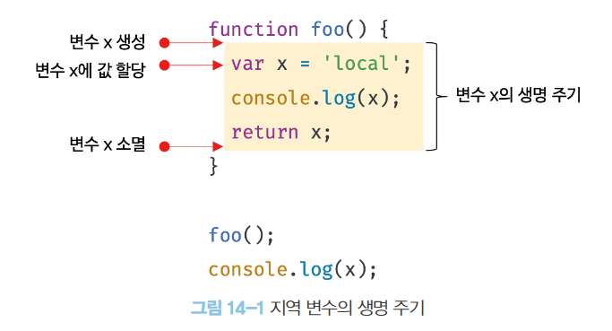
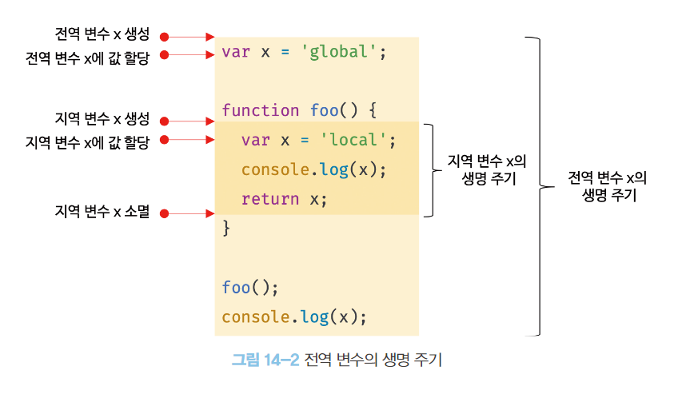

# 변수의 생명 주기

## 1. 지역 변수의 생명 주기

함수 내부에서 선언된 지역 변수는 함수가 호출되면 생성되고 함수가 종료하면 소멸한다.

(전역 변수의 생명 주기는 애플리케이션의 생명 주기와 같다.)

```jsx
function foo() {
  var x = "local";
  console.log(x); // local
  return x;
}

foo();
console.log(x); // ReferenceError: x is not defined
```

x는 foo 함수가 호출되기 전까지는 생성되지 않는다.

foo 함수를 호출하지 않으면 함수 내부의 변수 선언문이 실행되지 않기 때문이다.

> 변수 선언은 코드가 한 줄씩 순차적으로 실행되는 시점인 런타임에 실행되는 것이 아니라 런타임 이전 단계에서 자바스크립트 엔진에 의해 먼저 실행된다.

- 4.4절 “변수 선언의 실행 시점과 변수 호이스팅”
  >

위 설명은 전역 변수의 한정된 것으로, 함수 내부에서 선언한 변수는 함수가 호출된 직후의 함수 몸체의 코드가 한 줄씩 순차적으로 실행되기 이전에 자바스크립트 엔진에 의해 먼저 실행된다.

**즉, 지역 변수의 생명 주기는 함수의 생명 주기와 일치한다.**



1. foo 호출
2. x 변수의 선언문이 먼저 실행 → x 변수 선언, undefined로 초기화
3. 함수 몸체의 코드가 순차적으로 실행 (변수 할당문이 실행되면 x 변수에 값이 할당됨)
4. 함수가 종료되면 x 변수도 소멸

지역 변수가 함수보다 오래 생존하는 경우도 있다.

변수는 자신이 등록된 스코프가 소멸(메모리 해제)될 때까지 유효하다.

할당된 메모리 공간은 더 이상 그 누구도 참조하지 않을 때 가비지 콜렉터에 의해 해제되어 가용 메모리 풀에 반환된다.

이는 스코프도 마찬가지다.

```jsx
var x = "global";

function foo() {
  console.log(x); // ①
  var x = "local";
}

foo();
console.log(x); // global
```

①에서 출력되는 값은 undefined이다.

①의 시점에서 지역 변수 x는 이미 선언되어 undefined로 초기화되어 있고, 따라서 전역 변수가 아니라 지역 변수 x를 참조하여 값을 출력하기 때문이다.

이처럼 **호이스팅은 스코프를 단위로 동작**한다.

전역 변수의 호이스팅은 전역 변수의 선언이 전역 스코프의 선두로 끌어 올려진 것처럼 동작하고,

지역 변수의 호이스팅은 지역 변수의 선언이 지역 스코프의 선두로 끌어 올려진 것처럼 동작한다.

## 2. 전역 변수의 생명 주기

전역 코드는 함수 호출과 같이 전역 코드를 실행하는 특별한 진입점이 없고 코드가 로드되자마자 곧바로 해석되고 실행된다.

반환문이 실행되면 종료되는 함수와 달리 전역 코드에는 반환문을 사용할 수 없으므로 마지막 문이 실행되어 더 이상 실행할 문이 없을 때 종료한다.

var 키워드로 선언한 전역 변수는 전역 객체의 프로퍼티가 된다.

- 전역 객체
  - 코드가 실행되기 이전에 자바스크립트 엔진에 의해 어떤 객체보다도 먼저 생성되는 특수한 객체
  - 클라이언트 사이드 - window, 서버 사이드 - global
  - 표준 빌트인 객체, 호스트 객체, **var 키워드로 선언한 전역 변수와 전역 함수**를 프로퍼티로 갖는다.

즉, **var 키워드로 선언한 전역 변수의 생명 주기는 전역 객체의 생명 주기와 일치한다.**



---

# 전역 변수의 문제점

## 1. 암묵적 결합

전역 변수를 선언하는 것은 모든 코드가 전역 변수를 참조하고 변경할 수 있는 암묵적 결합을 허용하는 것이다.

변수의 유효 범위가 크면 클수록 코드의 가독성이 나빠지고 의도치 않게 상태가 변경될 수 있다.

## 2. 긴 생명 주기

전역 변수는 생명 주기가 길다.

따라서 메모리 리소스도 오랜 기간 소비한다. 또한 전역 변수의 상태를 변경할 수 있는 시간도 길고 기회도 많다.

var 키워드는 변수의 중복 선언을 허용하므로 생명 주기가 긴 전역 변수는 변수 이름이 중복될 가능성이 있어 의도치 않은 재할당이 이뤄질 수 있다.

## 3. 스코프 체인 상에서 종점에 존재

전역 변수는 스코프 체인 상에서 종점에 존재하기 때문에 검색 속도가 가장 느리다.

## 4. 네임스페이스 오염

자바스크립트는 파일이 분리되어 있다 해도 하나의 전역 스코프를 공유한다.

따라서 다른 파일 내에서 동일한 이름으로 명명된 전역 변수나 전역 함수가 같은 스코프 내에 존재할 경우 예상치 못한 결과를 가져올 수 있다.

---

# 전역 변수의 사용을 억제하는 방법

## 1. 즉시 실행 함수

```jsx
(function () {
  var foo = 10; // 즉시 실행 함수의 지역 변수
  // ...
})();

console.log(foo); // ReferenceError: foo is not defined
```

함수 정의와 동시에 호출되는 즉시 실행 함수를 통해 전역 변수의 사용을 제한할 수 있다.

## 2. 네임스페이스 객체

전역에 네임스페이스 역할을 담당할 객체를 생성하고 전역 변수처럼 사용하고 싶은 변수를 프로퍼티로 추가하는 방법이다.

```jsx
var MYAPP = {}; // 전역 네임스페이스 객체

MYAPP.name = "Lee";

console.log(MYAPP.name); // Lee
```

```jsx
var MYAPP = {}; // 전역 네임스페이스 객체

MYAPP.person = {
  name: "Lee",
  address: "Seoul",
};

console.log(MYAPP.person.name); // Lee
```

## 3. 모듈 패턴

클래스를 모방해서 관련이 있는 변수와 함수를 모아 즉시 실행 함수로 감싸 하나의 모듈을 만든다.

클로저를 기반으로 동작하여 전역 변수의 억제와 캡슐화를 구현할 수 있다.

- 캡슐화
  - 객체의 프로퍼티와 메서드를 하나로 묶는 것
  - 객체의 특정 프로퍼티나 메서드를 감출 목적으로 사용하기도 한다. (**정보** **은닉**)

```jsx
var Counter = (function () {
  // private 변수
  var num = 0;

  // 외부로 공개할 데이터나 메서드를 프로퍼티로 추가한 객체를 반환한다.
  return {
    increase() {
      return ++num;
    },
    decrease() {
      return --num;
    },
  };
})();

// private 변수는 외부로 노출되지 않는다.
console.log(Counter.num); // undefined

console.log(Counter.increase()); // 1
console.log(Counter.increase()); // 2
console.log(Counter.decrease()); // 1
console.log(Counter.decrease()); // 0
```

## 4. ES6 모듈

ES6 모듈은 파일 자체의 독자적인 모듈 스코프를 제공한다.

따라서 모듈 내에서 var 키워드로 선언한 변수는 더는 전역 변수가 아니며 window 객체의 프로퍼티도 아니다.

script 태그에 `type=”module”` 어트리뷰트를 추가하면 로드된 자바스크립트 파일은 모듈로서 동작한다. (확장자는 mjs 권장)
