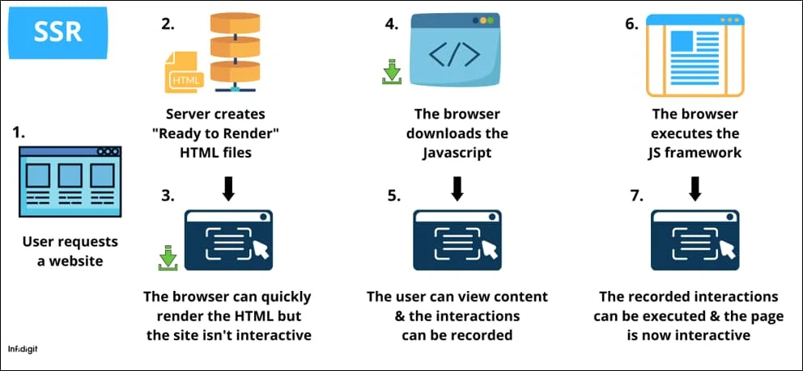
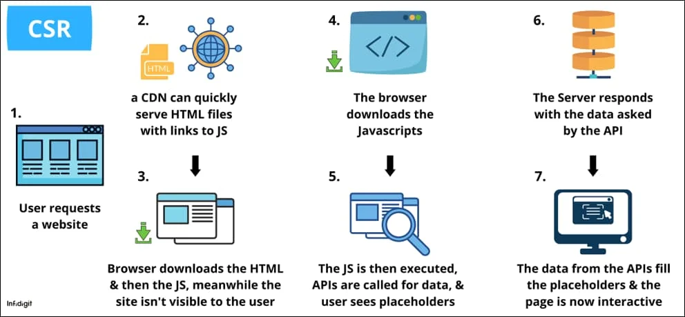

[Server-Side Rendering vs Client-Side Rendering: Which one is Good?](https://www.infidigit.com/blog/server-side-rendering-vs-client-side-rendering/)

# SSR(Server-side Rendering)

- 모든 페이지 리소스를 서버 단에서 렌더링 하는 것
- 서버가 완전히 렌더링 된 HTML, CSS, JavaScript를 전송한다.

## SSR 작동 방식

1. 유저가 브라우저를 통해 웹 페이지에 접근한다.
2. 브라우저가 서버와 연결된다. (서버는 사전 렌더링된 HTML과 CSS 코드를 갖고 있음)
3. 브라우저에 HTML, CSS가 렌더링 된다. 그러나 아직 상호작용은 할 수 없다.
4. 브라우저가 서버가 갖고 있는 자바스크립트 코드를 다운로드한다.
5. 유저는 이제 페이지를 볼 수 있고 상호작용할 수 있다.
6. 브라우저가 자바스크립트를 실행한다.
7. 페이지가 완전히 로드되고 이로 인해 사용자의 상호작용에 반응할 수 있게 된다.

## SSR의 장단점

### 장점

- **처음 페이지를 로딩할 때 빠르게 페이지를 로드한다.**
  - 사용자 경험에 good
- **SEO(Search Engine Optimization)에 좋다.**
  - 빠른 초기 로드 타임 때문에 서치 엔진 봇이 페이지를 크롤링하고 인덱싱할 수 있다.
- **느린 인터넷 속도를 가진 유저에게 좋다.**
  - JS가 처리되는 동안 렌더링 된 HTML을 미리 볼 수 있다.
- **SMO(Social Media Optimization)에 좋다.**
  - 페이지 링크를 다른 사람에게 공유하거나 소셜 미디어에 포스팅할 때 좋은 프리뷰를 제공할 수 있다. (페이지 제목, 설명, 이미지)

### 단점

- **높은 서버 부하**
  - 모든 페이지 리소스가 서버에 있으므로 브라우저가 계속 서버에 요청을 보낸다.
- **서버에서 대규모 애플리케이션을 렌더링하는 경우, 시간이 많이 걸릴 수 있다.**
- **페이지가 사용자에게 표시되는 동안에는 페이지와 상호 작용할 수 없다.**
- **느린 TTFB(Time to first byte)**
  - TTFB: HTTP 요청을 했을때 처음 byte (정보) 가 브라우져에 도달하는 시간
  - 서버에서 첫 요청에 대하여 HTML 렌더링을 처리해야 하기 때문

# CSR(Client-side Rendering)

- 모든 페이지 리소스가 클라이언트의 브라우저 단에서 렌더링 되는 것
- 자바스크립트 프레임워크에 의해 실행됨

## CSR 작동 방식

- 유저가 브라우저를 통해 웹 페이지에 접근한다.
- 서버 혹은 CDN이 필요한 자바스크립트 파일에 대한 링크가 포함된 HTML 페이지를 응답한다.
- 사용자는 로딩 중 표시가 있는 페이지만 볼 수 있다.
- 브라우저는 HTML에 링크된 자바스크립트 파일을 다운로드한다.
- 자바스크립트가 프레임워크에 의해 실행된다. 사용자는 placeholder만 볼 수 있다.
- 최종 렌더링을 위한 요청이 서버에 전송된다. (ex. data fetching…)
- 사용자는 이제 페이지를 볼 수 있고 상호작용할 수 있다.

## CSR의 장단점

### 장점

- **렌더링 속도가 빠르다.**
  - 첫 로딩 이후에 렌더링되는 속도가 빠르다.
- **조금 더 빠른 navigation을 제공한다.**
- **서버에 부하를 덜 준다.**
  - 자바스크립트가 클라이언트 측에서 실행되기 때문
- **Progressive Web App과 훌륭하게 작동한다.**
  - Progressive Web App(PWA): 웹과 네이티브 앱의 기능 모두의 이점을 갖도록 수 많은 특정 기술과 표준 패턴을 사용해 개발된 웹 앱
  - 코드가 브라우저 단에서 렌더링되기 때문
- **interactive**

### 단점

- **느린 초기 페이지 로드**
  - HTML, CSS 및 자바스크립트를 먼저 렌더링한 다음 사용자에게 표시해야 하므로 초기 페이지를 로드하는 데 걸리는 시간이 늘어난다.
- **올바르게 구현되지 않은 경우 SEO에 방해됨**
- **크롤링과 인덱싱을 지연시킴**
  - 서치 엔진 봇이 페이지 리소스가 로딩될 때까지 대기
- **외부 라이브러리 의존성**
  - 최상의 결과를 내기 위해 외부 라이브러리나 프레임워크에 의존하는 경우가 있다.

# SSR과 CSR을 선택할 때 고려해야 점

- **페이지 로드 타임**
  - SSR이 CSR에 비해 1~1.5초 더 빠르게 로드한다.
  - pre-rendered HTML을 제공하기 때문
- **캐싱**
  - CSR이 SSR보다 좋다.
  - 페이지가 로드되고 실행된 후에는 서버에 요청을 보내지 않아도 되기 때문. 재사용 가능한 스크립트가 브라우저에 저장됨.
  - SSR의 경우 페이지 리소스가 서버에 있으므로 브라우저가 서버에 요청을 보내야 함.
- **SEO**
  - SSR이 더 좋다.
  - SSR의 경우 검색 엔진 스파이더가 첫 번째 요청 시 미리 렌더링된 HTML이 전송되면서 원하는 데이터를 얻게 된다.
  - CSR의 경우 검색 엔진 스파이더가 페이지의 모든 코드가 렌더링 되기를 기다려야 한다.

구글에서는 SSR with hydration을 권장한다.

원글의 필자도 SSR이 CSR보다 우위에 있다고 함. CSR의 경우 올바르게 사용되지 않으면 사용자 경험을 해칠 수 있기 때문이다.
