# Space-around vs Space-evenly

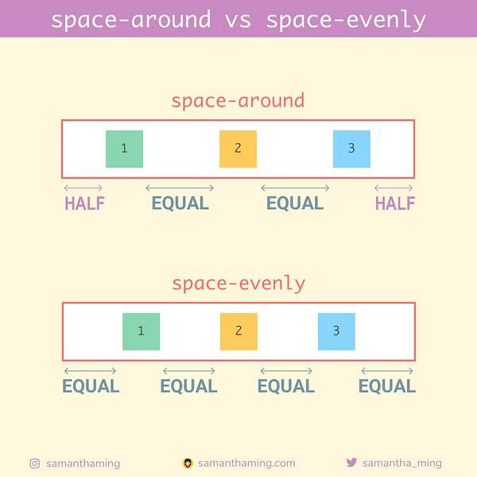

# flex-flow

flex-direction과 flex-wrap의 축약형

```css
flex-flow: flex-direction flex-wrap;
```

# align-items, align-content, align-self

셋 다 cross-axis에 대하여 아이템을 정렬할 때 사용하는 속성이다.

다만, **align-items**는 한 줄의 아이템을 정렬한다.

한 줄 이상의 아이템을 정렬할 때는 **align-content**를 사용한다. 그러기 위해서는 `flex-wrap: wrap;`이어야 한다.

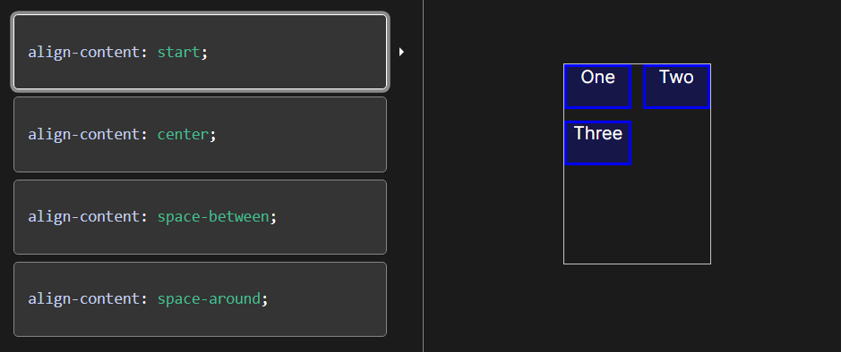

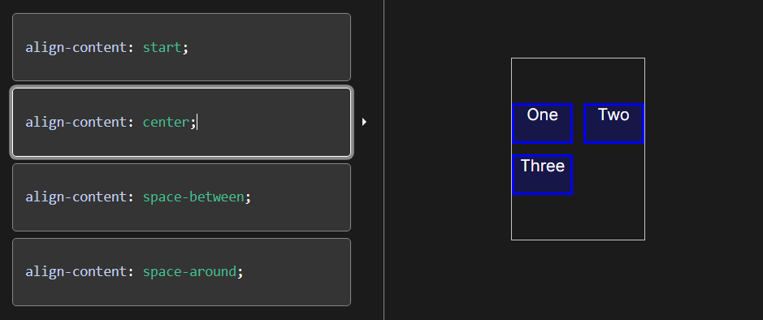

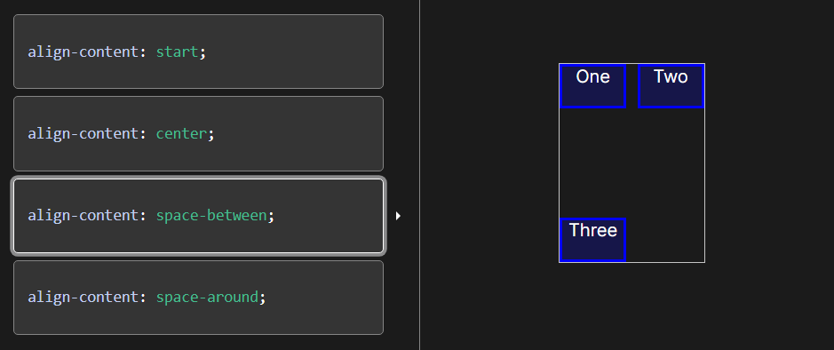

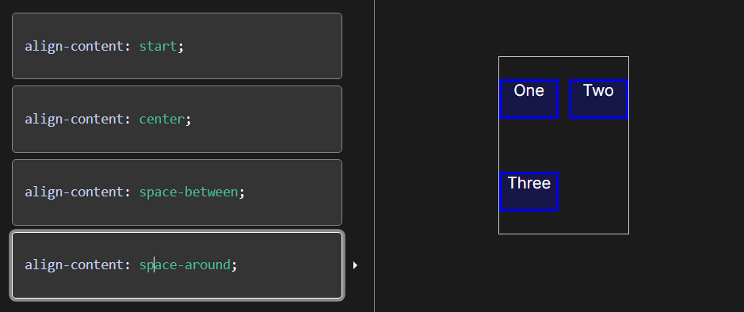

align-self는 부모 요소와 관계 없이 아이템 하나를 개별적으로 정렬하고 싶을 때 사용한다.

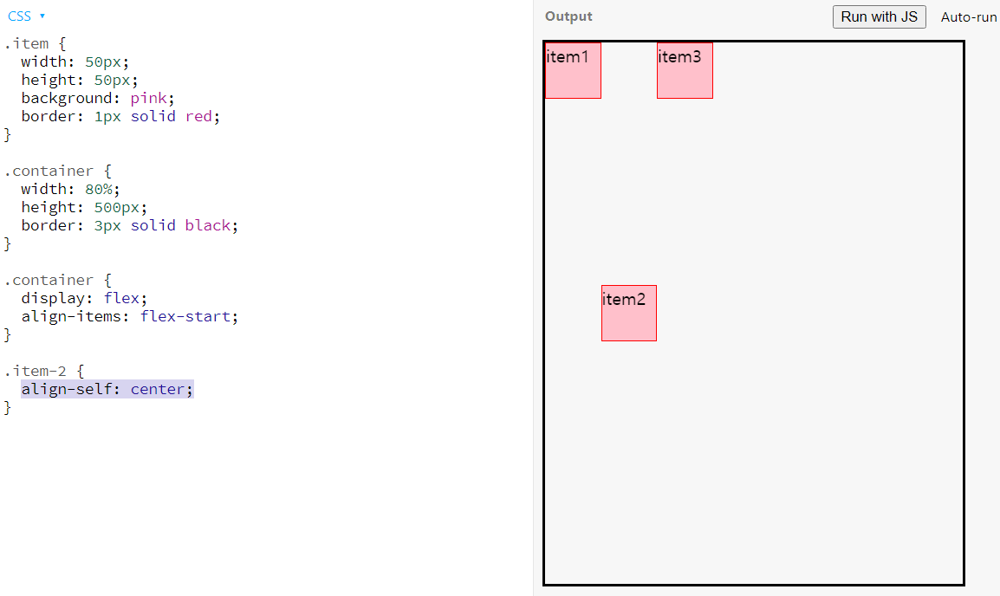

# flex-grow, flex-shrink, flex-basis

이 속성들도 개별 아이템 하나에 적용하는 속성이다.

- flex-basis
  - flex 아이템의 기본 크기
  - flex-direction이 row면 width, column이면 height
  - flex-basis를 0으로 지정하면 아이템이 점유하는 공간을 0으로 여겨 모든 공간을 여백으로 간주한다.
- flex-grow
  - flex 컨테이너가 아이템들의 너비보다 클 때, 남은 여백을 채우는 데 각 아이템이 몇의 비율로 채울 지 정하는 속성
  - 아래 예제에서는 1:2:1의 비율로 여백을 채움

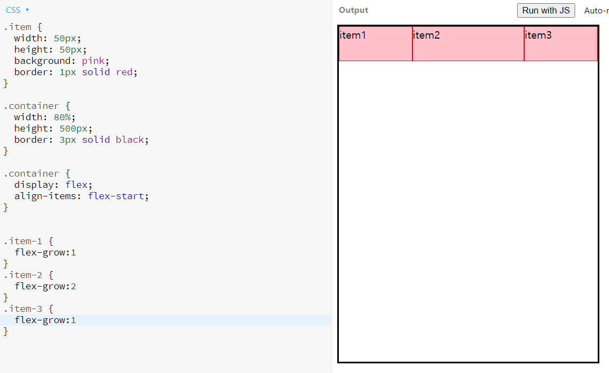

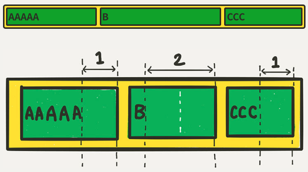

- flex-shrink
  - flex 컨테이너가 아이템들의 너비보다 작을 때, 몇의 비율로 아이템이 줄어들 것인지 정하는 속성

## flex

flex-grow, flex-shrink, flex-basis를 한번에 쓸 수 있는 축약형

```css
flex: flex-grow flex-shrink flex-basis;
```

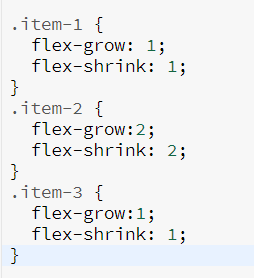

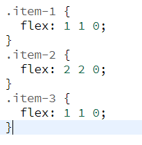

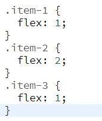

- `flex: 1;`은 `flex-grow: 1; flex-shrink: 1; flex-basis: 0%;`_과 O같다._

# Order

아이템 정렬 순서를 지정하는 속성이다.

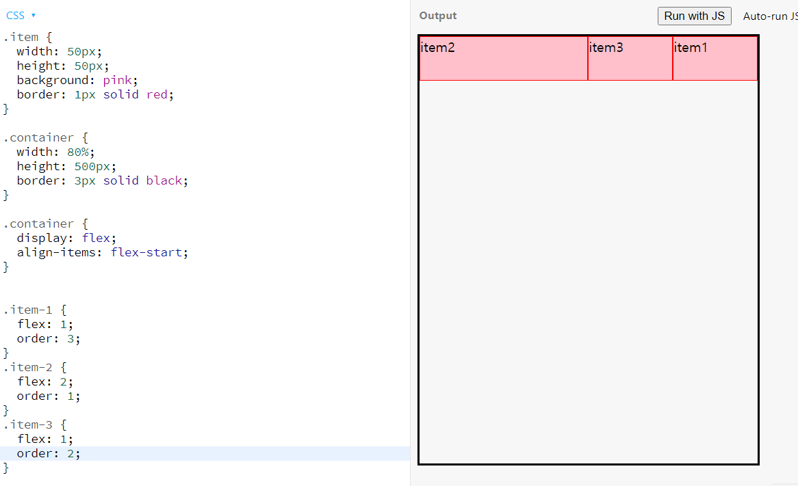

order 값에 따라 [item2, item3, item1] 순서로 정렬된 모습이다.
