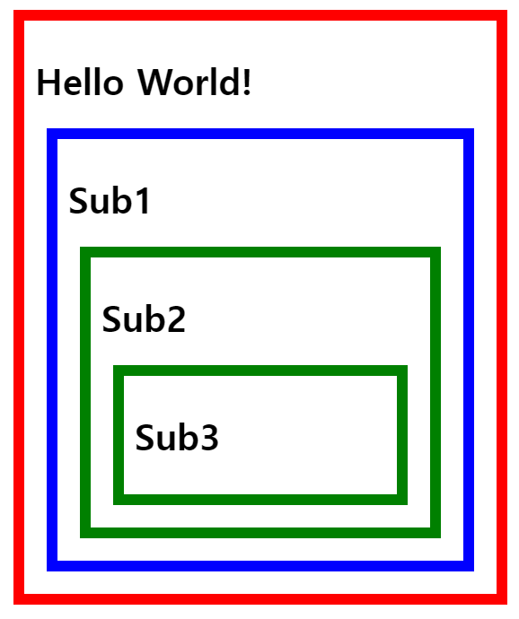

# Context API란…

전역적으로 상태를 관리할 수 있도록 돕는 도구이다.

전역 상태 관리를 하면 props drilling 현상을 방지할 수 있다.

```js
function App() {
  return <GrandParent value="Hello World!" />;
}

function GrandParent({ value }) {
  return <Parent value={value} />;
}

function Parent({ value }) {
  return <Child value={value} />;
}

function Child({ value }) {
  return <GrandChild value={value} />;
}

function GrandChild({ value }) {
  return <Message value={value} />;
}

function Message({ value }) {
  return <div>Received: {value}</div>;
}
```

다른 도구로는 redux 라이브러리가 있다.

## redux와 Context API의 차이

redux는…

- 미들웨어 개념이 존재한다.
  - 미들웨어를 사용하면 액션 객체가 리듀서에 의해 처리되기 전에 원하는 작업을 수행할 수 있다.
    - 특정 조건에 따라 액션이 무시되게 만들 수 있다.
    - 액션을 콘솔에 출력하거나, 서버쪽에 로깅을 할 수 있다.
    - 액션이 디스패치 됐을 때 이를 수정해서 리듀서에게 전달되도록 할 수 있다.
    - 특정 액션이 발생했을 때 이에 기반하여 다른 액션이 발생되도록 할 수 있다.
    - 특정 액션이 발생했을 때 특정 자바스크립트 함수를 실행시킬 수 있다.
  - 주로 비동기 처리를 할 때 사용된다.
- connect 함수를 이용하여 리덕스의 상태나 액션 생성함수를 prop으로 받을 수 있다.
- useSelector, useDispatch, useStore와 같은 hook들을 사용하여 좀 더 손쉬운 상태 관리 가능
- 하나의 커다란 상태
  - context를 사용하는 경우 일반적으로 여러 개의 context를 만들어 관리한다.

## 언제 쓸까?

1. 프로젝트의 규모가 큰가?
   - Yes: 리덕스
   - No: Context API
2. 비동기 작업을 자주 하게 되는가?
   - Yes: 리덕스
   - No: Context API
3. 리덕스를 배워보니까 사용하는게 편한가?
   - Yes: 리덕스
   - No: Context API 또는 MobX

---

# Context API 사용법 이해하기

1. createContext를 이용하여 context를 만들 수 있다.

   ```js
   const context = createContext(`context 기본값`);
   ```

2. useContext를 이용하여 context를 사용할 수 있다.

   ```js
   const contextToUse = useContext(`사용할 context`);
   ```

   - 부모 중에 가장 먼저 나타나는 Provider의 value값을 사용한다.

3. Context의 Provider 컴포넌트를 이용하여 감싸주면 감싸여있는 컴포넌트에 context를 전달할 수 있다.

   1. value 값은 필수! value 값이 컴포넌트에 전달된다.

   ```js
   function Sub1() {
     const theme = useContext(themeContext);
     return (
       <themeContext.Provider value={{ border: "10px solid green" }}>
         <div style={theme}>
           <h1>Sub1</h1>
           <Sub2 />
         </div>
       </themeContext.Provider>
     );
   }
   ```

---

# 예시

```js
import React, { createContext, useContext } from "react";
import "./style.css";

const themeDefault = { border: "10px solid red" };
const themeContext = createContext(themeDefault);

export default function App() {
  const theme = useContext(themeContext);
  return (
    <themeContext.Provider value={{ border: "10px solid blue" }}>
      <div className="root" style={theme}>
        <h1>Hello World!</h1>
        <Sub1 />
      </div>
    </themeContext.Provider>
  );
}

function Sub1() {
  const theme = useContext(themeContext);
  return (
    <themeContext.Provider value={{ border: "10px solid green" }}>
      <div style={theme}>
        <h1>Sub1</h1>
        <Sub2 />
      </div>
    </themeContext.Provider>
  );
}

function Sub2() {
  const theme = useContext(themeContext);
  return (
    <div style={theme}>
      <h1>Sub2</h1>
      <Sub3 />
    </div>
  );
}

function Sub3() {
  const theme = useContext(themeContext);
  return (
    <div style={theme}>
      <h1>Sub3</h1>
    </div>
  );
}
```



---

# Context를 여러 개 쓰는 이유

상태가 빈번하게 변경되는 경우 영향을 받지 않는 부분까지도 리렌더링이 되기 때문에 성능에 좋지 않다.

```js
import React, { createContext, useState, useContext, useMemo } from "react";

const CounterContext = createContext();

function CounterProvider({ children }) {
  const [counter, setCounter] = useState(1);
  const actions = useMemo(
    () => ({
      increase: () => setCounter(prev => prev + 1),
      decrease: () => setCounter(prev => prev - 1),
    }),
    []
  );
  const value = useMemo(() => [counter, actions], [counter, actions]);
  return (
    <CounterContext.Provider value={value}>{children}</CounterContext.Provider>
  );
}

function useCounter() {
  const value = useContext(CounterContext);
  if (value === undefined) {
    throw new Error("useCounterState should be used within CounterProvider");
  }
  return value;
}

export default function App() {
  return (
    <CounterProvider>
      <div>
        <Value />
        <Buttons />
      </div>
    </CounterProvider>
  );
}

function Value() {
  const [counter] = useCounter();
  return (
    <div>
      <h1>{counter}</h1>
    </div>
  );
}

function Buttons() {
  const [, actions] = useCounter();

  return (
    <div>
      <button onClick={actions.increase}>+1</button>
      <button onClick={actions.decrease}>-1</button>
    </div>
  );
}
```

이 경우, Value 부분만 변경되는 영향을 주어도 Buttons까지 영향을 끼치게 된다.

따라서 값과 업데이트 함수의 context를 따로 두어 사용한다.

```js
import React, { createContext, useState, useContext, useMemo } from "react";

const CounterValueContext = createContext();
const CounterActionsContext = createContext();

function CounterProvider({ children }) {
  const [counter, setCounter] = useState(1);
  const actions = useMemo(
    () => ({
      increase: () => setCounter(prev => prev + 1),
      decrease: () => setCounter(prev => prev - 1),
    }),
    []
  );

  return (
    <CounterValueContext.Provider value={counter}>
      <CounterActionsContext.Provider value={actions}>
        {children}
      </CounterActionsContext.Provider>
    </CounterValueContext.Provider>
  );
}

function useCounterValue() {
  const value = useContext(CounterValueContext);
  if (value === undefined) {
    throw new Error("useCounterState should be used within CounterProvider");
  }
  return value;
}

function useCounterActions() {
  const value = useContext(CounterActionsContext);
  if (value === undefined) {
    throw new Error("useCounterActions should be used within CounterProvider");
  }
  return value;
}

export default function App() {
  return (
    <CounterProvider>
      <div>
        <Value />
        <Buttons />
      </div>
    </CounterProvider>
  );
}

function Value() {
  const counter = useCounterValue();
  return (
    <div>
      <h1>{counter}</h1>
    </div>
  );
}

function Buttons() {
  const actions = useCounterActions();
  return (
    <div>
      <button onClick={actions.increase}>+1</button>
      <button onClick={actions.decrease}>-1</button>
    </div>
  );
}
```

---

참고

[https://react.vlpt.us/redux/](https://react.vlpt.us/redux/)

[https://velog.io/@velopert/react-context-tutorial](https://velog.io/@velopert/react-context-tutorial)

[https://youtu.be/JQ_lksQFgNw](https://youtu.be/JQ_lksQFgNw)
