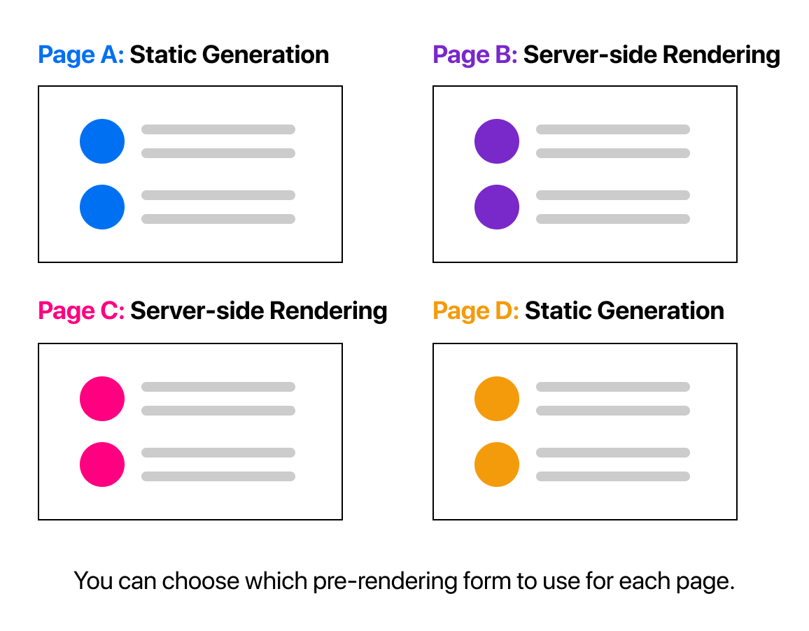
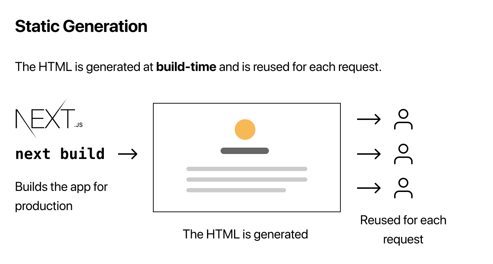
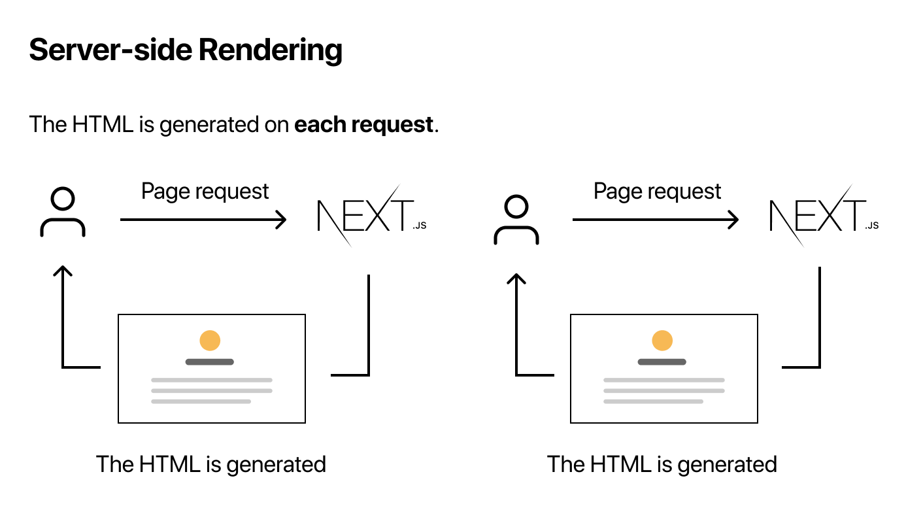

# Next.js

> Next.js는 서버 사이트 렌더링, 정적 웹 페이지 생성 등 리액트 기반 웹 애플리케이션 기능들을 가능케 하는 Node.js 위에서 빌드된 오픈 소스 웹 개발 프레임워크이다.

Next.js is a React **framework** that gives you building blocks to create web applications.

>

# Rendering

우선 렌더링에는 세 가지가 있다.

- **Client-side rendering(CSR)**
- Pre-rendering
  - **Static-site generation(SSG)**
    - getStaticProps
  - **Server-side rendering(SSR)**
    - getServerSideProps


SSG와 SSR은 클라이언트에게 전달되기 전에 데이터를 가져오고, React를 HTML로 변환하는 작업을 수행하기 때문에 pre-rendering이라고 불린다.


CSR은 initial load가 클라이언트 사이드에서 진행된다. 따라서 빈 HTML 코드에 자바스크립트가 UI를 구성하는 코드를 수행하면서 렌더링이 진행된다.

Next.js는 렌더링 방식을 페이지마다 다르게 설정할 수 있다.



# Pre-rendering & data fetching

Pre-rendering에는 두 가지가 있다.

- Static Generation
- Server-side Rendering

**언제 무엇을 사용할까?**

You should ask yourself: "Can I pre-render this page **ahead** of a user's request?"

유저의 요청 전에 페이지를 사전 생성할 수 있는가?

- Yes → Static Generation.
  - CDN을 사용하여 SSR보다 빠름
- No → Server-side Rendering
  - 자주 변경되는 데이터가 있을 때 사용

## 1. SSG



**Static Generation**은 빌드 타임에 HTML이 생성되는 방식이다.

그 후에 사전 생성된 HTML이 요청마다 다시 사용된다.

### getStaticProps()

```js
export async function getStaticProps() {
  // Get external data from the file system, API, DB, etc.
  const data = ...

  // The value of the `props` key will be
  //  passed to the `Home` component
  return {
    props: ...
  }
}
```

build time에 실행된다.

기본 형태는 위와 같이 사용한다.

```js
export async function getStaticProps() {
  const allPostsData = getSortedPostsData();
  return {
    props: {
      allPostsData,
    },
  };
}
```

이 예시에서 props 객체 안에 allPostsData를 반환하게 되는데 이 것이 해당 페이지의 prop이 된다.

따라서 해당 컴포넌트에서 `props.allPostsData`를 통해 사용할 수 있다.

```js
export default function Home ({ allPostsData }) { ... }
```

getStaticProps는 클라이언트 사이드 코드는 실행하지 않고 **서버 사이드 코드만 실행**하기 때문에 직접 데이터베이스를 쿼리하는 등의 코드를 사용할 수 있다.

그리고 **getStaticProps는 page 안에서만 사용할 수 있다.** (컴포넌트 X)

## 2. SSR



**Server-side Rendering**은 요청마다 HTML을 사전 생성하는 방식이다.

### getServerSideProps

```js
export async function getServerSideProps(context) {
  return {
    props: {
      // props for your component
    },
  };
}
```

request time에 실행된다.

형태는 getStaticProps와 비슷하다.

서버가 모든 요청에 대해 결과를 계산해야 하고, 추가 구성 없이는 CDN에서 결과를 캐시할 수 없기 때문에 getStaticProps보다 느리다.

# Routing

## 1. File-system based routing

Next.js는 파일 시스템을 기반으로 한 라우터를 갖는다.

`pages`폴더 안에 있는 파일들은 파일 이름을 기반으로 자동적으로 라우팅된다.

- `pages/index.js` → `/`
- `pages/blog/index.js` → `/blog`
- `pages/blog/first-post.js` → `/blog/first-post`
- `pages/dashboard/settings/username.js` → `/dashboard/settings/username`

## 2. Dynamic routes


동적 라우트는 파일 이름에 `[ ]` 대괄호를 사용한다.

ex) pages/posts/[id].js

### getStaticPaths()

> we need to return a list of **possible values** for `id`.

- 동적 라우트 경로로 들어갈 값에 대한 리스트를 반환해야한다.

```js
export async function getStaticPaths() {
  // Return a list of possible value for id
}
```

- development 단계에서 `getStaticPaths`는 모든 요청마다 실행된다.
- production 단계에서 `getStaticPaths`는 빌드할 때만 실행된다.

**Fallback**

- `false`
  - `getStaticPaths`에서 반환되지 않은 경로에 대하여 404 page를 내보낸다.
- `true`
  - `getStaticPaths`에서 반환된 경로는 빌드 시 HTML로 렌더링된다.
  - 반환되지 않은 경로는 처음엔 404 page가 아닌 Next.js에서 제공하는 “fallback” 버전의 페이지를 내보낸다.
  - 백그라운드에서 Next.js는 요청된 경로에 대한 페이지를 정적으로 생성하고 있다. 동일한 경로에 대한 다음 요청이 들어온 경우 이 페이지를 내보낸다.
- `blocking`
  - 새로운 경로에 대한 페이지는 `getStaticProps`를 이용하여 서버사이드 렌더링 되고 캐시된다.

### getStaticProps()

데이터를 가져와야 할 때 getStaticProps 함수에서 params 매개변수를 통해 id 값을 추출할 수 있다.

```js
export async function getStaticProps({ params }) {
  // Fetch necessary data for the blog post using params.id
  const postId = params.id;
}
```

### Catch-all Routes

뒤에 붙은 모든 경로를 캐치할 땐 `...`을 대괄호 안에 같이 써준다.

ex) pages/posts/[…id].js → `/posts/a`, `/posts/a/b`, `/posts/a/b/c`

이 경우, getStaticPaths는 다음과 같은 배열을 반환해야 한다.

```js
return [
  {
    params: {
      // Statically Generates /posts/a/b/c
      id: ["a", "b", "c"],
    },
  },
  //...
];
```

getStaticProps의 params는

```js
export async function getStaticProps({ params }) {
  // params.id will be like ['a', 'b', 'c']
}
```

## 3. Router

Next.js의 router를 사용하고 싶다면 `useRouter` 훅을 사용하면 된다.

```js
import { useRouter } from "next/router";
```

## 4. 404 page

커스텀 404 페이지를 만들고 싶다면 `pages/404.js`를 생성하면 된다.

이 페이지는 빌드 타임에 정적으로 생성된다.

# API Routes

API Routes는 Next.js 앱 내에 API 엔드포인트를 생성한다.

`pages/api` 디렉토리에 함수를 작성하여 사용할 수 있다.

```js
// req = HTTP incoming message, res = HTTP server response
export default function handler(req, res) {
  // ...
}
```

- `req` - `http.IncomingMessage`의 인스턴스 + 미들웨어
- `res` - `http.ServerResponse`의 인스턴스 + helper 함수

## 주의점

- `getStaticProps`나 `getStaticPaths`에서 API Route를 fetch하면 안된다.
  - 대신 서버 사이드 코드를 그 안에 직접 작성하여 사용한다.
  - 두 함수는 클라이언트 사이드 코드를 실행하지 않고 JS 번들에도 포함되지 않기 때문이다.

## Dynamic API Routes

`pages/api/post/[pid].js` 파일이 있다고 했을 때

```js
export default function handler(req, res) {
  const { pid } = req.query;
  res.end(`Post: ${pid}`);
}
```

req.query를 참조하여 pid 값을 추출할 수 있다.

### Catch All Dynamic API Routes

`pages/api/post/[...slug].js` → `/api/post/a`, `/api/post/a/b`, `/api/post/a/b/c`

```js
export default function handler(req, res) {
  const { slug } = req.query;
  res.end(`Post: ${slug.join(", ")}`);
}
```

slug는 배열이 되므로 이를 이용한다.
