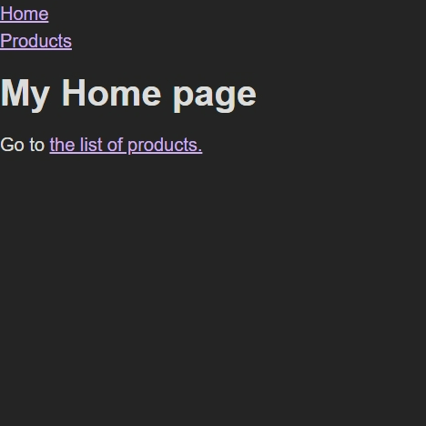
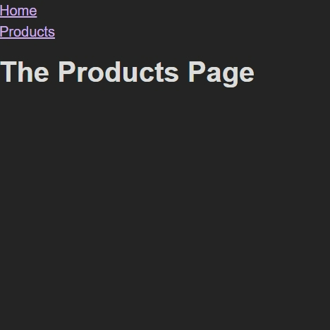

# 라우터 사용하기

1. `react-router-dom` 패키지 설치하기
2. `import { createBrowserRouter } from 'react-router-dom';`

   ```jsx
   import { createBrowserRouter } from "react-router-dom";

   import Home from "./pages/Home";

   // 라우트로 구성된 배열을 인수로 전
   const router = createBrowserRouter([{ path: "/", element: <Home /> }]);

   function App() {
     return <div></div>;
   }

   export default App;
   ```

3. RouterProvider를 이용해서 라우팅하기

   ```jsx
   import { createBrowserRouter, RouterProvider } from "react-router-dom";

   import Home from "./pages/Home";

   const router = createBrowserRouter([{ path: "/", element: <Home /> }]);

   function App() {
     return <RouterProvider router={router} />;
   }

   export default App;
   ```

## 다른 방법으로 라우팅하기

```jsx
import {
  createBrowserRouter,
  createRoutesFromElements,
  RouterProvider,
  Route,
} from "react-router-dom";

import HomePage from "./pages/Home";
import ProductsPage from "./pages/Products";

const routeDefinitions = createRoutesFromElements(
  <Route>
    <Route path="/" element={<HomePage />} />
    <Route path="/products" element={<ProductsPage />} />
  </Route>
);

const router = createBrowserRouter(routeDefinitions);

function App() {
  return <RouterProvider router={router} />;
}

export default App;
```

# 다른 페이지로 이동하기

## 1. a 태그 이용하기

```jsx
import React from "react";

function HomePage() {
  return (
    <>
      <h1>My Home page</h1>
      <p>
        Go to <a href="/products">the list of products.</a>
      </p>
    </>
  );
}

export default HomePage;
```

a 태그를 이용하는 경우 싱글 HTML 페이지를 제공하지만 모든 Javascript 코드를 다시 로딩한다.

리액트 애플리케이션 전체를 다시 로딩하고 재시작한다.

⇒ 사이트 성능에 영향을 미친다.

## 2. Link 이용하기

```jsx
import React from "react";
import { Link } from "react-router-dom";

function HomePage() {
  return (
    <>
      <h1>My Home page</h1>
      <p>
        Go to <Link to="/products">the list of products.</Link>
      </p>
    </>
  );
}

export default HomePage;
```

a 태그를 사용했을 때 생기는 **http 리퀘스트를 막아준다**.

라우트 정의를 확인하여 그에 맞춰 페이지를 업데이트하고 로딩한다.

# 레이아웃 및 중첩 라우트

네비게이션 바 같은 공통 컴포넌트를 사용할 때

```jsx
// App.js
import { createBrowserRouter, RouterProvider } from "react-router-dom";

import HomePage from "./pages/Home";
import ProductsPage from "./pages/Products";
import RootLayout from "./pages/Root";

const router = createBrowserRouter([
  {
    path: "/",
    element: <RootLayout />,
    children: [
      { path: "/", element: <HomePage /> },
      { path: "/products", element: <ProductsPage /> },
    ],
  },
]);

function App() {
  return <RouterProvider router={router} />;
}

export default App;
```

공통으로 사용할 라우트의 children 값으로 기존 라우트들을 넣으면 기존 요소들을 감싸주는 효과가 생겨 모든 경로에서 공통 컴포넌트를 표시할 수 있다.

```jsx
// Root.js
import React from "react";
import { Outlet } from "react-router-dom";
import MainNavigation from "../components/MainNavigation";

function RootLayout() {
  return (
    <>
      <MainNavigation />
      <Outlet />
    </>
  );
}

export default RootLayout;
```

공통 컴포넌트에서 자식 요소들을 렌더링할 위치를 지정해야 한다.

이 경우 Outlet을 이용하면 자식 요소 컴포넌트들이 해당 위치에 렌더링 된다.





# 에러 페이지 표시하기

존재하지 않는 페이지에 접근하는 경우 사용자에게 적절한 피드백을 제공하는 컴포넌트가 필요하다.

어떠한 경로에서 에러가 발생하면 결국 루트 페이지로 에러가 bubble up 되기 때문에 루트 경로에 errorElement를 지정하여 에러 페이지를 표시할 수 있다.

```jsx
import { createBrowserRouter, RouterProvider } from "react-router-dom";

import HomePage from "./pages/Home";
import ProductsPage from "./pages/Products";
import RootLayout from "./pages/Root";
import ErrorPage from "./pages/Error";

const router = createBrowserRouter([
  {
    path: "/",
    element: <RootLayout />,
    errorElement: <ErrorPage />,
    children: [
      { path: "/", element: <HomePage /> },
      { path: "/products", element: <ProductsPage /> },
    ],
  },
]);

function App() {
  return <RouterProvider router={router} />;
}

export default App;
```

# NavLink

네비게이션 바에서 어떤 페이지가 활성화 되어 있는지 표시하고 싶을 때 사용한다.

Link 컴포넌트를 NavLink로 바꾸고 className을 추가하면 className은 함수를 받을 수 있는 컴포넌트가 된다.

이 함수는 **앵커 태그에 추가되어야 하는 CSS 클래스 이름**을 리턴한다.

style 프롭에서도 동일하게 사용할 수 있다.

```jsx
import React from "react";
import { NavLink } from "react-router-dom";

import classes from "./MainNavigation.module.css";

function MainNavigation() {
  return (
    <header className={classes.header}>
      <nav>
        <ul className={classes.list}>
          <li>
            <NavLink
              to="/"
              className={({ isActive }) =>
                isActive ? classes.active : undefined
              }
              end
            >
              Home
            </NavLink>
          </li>
          <li>
            <NavLink
              to="/products"
              className={({ isActive }) =>
                isActive ? classes.active : undefined
              }
            >
              Products
            </NavLink>
          </li>
        </ul>
      </nav>
    </header>
  );
}

export default MainNavigation;
```

# 프로그램적으로 네비게이션하기

프로그램적으로 네비게이션을 한다는 뜻은…

특정한 경우에 네비게이션을 해야하는 경우를 의미한다.

예) 타이머가 만료 되면 네비게이션하기, 버튼을 눌렀을 때 네비게이션 하기

이런 경우 react-router-dom에서 제공하는 `useNavigate`를 사용한다.

```jsx
import React from "react";
import { Link, useNavigate } from "react-router-dom";

function HomePage() {
  const navigate = useNavigate();

  function navigationHandler() {
    navigate("/products");
  }

  return (
    <>
      <h1>My Home page</h1>
      <p>
        Go to <Link to="/products">the list of products.</Link>
      </p>
      <p>
        <button onClick={navigationHandler}>Navigate</button>
      </p>
    </>
  );
}

export default HomePage;
```

---

# loader

> **Each route can define a "loader" function to provide data to the route element before it renders.**

라우트 엘리먼트에 데이터를 전달하기 위해 렌더링 전에 수행하는 함수

```jsx
const router = createBrowserRouter([
  {
    path: "/",
    element: <RootLayout />,
    errorElement: <ErrorPage />,
    children: [
      { index: true, element: <HomePage /> },
      {
        path: "events",
        element: <EventsRootLayout />,
        children: [
          {
            index: true,
            element: <EventsPage />,
            loader: async () => {
              const response = await fetch("http://localhost:8080/events");

              if (!response.ok) {
                // ...
              } else {
                const resData = await response.json();
                // 리턴값이 전달됨
                return resData.events;
              }
            },
          },
          { path: ":eventId", element: <EventDetailPage /> },
          { path: "new", element: <NewEventPage /> },
          { path: ":eventId/edit", element: <EditEventPage /> },
        ],
      },
    ],
  },
]);
```

loader에서 throw되는 오류는 bubble up 되어, 페이지가 errorElement 페이지로 연결되게끔 한다.

## useLoaderData

엘리먼트(컴포넌트) 안에서 loader 데이터를 사용하고자 할 때 사용한다.

```jsx
import { useLoaderData } from "react-router-dom";

import EventsList from "../components/EventsList";

function EventsPage() {
  const data = useLoaderData();

  const events = data.events;

  return (
    <>
      <EventsList events={events} />
    </>
  );
}

export default EventsPage;
```

## useRouteError

loader 함수에서 throw한 error를 캐치하여 사용하고자 할 때 사용한다.

```jsx
import React from "react";
import { useRouteError } from "react-router-dom";
import MainNavigation from "../components/MainNavigation";

import PageContent from "../components/PageContent";

function ErrorPage() {
  const error = useRouteError();

  let title = "An error occurred!";
  let message = "Something went wrong!";

  if (error.status === 500) {
    message = error.data.message;
  }

  if (error.status === 404) {
    title = "Not found!";
    message = "Could not find resource or page.";
  }

  return (
    <>
      <MainNavigation />
      <PageContent title={title}>
        <p>{message}</p>
      </PageContent>
    </>
  );
}

export default ErrorPage;
```

---

# action

> **Actions are called whenever the app sends a non-get submission ("post", "put", "patch", "delete") to your route.**

get이 아닌 요청을 할 때 action 함수가 호출된다. (get은 loader)

```jsx
import React from "react";
import { json, redirect } from "react-router-dom";

import EventForm from "../components/EventForm";

function NewEventPage() {
  return <EventForm />;
}

export default NewEventPage;

export async function action({ request, params }) {
  const data = await request.formData();

  const eventData = {
    title: data.get("title"),
    image: data.get("image"),
    date: data.get("date"),
    description: data.get("description"),
  };

  const response = await fetch("http://localhost:8080/events", {
    method: "POST",
    headers: {
      "Content-Type": "application/json",
    },
    body: JSON.stringify(eventData),
  });

  if (!response.ok) {
    throw json({ message: "Could not save event." }, { status: 500 });
  }

  return redirect("/events");
}
```

이 때 사용하는 form은 react-router-dom이 제공하는 Form 컴포넌트를 사용해야 한다.

## 프로그램적으로 action 사용하기

`useSubmit` 훅을 사용하면 Form 컴포넌트를 이용하여 제출하는 듯한 작업이 가능하다.

```jsx
function EventItem({ event }) {
  const submit = useSubmit();

  function startDeleteHandler() {
    const proceed = window.confirm('Are you sure?');

    if (proceed) {
      submit(null, { method: 'delete' });
    }
  }
```
