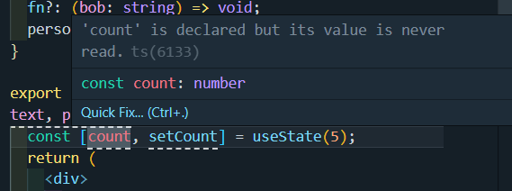

[React Typescript Tutorial](https://youtu.be/Z5iWr6Srsj8)

# React 컴포넌트 타입 지정하기

리액트 컴포넌트의 타입은 `React.FC`로 지정한다.

```tsx
import React from "react";

export const TextField: React.FC = () => {
  return (
    <div>
      <input />
    </div>
  );
};
```

---

# Prop 사용하기

props를 받을 때는 `React.FC<{prop이름: prop타입}>`을 이용한다.

```tsx
import React from "react";

export const TextField: React.FC<{ text: string }> = () => {
  return (
    <div>
      <input />
    </div>
  );
};
```

혹은 props용 interface를 이용하여 제네릭에 넣어준다.

```tsx
import React from "react";

interface Props {
  text: string;
}

export const TextField: React.FC<Props> = () => {
  return (
    <div>
      <input />
    </div>
  );
};
```

```tsx
interface Person {
  firstName: string;
  lastName: string;
}

interface Props {
  text: string;
  ok: boolean;
  i: number;
  fn: (bob: string) => void;
  person: Person;
}
```

prop이 optional한 경우에는 `?`를 붙인다.

```tsx
interface Props {
  text: string;
  ok?: boolean;
  i?: number;
  fn?: (bob: string) => void;
  person: Person;
}
```

---

# Hooks 사용하기

## 1. useState

### 유형 추론

기본적으로 유형 추론을 지원한다.



### 유형 지정하기

유형을 명시적으로 지정하려면 `<>`를 사용하여 지정한다.

```tsx
const [count, setCount] = useState<number | null>(5);

setCount(null);
```

```tsx
const [count, setCount] = useState<{ text: string }>({ text: "hello" });

setCount({ text });
```

```tsx
interface TextNode {
  text: string;
}

const [count, setCount] = useState<TextNode>({ text: "hello" });
```

## 2. useRef

기본적인 형태는

```tsx
const ref = useRef<반환값>(초기값);
```

위와 같다.

DOM 요소에 대한 참조하려면 엘리먼트에 맞는 `HTML***Element`로 타입을 명시한다.

```tsx
const inputRef = useRef<HTMLInputElement>(null);
const divRef = useRef<HTMLDivElement>(null);
```

초기값은 null이나 HTML 엘리먼트의 초기값으로 지정할 수 있다.

대부분 초기값은 null로 지정한다.

## 3. useReducer

**`useReducer`**훅이 반환하는 값의 타입을 지정해야한다.

그러기 위해 액션 타입과 상태 타입을 정의해야 한다.

- 액션 타입: `type` 속성의 타입 (action 파라미터에 넘어가는 타입)
- 상태 타입: 리듀서 함수에서 반환하는 상태의 타입

```tsx
import { useReducer } from "react";

type Action = { type: "increment" } | { type: "decrement" };
type State = { count: number };

function reducer(state: State, action: Action) {
  switch (action.type) {
    case "increment":
      return { count: state.count + 1 };
    case "decrement":
      return { count: state.count - 1 };
    default:
      throw new Error();
  }
}

function MyComponent() {
  const [state, dispatch] = useReducer(reducer, { count: 0 });

  return (
    <div>
      <p>Count: {state.count}</p>
      <button onClick={() => dispatch({ type: "increment" })}>Increment</button>
      <button onClick={() => dispatch({ type: "decrement" })}>Decrement</button>
    </div>
  );
}
```
