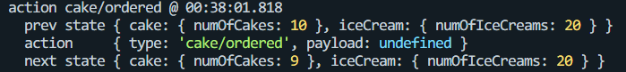
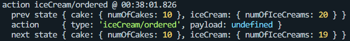

# 1. Redux Toolkit이 등장한 이유

Redux를 사용하기 위해서는 복잡한 셋업과정이 필요했다.

- action type
- action creator
- reducer의 switch문

위의 세 가지를 계속해서 작성해야 했다.

특정 작업을 처리하기 위해서는 다른 라이브러리들이 설치되어야 했다.

- redux-thunk
  - 비동기 액션 처리
- Immer
  - state가 중첩일 경우 쓰기 편리함.
- redux devtools
  - 디버그

Redux Toolkit은 이러한 **복잡한 셋업과정을 단순화 하고 유용한 기능들을 내장**하고 있어 좋은 개발자 경험을 제공할 수 있다.

---

# 2. Slice

Redux Toolkit에서는 state를 기능적 단위로 잘라 slice로 관리한다.

```jsx
const initialState = {
  numOfCakes: 10,
};

const cakeSlice = createSlice({
  name: "cake",
  initialState,
  reducers: {
    ordered: state => {
      state.numOfCakes--;
    },
    restocked: (state, action) => {
      state.numOfCakes += action.payload;
    },
  },
});
```

```jsx
const initialState = {
  numOfIceCreams: 20,
};

const iceCreamSlice = createSlice({
  name: "iceCream",
  initialState,
  reducers: {
    ordered: state => {
      state.numOfIceCreams--;
    },
    restocked: (state, action) => {
      state.numOfIceCreams += action.payload;
    },
  },
});
```

## 1. reducer 내에서 직접 상태를 변경해도 된다.

Redux를 사용할 땐 reducer 함수 내에서 직접 상태를 변경하면 안 됐다.

기존의 상태를 복사하여 필요한 부분만 변경 후 리턴하는 형태로 상태를 변경해야 했다.

그러나 Redux Toolkit에서는 **createSlice 함수 내에서 Immer 라이브러리를 사용하므로 상태를 직접 변경하는 것이 가능**하다.

## 2. Action Creator 함수를 만들지 않아도 된다.

createSlice 함수가 **액션 생성자 함수와 리듀서 함수를 자동으로 생성**하기 때문에 액션 생성자 함수를 만들지 않아도 된다.

createSlice 함수는 액션 생성자 함수와 reducer 함수를 하나의 객체로 묶어서 반환하고 이를 통해 액션을 디스패치하고 상태를 업데이트할 수 있다.

reducer 함수 내에 정의한 함수 이름과 같은 이름의 액션 생성자 함수를 자동으로 생성한다.

액션의 타입은 `"슬라이스이름/액션생성자함수이름"`의 형태로 생성된다.





---

# 3. createStore vs configureStore

configureStore 함수는 **createStore 함수의 기능을 충분히 대체**할 수 있을 뿐만 아니라 **더 많은 기능을 제공**하므로 configureStore 함수를 사용할 것을 공식적으로 권장하고 있다.

configureStore 함수는 **기본적으로 redux devtools extension을 지원**하므로 개발자가 더 쉽게 디버깅을 할 수 있도록 도와준다.

뿐만 아니라, 여러 개의 리듀서를 사용하기 위해서는 `combineReducer`함수를 사용해야 했다. 그러나 configureStore 함수를 사용하면 **별도의 함수 없이 여러 개의 리듀서를 사용**할 수 있다.

```jsx
const store = configureStore({
  reducer: {
    cake: cakeReducer,
    iceCream: iceCreamReducer,
  },
});
```

---

# 4. 미들웨어 적용 방법

기존의 방식으로는 `applyMiddleware` 함수를 사용하여 미들웨어를 사용할 수 있었다.

Redux Toolkit 에서는 configureStore 함수 내에 middleware 프로퍼티에 사용할 미들웨어를 추가하여 미들웨어를 사용할 수 있다.

```jsx
const store = configureStore({
  reducer: {
    cake: cakeReducer,
    iceCream: iceCreamReducer,
  },
  middleware: getDefaultMiddleware => getDefaultMiddleware().concat(logger),
});
```

기본적으로 사용하는 미들웨어들이 있기 때문에 기존의 미들웨어 뒤에 concat 함수로 logger 미들웨어를 부착하여 사용한다.

---

# 5. 추가적인 리듀서 사용하기

Redux Toolkit의 슬라이스는 그 슬라이스에서 만들어 낸 액션에 대한 작업만 이루어진다.

다른 슬라이스가 만들어 낸 액션에 대해서는 반응하지 않는다.

만약 다른 슬라이스의 액션에 대하여 반응하고 싶으면 어떻게 해야할까?

Redux에서는 reducer 함수의 switch문에 케이스를 단순히 추가하면 됐다. 그러나 Redux Toolkit에서는 액션과 리듀서를 자동으로 생성하므로 개발자가 직접 케이스를 추가하는 방법을 사용하기 위해서는 다른 방법을 사용해야 한다. 이 때 사용하는 것이 `extraReducers`이다.

```jsx
const iceCreamSlice = createSlice({
  name: "iceCream",
  initialState,
  reducers: {
    ordered: state => {
      state.numOfIceCreams--;
    },
    restocked: (state, action) => {
      state.numOfIceCreams += action.payload;
    },
  },
  extraReducers: builder => {
    // cakeSlice의 액션 중 ordered 액션에 대하여
    builder.addCase(cakeActions.ordered, state => {
      state.numOfIceCreams--;
    });
  },
});
```

예를 들어 케이크를 주문하는 손님에게 아이스크림을 무료로 제공하고 싶다면 extraReducers에 cake슬라이스의 액션을 추가하고 그 액션에 대하여 처리할 함수를 추가하면 케이크 주문이 들어왔을 때에도 아이스크림 개수를 줄일 수 있다.

builder는 Redux Toolkit에서 사용되는 개념으로, extraReducers 프로퍼티 내에서 리듀서를 정의할 때 사용된다. builder는 addCase, addMatcher 등의 메서드를 통해 리듀서를 정의하고 각 액션에 대한 state transition을 처리할 수 있도록 한다.

---

# 6. Async actions

Redux에서 비동기 작업을 하기 위해서는 redux-thunk 라이브러리를 별도로 설치해야 했다. 그러나 Redux Toolkit에서는 `createAsyncThunk`라는 함수를 기본으로 제공하여 비동기 작업을 처리할 수 있도록 해준다.

```jsx
// generates pending, fulfilled and rejected action types
const fetchUsers = createAsyncThunk("user/fetchUsers", () => {
  return axios
    .get("https://jsonplaceholder.typicode.com/users")
    .then(response => response.data.map(user => user.id));
});

const userSlice = createSlice({
  name: "user",
  initialState,
  extraReducers: builder => {
    builder.addCase(fetchUsers.pending, state => {
      state.loading = true;
    });
    builder.addCase(fetchUsers.fulfilled, (state, action) => {
      state.loading = false;
      state.users = action.payload;
      state.error = "";
    });
    builder.addCase(fetchUsers.rejected, (state, action) => {
      state.loading = false;
      state.users = [];
      state.error = action.error.message;
    });
  },
});
```

createAsyncThunk의 핵심적 특징은 두 번째 인자인 **payloadCreator에서 반환된 것이 프로미스이면 자동으로 pending, fulfilled, rejected 상태에 따른 액션을 자동으로 생성한다**는 것이다.

createAsyncThunk의 첫 번째 인자는 typePrefix로 typePrefix 뒤에 pending, fulfilled, rejected가 붙은 것이 자동으로 생성되는 액션의 이름이다. 위 코드의 경우 typePrefix가 ‘user/fetchedUsers’이므로 생성되는 액션은 `‘user/fetchedUsers/pending’`, `‘user/fetchedUsers/fulfilled’`, `‘user/fetchedUsers/rejected’`이다.

- fetchUsers.pending ⇒ `‘user/fetchedUsers/pending’`
- fetchUsers.fulfilled ⇒ `‘user/fetchedUsers/fulfilled’`
- fetchUsers.rejected ⇒ `‘user/fetchedUsers/rejected’`

그러나 이에 따른 리듀서 함수는 자동으로 만들어주지 않으므로 직접 extraReducers에 케이스를 추가하여 리듀서 함수를 생성해야 한다.
