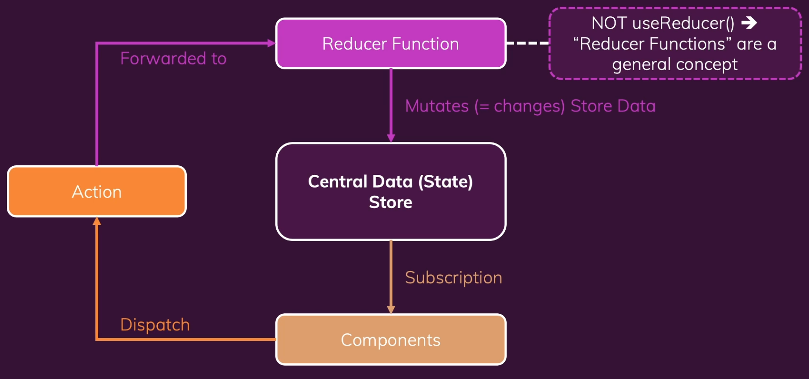

참고: [https://www.udemy.com/course/best-react/](https://www.udemy.com/course/best-react/)

# State의 종류

- **local state**
  - State that belongs to a single component
  - 하나의 컴포넌트에 속한 state
    - ex) input field에서 사용자 인풋을 받을 때
  - useState, useReducer
- **cross-component state**
  - State that affects multiple components
  - 다수의 컴포넌트에 영향을 미치는 state
    - ex) 모달 오버레이의 open/close 상태
  - prop chains / prop drilling
- **app-wide state**
  - State that affects the entire app
  - 앱 전체에 영향을 미치는 state
    - ex) 사용자 인증(user authentication status)
  - prop chains / prop drilling

Context API나 Redux가 cross-component state와 app-wide state 관리를 도와준다.

---

# Context가 있는데 Redux는 왜 필요할까?

## React Context의 (잠재적) 단점

- complex setup/management
  - 엔터프라이즈급 대형 프로젝트에서 ContextProvider가 여러 개 중첩되는 형태의 코드가 작성될 수 있다.
  - 하나의 ContextProvider만 사용하여 관리할 수 있지만 이 경우, 하나의 컨텍스트에서 많은 것들을 관리하므로 그 자체를 유지하고 관리하기 힘들다.
- performance
  - state가 자주 변경되는 경우 성능이 저하된다.
  - 모든 시나리오에서 리덕스를 대체할 수 있을만한 성능은 아니다.

⇒ React Context의 대안으로 Redux를 사용한다.

---

# Redux 작동 방식



Redux는 애플리케이션에 있는 중앙 데이터(상태) 저장소와 같다.

이 저장소에 전체 애플리케이션의 모든 상태를 저장한다.

컴포넌트는 상태를 사용하기 위해 중앙 데이터 저장소에 구독을 걸어놓는다.

데이터가 변경될 때마다 저장소가 컴포넌트에 알려주게 되고 컴포넌트는 필요한 데이터를 받는다.

컴포넌트는 저장소에 있는 데이터를 직접 조작하지 않는다.

그 대신 리듀서 함수를 사용하여 상태를 변경한다.

컴포넌트는 액션을 디스패치하고 이 액션이 리듀서에 전달되어 작동한다.

---

- 강의 내용

  # Redux의 기본적 사용

  ```js
  // 프로젝트에서 사용하는 것이 아닌 단일 js 파일에서 사용
  const redux = require("redux");

  // 리듀서 함수 작성
  const counterReducer = (state = { counter: 0 }, action) => {
    if (action.type === "increment") {
      return { counter: state.counter + 1 };
    }
    if (action.type === "decrement") {
      return { counter: state.counter - 1 };
    }
    return state;
  };

  // 저장소 생성
  const store = redux.createStore(counterReducer);

  // subscriber 함수: 상태가 바뀐 이후에 작동되는 함수
  // 항상 최신 상태를 가져온다.
  const counterSubscriber = () => {
    const latestState = store.getState();
    console.log(latestState);
  };

  // 구독 걸기
  store.subscribe(counterSubscriber);

  // dispatch로 액션 전달 -> 리듀서 작동 -> 상태 변경
  store.dispatch({ type: "increment" });
  store.dispatch({ type: "decrement" });
  ```

  ***

  # React에서 redux 사용하기

  1. `npm i redux react-redux`
     1. react-redux는 리액트에서 리덕스 스토어 구독을 더 쉽게 도와준다.
  2. store, reducer 함수 생성
  3. App 컴포넌트를 렌더링하는 index.js 에서 Provider로 감싸기

     ```js
     import {Provider} from 'react-redux';
     ...

     const root = ReactDOM.createRoot(document.getElementById('root'));
     root.render(
       <Provider store={store}>
         <App />
       </Provider>
     );
     ```

  4. store를 사용할 컴포넌트에서 `useSelector` 훅을 이용하여 state를 가져올 수 있고 `useDispatch` 함수를 이용하여 dispatch할 수 있다.

     ```js
     import { useSelector, useDispatch } from 'react-redux';
     ...

     const Counter = () => {
     	// 상태 중 일부를 가져올 수 있음
       const counter = useSelector((state) => state.counter);
       const dispatch = useDispatch();

     	const incrementHandler = () => {
         dispatch({ type: 'increment' });
       };
       const decrementHandler = () => {
         dispatch({ type: 'decrement' });
       };

       ...
     };

     export default Counter;
     ```

---

# 공식문서를 보며 Redux 배우기

## Redux Terminology

### actions

```js
const addTodoAction = {
  type: "todos/todoAdded",
  payload: "Buy milk",
};
```

쉽게 말해 애플리케이션 안에서 일어나는 이벤트를 설명한 것

`type`을 통해 todo가 추가될 것을 알 수 있고 `payload`에서 어떤 todo가 추가될 지 알 수 있다.

### action creators

```js
const addTodo = text => {
  return {
    type: "todos/todoAdded",
    payload: text,
  };
};
```

action 객체를 생성하는 함수

### reducers

`state`와 `action`객체를 받아서 state를 업데이트하고 반환하는 함수

action에 따라 이벤트를 다루는 이벤트 리스너라고 생각하면 된다.

**reducer rule**

- state와 action을 기반으로 새로운 state에 대한 연산을 해야함.
- 기존의 state를 변경하는 것이 아니라, state를 복사하여 변경하는 **immutable update**를 해야함.
- 비동기적인 로직, 랜덤 값 생성, side effect가 금지된다.

Redux의 목표는 예측가능한 코드를 만드는 것이다. 외부 변수에 의존하거나 랜덤하게 작동하는 경우 우리는 결과를 예측할 수 없고 애플리케이션 또한 랜덤으로 작동하게 될 것이다. 이것은 버그로 이어질 수 있다. 그러므로 immutable update가 중요하다.

**reducer logic**

- 어떤 action인지 확인하고 그에 따른 로직을 실행한다.
  - immutable update 후 반환
- 해당 action이 없다면 기존 state를 반환한다.

```js
const initialState = { value: 0 };

function counterReducer(state = initialState, action) {
  // Check to see if the reducer cares about this action
  if (action.type === "counter/increment") {
    // If so, make a copy of `state`
    return {
      ...state,
      // and update the copy with the new value
      value: state.value + 1,
    };
  }
  // otherwise return the existing state unchanged
  return state;
}
```

if/else문을 사용하거나 switch문을 사용하여 구현할 수 있다.

### store

```js
import { configureStore } from "@reduxjs/toolkit";

const store = configureStore({ reducer: counterReducer });

console.log(store.getState());
// {value: 0}
```

store는 생성할 때 reducer를 전달한다.

getState 메서드를 통해 state 값을 받을 수 있다.

### dispatch

```js
store.dispatch({ type: "counter/increment" });

console.log(store.getState());
// {value: 1}
```

state를 업데이트 하기 위해 dispatch 메서드를 사용한다.

dispatch 메서드를 사용하는 것은 “이벤트를 일으키는 것”과 같다.

### selectors

```js
const selectCounterValue = state => state.value;

const currentValue = selectCounterValue(store.getState());
console.log(currentValue);
// 2
```

state에서 특정 값만 추출하는 함수

애플리케이션이 커지는 경우 반복되는 로직을 피하는 등 유용하게 쓰일 수 있다.

## Redux Store 생성하기

```js
import { configureStore } from "@reduxjs/toolkit";
import counterReducer from "../features/counter/counterSlice";

export default configureStore({
  reducer: {
    counter: counterReducer,
  },
});
```

`configureStore`에서는 reducer를 넘겨주어야 한다.

`{counter: counterReducer}`를 reducer 객체에 넘겨준다는 것은 우리가 state.counter 섹션을 가지고 싶다는 뜻이며, action이 디스패치 되었을 때 state.counter 섹션을 업데이트할지 여부와 방법을 결정하는 일을 counterReducer가 담당한다는 뜻이다.

### redux slices

slice는 하나의 기능에 대한 reducer 로직과 action을 하나의 파일로 묶은 것을 의미한다.

```js
import { configureStore } from "@reduxjs/toolkit";
import usersReducer from "../features/users/usersSlice";
import postsReducer from "../features/posts/postsSlice";
import commentsReducer from "../features/comments/commentsSlice";

export default configureStore({
  reducer: {
    users: usersReducer,
    posts: postsReducer,
    comments: commentsReducer,
  },
});
```

state.users, state.posts, state.comments가 각각의 slice로 되어있는 것을 볼 수 있다.

## Slice reducer와 action 생성하기

```js
// features/counter/counterSlice.js
import { createSlice } from "@reduxjs/toolkit";

export const counterSlice = createSlice({
  name: "counter",
  initialState: {
    value: 0,
  },
  reducers: {
    increment: state => {
      // Redux Toolkit allows us to write "mutating" logic in reducers. It
      // doesn't actually mutate the state because it uses the immer library,
      // which detects changes to a "draft state" and produces a brand new
      // immutable state based off those changes
      state.value += 1;
    },
    decrement: state => {
      state.value -= 1;
    },
    incrementByAmount: (state, action) => {
      state.value += action.payload;
    },
  },
});

export const { increment, decrement, incrementByAmount } = counterSlice.actions;

export default counterSlice.reducer;
```

redux toolkit에는 action type string, action creator function, action 객체를 생성하는 작업을 처리하는 `createSlice` 함수가 있다.

슬라이스의 이름을 정의하고 reducer 함수가 포함된 객체를 작성하기만 하면 해당 액션 코드가 자동으로 생성된다.

“counter” + “increment”가 되어 `{type: "counter/increment"}`가 생성된다.

따라서 이전의 방식처럼 우리가 직접 action type을 지정하고 action 생성 함수를 작성할 필요가 없다.

```js
console.log(counterSlice.actions.increment());
// {type: "counter/increment"}
```

```js
const newState = counterSlice.reducer(
  { value: 10 },
  counterSlice.actions.increment()
);
console.log(newState);
// {value: 11}
```

## Reducer와 immutable update

`createSlice`함수는 immer 라이브러리를 사용하기 때문에 우리가 immutable update를 하기 쉽게 만들어준다.

```js
function handwrittenReducer(state, action) {
  return {
    ...state,
    first: {
      ...state.first,
      second: {
        ...state.first.second,
        [action.someId]: {
          ...state.first.second[action.someId],
          fourth: action.someValue,
        },
      },
    },
  };
}
```

위의 복잡한 코드를 아래와 같이 쉽게 작성할 수 있도록 도와준다.

```js
function reducerWithImmer(state, action) {
  state.first.second[action.someId].fourth = action.someValue;
}
```

주의할 점은 `createSlice`와 `createReducer`안에서만 mutating 로직을 사용할 수 있다는 점이다.

## Thunk로 비동기 로직 작성하기

Thunk는 비동기 로직을 작성할 수 있는 redux 함수이다.

- dispatch와 getState를 인자로 받는다.
- thunk 함수를 생성하고 리턴하는 외부 생성 함수가 존재한다.

```js
// The function below is called a thunk and allows us to perform async logic.
// It can be dispatched like a regular action: `dispatch(incrementAsync(10))`.
// This will call the thunk with the `dispatch` function as the first argument.
// Async code can then be executed and other actions can be dispatched
export const incrementAsync = amount => dispatch => {
  setTimeout(() => {
    dispatch(incrementByAmount(amount));
  }, 1000);
};
```

위 코드는 `store.dispatch(incrementAsync(5))`를 통해 실행할 수 있다.

서버로부터 AJAX 호출을 해야한다면 아래와 같이 코드를 작성할 수 있다.

```js
// the outside "thunk creator" function
const fetchUserById = userId => {
  // the inside "thunk function"
  return async (dispatch, getState) => {
    try {
      // make an async call in the thunk
      const user = await userAPI.fetchById(userId);
      // dispatch an action when we get the response back
      dispatch(userLoaded(user));
    } catch (err) {
      // If something went wrong, handle it here
    }
  };
};
```

## useSelector와 useDispatch

### useSelector

redux store state로부터 필요한 데이터 조각을 추출하는 훅

```js
// features/counter/counterSlice.js

// The function below is called a selector and allows us to select a value from
// the state. Selectors can also be defined inline where they're used instead of
// in the slice file. For example: `useSelector((state) => state.counter.value)`
export const selectCount = state => state.counter.value;
```

```js
const count = useSelector(selectCount);
```

이 코드는 useSelector를 통해 state.counter.value를 count에 저장한다.

### useDispatch

redux store로부터 dispatch 메서드를 사용할 수 있도록 하는 훅

```js
const dispatch = useDispatch();
```

```js
<button
  className={styles.button}
  aria-label="Increment value"
  onClick={() => dispatch(increment())}
>
  +
</button>
```

`store.dispatch(increment())`와 같은 효과를 낸다.

## Providing the store

```js
import React from "react";
import ReactDOM from "react-dom";
import "./index.css";
import App from "./App";
import store from "./app/store";
import { Provider } from "react-redux";
import * as serviceWorker from "./serviceWorker";

ReactDOM.render(
  <Provider store={store}>
    <App />
  </Provider>,
  document.getElementById("root")
);
```

useSelector 훅을 사용하기 위해서는 Provider 컴포넌트로 감싸주어야 한다.

## Preparing Action Payloads

createSlice는 “prepare callback” 함수를 제공한다.

이 함수는 여러 개의 매개변수를 취할 수 있고, 랜덤 unique id를 만들거나 필요한 로직을 수행하고 액션 객체 값을 설정할 수 있다.

```js
const onSavePostClicked = () => {
  if (title && content) {
    dispatch(
      postAdded({
        id: nanoid(),
        title,
        content,
      })
    );

    setTitle("");
    setContent("");
  }
};
```

예를 들어, post를 추가하는 함수에서 dispatch함수 속 payload에 `id: nanoid();`를 추가하여 넣었다면

```js
const postsSlice = createSlice({
  name: "posts",
  initialState,
  reducers: {
    postAdded: {
      reducer(state, action) {
        state.push(action.payload);
      },
      prepare(title, content) {
        return {
          payload: {
            id: nanoid(),
            title,
            content,
          },
        };
      },
    },
    postUpdated(state, action) {
      const { id, title, content } = action.payload;
      const existingPost = state.find(post => post.id === id);
      if (existingPost) {
        existingPost.title = title;
        existingPost.content = content;
      }
    },
  },
});
```

슬라이스의 postAdded 안에 reducer함수와 prepare 함수를 따로 두어 prepare 함수가 반환하는 액션 객체를 바탕으로 reducer 함수를 실행할 수 있다.

이렇게 하면

```js
const onSavePostClicked = () => {
  if (title && content) {
    dispatch(postAdded(title, content));

    setTitle("");
    setContent("");
  }
};
```

onSavePostClicked 로직을 위의 코드처럼 바꿀 수 있다.

## Data fetching

### 미들웨어의 사용

비동기 로직을 이용하여 스토어와 상호작용 하도록 하기 위해서는 미들웨어를 사용해야 한다.

미들웨어는

- 액션이 디스패치 되었을 때 필요한 추가적인 로직을 수행한다.
- 디스패치된 액션을 일시 중지, 수정, 지연, 대체, 중지할 수 있다.
- dispatch 및 getState에 액세스할 수 있는 추가 코드를 작성한다.
- 함수 및 프로미스와 같은 일반 액션 객체 이외의 다른 값을 가로채고 대신 실제 액션 객체를 디스패치 하는 방법을 dispatch에게 알려준다. (?)

미들웨어를 사용하는 이유는 스토어와 상호작용하는 다양한 비동기 로직을 사용할 수 있기 때문이다.

대표적인 미들웨어로 `redux-thunk`가 있다. `configureStore`함수는 자동적으로 thunk를 미들웨어로 사용한다.


### Thunk functions

Thunk 미들웨어가 스토어에 추가되면 store.dispatch에 직접 thunk 함수를 전달할 수 있다.

Thunk 함수는 항상 (`dispatch`, `getState`)를 사용하여 호출되며 필요에 따라 thunk 내부에서 사용할 수 있다.

```js
const store = configureStore({ reducer: counterReducer });

const exampleThunkFunction = (dispatch, getState) => {
  const stateBefore = getState();
  console.log(`Counter before: ${stateBefore.counter}`);
  dispatch(increment());
  const stateAfter = getState();
  console.log(`Counter after: ${stateAfter.counter}`);
};

store.dispatch(exampleThunkFunction);
```

일반 액션 객체를 디스패치하는 것과 일관성을 유지하기 위해 이러한 형태로 thunk action creator를 작성한다.

이 action creator는 thunk 내부에서 사용할 수 있는 인수들을 받는다.

```js
const logAndAdd = amount => {
  return (dispatch, getState) => {
    const stateBefore = getState();
    console.log(`Counter before: ${stateBefore.counter}`);
    dispatch(incrementByAmount(amount));
    const stateAfter = getState();
    console.log(`Counter after: ${stateAfter.counter}`);
  };
};

store.dispatch(logAndAdd(5));
```

### Data fetching을 위한 로직

- request를 하기 전에 “start” action이 디스패치 된다. loading state를 다루기 위해 사용된다.
- 비동기 요청이 수행된다.
- 요청 결과에 따라 “success” action과 “failure” action이 디스패치 된다.
  - loading state가 초기화 된다.(false)
  - “success”: 요청 결과 데이터를 다루는 액션
  - “failure”: 오류를 다루는 액션

이러한 과정이 꼭 필요한 것은 아니지만 일반적으로 사용된다.

### createAsyncThunk

start/success/failure 액션을 자동으로 디스패치 해주는 thunk API

createAsyncThunk는 두 개의 인수를 받는다.

- 액션 타입에 사용될 prefix string
- payload creator 콜백 함수
  - 데이터를 포함하는 Promise
  - 에러와 함께 reject되는 Promise

```js
import { createSlice, nanoid, createAsyncThunk } from "@reduxjs/toolkit";
import { client } from "../../api/client";

const initialState = {
  posts: [],
  status: "idle",
  error: null,
};

export const fetchPosts = createAsyncThunk("posts/fetchPosts", async () => {
  const response = await client.get("/fakeApi/posts");
  return response.data;
});
```

fetchPosts를 디스패치하면 아래처럼 동작한다.


`posts/fetchPosts/pending`을 loading 상태로 사용할 수 있다.

Promise가 resolve되면 콜백으로부터 `response.data` 배열을 받고 `posts/fetchPosts/fulfilled`액션을 디스패치한다.

### extraReducers 옵션

슬라이스의 reducers 필드에 정의하지 않은 액션에 대하여 처리해야할 때 extraReducers 옵션을 이용해 이를 가능하게 할 수 있다.

extraReducers 옵션은 builder라는 파라미터를 받는 함수여야한다.

builder 객체는 추가적인 액션에 대한 reducer를 정의하는 메서드를 제공한다.

`builder.addCase(actionCreator, reducer)`를 통해 액션을 다룰 수 있다.

예시

```js
import { increment } from "../features/counter/counterSlice";

const postsSlice = createSlice({
  name: "posts",
  initialState,
  reducers: {
    // slice-specific reducers here
  },
  extraReducers: builder => {
    builder
      .addCase("counter/decrement", (state, action) => {})
      .addCase(increment, (state, action) => {});
  },
});
```
