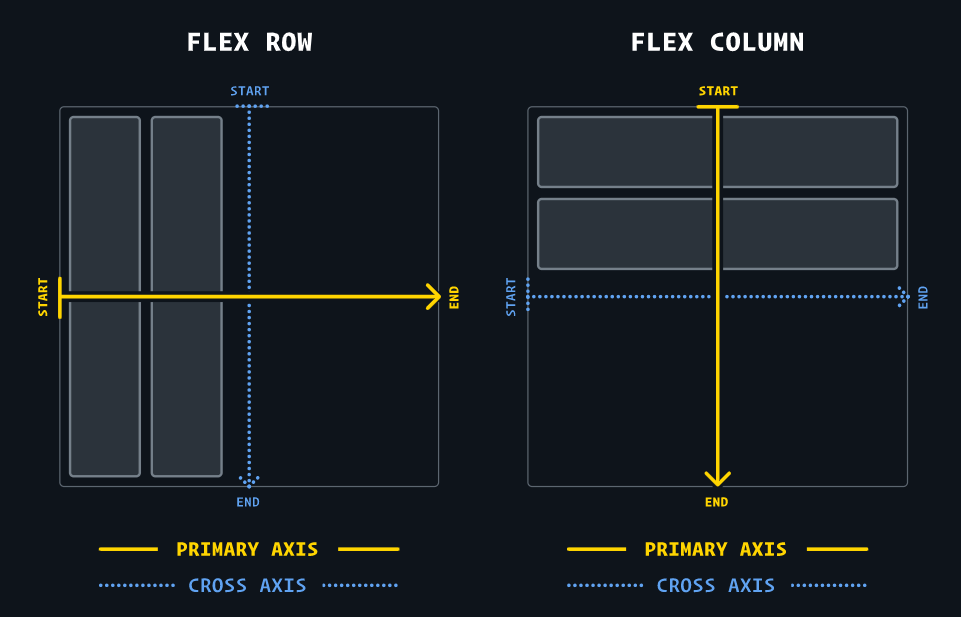

# CSS Units

- Absolute Units
  - px, cm, mm …
- Relative Units
  - em, rem, vh, vw …

---

# Absolute Units

- `pixels(px)`, `cm`, `mm` …
  - 고정적 단위

# Relative Units

## 1. percentage

- 주로 width에 쓰임
- height에 쓰면 이상해지는 경우가 있음
- **parent에 상대적**

## 2. relative to **font-size** (default: 16px)

### em

- parent에 상대적
- 문제점: cascading effect를 일으킬 수 있다.

```css
body {
  font-size: 10px;
}

.section-one {
  font-size: 2em;
}

ul {
  font-size: 1.5em;
}

li {
  font-size: 1.5em;
}
```

`body` > `div.section-one` > `ul` > `li` 형태일 경우

li의 font-size는 `10 * 2 * 1.5 * 1.5px`이 된다.

### rem

- root(`<html>`)에 상대적
- 주의점: root 엘리먼트의 font-size를 px 단위로 설정하지 않기
  - 사용자의 브라우저 설정을 덮어쓰기 때문에 좋지 않음
  - percentage를 사용하거나 명시적으로 font-size를 설정하지 않는 것이 좋다.

## 3. relative to the **viewport**

- `vw`, `vh`, `vmin`, `vmax`

## When to use em vs rem

개인에 따라 다르겠지만..

- font-size → rem
- padding & margin → em
- width → em or percentage

rem 단위는 전체적인 일관성을 유지하면서 크기를 조절하고 싶을 때 유용하며, em 단위는 각각의 모듈에 대한 더 세밀한 크기 조절이 필요할 때 사용될 수 있다.

---

# Flexbox

[An Interactive Guide to Flexbox](https://www.joshwcomeau.com/css/interactive-guide-to-flexbox/)

## flex-direction

- row
  - primary-axis: 수평
  - cross-axis: 수직
  - 아이템이 왼쪽에서 오른쪽으로 나열
- column
  - primary-axis: 수직
  - cross-axis: 수평
  - 아이템이 위에서 아래로 나열

primary-axis를 따라 나열되고 cross-axis를 따라 stretch 된다.



## alignment

### justify-content

primary-axis를 따라 아이템을 나열하는 방식

- `flex-start`
- `center`
- `flex-end`
- `space-between`
- `space-around`
- `space-evenly`

## align-items

cross-axis를 따라 아이템을 나열하는 방식

- `flex-start`
- `center`
- `flex-end`
- `stretch`
- `baseline`: 텍스트 요소의 밑줄이나 문자의 하단을 기준으로 정렬되는 가상의 수평선을 따라 정렬

## align-self

컨테이너가 아닌 child에 적용되는 옵션 (cross-axis를 따름)

나머지 사항은 [참조 링크](https://www.joshwcomeau.com/css/interactive-guide-to-flexbox/) 확인

---

# Media query

```css
@media media-type and (media-conditions) {
  ...;
}
```

- media-type
  - screen, print, speech
- media-condition
  - width
    - `min-width: 600px`
  - orientation
    - `orientation: landscape`
  - specific-features
    - `hover`

1. min-width & max-width

```css
body {
  background: pink;
}

@media (min-width: 400px) {
  body {
    background: purple;
  }
}
```

너비가 400px 이상인 경우 배경색이 보라색이 되고, 400보다 작은 경우 분홍색이 된다.

max-width의 경우 min-width와 반대로 동작한다.
