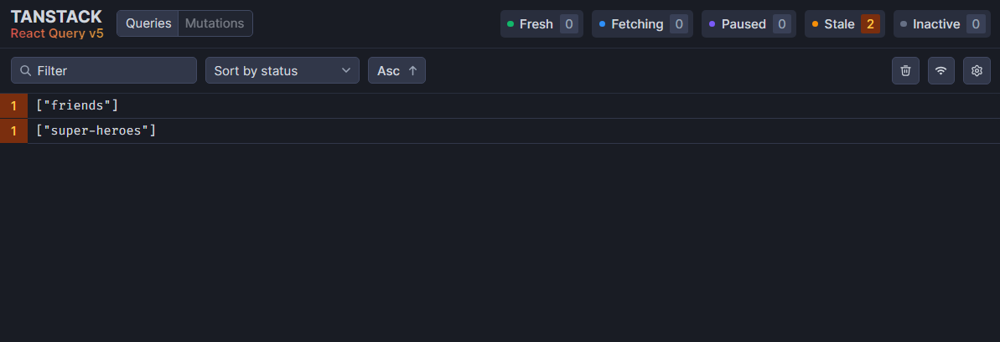
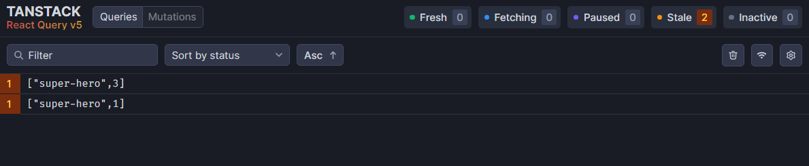
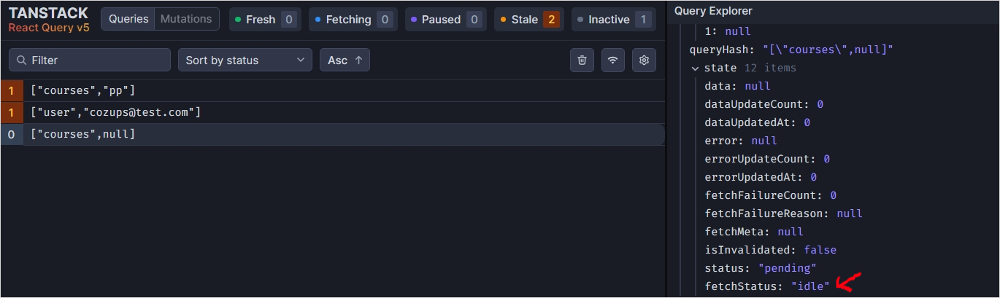

# 1. 병렬 쿼리(Parallel Queries) - 동시에 쿼리하기

React Query에서는 useQuery를 여러 개 쓰는 것 만으로도 병렬적인 쿼리가 가능하다.

```jsx
import { useQuery } from "@tanstack/react-query";
import axios from "axios";
import React from "react";

const fetchSuperHeroes = () => {
  return axios.get("http://localhost:4000/superheroes");
};

const fetchFriends = () => {
  return axios.get("http://localhost:4000/friends");
};

export const ParallelQueriesPage = () => {
  const { data: superHeroes } = useQuery({
    queryKey: ["super-heroes"],
    queryFn: fetchSuperHeroes,
  });
  const { data: friends } = useQuery({
    queryKey: ["friends"],
    queryFn: fetchFriends,
  });

  return <div>ParallelQueries.page</div>;
};
```



## Dynamic Parallel Queries

만약 쿼리를 해야 하는 횟수가 정해진 게 아니라면 동적으로 병렬 쿼리를 해야 한다.

예를 들어 주어진 id의 개수에 따라 쿼리 횟수가 달라지는 경우가 있다.

슈퍼히어로 아이디 배열 [1, 3]이 props로 넘어오는 경우 2번의 쿼리를 해야할 것 이다.

동적으로 쿼리를 해야할 때는 `useQueries`를 사용할 수 있다.

```jsx
import { useQueries } from "@tanstack/react-query";
import axios from "axios";
import React from "react";

const fetchSuperHero = heroId => {
  return axios.get(`http://localhost:4000/superheroes/${heroId}`);
};

export const DynamicParallelPage = ({ heroIds }) => {
  const queryResult = useQueries({
    queries: heroIds.map(heroId => {
      return {
        queryKey: ["super-hero", heroId],
        queryFn: () => fetchSuperHero(heroId),
      };
    }),
  });

  return <div>DynamicParallel Page</div>;
};
```

useQueries의 queries 안에 쿼리할 내용들을 배열로서 넘겨주면 된다.

쿼리할 내용은 useQuery에서 사용했던 포맷대로 바꾸어 주면 된다.

동적으로 여러 개의 쿼리를 한 내용은 각 쿼리의 결과가 담긴 배열로 반환 된다.

`useQueries({queries: [쿼리1, 쿼리 2, …]})` ⇒ `[쿼리 결과1, 쿼리 결과2, ...]`의 형식이다.



---

# 2. 순차적으로 쿼리하기(Dependent Queries)

쿼리한 결과를 바탕으로 또 다른 쿼리를 하기 위해서는 어떻게 해야할까?

예를 들어, 어떤 유저의 이메일을 바탕으로 그 사람이 가진 채널의 교육과정을 찾고 싶다고 가정하자.

```json
// db.json
"users": [
    {
      "id": "cozups@test.com",
      "channelId": "pp"
    }
  ],
"channels": [
  {
    "id": "pp",
    "course": ["React", "Vue", "Angular"]
  }
]
```

이 경우,

1. 유저의 이메일 → 채널 아이디 찾기
2. 채널 아이디 → 채널의 교육과정

이렇게 두 번의 쿼리가 필요하다.

```jsx
const { data: user } = useQuery({
  queryKey: ["user", email],
  queryFn: () => fetchUserByEmail(email),
});
const channelId = user?.data.channelId;
```

우선 유저의 이메일을 바탕으로 channelId를 찾는다.

channelId 변수는 user가 존재할 때만 할당된다.

```jsx
const { data: courses } = useQuery({
  queryKey: ["courses", channelId],
  queryFn: () => fetchCoursesByChannelId(channelId),
  enabled: !!channelId,
});
```

enabled 옵션을 이용하여 channelId가 존재할 때만 쿼리하도록 설정한다.

enabled에 `!!channelId`를 설정하여 channelId가 할당되어 있을 때만 쿼리하도록 설정할 수 있다.



channelId가 할당되지 않은 courses 쿼리의 상태가 ‘idle’인 것을 볼 수 있다.

---

# 3. Initial Query Data

UI에 데이터를 렌더링할 때, 새로 쿼리를 할 필요없이 **이전에 쿼리했던 데이터를 사용**할 수 있는 경우가 있다.

예를 들어, 어떤 데이터 리스트를 쿼리해 온 경우 리스트 아이템 하나에 대한 디테일 페이지를 만들고 싶으면 새로 쿼리할 필요없이 미리 가져온 리스트를 활용하여 렌더링 할 수 있다.

이런 경우 useQuery의 initialData 옵션을 사용하면 로딩 표시 없이 데이터를 미리 표시할 수 있다.

```jsx
useQuery({
  queryKey: ["super-hero", heroId],
  queryFn: fetchSuperHero,
  initialData: () => {
    const hero = queryClient
      .getQueryData(["super-heroes"])
      ?.data?.find(hero => hero.id === +heroId);

    if (hero) {
      return {
        data: hero,
      };
    } else {
      return undefined;
    }
  },
});
```

이 코드는 슈퍼히어로 리스트를 가져온 후에 슈퍼 히어로 한 명에 대한 디테일 페이지 컴포넌트에 렌더링 하기 위해 작성한 코드이다. initialData를 설정하지 않은 경우에는 디테일 페이지에 들어갈 때 로딩 화면을 보게 된다. 그러나 이미 슈퍼히어로 리스트를 가져왔기 때문에 이를 이용하여 디테일 페이지에 미리 렌더링할 수 있다.

**캐시된 데이터를 사용하기 위하여 queryClient를 사용**해야 하므로 `useQueryClient`를 사용한다. 그리고 queryClient에 담긴 쿼리 데이터에 접근하여 필요한 데이터를 뽑아 쓸 수 있다.

**initialData에 담긴 데이터는 서버에서 데이터를 가져오기 전에 사용된다.** 그러므로 기본적으로 initialData를 화면에 보여준 후 서버에서 데이터를 가져오면 가져온 데이터를 다시 UI에 표시한다.

---

# 4. 페이지네이션

페이지네이션 된 데이터를 불러오고 UI에 렌더링하는 것 자체는 간단하다.

```jsx
import { keepPreviousData, useQuery } from "@tanstack/react-query";
import axios from "axios";
import React, { useState } from "react";

const fetchColors = pageNumber => {
  return axios.get(`http://localhost:4000/colors?_limit=2&_page=${pageNumber}`);
};

export const PaginatedQueriesPage = () => {
  const [pageNumber, setPageNumber] = useState(1);
  const { data, isLoading, isError, error } = useQuery({
    queryKey: ["colors", pageNumber],
    queryFn: () => fetchColors(pageNumber),
    placeholderData: keepPreviousData,
  });

  if (isLoading) {
    return <h2>Loading...</h2>;
  }

  if (isError) {
    return <h2>{error.message}</h2>;
  }

  return (
    <div>
      {data?.data.map(color => (
        <div key={color.id}>
          <h2>
            {color.id}. {color.label}
          </h2>
        </div>
      ))}
      <div>
        <button
          onClick={() => setPageNumber(page => page - 1)}
          disabled={pageNumber === 1}
        >
          prev page
        </button>
        <button
          onClick={() => setPageNumber(page => page + 1)}
          disabled={pageNumber === 4}
        >
          next page
        </button>
      </div>
    </div>
  );
};
```

난 현재 json server를 쓰고 있는데 json server는 기본적으로 페이지네이션을 제공한다. 따라서 페이지네이션이 가능한 url로부터 데이터를 받아오고 이를 그대로 렌더링 하면 된다.

그러나 각 페이지마다 이루어지는 쿼리는 별개의 쿼리로 여겨지기 때문에 페이지를 변경할 때마다 새로 쿼리를 실행한다. 그 결과로 로딩 화면과 결과 화면으로 넘어가는 모습을 계속 보게 된다.

로딩 화면에서 결과 화면으로 넘어가는 화면을 보여주지 않기 위해 `placeholderData: keepPreviousData` 옵션을 사용할 수 있다. keepPreviousData는 react query가 제공하는 함수로, **서버로부터 데이터를 가져오는 와중에 isLoading 플래그를 활성화 시키지 않고 이전에 가져온 데이터를 계속해서 보여주도록 하는 함수**이다.

initialData와 비슷하게 서버에서 데이터를 가져오기 전에 사용하는 옵션이고, 서버에서 데이터를 가져오면 가져온 데이터를 UI에 보여준다.

---

# 5. Infinite Queries

‘Load More’ 버튼을 눌러서 계속 데이터를 요청하거나 무한 스크롤을 구현할 경우 react query가 제공하는 `useInfiniteQuery`를 이용하면 된다.

```jsx
import React, { Fragment } from "react";
import axios from "axios";
import { useInfiniteQuery } from "@tanstack/react-query";

const fetchColors = ({ pageParam = 1 }) => {
  return axios.get(`http://localhost:4000/colors?_limit=2&_page=${pageParam}`);
};

export const InfiniteQueriesPage = () => {
  const {
    data,
    isLoading,
    isError,
    error,
    hasNextPage,
    fetchNextPage,
    isFetching,
    isFetchingNextPage,
  } = useInfiniteQuery({
    queryKey: ["colors"],
    queryFn: fetchColors,
    getNextPageParam: (_lastPage, pages) => {
      if (pages.length < 4) {
        return pages.length + 1;
      } else {
        return undefined;
      }
    },
  });

  console.log(data);

  if (isLoading) {
    return <h2>Loading...</h2>;
  }

  if (isError) {
    return <h2>{error.message}</h2>;
  }

  return (
    <div>
      {data?.pages.map((group, i) => (
        <Fragment key={i}>
          {group.data.map(color => (
            <h2 key={color.id}>
              {color.id}. {color.label}
            </h2>
          ))}
        </Fragment>
      ))}
      <div>
        <button disabled={!hasNextPage} onClick={fetchNextPage}>
          Load more
        </button>
      </div>
      {isFetching && !isFetchingNextPage && "Fetching..."}
    </div>
  );
};
```

- useInfiniteQuery에서 `data`는 object를 반환한다.
  - `pages`: 각 페이지의 데이터 배열
  - `pageParams`: 각 페이지를 가져오는 데 필요한 파라미터 배열
- `getNextPageParam`
  - 다음 페이지의 데이터를 가져오기 위해 필요한 파라미터를 반환
  - 마지막 페이지와 모든 페이지의 전체 배열을 파라미터로 받는다.
- `hasNextPage`
  - `getNextPageParam`이 null이나 undefined를 반환하지 않으면 true

더 많은 프로퍼티들은 공식 페이지에서 참조

[Infinite Queries | TanStack Query Docs](https://tanstack.com/query/v5/docs/react/guides/infinite-queries)
