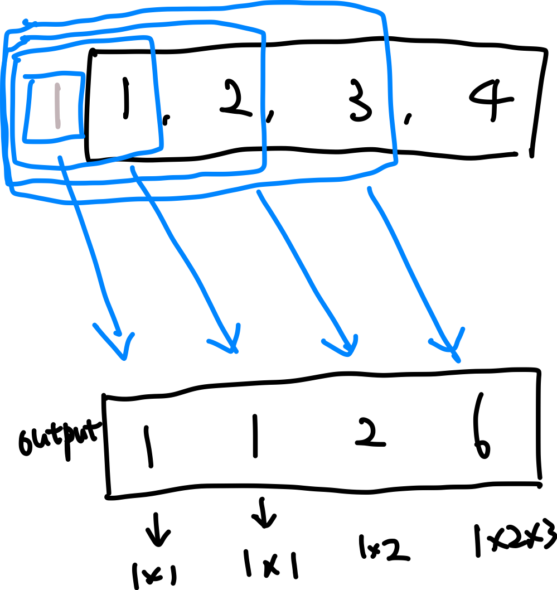
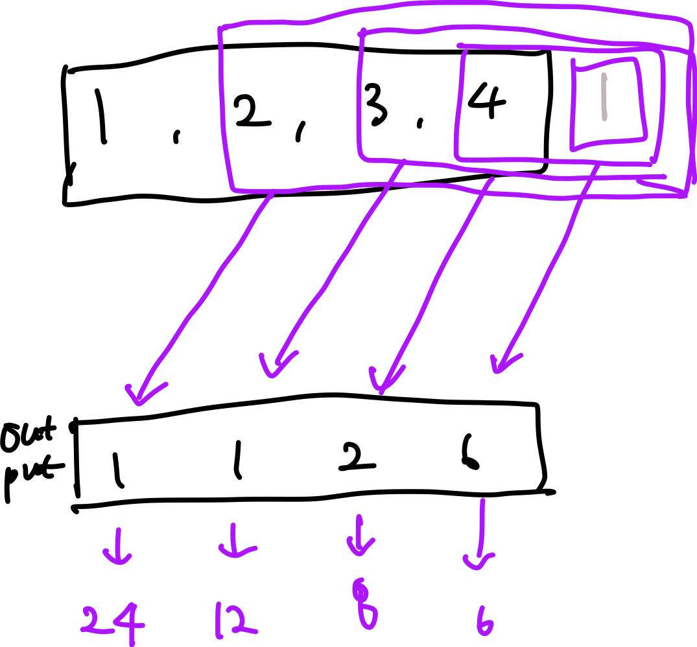
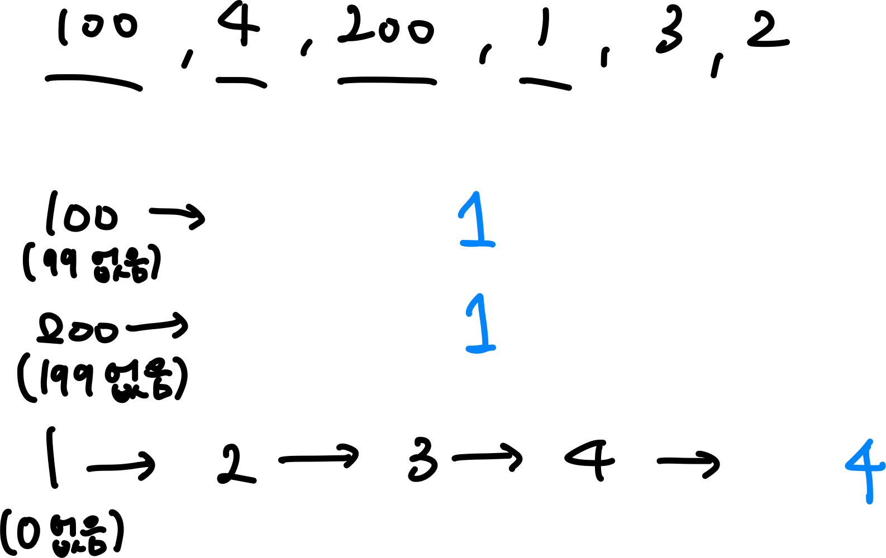

[NeetCode.io](https://neetcode.io/practice)

파이썬으로 풀이해주지만 나는 자바스크립트를 이용하여 푼다.

# 1. Contains Duplicate

[LeetCode - The World's Leading Online Programming Learning Platform](https://leetcode.com/problems/contains-duplicate/)

중복 요소가 있으면 true, 없으면 false를 반환하면 되는 문제

자바스크립트의 Set을 사용하면 쉽다.

배열을 Set으로 바꾸어 길이를 비교하면 된다.

- 코드

  ```jsx
  /**
   * @param {number[]} nums
   * @return {boolean}
   */
  var containsDuplicate = function (nums) {
    const numSet = new Set(nums);

    return nums.length !== numSet.size;
  };
  ```

혹은 HashMap을 이용하면 된다.

- 코드

  ```jsx
  /**
   * @param {number[]} nums
   * @return {boolean}
   */
  var containsDuplicate = function (nums) {
    const hashMap = {};

    for (let num of nums) {
      if (hashMap[num]) {
        return true;
      }
      hashMap[num] = true;
    }

    return false;
  };
  ```

# 2. Valid Anagram

[LeetCode - The World's Leading Online Programming Learning Platform](https://leetcode.com/problems/valid-anagram/description/)

문자열 t가 문자열 s의 애너그램이면 true를 반환하는 문제

HashMap을 이용하여 각 알파벳의 개수를 카운팅하여 비교하면 되는 문제

각 문자열의 HashMap을 이용하여 개수를 세어 비교해도 되지만, 나는 s의 HashMap만 이용하여 풀이하였다.

그러나 각각 카운팅하는 것이 좀 더 안전해 보인다.

- 코드

  ```jsx
  /**
   * @param {string} s
   * @param {string} t
   * @return {boolean}
   */
  var isAnagram = function (s, t) {
    const hashSet = {};

    for (let c of s) {
      hashSet[c] = !hashSet[c] ? 1 : hashSet[c] + 1;
    }

    for (let c of t) {
      if (!hashSet[c]) return false;
      hashSet[c] -= 1;
    }

    for (let item in hashSet) {
      if (hashSet[item] > 0) return false;
    }

    return true;
  };
  ```

# 3. Two Sum

[LeetCode - The World's Leading Online Programming Learning Platform](https://leetcode.com/problems/two-sum/)

nums배열 요소 중 두 개를 합해 target을 만들어낼 수 있는 요소의 인덱스를 반환하는 문제

HashMap을 이용하여 풀 수 있다.

- 코드

  ```jsx
  /**
   * @param {number[]} nums
   * @param {number} target
   * @return {number[]}
   */
  var twoSum = function (nums, target) {
    const maps = {};

    for (let i = 0; i < nums.length; i++) {
      const diff = target - nums[i];
      if (maps[diff] >= 0) {
        return [maps[diff], i];
      }
      maps[nums[i]] = i;
    }
  };
  ```

# 4. Group Anagrams

[LeetCode - The World's Leading Online Programming Learning Platform](https://leetcode.com/problems/group-anagrams/)

애너그램인 문자열끼리 묶어 배열로 반환하면 되는 문제

두 가지 해결법이 있다.

1. 각 문자열의 알파벳을 정렬하여 같은 단어끼리 묶기
2. 각 문자열의 알파벳 개수를 세어 같은 것끼리 묶기

나는 1번의 방법으로 문제를 해결했지만 2번의 방법이 더 효율적이다.

1번의 시간복잡도는 O(mnlogn)이고 2번의 시간복잡도는 O(mn)이다.

- 1번 풀이 코드

  ```jsx
  /**
   * @param {string[]} strs
   * @return {string[][]}
   */
  var groupAnagrams = function (strs) {
    const map = {};

    const helper = str => {
      return str.split("").sort().join("");
    };

    for (let str of strs) {
      const sortedStr = helper(str);
      if (!map[sortedStr]) {
        map[sortedStr] = [str];
      } else {
        map[sortedStr].push(str);
      }
    }

    return Object.values(map);
  };
  ```

- 2번 풀이 코드

  ```jsx
  /**
   * @param {string[]} strs
   * @return {string[][]}
   */
  var groupAnagrams = function (strs) {
    const obj = {};

    for (let str of strs) {
      const count = new Array(26).fill(0);

      for (let c of str) {
        count[c.charCodeAt() - 97]++;
      }

      const key = count.join("#");

      obj[key] ? obj[key].push(str) : (obj[key] = [str]);
    }

    return Object.values(obj);
  };
  ```

# 5. Top K Frequent Elements

[LeetCode - The World's Leading Online Programming Learning Platform](https://leetcode.com/problems/top-k-frequent-elements/)

배열의 숫자들 중에서 가장 자주 나오는 숫자부터 K번째로 자주 나오는 숫자까지 반환하면 되는 문제

내가 생각한 방법은 정렬이 필요한 방법이다.

단순히 개수를 세고 많이 나오는 순으로 정렬 후 잘라서 반환하는 방식이다.

이 방식도 정답이지만 정렬이 필요하다는 점에서 시간이 좀 더 소요된다.

- 코드

  ```jsx
  /**
   * @param {number[]} nums
   * @param {number} k
   * @return {number[]}
   */
  var topKFrequent = function (nums, k) {
    const map = {};

    for (let num of nums) {
      map[num] ? (map[num] += 1) : (map[num] = 1);
    }

    return Object.entries(map)
      .sort((a, b) => b[1] - a[1])
      .map(e => +e[0])
      .slice(0, k);
  };
  ```

정렬을 사용하지 않고 문제를 해결할 수 있는 방법이 있다.


각 숫자의 빈도 수를 계산하고 배열에 각 빈도수에 해당하는 숫자를 넣는 것이다.

1은 3번 나왔으므로 인덱스 3에 [1]을 넣고, 2는 2번 나왔으므로 인덱스 2에 [2]를 넣고, 3은 1번 나왔으므로 인덱스 1에 [3]을 넣는다.

그 후에 뒤에서부터 거꾸로 k개의 숫자를 꺼내면 O(n)의 복잡도로 문제를 해결할 수 있다.

- 코드

  ```jsx
  var topKFrequent = function (nums, k) {
    const freqMap = new Map();
    const bucket = [];
    const result = [];

    for (let num of nums) {
      freqMap.set(num, (freqMap.get(num) || 0) + 1);
    }

    for (let [num, freq] of freqMap) {
      bucket[freq] = (bucket[freq] || new Set()).add(num);
    }

    for (let i = bucket.length - 1; i >= 0; i--) {
      if (bucket[i]) result.push(...bucket[i]);
      if (result.length === k) break;
    }
    return result;
  };
  ```

# 6. Product of Array Except Self

[LeetCode - The World's Leading Online Programming Learning Platform](https://leetcode.com/problems/product-of-array-except-self/description/)

i번째 숫자를 제외한 나머지 숫자의 곱이 담긴 배열을 반환하면 되는 문제

대신 O(n)의 복잡도로 나눗셈 없이 구현해야한다는 제약이 있다.

i번째 숫자를 기준으로 앞부분의 곱셈 값과 뒷부분의 곱셈 값을 곱하면 문제를 해결할 수 있다.



앞부분 곱셈 값을 output 배열에 곱해두고



뒷부분 곱셈 값을 output 배열에 곱하면 제한사항에 맞게 정답을 구할 수 있다.

- 코드

  ```jsx
  /**
   * @param {number[]} nums
   * @return {number[]}
   */
  var productExceptSelf = function (nums) {
    const result = new Array(nums.length).fill(1);
    let pre = 1;
    let post = 1;

    // calculate prefix
    for (let i = 0; i < nums.length; i++) {
      result[i] *= pre;
      pre *= nums[i];
    }

    // calculate postfix
    for (let i = nums.length - 1; i >= 0; i--) {
      result[i] *= post;
      post *= nums[i];
    }

    return result;
  };
  ```

# 7. Longest Consecutive Sequence

[LeetCode - The World's Leading Online Programming Learning Platform](https://leetcode.com/problems/longest-consecutive-sequence/description/)

배열의 숫자들 중 가장 긴 연속적인 수열의 길이를 찾아내는 문제

O(n)의 복잡도로 풀이해야 한다.

수열 구간의 시작 숫자를 찾기 위해 해당 숫자보다 1 작은 숫자가 존재하는지 확인한다.

Set을 이용하여 쉽게 찾을 수 있다.

존재하는 경우, 시작 숫자가 아니므로 넘어간다.

존재하지 않는 경우, 시작 숫자이므로 해당 숫자 이후로 연속적인 숫자가 배열 안에 존재하는지 찾는다.



- 코드

  ```jsx
  /**
   * @param {number[]} nums
   * @return {number}
   */
  var longestConsecutive = function (nums) {
    const set = new Set(nums);
    let longest = 0;

    for (let num of nums) {
      if (!set.has(num - 1)) {
        let length = 0;
        while (set.has(num + length)) {
          length += 1;
        }
        longest = Math.max(longest, length);
      }
    }

    return longest;
  };
  ```
