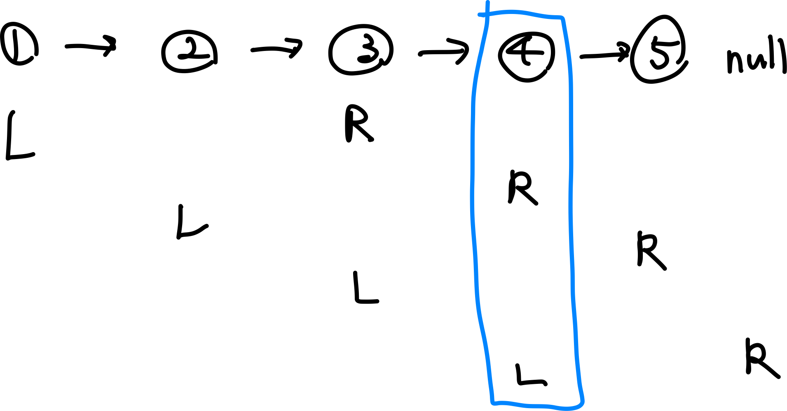
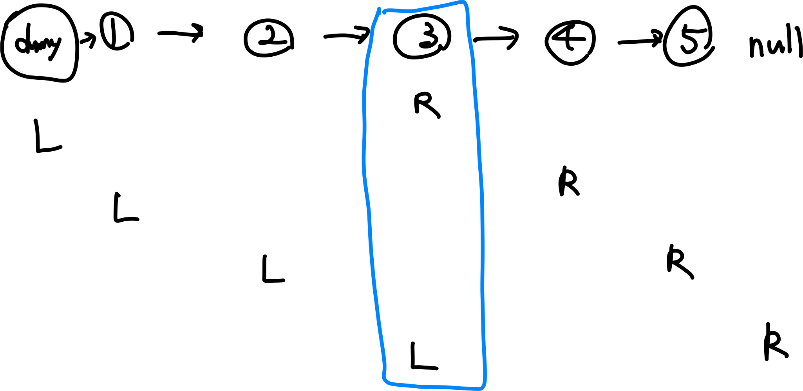

# 1. Reverse Linked List

[Reverse Linked List - LeetCode](https://leetcode.com/problems/reverse-linked-list/)

연결 리스트의 순서를 뒤집으면 되는 문제

next 포인터를 반대 방향으로 돌리면 된다.

- 코드
  ```jsx
  /**
   * Definition for singly-linked list.
   * function ListNode(val, next) {
   *     this.val = (val===undefined ? 0 : val)
   *     this.next = (next===undefined ? null : next)
   * }
   */
  /**
   * @param {ListNode} head
   * @return {ListNode}
   */
  var reverseList = function (head) {
    let [prev, curr] = [null, head];

    while (curr) {
      next = curr.next;
      curr.next = prev;
      prev = curr;
      curr = next;
    }

    return prev;
  };
  ```

# 2. Merge Two Sorted Lists

[Merge Two Sorted Lists - LeetCode](https://leetcode.com/problems/merge-two-sorted-lists/)

두 정렬된 리스트를 하나로 합치는 문제

각 리스트의 노드를 하나씩 비교하며 작은 것을 앞에 붙이면 된다.

- 코드
  ```jsx
  /**
   * Definition for singly-linked list.
   * function ListNode(val, next) {
   *     this.val = (val===undefined ? 0 : val)
   *     this.next = (next===undefined ? null : next)
   * }
   */
  /**
   * @param {ListNode} list1
   * @param {ListNode} list2
   * @return {ListNode}
   */
  var mergeTwoLists = function (list1, list2) {
    let dummy = new ListNode();
    let tail = dummy;

    while (list1 && list2) {
      if (list1.val <= list2.val) {
        tail.next = list1;
        list1 = list1.next;
      } else {
        tail.next = list2;
        list2 = list2.next;
      }
      tail = tail.next;
    }

    if (list1) {
      tail.next = list1;
    }
    if (list2) {
      tail.next = list2;
    }

    return dummy.next;
  };
  ```

# 3. Linked List Cycle

[Linked List Cycle - LeetCode](https://leetcode.com/problems/linked-list-cycle/)

연결 리스트에 사이클이 존재하면 true, 존재하지 않으면 false를 반환하는 문제

사이클이 있는지 확인하기 위해 두 가지 방법을 사용할 수 있다.

- Set을 이용하여 노드의 방문 여부를 확인하는 방법
- 플로이드의 토끼와 거북이 알고리즘(Floyd's Tortoise & Hare Algorithm)을 이용하는 방법

  - 하나씩 움직이는 slow 포인터와 두개씩 움직이는 fast 포인터가 같은 위치에서 만나면 사이클 존재

- 코드 (Set을 이용한 방법)
  ```jsx
  /**
   * Definition for singly-linked list.
   * function ListNode(val) {
   *     this.val = val;
   *     this.next = null;
   * }
   */

  /**
   * @param {ListNode} head
   * @return {boolean}
   */
  var hasCycle = function (head) {
    let set = new Set();

    while (head) {
      if (set.has(head)) {
        return true;
      }
      set.add(head);
      head = head.next;
    }

    return false;
  };
  ```
- 코드 (Floyd's Tortoise & Hare Algorithm)
  ```jsx
  /**
   * Definition for singly-linked list.
   * function ListNode(val) {
   *     this.val = val;
   *     this.next = null;
   * }
   */

  /**
   * @param {ListNode} head
   * @return {boolean}
   */
  var hasCycle = function (head) {
    let [s, f] = [head, head];

    while (f && f.next) {
      s = s.next;
      f = f.next.next;
      if (s === f) {
        return true;
      }
    }

    return false;
  };
  ```

# 4. Reorder List

[Reorder List - LeetCode](https://leetcode.com/problems/reorder-list/)

첫 번째 노드와 마지막 노드부터 번갈아가며 바꾸어 새로운 리스트를 만드는 문제


- 리스트를 절반으로 나눈다.
  - slow, fast 포인터를 통해 반으로 나눌 수 있다.
  - fast 포인터는 두개씩 움직이므로 fast 포인터가 끝에 도달했을 때 slow 포인터의 위치가 절반의 위치이다.
- 그리고 첫번째 리스트는 처음부터, 두번째 리스트는 끝에서부터 이어붙인다.
- 마지막 노드는 next를 null로 지정한다.
- 코드
  ```jsx
  /**
   * Definition for singly-linked list.
   * function ListNode(val, next) {
   *     this.val = (val===undefined ? 0 : val)
   *     this.next = (next===undefined ? null : next)
   * }
   */
  /**
   * @param {ListNode} head
   * @return {void} Do not return anything, modify head in-place instead.
   */
  var reorderList = function (head) {
    let [slow, fast] = [head, head.next];

    while (fast && fast.next) {
      slow = slow.next;
      fast = fast.next.next;
    }

    // divide list
    let second = slow.next;
    slow.next = null;

    // reverse second list
    let prev = null;
    while (second) {
      let temp = second.next;
      second.next = prev;
      prev = second;
      second = temp;
    }

    // merge first & second list
    let first = head;
    second = prev;
    while (second) {
      let [temp1, temp2] = [first.next, second.next];
      first.next = second;
      second.next = temp1;
      first = temp1;
      second = temp2;
    }
  };
  ```

# 5. Remove Nth Node From End of List

[Remove Nth Node From End of List - LeetCode](https://leetcode.com/problems/remove-nth-node-from-end-of-list/)

끝에서 N번째 노드를 삭제하는 문제

- 두 개의 포인터를 사용하는데 L 포인터와 R 포인터 사이의 간격이 N이 되도록 한다.
- R 포인터가 리스트의 끝(NULL)에 도달했을 때 L 포인터의 위치가 삭제할 노드의 위치가 된다.



- 그러나 ‘4’ 노드를 삭제하기 위해서는 그 이전의 노드 ‘3’을 알고 있어야 하므로 편의상 리스트의 헤드 앞에 더미 노드를 붙여 L 포인터가 그 지점부터 시작할 수 있도록 한다. (R의 위치는 그대로 둔다.)



- L 포인터가 ‘3’에 위치해 있는 상태에서 ‘5’에 연결하면 ‘4’가 삭제된다.
- dummy.next를 반환한다.
- 코드
  ```jsx
  /**
   * Definition for singly-linked list.
   * function ListNode(val, next) {
   *     this.val = (val===undefined ? 0 : val)
   *     this.next = (next===undefined ? null : next)
   * }
   */
  /**
   * @param {ListNode} head
   * @param {number} n
   * @return {ListNode}
   */
  var removeNthFromEnd = function (head, n) {
    let dummy = new ListNode();
    dummy.next = head;
    let [l, r] = [dummy, head];
    for (let i = 0; i < n; i++) {
      r = r.next;
    }

    while (r) {
      l = l.next;
      r = r.next;
    }
    l.next = l.next.next;

    return dummy.next;
  };
  ```
