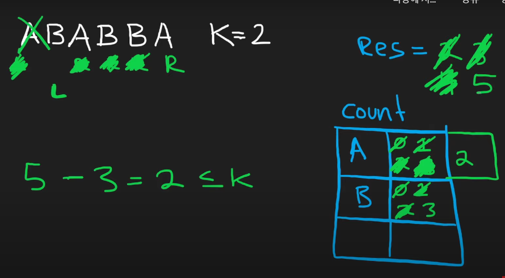

# 1. Best Time to Buy and Sell Stock

[Best Time to Buy and Sell Stock - LeetCode](https://leetcode.com/problems/best-time-to-buy-and-sell-stock/)

스톡을 구입하고 판매할 때 얻을 수 있는 최대 수익을 반환하는 문제

구입할 때를 L, 판매할 때를 R로 두어 수익이 나지 않으면 L을 이동시키고 수익이 나는 경우 R을 이동시켜 최댓값을 구한다.

- 코드

  ```js
  /**
   * @param {number[]} prices
   * @return {number}
   */
  var maxProfit = function (prices) {
    let [l, r] = [0, 1];
    let res = 0;

    while (l < prices.length && r < prices.length) {
      let profit = prices[r] - prices[l];

      if (prices[l] > prices[r]) {
        l = r;
        r++;
      } else {
        r++;
      }

      res = Math.max(res, profit);
    }

    return res;
  };
  ```

# 2. **Longest Substring Without Repeating Characters**

[LeetCode - The World's Leading Online Programming Learning Platform](https://leetcode.com/problems/longest-substring-without-repeating-characters/)

중복 글자가 없는 가장 긴 부분 문자열을 찾는 문제

중복 글자가 없는 경우 R을 늘리고 중복 글자가 있는 경우 중복 글자가 없어질 때까지 L을 옮긴다.

중복 글자 포함 여부는 Set을 이용하여 판별한다.

- 코드

  ```js
  /**
   * @param {string} s
   * @return {number}
   */
  var lengthOfLongestSubstring = function (s) {
    if (s.length === 0) return 0;

    let map = new Set();
    let l = 0;
    let res = 1;
    for (let r = 0; r < s.length; r++) {
      while (map.has(s[r])) {
        map.delete(s[l]);
        l++;
      }
      map.add(s[r]);
      res = Math.max(res, r - l + 1);
    }
    return res;
  };
  ```

# 3. **Longest Repeating Character Replacement**

[LeetCode - The World's Leading Online Programming Learning Platform](https://leetcode.com/problems/longest-repeating-character-replacement/)

최대 k번의 글자 교체를 통해 얻을 수 있는 최장 길이의 연속되는 부분 문자열 길이를 구하는 문제

이 문자열은 같은 글자로만 이루어져야 한다.

특정 부분 문자열이 유효한 문자열인지 판단할 수 있는 방법은 각 글자 별 빈도 수를 카운트하고 **[문자열 길이 - 최대 빈도 수 ≤ k]** 인지 확인하는 것이다.



왜냐하면 나머지 글자를 가장 자주 등장하는 글자로 바꾸면 같은 문자로만 이루어진 문자열을 만들 수 있기 때문이다.

슬라이딩 윈도우 알고리즘과 이 방법을 통해 문제를 해결할 수 있다.

- 코드

  ```js
  /**
   * @param {string} s
   * @param {number} k
   * @return {number}
   */
  var characterReplacement = function (s, k) {
    let count = {};
    let l = 0;
    let res = 0;

    for (let r = 0; r < s.length; r++) {
      count[s[r]] = (count[s[r]] || 0) + 1;

      while (r - l + 1 - Math.max(...Object.values(count)) > k) {
        count[s[l]] -= 1;
        l++;
      }
      res = Math.max(res, r - l + 1);
    }

    return res;
  };
  ```
