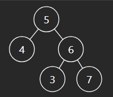

# 1. Invert Binary Tree

[Invert Binary Tree - LeetCode](https://leetcode.com/problems/invert-binary-tree/description/)

트리의 좌우를 바꾸는 문제

각 노드에 대하여 left child와 right child를 바꾼다.

재귀를 이용한다.

- 코드

  ```jsx
  /**
   * Definition for a binary tree node.
   * function TreeNode(val, left, right) {
   *     this.val = (val===undefined ? 0 : val)
   *     this.left = (left===undefined ? null : left)
   *     this.right = (right===undefined ? null : right)
   * }
   */
  /**
   * @param {TreeNode} root
   * @return {TreeNode}
   */
  var invertTree = function (root) {
    if (!root) {
      return root;
    }

    [root.left, root.right] = [root.right, root.left];

    invertTree(root.left);
    invertTree(root.right);

    return root;
  };
  ```

# 2. Maximum Depth of Binary Tree

[Maximum Depth of Binary Tree - LeetCode](https://leetcode.com/problems/maximum-depth-of-binary-tree/)

트리의 최대 깊이를 반환하는 문제

나는 preorder로 트리를 순회하며 depth를 구했다.

- 코드

  ```jsx
  /**
   * Definition for a binary tree node.
   * function TreeNode(val, left, right) {
   *     this.val = (val===undefined ? 0 : val)
   *     this.left = (left===undefined ? null : left)
   *     this.right = (right===undefined ? null : right)
   * }
   */
  /**
   * @param {TreeNode} root
   * @return {number}
   */
  var maxDepth = function (root) {
    let res = 0;
    const preOrder = (root, dep) => {
      if (!root) {
        return;
      }

      res = Math.max(res, dep);

      preOrder(root.left, dep + 1);
      preOrder(root.right, dep + 1);
    };

    preOrder(root, 1);

    return res;
  };
  ```

다른 DFS 방법으로는 `1 + max(f(left), f(right))`를 구하면 된다.

- 코드

  ```jsx
  var maxDepth = function (root) {
    if (!root) {
      return 0;
    }

    return 1 + Math.max(maxDepth(root.left), maxDepth(root.right));
  };
  ```

BFS로 푸는 방법도 있다.

- 코드

  ```jsx
  var maxDepth = function (root) {
    if (!root) {
      return 0;
    }

    let level = 0;
    let q = [root];

    while (q.length) {
      let n = q.length;
      for (let i = 0; i < n; i++) {
        let node = q.shift();
        if (node.left) {
          q.push(node.left);
        }
        if (node.right) {
          q.push(node.right);
        }
      }

      level += 1;
    }

    return level;
  };
  ```

재귀 DFS가 아닌 반복적 DFS를 이용하는 방법도 있다.

- 코드

  ```jsx
  var maxDepth = function (root) {
    if (!root) {
      return 0;
    }

    let stack = [[root, 1]];
    let res = 1;

    while (stack.length) {
      let [node, depth] = stack.pop();

      if (node) {
        res = Math.max(res, depth);
        stack.push([node.left, depth + 1]);
        stack.push([node.right, depth + 1]);
      }
    }

    return res;
  };
  ```

# 3. Same Tree

[Same Tree - LeetCode](https://leetcode.com/problems/same-tree/)

두 트리가 같은 트리인지 확인하는 문제

노드의 값 뿐만 아니라 구조까지 같아야한다.


이 트리는 다른 트리이다.

현재 노드와 left subtree, right subtree가 모두 같은지 확인해야 한다.

- 코드

  ```jsx
  /**
   * Definition for a binary tree node.
   * function TreeNode(val, left, right) {
   *     this.val = (val===undefined ? 0 : val)
   *     this.left = (left===undefined ? null : left)
   *     this.right = (right===undefined ? null : right)
   * }
   */
  /**
   * @param {TreeNode} p
   * @param {TreeNode} q
   * @return {boolean}
   */
  var isSameTree = function (p, q) {
    if (!p && !q) {
      return true;
    }
    if (!p || !q || p.val !== q.val) {
      return false;
    }

    return isSameTree(p.left, q.left) && isSameTree(p.right, q.right);
  };
  ```

# 4. Subtree of Another Tree

[Subtree of Another Tree - LeetCode](https://leetcode.com/problems/subtree-of-another-tree/)

subtree로 주어진 트리가 tree의 서브트리인지 확인하는 문제

위에서 푼 same tree의 방법이 필요한 문제이다.

각 노드에 대하여 sameTree 함수를 실행하며 서브트리가 있는지 확인한다.

- 코드

  ```jsx
  /**
   * Definition for a binary tree node.
   * function TreeNode(val, left, right) {
   *     this.val = (val===undefined ? 0 : val)
   *     this.left = (left===undefined ? null : left)
   *     this.right = (right===undefined ? null : right)
   * }
   */
  /**
   * @param {TreeNode} root
   * @param {TreeNode} subRoot
   * @return {boolean}
   */
  var isSubtree = function (root, subRoot) {
    const sameTree = (s, t) => {
      if (!s && !t) {
        return true;
      }
      if (!s || !t || s.val !== t.val) {
        return false;
      }

      return sameTree(s.left, t.left) && sameTree(s.right, t.right);
    };

    if (!subRoot) {
      return true;
    }
    if (!root) {
      return false;
    }

    if (sameTree(root, subRoot)) {
      return true;
    }

    return isSubtree(root.left, subRoot) || isSubtree(root.right, subRoot);
  };
  ```

# 5. Lowest Common Ancestor of a Binary Search Tree

[Lowest Common Ancestor of a Binary Search Tree - LeetCode](https://leetcode.com/problems/lowest-common-ancestor-of-a-binary-search-tree/)

노드 p와 q의 공통조상을 찾는 문제

- `p.val > cur.val && q.val > cur.val`인 경우
  - 오른쪽 서브트리만 조사
  - `cur = cur.right`
- `p.val < cur.val && q.val < cur.val`인 경우
  - 왼쪽 서브트리만 조사
  - `cur = cur.left`
- p는 현재 노드보다 작고, q는 현재 노드보다 큰 경우
  - 갈라지는 부분이므로 현재 노드가 LCA
  - 위의 두 가지 경우는 lowest가 아닐 수 있음
- 코드

  ```jsx
  /**
   * Definition for a binary tree node.
   * function TreeNode(val) {
   *     this.val = val;
   *     this.left = this.right = null;
   * }
   */

  /**
   * @param {TreeNode} root
   * @param {TreeNode} p
   * @param {TreeNode} q
   * @return {TreeNode}
   */
  var lowestCommonAncestor = function (root, p, q) {
    let cur = root;

    while (cur) {
      if (p.val > cur.val && q.val > cur.val) {
        cur = cur.right;
      } else if (p.val < cur.val && q.val < cur.val) {
        cur = cur.left;
      } else {
        return cur;
      }
    }
  };
  ```

# 6. **Binary Tree Level Order Traversal**

[Binary Tree Level Order Traversal - LeetCode](https://leetcode.com/problems/binary-tree-level-order-traversal/)

트리의 level order traversal 결과를 리턴하는 문제

노드를 level 별로 묶어서 반환해야 한다.

level order이므로 BFS를 이용한다.

- 코드

  ```jsx
  /**
   * Definition for a binary tree node.
   * function TreeNode(val, left, right) {
   *     this.val = (val===undefined ? 0 : val)
   *     this.left = (left===undefined ? null : left)
   *     this.right = (right===undefined ? null : right)
   * }
   */
  /**
   * @param {TreeNode} root
   * @return {number[][]}
   */
  var levelOrder = function (root) {
    if (!root) return [];

    let q = [root];
    let res = [];

    while (q.length) {
      res.push(q.map(n => n.val));
      let n = q.length;
      for (let i = 0; i < n; i++) {
        let node = q.shift();

        if (node.left) {
          q.push(node.left);
        }
        if (node.right) {
          q.push(node.right);
        }
      }
    }

    return res;
  };
  ```

# 7. **Validate Binary Search Tree**

[Validate Binary Search Tree - LeetCode](https://leetcode.com/problems/validate-binary-search-tree/)

트리가 BST가 맞는지 확인하는 문제

처음엔 단순히 왼쪽 노드 값이 루트 값보다 작고 오른쪽 노드 값이 루트 값보다 큰지 확인했었는데 이 경우 문제가 있다.



이 경우 위의 방법으로는 true가 나오지만 3이 5보다 작으므로 5보다 왼쪽에 위치해야 맞는 트리이다.

따라서 노드의 값이 유효 범위에 있는 값인지 확인해야 한다.

- 처음에는 루트 5가 -Infinity와 Infinity 사이에 있는 값인지 확인한다.
- left child는 parent의 유효 범위에서 오른쪽 경계 값을 부모의 값으로 바꾼다.
  - -Infinity < 4 < 5인지 확인
- right child는 parent의 유효 범위에서 왼쪽 경계 값을 부모의 값으로 바꾼다.
  - 5 < 6 < Infinity인지 확인

이러한 방식을 반복한다.

- 코드

  ```jsx
  /**
   * Definition for a binary tree node.
   * function TreeNode(val, left, right) {
   *     this.val = (val===undefined ? 0 : val)
   *     this.left = (left===undefined ? null : left)
   *     this.right = (right===undefined ? null : right)
   * }
   */
  /**
   * @param {TreeNode} root
   * @return {boolean}
   */
  var isValidBST = function (root) {
    const valid = (node, left, right) => {
      if (!node) {
        return true;
      }
      if (!(node.val < right && node.val > left)) {
        return false;
      }

      return (
        valid(node.left, left, node.val) && valid(node.right, node.val, right)
      );
    };

    return valid(root, -Infinity, Infinity);
  };
  ```
