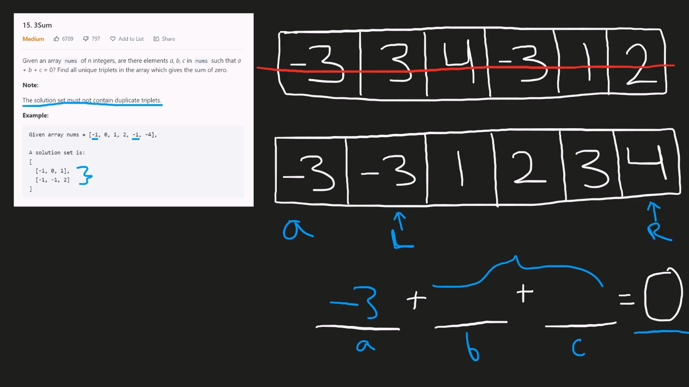

# 1. Valid Palindrome

[LeetCode - The World's Leading Online Programming Learning Platform](https://leetcode.com/problems/valid-palindrome/description/)

팰린드롬이면 true, 아니면 false를 반환하는 문제

문자열 중 알파벳, 숫자만 고려한다.

나는 정규 표현식으로 문자를 걸러내서 했는데 굳이 그럴 필요가 없는 문제였다.

그냥 한 글자씩 비교하면서 알파벳, 숫자가 아니면 건너뛰면 된다.

- 코드

  ```jsx
  /**
   * @param {string} s
   * @return {boolean}
   */
  var isPalindrome = function (s) {
    let l = 0;
    let r = s.length - 1;

    const isAlphanumeric = c => {
      const regExp = /[a-zA-Z0-9]/gi;
      return regExp.test(c);
    };

    while (l < r) {
      if (!isAlphanumeric(s[l])) {
        l++;
        continue;
      }

      if (!isAlphanumeric(s[r])) {
        r--;
        continue;
      }

      if (s[l].toLowerCase() !== s[r].toLowerCase()) {
        return false;
      }

      l++;
      r--;
    }

    return true;
  };
  ```

# 2. 3Sum

[3Sum - LeetCode](https://leetcode.com/problems/3sum/description/)

3개의 요소 (중복x)를 더해 0이 되게 하는 조합을 찾는 문제

우선 배열을 정렬하고 하나의 요소를 기준으로 잡은 후 나머지 범위에서 투 포인터 알고리즘을 이용하여 합이 0이 되게 하는 숫자들을 찾으면 된다.



-3(a)을 기준으로 잡고 나머지 [-3, 1, 2, 3, 4] 중 합이 3이 되는 페어를 투 포인터 알고리즘으로 찾아내면 총합 0인 숫자들의 조합을 찾을 수 있다.

그 이후로 a를 옮겨서 같은 작업을 하면 되는데 -3 이후에 또 -3이 나오는 경우에는 스킵해도 된다. (같은 답이 나올 것이기 때문에)

- 코드

  ```jsx
  /**
   * @param {number[]} nums
   * @return {number[][]}
   */
  var threeSum = function (nums) {
    let result = [];
    let sorted = nums.sort((a, b) => a - b);

    for (let i = 0; i < sorted.length; i++) {
      if (sorted[i] === sorted[i - 1]) continue;
      let l = i + 1;
      let r = sorted.length - 1;

      let target = -sorted[i];
      while (l < r) {
        if (sorted[l] + sorted[r] === target) {
          result.push([sorted[i], sorted[l], sorted[r]]);
          while (sorted[l + 1] === sorted[l]) {
            l++;
          }
          l++;
        }
        if (sorted[l] + sorted[r] < target) {
          l++;
          continue;
        }
        if (sorted[l] + sorted[r] > target) {
          r--;
          continue;
        }
      }
    }

    return result;
  };
  ```

# 3. Container With Most Water

[Container With Most Water - LeetCode](https://leetcode.com/problems/container-with-most-water/description/)


물을 최대한 많이 담을 수 있는 컨테이너의 용량을 찾는 문제

투 포인터 알고리즘을 이용해 최대 용량을 담을 수 있는 컨테이너를 형성하는 왼쪽 벽, 오른쪽 벽을 찾아 계산한다.

높이가 낮은 쪽의 포인터를 옮겨 계속 계산하여 최댓값을 찾으면 된다.

- 코드

  ```jsx
  /**
   * @param {number[]} height
   * @return {number}
   */
  var maxArea = function (height) {
    let res = 0;
    let [l, r] = [0, height.length - 1];

    while (l < r) {
      const area = (r - l) * Math.min(height[l], height[r]);

      if (height[l] < height[r]) {
        l++;
      } else {
        r--;
      }

      res = Math.max(res, area);
    }

    return res;
  };
  ```
