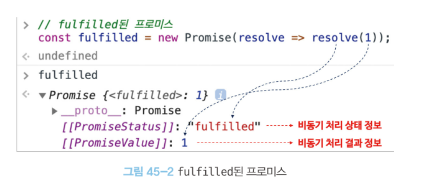
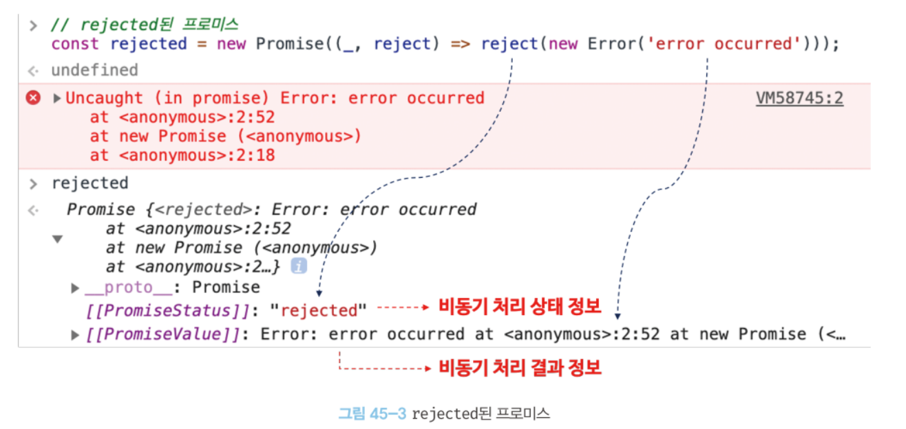

# 비동기 처리를 위한 콜백 패턴의 단점

전통적인 콜백 패턴은 **콜백 헬**로 인해 가독성이 나쁘고 **에러의 처리가 곤란**하며 **여러 개의 비동기 처리를 한 번에 처리하는데 한계**가 있다.

## 1. 콜백 헬

콜백 함수 호출이 중첩되어 복잡도가 높아지는 현상

- 비동기 함수 내부의 **비동기로 동작하는 코드에서 처리 결과를 외부로 반환하거나 상위 스코프의 변수에 할당하면 기대한 대로 동작하지 않는다.**
- 비동기 함수는 태스크 큐에 저장되어 대기하다가, 콜 스택이 비면 이벤트 루프에 의해 콜 스택으로 푸시되어 실행된다.
- 따라서 비동기 처리 결과를 외부에 반환할 수 없고, 상위 스코프의 변수에 할당할 수도 없다.

⇒ 비동기 함수에 **비동기 처리 결과에 대한 후속 처리를 수행하는 콜백 함수를 전달**하는 것이 일반적

```js
// GET 요청을 위한 비동기 함수
const get = (url, callback) => {
  const xhr = new XMLHttpRequest();
  xhr.open("GET", url);
  xhr.send();

  xhr.onload = () => {
    if (xhr.status === 200) {
      // 서버의 응답을 콜백 함수에 전달하면서 호출하여 응답에 대한 후속 처리를 한다.
      callback(JSON.parse(xhr.response));
    } else {
      console.error(`${xhr.status} ${xhr.statusText}`);
    }
  };
};

const url = "https://jsonplaceholder.typicode.com";

// id가 1인 post의 userId를 취득
get(`${url}/posts/1`, ({ userId }) => {
  console.log(userId); // 1
  // post의 userId를 사용하여 user 정보를 취득
  get(`${url}/users/${userId}`, userInfo => {
    console.log(userInfo); // {id: 1, name: "Leanne Graham", username: "Bret",...}
  });
});
```

```js
get("/step1", a => {
  get(`/step2/${a}`, b => {
    get(`/step3/${b}`, c => {
      get(`/step4/${c}`, d => {
        console.log(d);
      });
    });
  });
});
```

콜백 헬은 가독성을 나쁘게 하며 실수를 유발하는 원인이 된다.

## 2. 에러 처리의 한계

```js
try {
  setTimeout(() => {
    throw new Error("Error!");
  }, 1000);
} catch (e) {
  // 에러를 캐치하지 못한다
  console.error("캐치한 에러", e);
}
```

- setTimeout 호출 → 콜 스택에 푸시되어 실행
- setTimeout은 비동기 함수이므로 콜백 함수가 호출되는 것을 기다리지 않고 종료
- setTimeout의 콜백 함수는 태스크 큐로 푸시
- 콜 스택이 비었을 때 이벤트 루프에 의해 콜 스택으로 푸시되어 실행

⇒ setTimeout의 콜백 함수가 실행될 때 setTimeout 함수는 이미 콜 스택에서 제거된 상태이다.
따라서 setTimeout의 콜백 함수의 호출자(caller)는 setTimeout 함수가 아니다. 에러는 호출자(caller)방향으로 전파되는데 setTimeout의 콜백 함수를 호출한 것은 setTimeout이 아니므로 catch 블록에서 캐치되지 않는다.

---

# 프로미스의 생성

전통적인 콜백 패턴은 콜백 헬이나 에러 처리가 곤란하기 때문에 이를 극복하기 위해서 ES6에서 프로미스가 도입되었다.

Promise 생성자를 new 연산자와 함께 호출하면 Promise 객체를 생성한다.

- 인수
  - `resolve`: 비동기 처리가 성공하면 호출되는 함수
  - `reject`: 비동기 처리가 실패하면 호출되는 함수

```js
// 프로미스 생성
const promise = new Promise((resolve, reject) => {
  // Promise 함수의 콜백 함수 내부에서 비동기 처리를 수행한다.
  if (/* 비동기 처리 성공 */) {
    resolve('result');
  } else { /* 비동기 처리 실패 */
    reject('failure reason');
  }
});
```

- 프로미스 상태 정보
  - pending: 비동기 처리가 아직 수행되지 않은 상태. 프로미스가 생성된 직후 기본 상태
  - settled: 비동기 처리가 수행된 상태
    - fulfilled: 비동기 처리가 수행된 상태**(성공)**. resolve 함수 호출
    - rejected: 비동기 처리가 수행된 상태**(실패)**. reject 함수 호출
- 반환
  - 비동기 처리 상태와 처리 결과
    
    

---

# 프로미스의 후속 처리 메서드

## 1. Promise.prototype.then

두 개의 콜백 함수를 인수로 전달 받는다.

- 첫 번째 콜백 함수: 프로미스가 fulfilled 상태가 되면 호출된다.
- 두 번째 콜백 함수: 프로미스가 rejected 상태가 되면 호출된다.

언제나 프로미스를 반환한다.

```js
// fulfilled
new Promise(resolve => resolve("fulfilled")).then(
  v => console.log(v),
  e => console.error(e)
); // fulfilled

// rejected
new Promise((_, reject) => reject(new Error("rejected"))).then(
  v => console.log(v),
  e => console.error(e)
); // Error: rejected
```

## 2. Promise.prototype.catch

한 개의 콜백 함수를 인수로 전달 받는다.

프로미스가 rejected 상태인 경우만 호출된다.

언제나 프로미스를 반환한다.

```js
// rejected
new Promise((_, reject) => reject(new Error("rejected"))).catch(e =>
  console.log(e)
); // Error: rejected
```

```js
// rejected
new Promise((_, reject) => reject(new Error("rejected"))).then(undefined, e =>
  console.log(e)
); // Error: rejected
```

위 두 방법은 동일하게 동작한다.

## 3. Promise.prototype.finally

한 개의 콜백 함수를 인수로 전달 받는다.

프로미스의 성공 또는 실패와 상관없이 무조건 한 번 호출 된다.

→ 공통적으로 수행할 내용이 있을 때 유용하다.

언제나 프로미스를 반환한다.

```js
new Promise(() => {}).finally(() => console.log("finally")); // finally
```

---

# 프로미스의 에러 처리

1. 비동기 처리에서 발생한 에러는 then 메서드의 두 번째 콜백 함수로 처리할 수 있다.

```js
const wrongUrl = "https://jsonplaceholder.typicode.com/XXX/1";

// 부적절한 URL이 지정되었기 때문에 에러가 발생한다.
promiseGet(wrongUrl).then(
  res => console.log(res),
  err => console.error(err)
); // Error: 404
```

1. 프로미스의 후속 처리 메서드 catch를 사용해 처리할 수도 있다.

```js
const wrongUrl = "https://jsonplaceholder.typicode.com/XXX/1";

// 부적절한 URL이 지정되었기 때문에 에러가 발생한다.
promiseGet(wrongUrl)
  .then(res => console.log(res))
  .catch(err => console.error(err)); // Error: 404
```

catch 메서드를 모든 then 메서드를 호출한 이후에 호출하면 비동기 처리에서 발생한 에러뿐만 아니라 then 메서드 내부에서 발생한 에러까지 모두 캐치할 수 있다.

또한, then 메서드를 사용한 에러 처리보다 가독성이 좋고 명확하다는 장점이 있다.

---

# 프로미스 체이닝

프로미스 후속 처리 메서드를 연속적으로 호출하는 것

```js
const url = "https://jsonplaceholder.typicode.com";

// id가 1인 post의 userId를 취득
promiseGet(`${url}/posts/1`)
  // 취득한 post의 userId로 user 정보를 취득
  .then(({ userId }) => promiseGet(`${url}/users/${userId}`))
  .then(userInfo => console.log(userInfo))
  .catch(err => console.error(err));
```

콜백 헬이 발생하지 않지만, 프로미스도 콜백 패턴을 사용하므로 가독성이 좋지 않다.

이를 해결하기 위해 ES8에 도입된 async/await 를 사용하여 동기 처리처럼 프로미스를 처리할 수 있다.

```js
const url = "https://jsonplaceholder.typicode.com";

(async () => {
  // id가 1인 post의 userId를 취득
  const { userId } = await promiseGet(`${url}/posts/1`);

  // 취득한 post의 userId로 user 정보를 취득
  const userInfo = await promiseGet(`${url}/users/${userId}`);

  console.log(userInfo);
})();
```

---

# 프로미스의 정적 메서드

## 1. Promise.resolve / Promise.reject

- Promise.resolve
  - 인수로 전달받은 값을 resolve 하는 프로미스 생성
  ```js
  // 배열을 resolve하는 프로미스를 생성
  const resolvedPromise = Promise.resolve([1, 2, 3]);
  resolvedPromise.then(console.log); // [1, 2, 3]
  ```
  ```js
  const resolvedPromise = new Promise(resolve => resolve([1, 2, 3]));
  resolvedPromise.then(console.log); // [1, 2, 3]
  ```
- Promise.reject
  - 인수로 전달받은 값을 reject 하는 프로미스 생성
  ```js
  // 에러 객체를 reject하는 프로미스를 생성
  const rejectedPromise = Promise.reject(new Error("Error!"));
  rejectedPromise.catch(console.log); // Error: Error!
  ```
  ```js
  const rejectedPromise = new Promise((_, reject) =>
    reject(new Error("Error!"))
  );
  rejectedPromise.catch(console.log); // Error: Error!
  ```

## 2. Promise.all

여러 개의 비동기 처리를 모두 병렬 처리할 때 사용한다.

- 프로미스를 요소로 갖는 배열 등의 이터러블을 인수로 전달받는다.
- 전달받은 모든 프로미스가 **모두 fulfilled 상태**가 되면 모든 처리 결과를 배열에 저장해 새로운 프로미스를 반환한다.
- **처리 순서가 보장**된다.
- 하나라도 reject 되는 경우 나머지 프로미스 처리를 기다리지 않고 즉시 종료된다.

```js
const requestData1 = () =>
  new Promise(resolve => setTimeout(() => resolve(1), 3000));
const requestData2 = () =>
  new Promise(resolve => setTimeout(() => resolve(2), 2000));
const requestData3 = () =>
  new Promise(resolve => setTimeout(() => resolve(3), 1000));

// 세 개의 비동기 처리를 순차적으로 처리
const res = [];
requestData1()
  .then(data => {
    res.push(data);
    return requestData2();
  })
  .then(data => {
    res.push(data);
    return requestData3();
  })
  .then(data => {
    res.push(data);
    console.log(res); // [1, 2, 3] ⇒ 약 6초 소요
  })
  .catch(console.error);
```

앞선 비동기 처리 후 다음 비동기 처리를 수행한다.

총 6초 이상이 소요된다.

```js
const requestData1 = () =>
  new Promise(resolve => setTimeout(() => resolve(1), 3000));
const requestData2 = () =>
  new Promise(resolve => setTimeout(() => resolve(2), 2000));
const requestData3 = () =>
  new Promise(resolve => setTimeout(() => resolve(3), 1000));

Promise.all([requestData1(), requestData2(), requestData3()])
  .then(console.log) // [ 1, 2, 3 ] ⇒ 약 3초 소요
  .catch(console.error);
```

병렬 처리하므로 가장 늦게 처리되는 3초보다 조금 더 소요된다.

- Promise.all 메서드는 인수로 전달 받은 이터러블의 요소가 프로미스가 아닌 경우 Promise.resolve 메서드를 통해 프로미스로 래핑한다.

```js
Promise.all([
  1, // => Promise.resolve(1)
  2, // => Promise.resolve(2)
  3, // => Promise.resolve(3)
])
  .then(console.log) // [1, 2, 3]
  .catch(console.log);
```

## 3. Promise.race

- 프로미스를 요소로 갖는 배열 등의 이터러블을 인수로 전달받는다.
- **가장 먼저 fulfilled 상태**가 된 프로미스의 처리 결과를 resolve하는 새로운 프로미스를 반환한다.
- 하나라도 rejected 상태가 되면 에러를 reject하는 새로운 프로미스를 즉시 반환한다.

```js
Promise.race([
  new Promise(resolve => setTimeout(() => resolve(1), 3000)), // 1
  new Promise(resolve => setTimeout(() => resolve(2), 2000)), // 2
  new Promise(resolve => setTimeout(() => resolve(3), 1000)), // 3
])
  .then(console.log) // 3
  .catch(console.log);
```

```js
Promise.race([
  new Promise((_, reject) =>
    setTimeout(() => reject(new Error("Error 1")), 3000)
  ),
  new Promise((_, reject) =>
    setTimeout(() => reject(new Error("Error 2")), 2000)
  ),
  new Promise((_, reject) =>
    setTimeout(() => reject(new Error("Error 3")), 1000)
  ),
])
  .then(console.log)
  .catch(console.log); // Error: Error 3
```

## 4. Promise.allSettled

- 프로미스를 요소로 갖는 배열 등의 이터러블을 인수로 전달받는다.
- **전달 받은 프로미스가 모두 settled 상태**가 되면 처리 결과를 배열로 반환한다.
- fulfilled 또는 rejected 상태와는 상관없이 인수로 전달 받은 모든 프로미스들의 처리 결과를 모두 배열에 담아 반환한다.
  - `fulfilled`: 비동기 처리 상태를 나타내는 `status` 프로퍼티, 처리 결과를 나타내는 `value` 프로퍼티
  - `rejected`: 비동기 처리 상태를 나타내는 `status` 프로퍼티, 에러를 나타내는 `reason` 프로퍼티

---

# 마이크로 태스크 큐

- 마이크로 태스크 큐는 태스크 큐와 별도의 큐로서,
- **프로미스**의 후속 처리 메서드의 콜백 함수가 일시 저장된다.
- **마이크로 태스크 큐는 태스크 큐보다 우선순위가 높다.**

```js
setTimeout(() => console.log(1), 0);

Promise.resolve()
  .then(() => console.log(2))
  .then(() => console.log(3));
```

2 → 3 → 1이 출력된다.

---

# fetch

HTTP 요청 전송 기능을 제공하는 클라이언트 사이드 Web API

- XMLHttpRequest 객체보다 사용법이 간단하고
- 프로미스를 지원하기 때문에
- 콜백 패턴의 단점에서 자유롭다.

fetch 함수는 HTTP 응답을 나타내는 Response 객체를 래핑한 Promise 객체를 반환한다.

```js
fetch("https://jsonplaceholder.typicode.com/todos/1").then(response =>
  console.log(response)
);
```

fetch 함수를 사용할 때는 에러 처리에 주의해야 한다.

```js
const wrongUrl = "https://jsonplaceholder.typicode.com/XXX/1";

// 부적절한 URL이 지정되었기 때문에 404 Not Found 에러가 발생한다.
fetch(wrongUrl)
  .then(() => console.log("ok"))
  .catch(() => console.log("error"));
```

fetch 함수가 반환하는 프로미스는 기본적으로 `404 Not Found`나 `500 Internal Server Error`와 같은 HTTP 에러가 발생해도 에러를 reject하지 않고 불리언 타입의 ok를 false로 설정한 Response 객체를 반환한다.

오프라인 등의 네트워크 장애나 CORS 에러에 의해 요청이 완료되지 못한 경우에만 프로미스를 reject한다.

따라서 fetch 함수를 사용할 때는 resolve한 불리언 타입의 ok 상태를 확인해 명시적으로 에러를 처리한다.

```js
const wrongUrl = "https://jsonplaceholder.typicode.com/XXX/1";

// 부적절한 URL이 지정되었기 때문에 404 Not Found 에러가 발생한다.
fetch(wrongUrl)
  // response는 HTTP 응답을 나타내는 Response 객체다.
  .then(response => {
    if (!response.ok) throw new Error(response.statusText);
    return response.json();
  })
  .then(todo => console.log(todo))
  .catch(err => console.error(err));
```

참고로 **axios**는 모든 HTTP 에러를 reject하는 프로미스를 반환한다. 따라서 모든 에러를 catch에서 처리할 수 있어 편리하다.
