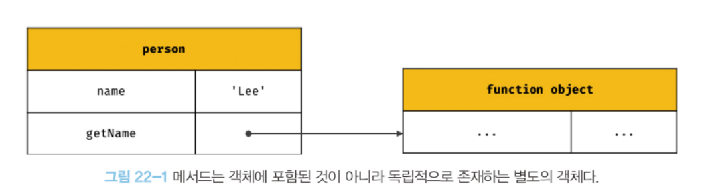
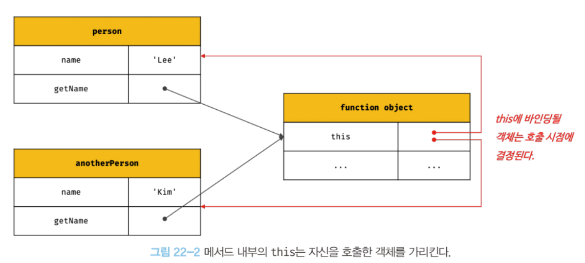

# this 키워드

<aside>
💡 this는 자신이 속한 객체 또는 자신이 생성할 인스턴스를 가리키는 자기 참조 변수다.

</aside>

- 객체 리터럴로 객체를 생성한 경우, 이미 객체 리터럴 평가가 완료되어 자신이 속한 객체를 가리킬 수 있다.
- 그러나 생성자 함수 방식으로 인스턴스를 생성하는 경우, 생성자 함수를 정의하는 시점에 생성할 인스턴스를 가리킬 식별자를 알 수 없다.
- this는 자바스크립트 엔진에 의해 암묵적으로 생성되며, 함수를 호출하면 arguments 객체와 this가 암묵적으로 함수 내부에 전달된다.
- this는 함수 호출 방식에 의해 동적으로 바인딩된다.
  - 객체 리터럴 메서드 내부의 this
    - 메서드를 호출한 객체를 가리킨다.
  - 생성자 함수 내부의 this
    - 생성자 함수가 생성할 인스턴스를 가리킨다.
- strict mode도 this 바인딩에 영향을 준다.
  - strict mode가 적용된 일반 함수 내부의 this는 undefined를 가리킨다.

---

# 함수 호출 방식과 this 바인딩

this 바인딩은 함수 호출 방식에 의해 동적으로 결정된다.

- 렉시컬 스코프는 함수 정의가 평가되어 함수 객체가 평가되는 시점에 상위 스코프를 결정한다.
- **this는 함수 호출 시점에 결정된다.**

## 1. 일반 함수 호출

- this → 전역 객체 (strict mode에서는 undefined)
- 콜백 함수가 일반 함수로 호출되면 콜백 함수 내부의 this도 전역 객체를 가리킨다.

⇒ 일반 함수로 호출된 모든 함수 (중첩 함수, 콜백 함수 포함) 내부의 this는 전역 객체를 가리킨다.

- 그러나 메서드 내부의 중첩 함수, 콜백 함수의 this가 전역 객체를 가리키는 것은 문제가 있다.

  - 이 경우, this 바인딩을 변수에 할당하는 방법이 있다.

  ```jsx
  var value = 1;

  const obj = {
    value: 100,
    foo() {
      // this 바인딩(obj)을 변수 that에 할당한다.
      const that = this;

      // 콜백 함수 내부에서 this 대신 that을 참조한다.
      setTimeout(function () {
        console.log(that.value); // 100
      }, 100);
    },
  };

  obj.foo();
  ```

  - 또는 `Function.prototype.apply`, `Function.prototype.call`, `Function.prototype.bind` 메서드를 사용하는 방법도 있다.
  - 또는 **화살표 함수**를 사용하는 방법이 있다.
    - 화살표 함수 내부의 this는 상위 스코프의 this를 가리킨다.

## 2. 메서드 호출

- this → 메서드를 호출한 객체 바인딩
- 메서드를 소유한 객체가 아닌 메서드를 호출한 객체에 바인딩된다.

```jsx
const person = {
  name: "Lee",
  getName() {
    // 메서드 내부의 this는 메서드를 호출한 객체에 바인딩된다.
    return this.name;
  },
};

// 메서드 getName을 호출한 객체는 person이다.
console.log(person.getName()); // Lee
```

- 메서드는 프로퍼티에 바인딩 된 함수이다.
- 즉, person 객체의 getName 프로퍼티가 가리키는 함수 객체는 person 객체에 포함된 것이 아니라 독립적으로 존재하는 별도의 객체이다.



- 따라서 getName 메서드는 다른 객체의 프로퍼티에 할당하여 다른 객체의 메서드가 될 수 있고 일반 변수에 할당하여 일반 함수로 호출될 수도 있다.

  ```jsx
  const anotherPerson = {
    name: "Kim",
  };
  // getName 메서드를 anotherPerson 객체의 메서드로 할당
  anotherPerson.getName = person.getName;

  // getName 메서드를 호출한 객체는 anotherPerson이다.
  console.log(anotherPerson.getName()); // Kim

  // getName 메서드를 변수에 할당
  const getName = person.getName;

  // getName 메서드를 일반 함수로 호출
  console.log(getName()); // ''
  // 일반 함수로 호출된 getName 함수 내부의 this.name은 브라우저 환경에서 window.name과 같다.
  // 브라우저 환경에서 window.name은 브라우저 창의 이름을 나타내는 빌트인 프로퍼티이며 기본값은 ''이다.
  // Node.js 환경에서 this.name은 undefined다.
  ```

  

⇒ 메서드 내부의 this는 프로퍼티로 메서드를 가리키고 있는 객체와는 관계가 없고 메서드를 호출한 객체에 바인딩 된다.

- 프로토타입 메서드 내부의 this도 마찬가지로 해당 메서드를 호출한 객체에 바인딩된다.

```jsx
function Person(name) {
  this.name = name;
}

Person.prototype.getName = function () {
  return this.name;
};

const me = new Person("Lee");

// getName 메서드를 호출한 객체는 me다.
console.log(me.getName()); // ① Lee

Person.prototype.name = "Kim";

// getName 메서드를 호출한 객체는 Person.prototype이다.
console.log(Person.prototype.getName()); // ② Kim
```

## 3. 생성자 함수 호출

- this → 생성자 함수가 생성할 인스턴스

```jsx
// 생성자 함수
function Circle(radius) {
  // 생성자 함수 내부의 this는 생성자 함수가 생성할 인스턴스를 가리킨다.
  this.radius = radius;
  this.getDiameter = function () {
    return 2 * this.radius;
  };
}

// 반지름이 5인 Circle 객체를 생성
const circle1 = new Circle(5);
// 반지름이 10인 Circle 객체를 생성
const circle2 = new Circle(10);

console.log(circle1.getDiameter()); // 10
console.log(circle2.getDiameter()); // 20
```

## 4. Function.prototype.apply/call/bind 메서드에 의한 간접 호출

- apply, call 메서드는 this로 사용할 객체와 인수 리스트를 인수로 전달받아 함수를 호출한다.

  ```jsx
  function getThisBinding() {
    return this;
  }

  // this로 사용할 객체
  const thisArg = { a: 1 };

  console.log(getThisBinding()); // window

  // getThisBinding 함수를 호출하면서 인수로 전달한 객체를 getThisBinding 함수의 this에 바인딩한다.
  console.log(getThisBinding.apply(thisArg)); // {a: 1}
  console.log(getThisBinding.call(thisArg)); // {a: 1}
  ```

  - apply, call 메서드의 본질적인 기능은 함수를 호출하는 것이다.
  - 함수를 호출하면서 첫 번째 인수로 전달한 특정 객체를 호출한 함수의 this에 바인딩한다.

  ```jsx
  function getThisBinding() {
    console.log(arguments);
    return this;
  }

  // this로 사용할 객체
  const thisArg = { a: 1 };

  // getThisBinding 함수를 호출하면서 인수로 전달한 객체를 getThisBinding 함수의 this에 바인딩한다.
  // apply 메서드는 호출할 함수의 인수를 배열로 묶어 전달한다.
  console.log(getThisBinding.apply(thisArg, [1, 2, 3]));
  // Arguments(3) [1, 2, 3, callee: ƒ, Symbol(Symbol.iterator): ƒ]
  // {a: 1}

  // call 메서드는 호출할 함수의 인수를 쉼표로 구분한 리스트 형식으로 전달한다.
  console.log(getThisBinding.call(thisArg, 1, 2, 3));
  // Arguments(3) [1, 2, 3, callee: ƒ, Symbol(Symbol.iterator): ƒ]
  // {a: 1}
  ```

  - apply, call 메서드를 통해 arguments와 같은 유사 배열 객체에 배열 메서드를 사용할 수 있다.

    - arguments 객체는 배열이 아니기 때문에 Array.prototype.slice 메서드를 사용할 수 없지만 apply, call 메서드를 이용하면 가능하다.

      ```jsx
      function convertArgsToArray() {
        console.log(arguments);

        // arguments 객체를 배열로 변환
        // Array.prototype.slice를 인수없이 호출하면 배열의 복사본을 생성한다.
        const arr = Array.prototype.slice.call(arguments);
        // const arr = Array.prototype.slice.apply(arguments);
        console.log(arr);

        return arr;
      }

      convertArgsToArray(1, 2, 3); // [1, 2, 3]
      ```

- bind 메서드는 apply, call 메서드와 달리 함수를 호출하지 않는다.

  - 첫 번째 인수로 전달한 값으로 this 바인딩이 교체된 함수를 새롭게 생성해 반환한다.

  ```jsx
  function getThisBinding() {
    return this;
  }

  // this로 사용할 객체
  const thisArg = { a: 1 };

  // bind 메서드는 첫 번째 인수로 전달한 thisArg로 this 바인딩이 교체된
  // getThisBinding 함수를 새롭게 생성해 반환한다.
  console.log(getThisBinding.bind(thisArg)); // getThisBinding
  // bind 메서드는 함수를 호출하지는 않으므로 명시적으로 호출해야 한다.
  console.log(getThisBinding.bind(thisArg)()); // {a: 1}
  ```

  - 콜백 함수 내부의 this를 바인딩하는 예시

    ```jsx
    const person = {
      name: "Lee",
      foo(callback) {
        // bind 메서드로 callback 함수 내부의 this 바인딩을 전달
        // 바인딩하지 않으면 this는 window.name을 가리킨다.
        setTimeout(callback.bind(this), 100);
      },
    };

    person.foo(function () {
      console.log(`Hi! my name is ${this.name}.`); // Hi! my name is Lee.
    });
    ```
