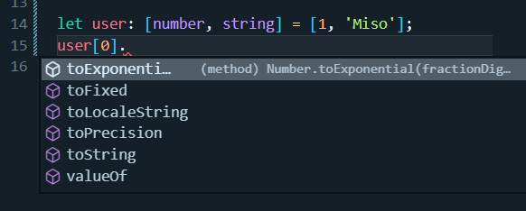
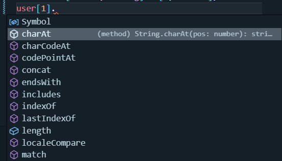

# 자바스크립트의 타입

- number
- string
- boolean
- null
- undefined
- object

# 타입스크립트의 타입

- any
- unknown
- never
- enum
- tuple

# Built-in 타입

```tsx
// 큰 숫자는 밑줄을 넣어 숫자를 구분하기 편하게 만들 수 있다.
let sales: number = 123_456_789;
let course: string = "TypeScript";
let is_published: boolean = true;
```

- 타입을 명시하는 주석은 꼭 달지 않아도 된다. 초기화 한 값을 바탕으로 타입스크립트가 알아서 추론할 수 있다.
  - 초기화 하지 않고 선언한 경우 any 타입으로 가정한다.

# any 타입

```tsx
// 추론 되는 타입
let sales = 123_456_789;
let course = "TypeScript";
let is_published = true;

// 추론되지 않아 any로 지정
let level;
level = 1;
level = "a";
```

- any 타입으로 지정되면 어떠한 값도 넣을 수 있다. 그러나 이것은 타입스크립트를 사용하는 전체 아이디어에 위배된다.

```tsx
function render(document) {
  console.log(document);
}
```

- 매개변수 유형을 명시적으로 표기하지 않으면 암시적으로 any 타입이 된다. 이 경우 컴파일러가 오류를 발생시킨다.
- 이 오류를 없애기 위해서는
  - document에 any타입으로 명시하거나
  - tsconfig.json에서 noImplicitAny를 false로 지정한다.
  - 근데 이럴거면… 타입스크립트를 쓸 이유가 없

# Array

- 자바스크립트의 Array는 구성 요소에 어떠한 타입이든 다 넣을 수 있다.

  ```tsx
  let numbers = [1, 2, "3"];
  ```

  만약 numbers의 요소들이 모두 숫자라고 가정하고 작성한 어떤 작업이 있을 경우, 위 형태의 배열은 예외적인 결과 값을 가져올 것이다.

- 타입스크립트에서는 배열 또한 타입을 지정할 수 있다.
  ```tsx
  let numbers: number[] = [1, 2, "3"];
  ```
  이렇게 타입을 지정하면 모든 요소가 number임을 명시하게 되는 것이고 세번째 요소 ‘3’에 대하여 오류를 발생시킨다.
  ```tsx
  let numbers = [1, 2, 3];
  ```
  모든 요소가 숫자 타입인 배열을 이용하여 변수를 초기화하면 타입스크립트는 알아서 `number[]` 타입으로 변수의 타입을 추론한다.
  빈 배열을 이용하여 초기화 하는 경우 `any[]` 타입이 된다.

# Tuple

특정 유형을 갖는 요소들로 구성된 고정 길이 배열

값을 한 쌍으로 작업할 때 유용하다.

```tsx
let user: [number, string] = [1, "Miso"];
```

저기서 하나의 요소가 더 추가되면 오류가 난다.

정확히 길이와 유형이 맞아야 한다.





타입스크립트에 의해 이미 각각의 타입을 알기 때문에 타입에 맞는 메서드를 사용할 수 있다.

- number 타입 ⇒ Number 객체 메서드
- string 타입 ⇒ String 객체 메서드

# Enum

```tsx
enum Size {
  Small,
  Medium,
  Large,
}
```

타입스크립트는 암시적으로 첫 번째 요소에 0을 할당하고 그 뒤로 1, 2 … 를 할당한다.

만약 이것이 싫다면 명시적으로 값을 주면 된다.

```tsx
enum Size {
  Small = 1,
  Medium,
  Large,
}
let mySize: Size = Size.Medium;
console.log(mySize); // 2
```

위 코드를 컴파일 한 자바스크립트 코드는

```js
var Size;
(function (Size) {
  Size[(Size["Small"] = 1)] = "Small";
  Size[(Size["Medium"] = 2)] = "Medium";
  Size[(Size["Large"] = 3)] = "Large";
})(Size || (Size = {}));
let mySize = Size.Medium;
console.log(mySize);
```

타입스크립트 컴파일 최적화를 위해 enum을 사용할 때 `const` 키워드를 사용하는 것을 추천한다.

```tsx
const enum Size {
  Small = 1,
  Medium,
  Large,
}
let mySize: Size = Size.Medium;
console.log(mySize);
```

`const` 키워드를 이용하면 코드가 간결해진다.

```js
let mySize = 2;
console.log(mySize);
```

# Function

```tsx
function calculateTax(income: number) {}
```

- function에 명시적으로 타입을 설정하지 않으면 리턴 값에 따라 함수의 타입이 추론된다.
  - 리턴 값이 없는 경우 `void` 타입
  - 그러나 항상 타입을 명시해주는 것이 권장된다.
- **사용되지 않은 매개변수**에 대한 경고를 띄워주는 옵션
  - tsconfig.json의 `noUnusedParameters`
  - 이 옵션을 켜면 사용되지 않은 매개변수에 대하여 경고를 띄운다.
- **반드시 함수에 리턴 값이 존재**하도록 하는 옵션
  - tsconfig.json의 `noImplicitReturns`
  - 이 옵션을 켜면 반드시 함수에 리턴 값이 있어야 한다.
- 사용되지 않은 로컬 변수에 대한 경고를 띄워주는 옵션
  - tsconfig.json의 `noUnusedLocals`
  - 이 옵션을 켜면 사용되지 않은 로컬 변수에 대하여 경고를 띄운다.
- 함수를 호출할 때, 매개변수의 개수를 반드시 지켜야한다.
  - 자바스크립트에서는 매개변수의 개수에 대하여 신경쓰지 않지만 타입스크립트는 엄격하게 개수를 고려한다.
- 선택적 매개변수 사용을 위해 `?` 키워드를 사용할 수 있다.
  ```tsx
  function calculateTax(income: number, taxYear?: number): number {
    if ((taxYear || 2022) < 2022) {
      return income * 1.2;
    }
    return income * 1.3;
  }
  calculateTax(10_000);
  ```
- 매개변수에 기본값을 넣을 수 있다.
  ```tsx
  function calculateTax(income: number, taxYear = 2022): number {
    if (taxYear < 2022) {
      return income * 1.2;
    }
    return income * 1.3;
  }
  calculateTax(10_000);
  ```
  - 이 경우 매개변수 값을 전달하면 전달된 값으로 덮어씌워 진다.

# Object

```tsx
let employee = { id: 1 };
employee.name = "miso";
```

이 코드는 자바스크립트에서는 문제없이 작동하지만 타입스크립트는 그렇지 않다.

오류의 내용은 employee 객체 안에 name 속성이 없다는 것이다.

현재 employee는 초기값에 의해 `{ id: number }` 타입으로 지정되어 있다.

그렇다면 이 오류를 고치기 위해

```tsx
let employee: {
  id: number;
  name: string;
} = { id: 1 };
employee.name = "miso";
```

이러한 형태로 작성할 수 있을 것이다.

그러나 이 또한 문제를 일으킨다.

타입에 name 프로퍼티와 타입을 지정했지만 초기화 한 값에는 id 프로퍼티만 존재하기 때문이다.

이를 해결하기 위해서는

- name 프로퍼티를 빈 문자열로 지정하여 초기화한다.

```tsx
let employee: {
  id: number;
  name: string;
} = { id: 1, name: "" };
employee.name = "miso";
```

- name 프로퍼티를 optional로 만든다. (이 경우 name은 필수적인 요소이므로 권장되지 않음)

```tsx
let employee: {
  id: number;
  name?: string;
} = { id: 1 };
employee.name = "miso";
```

- 읽기 전용 프로퍼티를 만들 수 있다.
  ```tsx
  let employee: {
    readonly id: number;
    name: string;
  } = { id: 1, name: "Miso" };
  ```
- 메서드를 추가하는 방법
  ```tsx
  let employee: {
    readonly id: number;
    name: string;
    retire: (date: Date) => void; // 매개변수 타입 => 반환 타입
  } = {
    id: 1,
    name: "Miso",
    retire: (date: Date) => {
      console.log(date);
    },
  };
  ```
  매개변수 타입과 반환 타입을 명시해야한다.

# Type Alias

앞서 작성한 객체 코드를 type alias를 이용하면 다음과 같이 작성할 수 있다.

```tsx
type Employee = {
  readonly id: number;
  name: string;
  retire: (date: Date) => void;
};

let employee: Employee = {
  id: 1,
  name: "Miso",
  retire: (date: Date) => {
    console.log(date);
  },
};
```

type alias를 이용하면 여러 위치에서 재사용하기 쉬워진다.

# Union Type

변수가 여러 개의 타입을 가질 수 있을 때 `|` 기호를 사용하여 표현할 수 있다.

```tsx
function kgToLbs(weight: number | string): number {
  if (typeof weight === "number") {
    return weight * 2.2;
  } else {
    return parseInt(weight) * 2.2;
  }
}
```

# Intersection Type

여러 개의 타입을 가지는데 `&` 키워드를 사용하는 타입

```tsx
type Draggable = {
  drag: () => void;
};

type Resizable = {
  resize: () => void;
};

type UIWidget = Draggable & Resizable;

let textBox: UIWidget = {
  drag: () => {},
  resize: () => {},
};
```

이 경우 두 타입에 대한 프로퍼티들을 다 가져야 한다.

# Literal Type

변수가 특정 값만 갖게 하고 싶을 때 사용한다.

```tsx
let quantity: 50 | 100 = 51;
```

이 경우 50, 100만 값으로 가질 수 있다.

반드시 숫자 타입일 필요는 없다. 다른 타입도 된다.

```tsx
type Quantity = 50 | 100;
let quantity: Quantity = 100;
```

type alias를 사용할 수 있다.

# Nullable Type

```tsx
function greet(name: string) {
  console.log(name.toUpperCase());
}

greet(null);
```

이 코드는 자바스크립트에서 null에 toUpperCase 메서드를 사용할 수 없어 오류가 나고,

타입스크립트에서는 null이 string 타입의 매개변수에 할당될 수 없어 오류가 날 것이다.

tsconfig.json의 `strictNullChecks` 옵션은 `strict` 옵션의 일부로 들어가 있지만 덮어 쓸 수 있다.

`strictNullChecks` 옵션을 false로 지정하는 경우 타입스크립트에서 null을 전달해도 오류가 나지 않는다. (사용하지 않는 것이 좋다)

```tsx
function greet(name: string | null) {
  if (name) {
    console.log(name.toUpperCase());
  } else {
    console.log("Hola!");
  }
}

greet(null);
```

그래도 null 값을 사용하고 싶다면 위의 형태로 명시하면 된다. 근데 쓸 일이 많지는 않을 듯

# Optional Chaining

```tsx
type Customer = {
  birthday: Date;
};

function getCustomer(id: number): Customer | null {
  return id === 0 ? null : { birthday: new Date() };
}

let customer = getCustomer(0);
console.log(customer.birthday);
```

이 코드는 customer가 null일 수 있다는 오류를 발생시킨다.

이 문제를 해결하는 방법은

- if 문을 이용하여 customer가 null이 아닐 때 출력하도록 하기
- optional property access operator `?` 를 붙이기

  ```tsx
  type Customer = {
    birthday: Date;
  };

  function getCustomer(id: number): Customer | null {
    return id === 0 ? null : { birthday: new Date() };
  }

  let customer = getCustomer(0);
  console.log(customer?.birthday);
  ```

  이 경우 customer가 존재하지 않는 경우 undefined를 출력한다.

만약 birthday도 optional property로 지정하는 경우

```tsx
type Customer = {
  birthday?: Date;
};

function getCustomer(id: number): Customer | null {
  return id === 0 ? null : { birthday: new Date() };
}

let customer = getCustomer(0);
console.log(customer?.birthday?.getFullYear());
```

birthday에도 `?` 연산자를 붙여 birthday가 존재하는 경우에만 코드가 실행되도록 할 수 있다.
