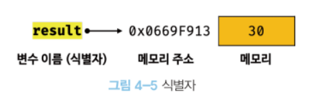
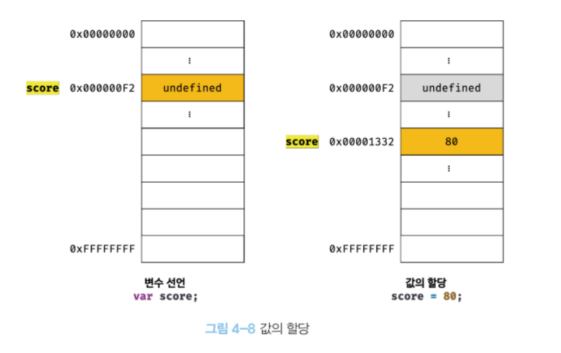
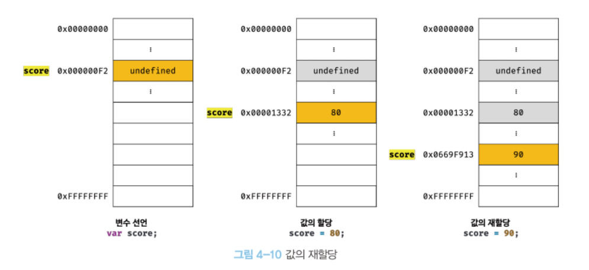

# 변수

## 1. 변수란 무엇인가? 왜 필요한가?

변수라는 것은 **하나의 값을 저장하기 위해 확보한 메모리 공간**이다.

**그렇다면 왜 필요할까?**

`10 + 20`이라는 표현식을 계산하기 위해서는 임의의 메모리에 피연산자 10과 20을 저장해놓고 CPU가 연산을 수행한다. 표현식의 결과 값인 30도 메모리 어딘가에 임의로 저장된다. 그러나 우리는 코드를 실행하기 전까지 이 메모리의 위치를 알 수도 없고 안다고 하더라도 직접 접근할 수 없다. 연산의 결과 30을 재사용하기 위해서 30이 저장된 메모리 공간에 상징적으로 이름을 붙인 것이 변수이다.

- 변수 이름: 메모리 공간에 저장된 값을 식별할 수 있는 고유한 이름
- 변수 값: 변수에 저장된 값
- 할당: 변수에 값을 저장하는 것
- 참조: 변수 값을 읽어 들이는 것

## 2. 식별자

식별자는 어떤 값을 구별해서 식별할 수 있는 고유한 이름이다.

식별자는 값이 저장되어 있는 **메모리 주소**와 매핑 관계를 맺으며, 이 매핑 정보도 메모리에 저장되어야 한다.

**식별자는 값이 아니라 메모리 주소를 기억하고 있다.**



## 3. 변수 선언

변수 선언은 변수를 생성하는 것을 의미한다. 변수를 사용하려면 반드시 선언이 필요하다.

선언하지 않은 식별자에 접근하는 경우 ReferenceError(참조 에러)가 발생한다.

자바스크립트 엔진은 변수 선언을 2단계에 거쳐 수행한다.

- **선언 단계**: 변수 이름을 등록해서 자바스크립트 엔진에 변수의 존재를 알린다.
  - 변수 이름은 실행 컨텍스트에 저장된다. 자바스크립트 엔진은 실행 컨텍스트를 통해 식별자와 스코프를 관리한다.
- **초기화 단계**: 값을 저장하기 위한 메모리 공간을 확보하고 암묵적으로 undefined로 초기화한다.

`var`키워드를 사용한 변수 선언은 선언 단계와 초기화 단계가 동시에 진행된다. 암묵적으로 undefined로 초기화 되므로 쓰레기 값이 참조되는 위험으로부터 안전하다.

## 4. 변수 선언의 실행 시점과 변수 호이스팅

**변수의 선언은 런타임 이전 단계에서 먼저 실행된다.**

자바스크립트 엔진은 소스코드를 한 줄씩 순차적으로 실행하기에 앞서 소스코드의 평가 과정을 거친다. **소스코드의 평가 과정에서 자바스크립트 엔진은 변수 선언을 포함한 모든 선언문을 소스코드에서 찾아내 먼저 실행한다.**

**변수 선언문이 코드의 선두로 끌어 올려진 것처럼 동작하는 자바스크립트 고유의 특징**을 **변수 호이스팅**이라 한다.

```js
console.log(score); // undefined

var score; // 변수 선언문
```

## 5. 값의 할당

변수 선언과 값의 할당은 실행 시점이 다르다.

**변수 선언은 런타임 이전에 먼저 실행되지만 값의 할당은 런타임에 실행된다.**

```js
console.log(score); // undefined

var score; // ① 변수 선언
score = 80; // ② 값의 할당

console.log(score); // 80
```

```js
console.log(score); // undefined

var score = 80; // 변수 선언과 값의 할당

console.log(score); // 80
```

변수 선언과 값의 할당을 하나의 문장으로 단축 표현해도 자바스크립트 엔진은 변수 선언과 값의 할당을 2개의 문으로 나누어 각각 실행한다.

**주의할 점**

변수를 할당하는 것은 이전 값 undefined가 저장되어 있던 메모리 공간을 지우고 그 메모리 공간에 80을 저장하는 것이 아니라 **새로운 메모리 공간을 확보하고 그곳에 할당 값 80을 저장**하는 것이다.



## 6. 값의 재할당

변수에 값을 재할당 할 때 값을 할당할 때와 같이 새로운 메모리 공간을 확보하고 값을 저장한다.



이전 값 undefined와 80은 아무도 사용하고 있지 않으니 가비지 콜렉터에 의해 자동으로 메모리에서 해제된다.
