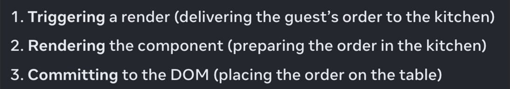

# Vite

> 빠르고 간결한 모던 웹 프로젝트 개발 경험에 초점을 맞춰 탄생한 빌드 도구

## 장점

- 번들링 성능을 높임 → 서버 구동이 빠르다
  - 문제점을 dependencies와 source code 두 가지로 나누어 개선
  - dependencies: 자주 바뀌지 않는 소스 코드 → Go로 작성된 ESBuild를 통해 다른 번들러 대비 10-100배 빠른 번들링
  - source code: 자주 바뀌는 소스 코드 → 현재 화면에서 실제로 사용이 되어야만 처리되도록 함.

---

# createRoot()

리액트 컴포넌트를 표시하는 루트를 생성하는 함수

VirtualDOM Tree에서 `<div id=”root” />`를 나타내는 node를 생성한다.

```js
const root = createRoot(domNode, options?)
```

- domNode
  - DOM 엘리먼트
  - 이 엘리먼트를 root로 삼는다.
- option
  - `onRecoverableError`: React가 자동으로 오류를 복구할 때 호출되는 콜백
  - `identifierPrefix`: useId에 의해 생성된 ID에 사용하는 문자열 접두사. 같은 페이지에서 여러 루트를 사용할 때 충돌을 피하는 데 유용함.

사용 예시

```js
import { createRoot } from "react-dom/client";

const root = createRoot(document.getElementById("root"));
root.render(<App />);
```

---

# Virtual DOM의 역할

- 최적화된 업데이트로 사용자 경험 개선
  - `reconciliation`: virtual DOM과 실제 DOM을 비교하여 동기화하는 과정
  - 한 마디로, 두 트리의 다른 부분을 찾아서 어떤 부분을 변경해야 하는 지 결정하는 과정
- 업데이트에 우선순위를 부여
  - animation vs text

## React의 diffing process

1. 두 virtual DOM 트리가 같은 루트를 가졌는지 확인
2. DFS 알고리즘을 통해 변경된 엘리먼트를 찾아 트리를 순회함.
3. 만약 두 트리가 다른 엘리먼트를 갖고 있는 경우 (`span` 엘리먼트에서 `div`엘리먼트로 바뀌는 경우) 이전 DOM 노드를 파괴하고 새 노드를 빌드함.
4. list를 비교하는 경우, 위에서부터 확인하기 때문에 요소를 마지막에 넣는 경우는 문제가 없지만 요소를 앞에 넣는 경우는 list를 다시 작성해야 하는 완전히 새로운 list로 간주한다.
   1. 이를 방지하기 위해 `key` prop을 사용한다.

## Fiber

참고: [https://github.com/acdlite/react-fiber-architecture](https://github.com/acdlite/react-fiber-architecture)

리액트 렌더링/업데이트의 가장 작은 단위

컴포넌트용 스택 프레임 (스택 프레임: 콜 스택에 추가되는 하나의 작업)

효율적인 업데이트를 위해

- work를 중지하고, 필요 시 다시 시작할 수 있어야 한다.
- 다른 종류의 work들에게 우선순위를 부여할 수 있어야 한다.
- 이미 완료된 work를 재사용 할 수 있어야 한다.
- work가 더이상 필요 없게 되면 버릴 수 있어야 한다

## Rendering process

### 1. render phase

컴포넌트에서 발생하는 변경 사항이 Virtual DOM에 적용되는 단계

이 단계에서는 아직 실제 DOM이 업데이트되지 않은 상태이므로, 렌더링 성능을 향상시키기 위한 최적화 작업이 가능하다.

1. `performUnitOfWork`
2. `beginWork`
3. `completeUnitOfWork`
4. `completeWork`

render phase에서는 위와 같은 단계로 함수가 실행된다.

- current tree: 현재 브라우저에 보이는 DOM Tree
- work-in-progress tree: 업데이트 사항이 반영되는 중인 DOM Tree

### 2. commit phase

Virtual DOM에 업데이트된 내용이 실제 DOM에 반영되고 브라우저에서 화면이 업데이트되는 단계

이 단계에서는 최적화가 불가능하므로 render phase에서 렌더링해야 한다.



### render 효율을 위해…

- 불필요한 js element를 없애는 것이 좋음
  - diffing시 모든 노드를 순회하기 때문
- key를 잘 지정해줘야 함
  - key 없이 리스트 앞에 요소 넣기 x

---

# 수업 외 Tip

1. 이력서 열람할 수 있는 사이트 [https://f-lab.kr/publish/resumes](https://f-lab.kr/publish/resumes)
2. 디바이스 별 반응형 볼 수 있는 사이트 [https://responsivedesignchecker.com/](https://responsivedesignchecker.com/)
3. 커밋 작성법 [https://blog.ull.im/engineering/2019/03/10/logs-on-git.html](https://blog.ull.im/engineering/2019/03/10/logs-on-git.html)
4. 좋은 코드를 많이 보기 - 센드버드, 리디 추천

## 아토믹 디자인 패턴이란?

참고: [https://brunch.co.kr/@skykamja24/580](https://brunch.co.kr/@skykamja24/580)

가장 작은 컴포넌트 단위를 원자(Atoms)로 설정하고, 이를 바탕으로 상위 컴포넌트를 만들어 재사용성을 최대화하는 방법론

원자(Atoms) → 분자(Molecules) → 유기체(Organisms) → 템플릿(Templates) → 페이지(pages)

1. 원자
   1. 디자인과 기능의 최소 단위
   2. `Label`, `Text`, `Container`, `Button`, `Icon` 컴포넌트
2. 분자
   1. 입력 폼, 네비게이션, 카드 컴포넌트
3. 유기체
   1. 입력 폼과 함께 헤더 감싸기, 여러 카드를 관리하는 그리드
4. 템플릿
   1. 여러 카드 그리드를 묶은 컴포넌트

### 아토믹 디자인 패턴의 단점

하위 컴포넌트에서 문제가 생기면 모든 상위 컴포넌트에 문제가 생길 수 있음
