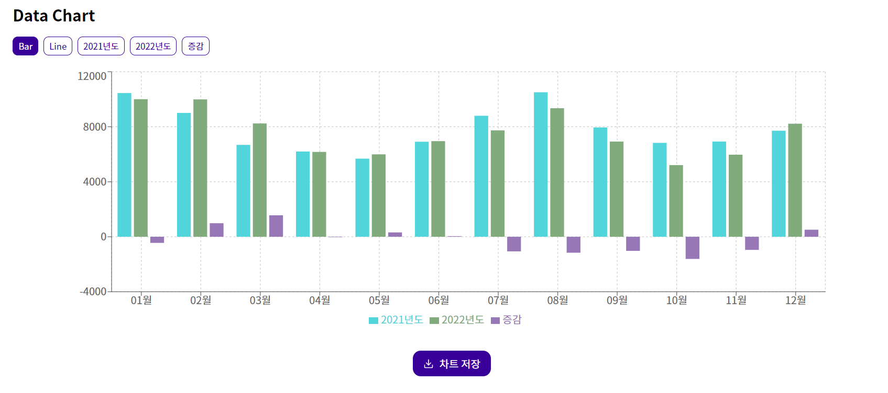
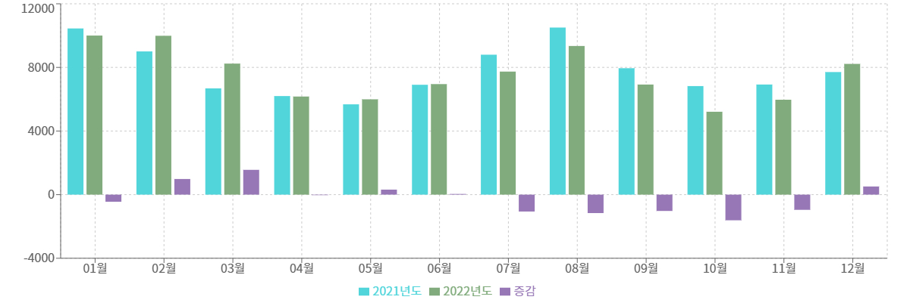

코드리뷰는 ChatGPT의 도움을 받았습니다.

프로젝트 repository: https://github.com/LifeIsAlone/DataVisualize

원글: [노션](https://www.notion.so/cc31cadf9cab47e4b37e098a6a8a677b?pvs=21)

# 개선할 사항들

- [x] csv 파일 리딩 코드 고치기
- [x] 데이터 키(어트리뷰트) 토글 방식 바꾸기
  - 현재 array의 마지막에 넣고 있음 → 데이터를 넣었다 빼면 색깔이 달라져서 차트를 볼 때 헷갈린다.
  - 오브젝트를 이용해서 `isShown: false` 와 같은 boolean 프로퍼티를 넣어서 고쳐볼 생각
- [x] 컬러 셋 개수가 적을 수도 있겠다는 생각이 듦
- [x] 캡쳐해서 저장하는 기능 추가하기
- [x] 반응형으로 바꾸기
- [x] 중간에 다른 파일 넣었을 때 제대로 작동하게 하기 → 전역 상태
- [ ] 차트 종류 늘리기
- [ ] 데이터 양식 문제에 대한 고민…

# 리팩토링

## 23.04.09

### 1. Context API 도입

```jsx
import { createContext, useState } from "react";

export const ChartContext = createContext({
  input: [],
  setInput: data => {},
});

const ChartProvider = ({ children }) => {
  const [input, setInput] = useState([]);

  const saveInput = data => {
    setInput(data);
  };

  const chartContext = {
    input,
    setInput: saveInput,
  };

  return (
    <ChartContext.Provider value={chartContext}>
      {children}
    </ChartContext.Provider>
  );
};

export default ChartProvider;
```

입력 받은 CSV 파일이 여러 컴포넌트에 영향을 미치기 때문에 전역 상태로 관리하였다.

### 2. 데이터 키(어트리뷰트) 토글 방식 & 키 상태 구조 바꾸기

기존의 코드는 이러했다.

```jsx
const handleKeys = index => {
  if (isActive(index)) {
    const newKeys = activeKeys.filter(item => item !== chartKeys[index]);
    setActiveKeys(newKeys);
  } else {
    setActiveKeys([...activeKeys, chartKeys[index]]);
  }
};
```

이 코드의 문제점은 키를 on 했다가 off하고 다시 on하면 맨 끝에 추가되므로 보기 헷갈려진다.

예를 들어 [사과], [바나나], [키위] 중 [사과], [키위]를 선택했다가 [사과]를 다시 눌러 해제하면 [키위]만 선택되는데 여기서 다시 [사과]를 선택하면 [키위, 사과]가 되면서 차트를 보는 데 헷갈려진다.

이를 해결하기 위해서 키의 상태 구조를 다음과 같이 바꾸었다.

```jsx
{
    name: chartKey,
    activated: false,
    color: randomColorGenerator(),  // 랜덤 컬러를 생성하는 함수
}
```

키를 토글 시

```jsx
const handleKeys = index => {
  const newChartData = [...chartData];
  newChartData[index] = {
    ...newChartData[index],
    activated: !newChartData[index].activated,
  };
  const newActivatedKeys = newChartData.filter(chartKey => chartKey.activated);
  setChartData(newChartData);
  setActiveKeys(newActivatedKeys);
};
```

activated를 반전하여 표시 상태를 바꾸기로 했다.

### 3. 랜덤 컬러 생성

기존 차트의 컬러를 쓰는 방식은 이러했다.

```jsx
const colorSet = [
  "#4cc9f0",
  "#ffb703",
  "#06d6a0",
  "#560bad",
  "#d62828",
  "#f15bb5",
  "#4361ee",
  "#99d98c",
  "#5e548e",
  "#403d39",
];
```

색 10개가 들어있는 컬러셋에서 썼다.

사실 그냥… 키가 10개가 넘지 않을거라는 가정하에 생각한 것이었다. 왜냐하면 랜덤 컬러로 지정하는 경우 흰색이 나오거나 보기 불편한 색이 나오는 것을 방지하기 위함이었다.

키가 많을 경우를 고려하여 다시 랜덤 컬러코드를 생성하는 코드를 사용했다.

```jsx
function randomColorGenerator() {
  let color = "#";

  for (let i = 0; i < 3; i++) {
    color += Math.floor(Math.random() * 127 + 128).toString(16);
  }

  return color;
}
```

일단 이렇게 작성하여 너무 어두운 색이 안 나오도록 했는데 너무 밝은 색이 나와서 보기 힘들 경우가 해결되지 않는다. 다시 고쳐야 할 것 같다.

### ChatGPT의 코드리뷰

1. `makeData` 함수를 더 간결하게 작성할 것
2. `randomColorGenerator` \*\*\*\*함수를 고칠 것
   1. “반환된 컬러가 흰색인 경우 텍스트 색상과 충돌하여 버튼의 텍스트를 알아보기 어려울 수 있습니다.”
3. `handleKeys` 함수를 더 간결하게 작성할 것
4. `handleChartMode` 함수 - 굳이 변수 쓰지 않기
5. 공통 스타일을 CSS 함수로 만들어 재사용하기

---

## 23.04.10

### 1. 코드 리뷰를 기반으로 코드 고치기

- randomColorGenerator 함수

```jsx
function randomColorGenerator() {
  let color = "#";

  for (let i = 0; i < 3; i++) {
    color += Math.floor(Math.random() * 127 + 128).toString(16);
  }

  return color;
}
```

이 코드의 문제점은 너무 밝은 색을 생성해낼 수 있고 비슷한 색을 생성할 확률이 높다는 것이다.

조금 더 다양한 색을 생성해낼 수 있도록 HSL 방식을 이용하였다.

```jsx
function randomColorGenerator() {
  const hue = Math.floor(Math.random() * 360);
  const saturation = Math.floor(Math.random() * 100);
  const lightness = Math.floor(Math.random() * 20 + 50);
  return `hsl(${hue}, ${saturation}%, ${lightness}%)`;
}
```

여기서도 너무 밝은 색을 생성하지 않도록 lightness 값을 조절하였다.

- handleKeys → toggleActivation

함수의 역할을 더 직관적으로 이해할 수 있도록 함수 이름을 바꿨다.

```jsx
const handleKeys = index => {
  const newChartData = [...chartData];
  newChartData[index] = {
    ...newChartData[index],
    activated: !newChartData[index].activated,
  };
  const newActivatedKeys = newChartData.filter(chartKey => chartKey.activated);
  setChartData(newChartData);
  setActiveKeys(newActivatedKeys);
};
```

위 코드를

```jsx
const toggleActivation = index => {
  const updatedChartData = chartData.map((data, i) => {
    if (i !== index) return data;
    return {
      ...data,
      activated: !data.activated,
    };
  });

  const activatedKeys = updatedChartData.filter(data => data.activated);

  setChartData(updatedChartData);
  setActiveKeys(activatedKeys);
};
```

이렇게 고쳤다. 그런데 사실 고쳐야만하는 이유는 잘 모르겠다. 다시 코드리뷰를 시키니까 이전 코드 형식으로 바꾸라고 하기도 했다..😅

### 2. PapaParse 라이브러리로 csv 파일 파싱

```jsx
function readFile(e) {
  return new Promise((resolve, reject) => {
    const reader = new FileReader();
    reader.onload = function () {
      const data = Papa.parse(reader.result, {
        header: true, // 첫 번째 행을 헤더로 사용
        dynamicTyping: true, // 숫자 자동 변환
        encoding: "EUC-KR", // 인코딩 설정
      }).data;

      resolve(data);
    };
    reader.onerror = reject;
    reader.readAsText(e.target.files[0], "EUC-KR");
  });
}
```

PapaParse 라이브러리가 기존의 makeData 함수가 해주던 일을 해준다.

따라서 DataView, DataChart 컴포넌트도 그에 맞게 변경해주었다. makeData 함수는 제거했다.

[코드](https://github.com/LifeIsAlone/DataVisualize/commit/1bce0af3e33bef0ec9e05a9c491b5211e18f2424)

### 3. 차트 이미지 다운로드

`dom-to-image` 라이브러리를 사용하여 차트의 이미지를 다운로드할 수 있도록 했다.


```jsx
const saveChartImage = () => {
  domtoimage
    .toJpeg(document.querySelector(".recharts-wrapper"))
    .then(function (dataUrl) {
      const link = document.createElement("a");
      link.download = "my-chart-image.jpeg";
      link.href = dataUrl;
      link.click();
    })
    .catch(function (error) {
      console.error("oops, something went wrong!", error);
    });
};
```

### 발견한 버그

- csv 파싱 중 마지막에 null 요소가 들어가는 문제 → csv 파일의 마지막 줄에 CRLF가 있는 경우인 듯 함
  - FileReader로 파일을 읽고 trim() 함수를 돌려 해결
- 차트 이미지 저장 시 배경색 → option `bgColor`로 조정

### 다음에 할 것

- 저장 버튼 옮기기
- 반응형 구현하기

---

## 23.04.14

### 1. 저장 버튼 옮기기



이미지 저장 버튼을 차트 아래로 옮김

### 2. 차트 이미지 저장 시 배경색 변경


이미지 아래에 검은색 줄이 생김

- 캡쳐 옵션을 사용하지 않고 엘리먼트의 css 스타일을 변경했더니 생긴 문제

```jsx
const saveChartImage = () => {
  domtoimage
    .toJpeg(document.querySelector(".recharts-wrapper"), { bgcolor: "white" })
    .then(function (dataUrl) {
      const link = document.createElement("a");
      link.download = "my-chart-image.jpeg";
      link.href = dataUrl;
      link.click();
    })
    .catch(function (error) {
      console.error("oops, something went wrong!", error);
    });
};
```

`{ bgcolor: 'white' }`를 이용하여 수정

- 변경 결과
  

docs를 잘 확인하자…

### 3. 반응형 디자인으로 바꾸기

- pc & tablet


- phone


기존의 코드는 디바이스를 고려하지 않은 코드였다.

이를 반응형으로 바꾸었다.

[코드](https://github.com/LifeIsAlone/DataVisualize/commit/742bf3fc61494c8709a07f044b22dac1f4238528)

### 4. 캡쳐 옵션 변경

```jsx
const saveChartImage = () => {
  const element = document.querySelector(".recharts-wrapper");

  // 항상 1500px width로 캡쳐하기 위함
  const width = 1500;
  const ratio = width / element.clientWidth;

  domtoimage
    .toJpeg(element, {
      bgcolor: "white",
      width: element.clientWidth * ratio,
      height: element.clientHeight * ratio,
      style: { transform: `scale(${ratio})`, "transform-origin": "top left" },
    })
    .then(function (dataUrl) {
      const link = document.createElement("a");
      link.download = "my-chart-image.jpeg";
      link.href = dataUrl;
      link.click();
    })
    .catch(function (error) {
      console.error("oops, something went wrong!", error);
    });
};
```

항상 이미지를 1500px의 가로 크기로 저장하도록 설정

모바일에서는 유용하지 않을 듯하다… 왜냐하면 차트가 너무 작아져서 x축 요소들이 생략되기 때문


모바일 디바이스에서 차트에 비해 글씨가 너무 크다.
