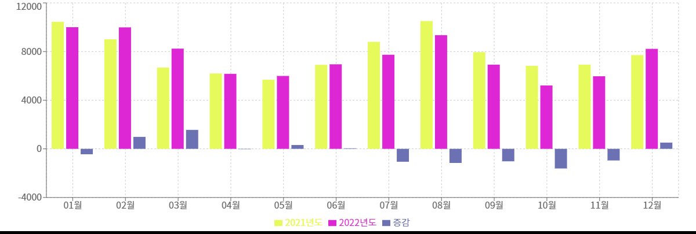
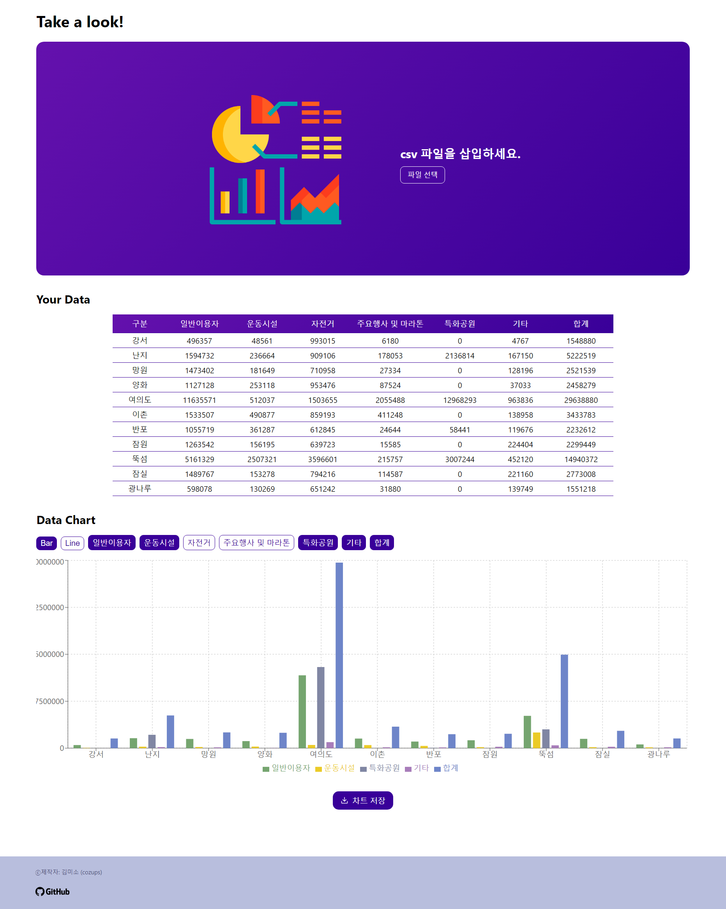
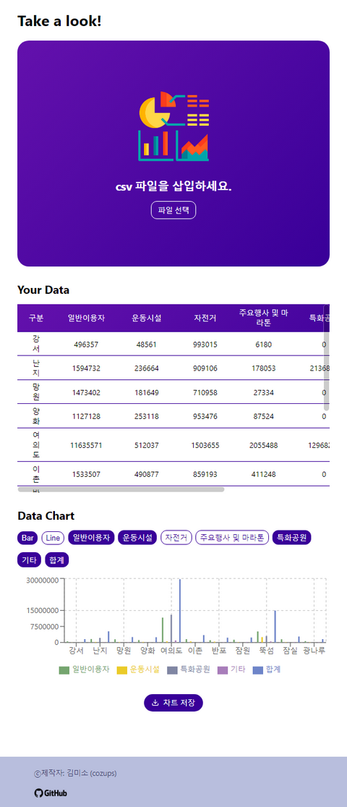

# Project Repository

https://github.com/LifeIsAlone/DataVisualize

# 개선할 사항들

- csv 파일 리딩 코드 수정 - PapaParse 라이브러리 사용
- 데이터 키(어트리뷰트) 토글 방식 변경
- 현재 array의 마지막에 삽입 방식 → 데이터를 넣었다 빼면 색깔이 달라져 차트를 볼 때 헷갈린다.
- 오브젝트를 이용해서 `activated: false` 와 같은 boolean 프로퍼티를 설정하여 관리
- 컬러 셋 하드코딩 → 랜덤 컬러 생성 함수 사용
- 차트 이미지 다운로드 기능 추가
- 반응형 디자인
- 중간에 다른 파일 넣었을 때 제대로 작동하게 하기 → 전역 상태

# 1. csv 파일 파싱 방식 변경 - PapaParse 라이브러리

```jsx
const handleFileRead = e => {
  const file = e.target.files[0];

  Papa.parse(file, {
    header: true, // 첫 번째 행을 헤더로 사용
    dynamicTyping: true, // 숫자 자동 변환
    encoding: "EUC-KR", // 인코딩 설정
    skipEmptyLines: true,
    complete: result => {
      chartCtx.setInput(result.data);
    },
  });
};
```

직접 csv를 파싱하는 코드를 작성했었지만 가독성이 좋지 않고 여러 가지 연산을 config를 설정하여 효율적으로 연산할 수 있는 PapaParse 라이브러리를 사용하게 되었다.

# 2. CSV 데이터 전역 상태 공유

```jsx
import { createContext, useState } from "react";

export const ChartContext = createContext({
  input: [],
  setInput: data => {},
});

const ChartProvider = ({ children }) => {
  const [input, setInput] = useState([]);

  const saveInput = data => {
    setInput(data);
  };

  const chartContext = {
    input,
    setInput: saveInput,
  };

  return (
    <ChartContext.Provider value={chartContext}>
      {children}
    </ChartContext.Provider>
  );
};

export default ChartProvider;
```

```js
// src/index.js

import React from "react";
import ReactDOM from "react-dom/client";
import "./index.css";
import App from "./App";
import reportWebVitals from "./reportWebVitals";
import ChartProvider from "./store/ChartProvider";

const root = ReactDOM.createRoot(document.getElementById("root"));
root.render(
  <React.StrictMode>
    <ChartProvider>
      <App />
    </ChartProvider>
  </React.StrictMode>
);

// If you want to start measuring performance in your app, pass a function
// to log results (for example: reportWebVitals(console.log))
// or send to an analytics endpoint. Learn more: https://bit.ly/CRA-vitals
reportWebVitals();
```

입력 받은 CSV 파일을 여러 컴포넌트에서 사용할 수 있도록 Context API를 이용하여 전역 상태로 관리하였다.

# 3. 데이터 키(차트 어트리뷰트) 토글 방식 & 키 상태 구조 변경

기존의 코드는 이러했다.

```jsx
const handleKeys = index => {
  if (isActive(index)) {
    const newKeys = activeKeys.filter(item => item !== chartKeys[index]);
    setActiveKeys(newKeys);
  } else {
    setActiveKeys([...activeKeys, chartKeys[index]]);
  }
};
```

이 코드는 isActive(index)가 true인 경우, 이미 활성화 된 키를 비활성화 하고 그렇지 않은 경우에는 키를 활성화하는 토글 함수이다. 활성화 여부는 activeKeys 배열에 키가 포함되어 있는지 확인한다.

이 코드의 문제점은 키를 on 했다가 off하고 다시 on하면 맨 끝에 추가되므로 보기 헷갈려진다.
예를 들어 [사과], [바나나], [키위] 중 [사과], [키위]를 선택했다가 [사과]를 다시 눌러 해제하면 [키위]만 선택되는데 여기서 다시 [사과]를 선택하면 [키위, 사과]가 되면서 차트를 보는 데 헷갈려진다.

이를 해결하기 위해서 활성화 된 키를 배열의 요소로 다루기보다 키 구조를 다음과 같이 객체로 바꾸어 관리하였다.

```jsx
{
    name: chartKey,
    activated: false,
    color: randomColorGenerator(),  // 랜덤 컬러를 생성하는 함수
}
```

배열에 키를 넣었다 뺐다 하기보다 activated 플래그를 확인하여 다루는 방식으로 변경하였다.

키를 토글 시

```jsx
const toggleActivation = index => {
  const updatedChartKey = chartKey.map((data, i) => {
    if (i !== index) return data;
    return {
      ...data,
      activated: !data.activated,
    };
  });

  const activatedKeys = updatedChartKey.filter(data => data.activated);

  setchartKey(updatedChartKey);
  setActiveKeys(activatedKeys);
};
```

activated를 반전하여 활성화 여부를 토글한다.

# 4. 랜덤 컬러 생성

기존 차트의 컬러를 쓰는 방식은 색 10개가 들어있는 컬러셋을 하드코딩하여 사용했다.

```jsx
const colorSet = [
  "#4cc9f0",
  "#ffb703",
  "#06d6a0",
  "#560bad",
  "#d62828",
  "#f15bb5",
  "#4361ee",
  "#99d98c",
  "#5e548e",
  "#403d39",
];
```

랜덤 컬러로 지정하는 경우 흰색이 나오거나 보기 불편한 색이 나오는 것을 방지하기 위함이었다.
키가 많을 경우를 고려하여 다시 랜덤 컬러 코드를 생성하는 코드를 사용했다.

```jsx
function randomColorGenerator() {
  const hue = Math.floor(Math.random() * 360);
  const saturation = Math.floor(Math.random() * 100);
  const lightness = Math.floor(Math.random() * 20 + 50);
  return `hsl(${hue}, ${saturation}%, ${lightness}%)`;
}
```

조금 더 다양한 색을 생성해낼 수 있도록 HSL 방식을 이용하였고 너무 밝은 색을 생성하는 경우 차트의 배경색이 흰색이므로 구분이 가지 않을 수 있어 lightness 값을 조절하였다.

# 5. 차트 이미지 다운로드

`dom-to-image` 라이브러리를 사용하여 차트의 이미지를 다운로드할 수 있도록 했다.



```jsx
const saveChartImage = () => {
  const element = document.querySelector(".recharts-wrapper");

  // 항상 1500px width로 캡쳐하기 위함
  const width = 1500;
  const ratio = width / element.clientWidth;

  domtoimage
    .toJpeg(element, {
      bgcolor: "white",
      width: element.clientWidth * ratio,
      height: element.clientHeight * ratio,
      style: { transform: `scale(${ratio})`, "transform-origin": "top left" },
    })
    .then(function (dataUrl) {
      const link = document.createElement("a");
      link.download = "my-chart-image.jpeg";
      link.href = dataUrl;
      link.click();
    })
    .catch(function (error) {
      console.error("oops, something went wrong!", error);
    });
};
```

항상 이미지를 1500px의 가로 크기로 저장하도록 설정하였다.

모바일에서는 유용하지 않을 듯하다. 디바이스가 작아지는 경우 차트가 너무 작아져서 x축 요소들이 생략되고 모바일 디바이스에서 차트에 비해 글씨가 너무 커져 적절한 view가 나오지 않는다.


# 6. 반응형 디자인으로 바꾸기

- pc & tablet



- phone



기존의 코드는 디바이스를 고려하지 않은 코드였다.
이를 반응형으로 바꾸었다.

[코드](https://github.com/LifeIsAlone/DataVisualize/commit/742bf3fc61494c8709a07f044b22dac1f4238528)

# 더 고민해야 할 사항들

- 차트 종류 늘리기
- 데이터 양식 문제에 대한 고민
