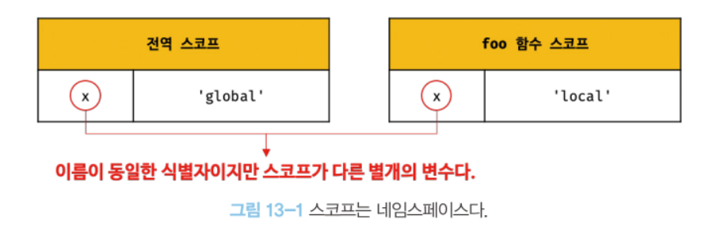
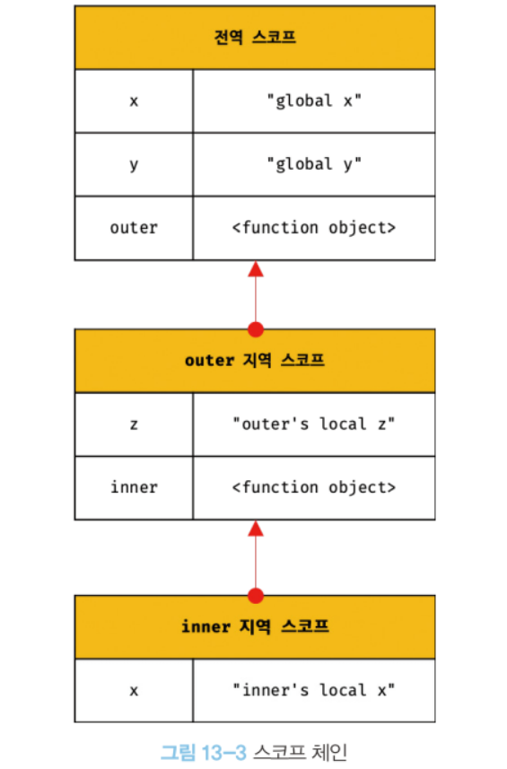

# 스코프란?

스코프는 **식별자가 유효한 범위**를 말한다.

모든 식별자(변수 이름, 함수 이름, 클래스 이름 등)은 자신이 선언된 위치에 의해 다른 코드가 식별자 자신을 참조할 수 있는 유효 범위가 결정된다.

- 식별자 결정: 어떤 변수를 참조해야 할 것인지를 결정하는 것
- 렉시컬 환경: “코드가 어디서 실행되며 주변에 어떤 코드가 있는지”
  - 코드의 문맥은 렉시컬 환경으로 이루어진다.

```jsx
var x = "global";

function foo() {
  var x = "local";
  console.log(x); // ①
}

foo();

console.log(x); // ②
```



- **스코프는 식별자인 변수 이름의 충돌을 방지하여 같은 이름의 변수를 사용할 수 있게 한다.**
  - 식별자는 어떤 값을 구별하여 식별해낼 수 있는 고유한 이름을 말한다.
  - 따라서 하나의 값은 유일한 식별자에 연결되어야 한다.
  - 예) 파일 이름은 유일해야 한다. 파일 이름을 중복해서 사용할 수 있는 이유는 폴더 개념이 존재하기 때문이다.
  - 즉, 다른 스코프에는 같은 이름의 식별자를 사용할 수 있다.

---

# 스코프의 종류

코드는 전역과 지역으로 구분되며,

변수는 자신이 선언된 위치에 의해 자신의 스코프가 결정된다.

## 전역과 전역 스코프

- 코드의 가장 바깥 영역
- 전역 스코프를 만든다.
- 전역 변수 - 어디서든 참조할 수 있다.

## 지역과 지역 스코프

- 함수 몸체 내부
- 지역 스코프를 만든다.
- 지역 변수 - 자신의 지역 스코프와 하위 지역 스코프에서 유효하다.

---

# 스코프 체인

함수는 중첩이 될 수 있으며 이는 곧 **스코프가 함수의 중첩에 의해 계층적 구조를 갖는다**는 의미를 갖는다.

```jsx
var x = "global x";
var y = "global y";

function outer() {
  var z = "outer's local z";

  console.log(x); // ① global x
  console.log(y); // ② global y
  console.log(z); // ③ outer's local z

  function inner() {
    var x = "inner's local x";

    console.log(x); // ④ inner's local x
    console.log(y); // ⑤ global y
    console.log(z); // ⑥ outer's local z
  }

  inner();
}

outer();

console.log(x); // ⑦ global x
console.log(z); // ⑧ ReferenceError: z is not defined
```

위 코드의 스코프의 계층 구조를 그림으로 나타내면



스코프는 하나의 계층적 구조로 연결되며, 모든 지역 스코프의 최상위 스코프는 전역 스코프다.

이렇게 스코프가 계층적으로 연결된 것을 **스코프 체인**이라고 한다.

자바스크립트 엔진은 스코프 체인을 통해 변수를 참조하는 코드의 스코프에서 시작하여 **상위 스코프 방향으로 이동하면서 선언된 변수를 검색**한다.

**렉시컬 환경**

- 자바스크립트 엔진은 코드를 실행하기에 앞서 렉시컬 환경을 실제로 생성한다.
- 스코프 체인은 실행 컨텍스트의 렉시컬 환경을 단방향으로 연결한 것이다.
- 전역 렉시컬 환경은 코드가 로드되면 곧바로 생성되고 함수 렉시컬 환경은 함수가 호출되면 곧바로 생성된다.

## 스코프 체인에 의한 변수 검색

```jsx
var x = "global x";
var y = "global y";

function outer() {
  var z = "outer's local z";

  console.log(x); // ① global x
  console.log(y); // ② global y
  console.log(z); // ③ outer's local z

  function inner() {
    var x = "inner's local x";

    console.log(x); // ④ inner's local x
    console.log(y); // ⑤ global y
    console.log(z); // ⑥ outer's local z
  }

  inner();
}

outer();

console.log(x); // ⑦ global x
console.log(z); // ⑧ ReferenceError: z is not defined
```

- 검색 과정
  - ④ x 변수를 참조하는 코드의 스코프인 inner 함수의 지역 스코프에서 x 변수가 선언되었는지 검색한다.
  - ⑤ y 변수를 참조하는 코드의 스코프인 inner 함수의 지역 스코프에서 y 변수가 선언되었는지 검색한다.
    - 존재하지 않으므로 상위 스코프인 outer 함수의 지역 스코프로 이동하여 검색한다.
    - 존재하지 않으므로 상위 스코프인 전역 스코프로 이동하여 검색한다.
  - ⑥ z 변수를 참조하는 코드의 스코프인 inner 함수의 지역 스코프에서 z 변수가 선언되었는지 검색한다.
    - 존재하지 않으므로 상위 스코프인 outer 함수의 지역 스코프로 이동하여 검색한다.

자바스크립트 엔진은 스코프 체인을 따라 변수를 참조하는 코드의 스코프에서 시작해서 **상위 스코프 방향으로 이동하며 선언된 변수를 검색**한다.

⇒ 하위 스코프에서 상위 스코프 변수 참조 가능

⇒ 상위 스코프에서 하위 스코프 변수 참조 불가능

## 스코프 체인에 의한 함수 검색

```jsx
// 전역 함수
function foo() {
  console.log("global function foo");
}

function bar() {
  // 중첩 함수
  function foo() {
    console.log("local function foo");
  }

  foo(); // ①
}

bar();
```

- 함수 선언문으로 함수를 정의하면 런타임 이전에 함수 객체가 먼저 생성된다.
- 함수 이름과 동일한 이름의 식별자를 암묵적으로 선언하고 생성된 함수 객체를 할당한다.
- 함수도 식별자에 할당되기 때문에 스코프를 갖는다.

---

# 함수 레벨 스코프

- 블록 레벨 스코프
  - 함수 몸체만이 아니라 모든 코드 블록(if, for, while, try/catch 등)이 지역 스코프를 만드는 것
  - let, const 키워드로 선언된 변수
- 함수 레벨 스코프
  - 오로지 함수의 코드 블록(함수 몸체)만을 지역 스코프로 인정하는 것
  - var 키워드로 선언된 변수

```jsx
var x = 1;

if (true) {
  // var 키워드로 선언된 변수는 함수의 코드 블록(함수 몸체)만을 지역 스코프로 인정한다.
  // 함수 밖에서 var 키워드로 선언된 변수는 코드 블록 내에서 선언되었다 할지라도 모두 전역 변수다.
  // 따라서 x는 전역 변수다. 이미 선언된 전역 변수 x가 있으므로 x 변수는 중복 선언된다.
  // 이는 의도치 않게 변수 값이 변경되는 부작용을 발생시킨다.
  var x = 10;
}

console.log(x); // 10
```

```jsx
var i = 10;

// for 문에서 선언한 i는 전역 변수다. 이미 선언된 전역 변수 i가 있으므로 중복 선언된다.
for (var i = 0; i < 5; i++) {
  console.log(i); // 0 1 2 3 4
}

// 의도치 않게 변수의 값이 변경되었다.
console.log(i); // 5
```

---

# 렉시컬 스코프

```jsx
var x = 1;

function foo() {
  var x = 10;
  bar();
}

function bar() {
  console.log(x);
}

foo(); // ?
bar(); // ?
```

- 동적 스코프
  - 함수를 어디서 호출했는지에 따라 함수의 상위 스코프가 결정된다.
  - 함수가 정의되는 시점에 함수가 어디서 호출될 지 알 수 없어 함수가 호출되는 시점에 동적으로 상위 스코프를 결정해야 하기 때문
- 렉시컬 스코프 (정적 스코프)
  - 함수를 어디서 정의했는지에 따라 함수의 상위 스코프가 결정된다.

자바스크립트는 렉시컬 스코프를 따른다.

함수 정의 (함수 선언문 또는 함수 표현식)가 실행되어 생성된 함수 객체는 상위 스코프를 기억한다.

위 코드의 결과는…

- 렉시컬 스코프를 따르므로 foo, bar의 상위 스코프는 전역 스코프이다.
- 따라서 1, 1이 출력된다.
