# 소스코드의 타입

ECMAScript 사양은 소스코드를 4가지 (전역 코드, 함수 코드, eval 코드, 모듈 코드)로 구분한다.

소스코드의 타입에 따라 실행 컨텍스트를 생성하는 과정과 관리 내용이 다르다.

- 전역 코드
  - 전역 변수를 관리하기 위해 최상위 스코프인 전역 스코프를 생성
  - 전역 변수와 전역 함수를 전역 객체의 프로퍼티와 메서드로 바인딩하고 참조하기 위해 전역 객체와 연결해야 한다.
  - 전역 코드가 평가되면 **전역 실행 컨텍스트**가 생성된다.
- 함수 코드
  - 지역 스코프를 생성하고 지역 변수, 매개변수, arguments 객체를 관리
  - 생성한 지역 스코프를 전역 스코프에서 시작하는 스코프 체인의 일원으로 연결해야 한다.
  - 함수 코드가 평가되면 **함수 실행 컨텍스트**가 생성된다.
- eval 코드
  - strict mode에서 자신만의 독자적인 스코프를 생성한다.
  - eval 코드가 평가되면 **eval 실행 컨텍스트**가 생성된다.
- 모듈 코드
  - 모듈별로 독립적인 모듈 스코프를 생성한다.
  - 모듈 코드가 평가되면 **모듈 실행 컨텍스트**가 생성된다.

---

# 소스코드의 평가와 실행

모든 소스코드는 실행에 앞서 평가 과정을 거치며 코드를 실행하기 위한 준비를 한다.

- 소스코드의 평가
  - 실행 컨텍스트를 생성
  - 변수, 함수 등의 선언문만 먼저 실행하여 생성된 변수나 함수 식별자를 키로 실행 컨텍스트가 관리하는 스코프(렉시컬 환경의 환경 레코드)에 등록한다.
- 소스코드의 실행
  - 선언문을 제외한 소스코드가 순차적으로 실행
  - 소스코드 실행에 필요한 변수나 함수의 참조를 실행 컨텍스트가 관리하는 스코프에서 검색해서 취득
  - 소스코드의 실행 결과는 다시 실행 컨텍스트가 관리하는 스코프에 등록된다.

```jsx
var x;
x = 1;
```

- 소스코드 평가
  - `var x;` 먼저 실행 → 스코프에 등록, undefined 초기화
    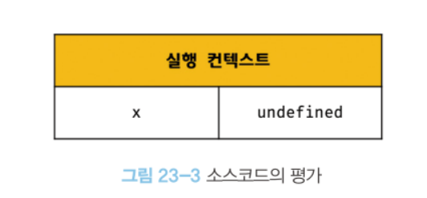
- 소스코드 실행
  - `x = 1;` 실행하기 위해 x가 선언된 변수인지 확인
  - 실행 컨텍스트가 관리하는 스코프에 x 변수가 등록되었는지 확인
  - 선언된 변수라면 값을 할당하고 결과를 실행 컨텍스트에 등록하여 관리한다.
    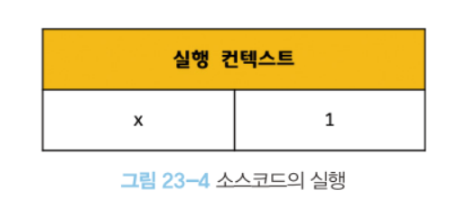

---

# 실행 컨텍스트의 역할

```jsx
// 전역 변수 선언
const x = 1;
const y = 2;

// 함수 정의
function foo(a) {
  // 지역 변수 선언
  const x = 10;
  const y = 20;

  // 메서드 호출
  console.log(a + x + y); // 130
}

// 함수 호출
foo(100);

// 메서드 호출
console.log(x + y); // 3
```

1. 전역 코드 평가
   - 전역 코드의 변수 선언문과 함수 선언문이 먼저 실행
   - 전역 변수와 전역 함수가 실행 컨텍스트가 관리하는 전역 스코프에 등록
2. 전역 코드 실행
   - 전역 변수에 값이 할당되고 함수가 호출됨
   - 함수가 호출되면 전역 코드의 실행을 멈추고 코드 실행 순서를 바꾸어 함수 내부로 진입
3. 함수 코드 평가
   - 매개변수와 지역 변수 선언문이 먼저 실행
   - 매개변수와 지역 변수가 실행 컨텍스트가 관리하는 지역 스코프에 등록
   - arguments 객체가 생성되어 지역 스코프에 등록
   - this 바인딩
4. 함수 코드 실행
   - 매개변수와 지역 변수에 값 할당, console.log 호출
   - console.log를 호출하기 위해 console을 스코프 체인을 통해 검색 (전역 객체의 프로퍼티로 존재)
   - log 프로퍼티를 console 프로토타입 체인을 통해 검색
   - a + x + y를 평가하기 위해 a, x, y 식별자 스코프 체인을 통해 검색
   - console.log 실행이 종료되면 함수 코드의 실행 과정이 종료되고 다시 전역 코드 실행

<aside>
💡 <strong>실행 컨텍스트</strong>는 소스 코드를 실행하는 데 필요한 환경을 제공하고 코드의 실행 결과를 실제로 관리하는 영역이다.

**식별자**(변수, 함수, 클래스 등의 이름)을 등록하고 관리하는 **스코프**와 **코드 실행 순서 관리**를 구현한 내부 메커니즘이다.

</aside>

식별자와 스코프는 실행 컨텍스트의 **렉시컬 환경**으로 관리하고, 코드 실행 순서는 **실행 컨텍스트 스택**으로 관리한다.

---

# 실행 컨텍스트 스택

```jsx
const x = 1;

function foo() {
  const y = 2;

  function bar() {
    const z = 3;
    console.log(x + y + z);
  }
  bar();
}

foo(); // 6
```

위 코드는 전역 실행 컨텍스트와 함수 실행 컨텍스트를 생성한다.

생성된 실행 컨텍스트는 스택 자료구조로 관리된다.

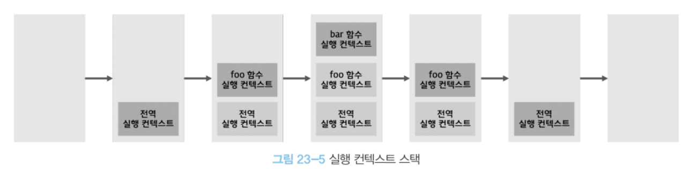

실행 컨텍스트 스택의 최상위에 존재하는 실행 컨텍스트는 언제나 현재 실행중인 코드의 실행 컨텍스트다.

---

# 렉시컬 환경

식별자와 식별자에 바인딩된 값, 상위 스코프에 대한 참조를 기록하는 자료구조로 실행 컨텍스트를 구성하는 컴포넌트다.

렉시컬 환경은 스코프와 식별자를 관리한다.

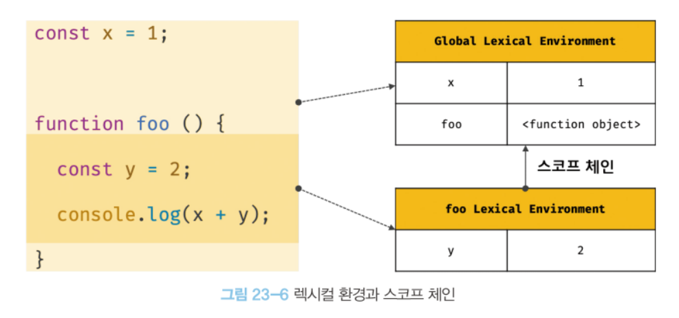

실행 컨텍스트는 LexicalEnvironment 컴포넌트와 VariableEnvironment 컴포넌트로 구성된다.

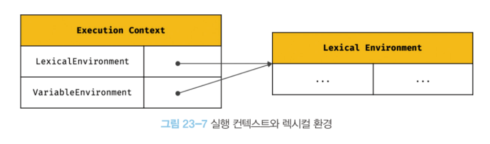

생성 초기에 LexicalEnvironment 컴포넌트와 VariableEnvironment 컴포넌트는 하나의 동일한 렉시컬 환경을 가리킨다.

그러나 상황에 따라 VariableEnvironment 컴포넌트를 위한 새로운 렉시컬 환경을 생성하고 LexicalEnvironment 컴포넌트의 내용과 달라지는 경우가 있다.

💡**VariableEnvironment**

- 현재 컨텍스트 내의 식별자들에 대한 정보 및 외부 환경 정보
- 선언 시점의 LexicalEnvironment의 snapshot으로, 변경 사항은 반영되지 않음
- 실행 컨텍스트를 생성할 때 VariableEnvironment에 정보를 먼저 담고 이를 복사해 LexicalEnvironment를 만들고 그 이후에는 LexicalEnvironment를 주로 활용함

렉시컬 환경은 환경 레코드 컴포넌트와 외부 렉시컬 환경에 대한 참조 컴포넌트로 구성된다.

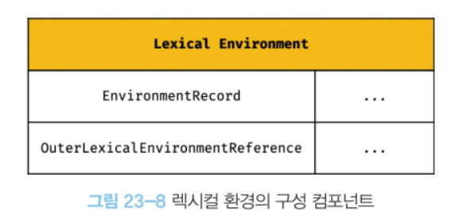

- 환경 레코드
  - 스코프에 포함된 식별자를 등록하고 등록된 식별자에 바인딩된 값을 관리하는 저장소
- 외부 렉시컬 환경에 대한 참조
  - 상위 스코프를 가리키는 컴포넌트
  - 외부 렉시컬 환경에 대한 참조를 통해 스코프 체인을 구현한다.

---

# 실행 컨텍스트의 생성과 식별자 검색 과정

```jsx
var x = 1;
const y = 2;

function foo(a) {
  var x = 3;
  const y = 4;

  function bar(b) {
    const z = 5;
    console.log(a + b + x + y + z);
  }
  bar(10);
}

foo(20); // 42
```

## 1. 전역 객체 생성

- 전역 객체는 전역 코드가 평가되기 이전에 생성된다.
  - 빌트인 전역 프로퍼티, 빌트인 전역 함수
  - 표준 빌트인 객체
  - Web API
  - 전역 객체도 Object.prototype 상속

## 2. 전역 코드 평가

### 1. 전역 실행 컨텍스트 생성

- 비어있는 전역 실행 컨텍스트를 생성하여 실행 컨텍스트 스택에 푸시

### 2. 전역 렉시컬 환경 생성

- 전역 렉시컬 환경을 생성하고 전역 실행 컨텍스트에 바인딩

1. 전역 환경 레코드 생성

   - 전역 스코프, 전역 객체의 빌트인 전역 프로퍼티, 빌트인 전역 함수, 표준 빌트인 객체 제공
   - var 키워드로 생성한 전역 변수와 let, const 키워드로 생성한 전역 변수를 구분하여 관리하기 위해 **객체 환경 레코드**와 **선언적 환경 레코드**로 구성

- 객체 환경 레코드
  - 전역 함수, 빌트인 전역 프로퍼티, 빌트인 전역 함수, 표준 빌트인 객체 관리
  - var 키워드로 선언한 전역 변수와 함수 선언문으로 정의된 전역 함수는 객체 환경 레코드에 연결된 BindingObject를 통해 전역 객체의 프로퍼티와 메서드가 된다.
  - 이것이 식별자(window)없이 전역 객체의 프로퍼티를 참조할 수 있는 매커니즘이다.
    - window.alert() ⇒ alert()
      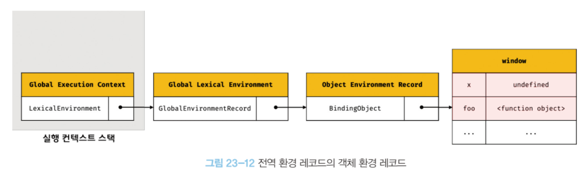
  - `var x`는 변수 호이스팅에 의해 undefined로 바인딩, `foo`는 생성된 함수 객체를 즉시 바인딩한다.
- 선언적 환경 레코드
  - let, const로 선언한 전역 변수를 등록하고 관리
  - let, const로 선언한 변수들은 전역 객체의 프로퍼티가 되지 않는다.
    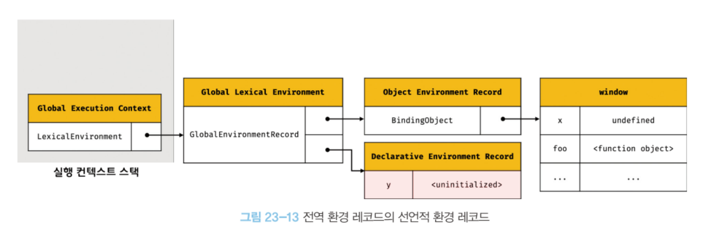
  - 변수 호이스팅에 의해 일시적 사각지대에 빠지기 때문에 <uninitialized>로 바인딩되고 이 경우에는 변수에 접근할 수 없다.

2. this 바인딩

   - 전역 환경 레코드의 [[GlobalThisValue]]에 this 바인딩
   - 일반적으로 전역 코드의 this는 전역 객체를 가리키므로 전역 객체 바인딩

   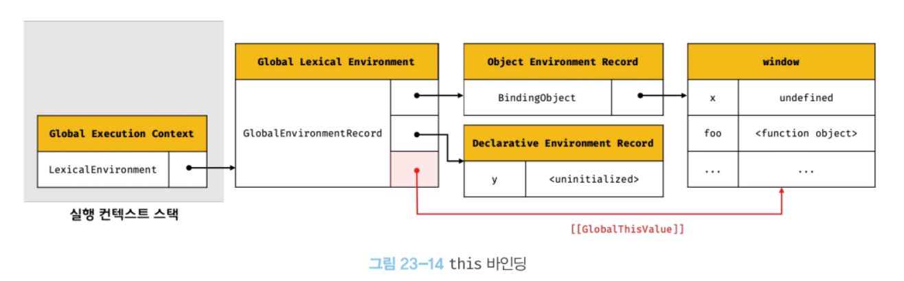

   - 객체 환경 레코드와 선언적 환경 레코드에는 this를 바인딩하는 내부 슬롯이 존재하지 않고 전역 환경 레코드와 함수 환경 레코드에만 존재한다.

3. 외부 렉시컬 환경에 대한 참조 결정

   - 외부 렉시컬 환경에 대한 참조는 상위 스코프를 가리키며 이를 통해 스코프 체인을 만든다.
   - 전역 코드를 포함하는 소스코드가 없으므로 null이 바인딩된다.

   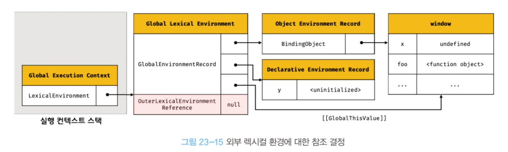

## 3. 전역 코드 실행

- 전역 코드가 순차적으로 실행
- 식별자를 검색할 때 실행 중인 실행 컨텍스트(최상위 실행 컨텍스트)에서 식별자를 검색하기 시작한다.
- 실행 중인 실행 컨텍스트에서 식별자를 검색할 수 없는 경우 외부 렉시컬 환경에 대한 참조가 가리키는 상위 스코프로 이동하여 검색한다.
- 전역 렉시컬 환경에서 검색할 수 없는 식별자는 참조 에러(ReferenceError)를 발생시킨다.

## 4. foo 함수 코드 평가

### 1. 함수 실행 컨텍스트 생성

- foo 함수 실행 컨텍스트를 생성하고 실행 컨텍스트 스택에 푸시

### 2. 함수 렉시컬 환경 생성

- foo 함수 렉시컬 환경을 생성하고 foo 함수 실행 컨텍스트에 바인딩

1. 함수 환경 레코드 생성

   - 매개변수, arguments 객체, 함수 내부의 지역 변수, 중첩 함수를 등록하고 관리

   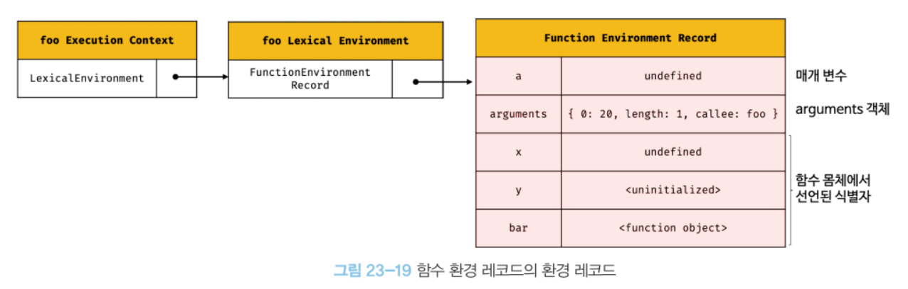

2. this 바인딩

   - 함수 환경 레코드의 [[ThisValue]] 내부 슬롯에 this 바인딩
   - this는 함수 호출 방식에 따라 결정되는데 foo 함수는 일반 함수로 호출되었으므로 전역 객체가 바인딩된다.

   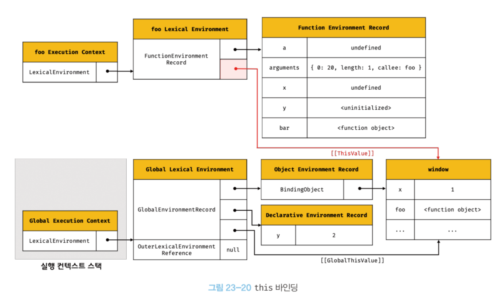

3. 외부 렉시컬 환경에 대한 참조 결정

   - foo 함수가 평가된 시점에 실행 중인 실행 컨텍스트의 렉시컬 환경의 참조가 할당된다.
   - foo 함수는 전역 코드의 평가 시점에 평가되므로 전역 렉시컬 환경의 참조가 할당된다.

   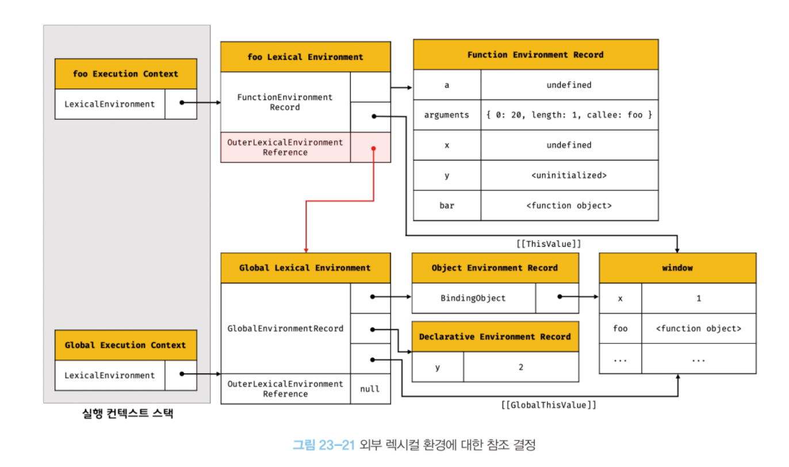

   - 함수 정의를 평가하여 함수 객체를 생성할 때 함수의 상위 스코프(실행 중인 실행 컨텍스트)를 함수의 내부 슬롯 [[Environment]]에 저장한다.
   - 함수 렉시컬 환경의 외부 렉시컬 환경에 대한 참조에 할당되는 것은 [[Environment]]에 저장된 렉시컬 환경에 대한 참조다.

## 5. foo 함수 코드 실행

- foo 함수의 소스 코드가 순차적으로 실행
- 렉시컬 환경에서 식별자를 검색하여 값 바인딩

## 6. bar 함수 코드 평가

- foo 코드 평가와 과정 동일
  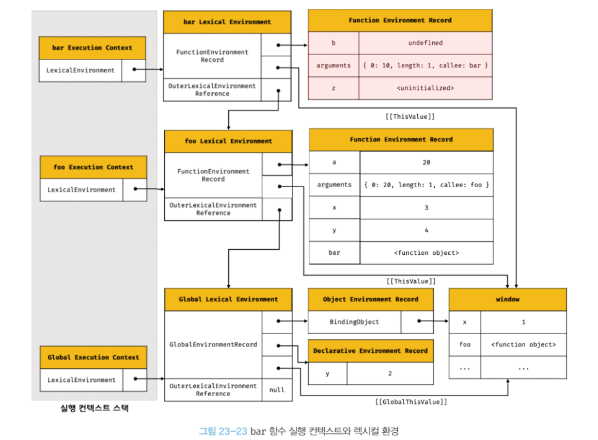

## 7. bar 함수 코드 실행

- bar 함수의 소스 코드 순차적으로 실행
- 매개변수에 인수 할당, 변수에 값 할당
- `console.log(a + b + x + y + z);` 실행
  - console 식별자 검색
    - 스코프 체인에서 검색
  - log 메서드 검색
    - console 객체의 프로토타입 체인을 통해 메서드 검색
  - 표현식 a + b + x + y + z의 평가
    - a, b, x, y, z 식별자 검색
  - console.log 메서드 호출

## 8. bar 함수 코드 실행 종료

- 더는 실행할 코드가 없으므로 실행이 종료된다.
- 실행 컨텍스트 스택에서 bar 함수 실행 컨텍스트가 제거된다.
- bar 함수 실행 컨텍스트가 제거되었다 해서 bar 함수 렉시컬 환경까지 즉시 소멸하는 것은 아니다.
- 누군가에 의해 참조되지 않을 때 가비지 컬렉터에 의해 소멸한다.

## 9. foo 함수 코드 실행 종료

- 더는 실행할 코드가 없으므로 실행이 종료된다.
- 실행 컨텍스트 스택에서 foo 함수 실행 컨텍스트가 제거된다.

## 10. 전역 코드 실행 종료

- 더는 실행할 코드가 없으므로 실행이 종료된다.
- 실행 컨텍스트 스택에서 전역 실행 컨텍스트가 제거된다.

---

# 실행 컨텍스트와 블록 레벨 스코프

- var 키워드로 선언한 변수는 함수 레벨 스코프,
- let, const 키워드로 선언한 변수는 블록 레벨 스코프를 따른다.

```jsx
let x = 1;

if (true) {
  let x = 10;
  console.log(x); // 10
}

console.log(x); // 1
```

- if 문이 실행되는 경우 if 문을 위한 블록 레벨 스코프를 생성하여야 한다.
- 이를 위해 선언적 환경 레코드를 갖는 렉시컬 환경을 새로 생성하여 기존의 렉시컬 환경을 교체한다.
- 외부 렉시컬 환경에 대한 참조는 if 문이 실행되기 이전의 전역 렉시컬 환경을 가리킨다.

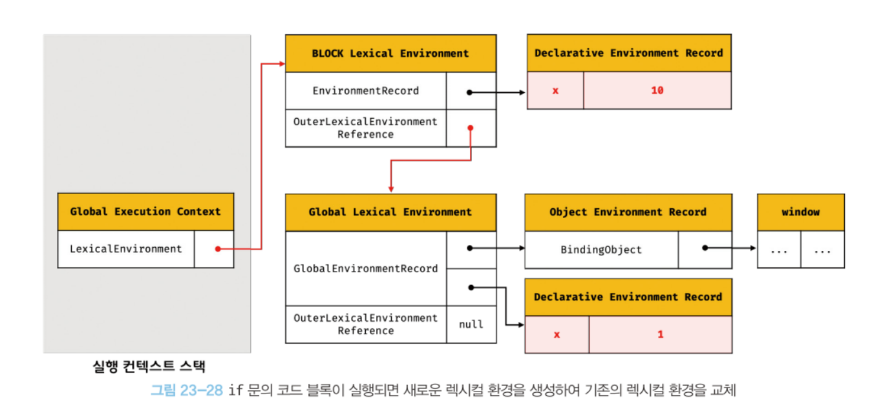

if 문의 코드 블록 실행이 종료되면 if 문의 코드 블록이 실행되기 이전의 렉시컬 환경으로 되돌린다.

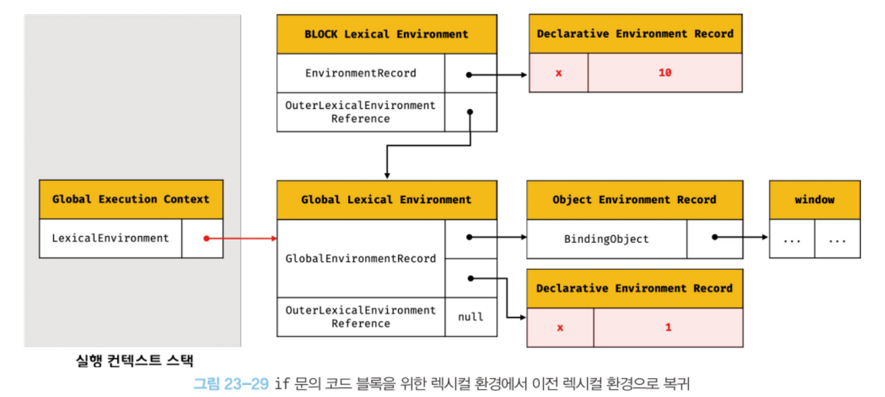

이는 블록 레벨 스코프를 사용하는 모든 블록문에 적용된다.

for 문의 변수 선언문에 let 키워드를 사용한 for문은 코드 블록이 반복해서 실행될 때마다 코드 블록을 위한 새로운 렉시컬 환경을 생성한다.
