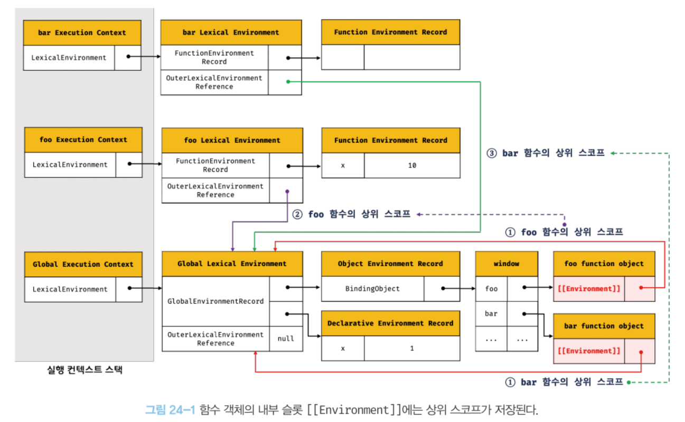
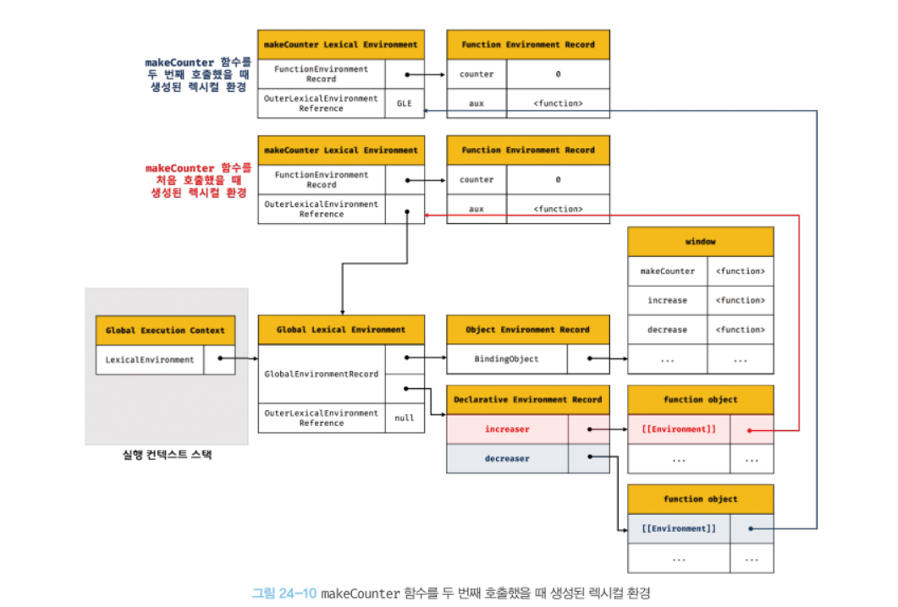
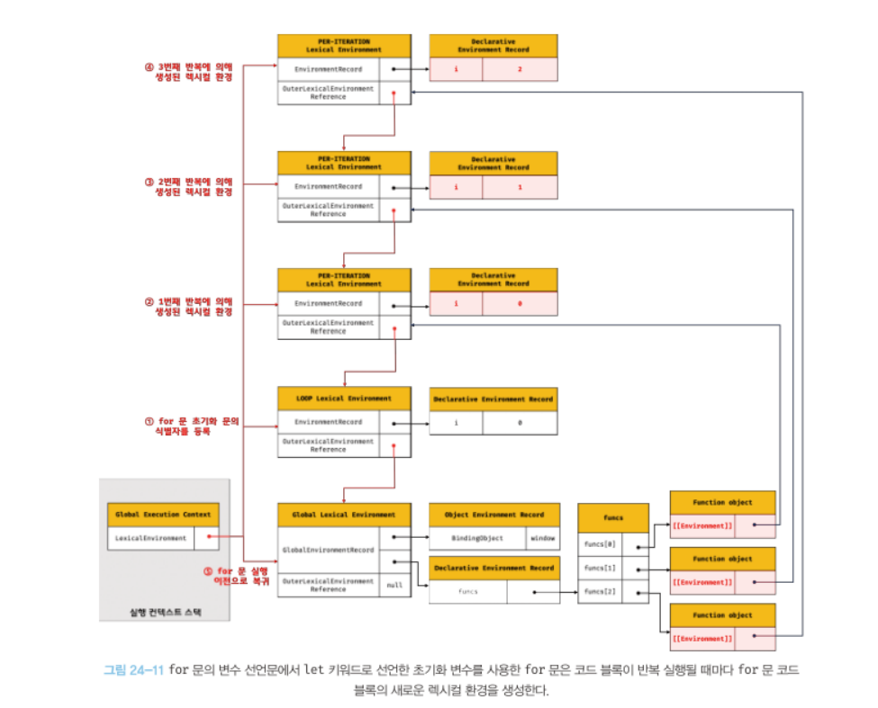

# 클로저

<aside>
📌 함수와 함수가 선언된 렉시컬 환경의 조합

</aside>

## 1. 렉시컬 스코프

함수를 **어디에 정의**했는지에 따라 결정되는 상위 스코프

## 2. 함수 객체의 내부 슬롯 [[Environment]]

함수 정의가 평가되어 함수 객체를 생성할 때, 함수는 자신의 내부 슬롯 [[Environment]]에 상위 스코프의 참조를 저장한다.

**[[Environment]] = 상위 스코프의 참조 = 현재 실행 중인 실행 컨텍스트의 렉시컬 환경 (실행 컨텍스트의 외부 함수 렉시컬 환경의 참조)**

함수 객체는 내부 슬롯 [[Environment]]에 저장한 상위 스코프를 자신이 존재하는 한 기억한다.

```jsx
const x = 1;

function foo() {
  const x = 10;

  // 상위 스코프는 함수 정의 환경(위치)에 따라 결정된다.
  // 함수 호출 위치와 상위 스코프는 아무런 관계가 없다.
  bar();
}

// 함수 bar는 자신의 상위 스코프, 즉 전역 렉시컬 환경을 [[Environment]]에 저장하여 기억한다.
function bar() {
  console.log(x);
}

foo(); // ?
bar(); // ?
```



**실행 컨텍스트의 외부 렉시컬 환경에 대한 참조 = 함수 객체 내부 슬롯 [[Environment]]**

## 3. 클로저와 렉시컬 환경

```jsx
const x = 1;

// ①
function outer() {
  const x = 10;
  const inner = function () {
    console.log(x);
  }; // ②
  return inner;
}

// outer 함수를 호출하면 중첩 함수 inner를 반환한다.
// 그리고 outer 함수의 실행 컨텍스트는 실행 컨텍스트 스택에서 팝되어 제거된다.
const innerFunc = outer(); // ③
innerFunc(); // ④ 10
```

외부 함수보다 중첩 함수가 더 오래 유지되는 경우, 중첩 함수는 이미 생명 주기가 종료한 외부 함수의 변수를 참조 할 수 있다. 이러한 중첩 함수를 **클로저**라고 한다.

함수를 어디서 호출하든 상관없이 함수는 언제나 자신이 기억하는 상위 스코프의 식별자를 참조할 수 있고 식별자에 바인딩 된 값을 변경할 수도 있다.

- outer 함수가 평가되어 함수 객체를 생성할 때, 전역 렉시컬 환경을 outer 함수 객체의 [[Environment]] 내부 슬롯에 저장한다.
- outer 함수를 호출하면 outer 함수의 렉시컬 환경이 생성되고 outer 함수 객체의 [[Environment]] 슬롯에 저장된 전역 렉시컬 환경을 “외부 렉시컬 환경에 대한 참조”에 할당한다.
- 중첩 함수 inner가 평가된다. (함수 표현식이므로 런타임에 평가)
- inner 함수는 자신의 [[Environment]] 슬롯에 outer 함수의 렉시컬 환경을 상위 스코프로서 저장한다. (현재 실행 중인 실행 컨텍스트의 렉시컬 환경)
- outer 함수의 실행이 종료되면 inner 함수를 반환하면서 outer 함수의 생명 주기가 종료된다. outer 함수의 실행 컨텍스트가 실행 컨텍스트 스택에서 제거된다.
- **outer 함수의 실행 컨텍스트는 스택에서 제거되지만 outer 함수의 렉시컬 환경까지 소멸하는 것은 아니다.**
  - inner 함수의 [[Environment]]에서 참조 되므로 가비지 컬렉션의 대상이 아님.
- inner 함수를 호출하면 inner 함수의 실행 컨텍스트가 생성되고 실행 컨텍스트 스택에 푸시된다.
- 그리고 렉시컬 환경의 외부 렉시컬 환경에 대한 참조에는 inner 함수 객체의 [[Environment]]슬롯에 저장되어 있는 참조 값이 할당된다.

### 클로저라고 부르지 않는 것들

1. 상위 스코프의 식별자를 참조하지 않는 함수

```jsx
<!DOCTYPE html>
<html>
<body>
  <script>
    function foo() {
      const x = 1;
      const y = 2;

      // 일반적으로 클로저라고 하지 않는다.
      function bar() {
        const z = 3;

        debugger;
        // 상위 스코프의 식별자를 참조하지 않는다.
        console.log(z);
      }

      return bar;
    }

    const bar = foo();
    bar();
  </script>
</body>
</html>
```

상위 스코프의 어떠한 식별자도 참조하지 않는 경우, 브라우저는 최적화를 위해 상위 스코프를 기억하지 않는다.

클로저에 의해 참조되는 상위 스코프의 변수를 **자유 변수**라고 한다.

1. 외부 함수보다 일찍 소멸하는 중첩 함수

```jsx
<!DOCTYPE html>
<html>
<body>
  <script>
    function foo() {
      const x = 1;

      // 일반적으로 클로저라고 하지 않는다.
      // bar 함수는 클로저였지만 곧바로 소멸한다.
      function bar() {
        debugger;
        // 상위 스코프의 식별자를 참조한다.
        console.log(x);
      }
      bar();
    }

    foo();
  </script>
</body>
</html>
```

외부 함수보다 일찍 소멸하는 함수는 생명 주기가 종료된 외부 함수의 식별자를 참조할 수 있다는 클로저의 본질에 부합하지 않는다.

**클로저는 중첩 함수가 상위 스코프의 식별자를 참조하고 있고 중첩 함수가 외부 함수보다 더 오래 유지되는 경우에 한정하는 것이 일반적이다.**

## 4. 클로저의 활용

클로저는 상태를 안전하게 변경하고 유지하기 위해 사용한다.

즉, 상태를 안전하게 은닉하고 특정 함수에게만 상태 변경을 허용하기 위해 사용된다.

```jsx
// 카운트 상태 변수
let num = 0;

// 카운트 상태 변경 함수
const increase = function () {
  // 카운트 상태를 1만큼 증가 시킨다.
  return ++num;
};

console.log(increase()); // 1
console.log(increase()); // 2
console.log(increase()); // 3
```

위 코드는 정상적으로 작동하지만 카운트의 상태가 전역 변수를 통해 관리되고 있어 누구나 접근할 수 있고 변경할 수 있어 의도치 않게 상태가 변경될 수 있다.

카운트 상태를 안전하게 변경하고 유지하기 위해서는 increase 함수만이 num 변수를 참조하고 변경할 수 있게 하는 것이 바람직하다.

```jsx
// 카운트 상태 변경 함수
const increase = (function () {
  // 카운트 상태 변수
  let num = 0;

  // 클로저
  return function () {
    // 카운트 상태를 1만큼 증가 시킨다.
    return ++num;
  };
})();

console.log(increase()); // 1
console.log(increase()); // 2
console.log(increase()); // 3
```

즉시 실행 함수는 호출된 이후 즉시 소멸되지만 즉시 실행 함수가 반환한 클로저는 increase 변수에 할당되어 호출된다. 즉시 실행 함수가 반환한 클로저는 즉시 실행 함수의 렉시컬 환경을 기억하고 있다.

이처럼 클로저는 상태가 의도치 않게 변경되지 않도록 안전하게 은닉하고 특정 함수에게만 상태 변경을 허용하여 상태를 안전하게 변경하고 유지하기 위해 사용한다.

클로저는 외부 상태 변경이나 가변 데이터를 피하고 불변성을 지향하는 함수형 프로그래밍에서 부수 효과를 최대한 억제하여 오류를 피하고 프로그램의 안정성을 높이기 위해 적극적으로 사용된다.

```jsx
// 함수를 인수로 전달받고 함수를 반환하는 고차 함수
// 이 함수는 카운트 상태를 유지하기 위한 자유 변수 counter를 기억하는 클로저를 반환한다.
function makeCounter(aux) {
  // 카운트 상태를 유지하기 위한 자유 변수
  let counter = 0;

  // 클로저를 반환
  return function () {
    // 인수로 전달 받은 보조 함수에 상태 변경을 위임한다.
    counter = aux(counter);
    return counter;
  };
}

// 보조 함수
function increase(n) {
  return ++n;
}

// 보조 함수
function decrease(n) {
  return --n;
}

// 함수로 함수를 생성한다.
// makeCounter 함수는 보조 함수를 인수로 전달받아 함수를 반환한다
const increaser = makeCounter(increase); // ①
console.log(increaser()); // 1
console.log(increaser()); // 2

// increaser 함수와는 별개의 독립된 렉시컬 환경을 갖기 때문에 카운터 상태가 연동하지 않는다.
const decreaser = makeCounter(decrease); // ②
console.log(decreaser()); // -1
console.log(decreaser()); // -2
```

increaser 함수와 decreaser 함수는 별개의 독립된 렉시컬 환경을 갖는다. makeCounter 함수를 호출하면 그때마다 새로운 makeCounter 함수 실행 컨텍스트의 렉시컬 환경이 생성되기 때문이다.



## 5. 캡슐화와 정보 은닉

캡슐화는 객체의 상태를 나타내는 프로퍼티와 프로퍼티를 참조하고 조작할 수 있는 동작인 메서드를 하나로 묶는 것을 말한다. 캡슐화는 객체의 특정 프로퍼티나 메서드를 감출 목적으로 사용하기도 하는데 이를 정보 은닉이라고 한다.

정보 은닉은 외부에 공개할 필요가 없는 구현의 일부를 감추어 **적절하지 못한 접근으로부터 객체의 상태가 변경되는 것을 방지**하고 **객체 간 의존성(결합도)을 낮추는 효과**가 있다.

대부분의 객체 지향 프로그래밍 언어는 public, private, protected와 같은 접근 제한자를 선언할 수 있지만 자바스크립트는 접근 제한자를 제공하지 않는다. 따라서 자바스크립트 객체의 모든 프로퍼티와 메서드는 기본적으로 public하다.

```jsx
function Person(name, age) {
  this.name = name; // public
  let _age = age; // private

  // 인스턴스 메서드
  this.sayHi = function () {
    console.log(`Hi! My name is ${this.name}. I am ${_age}.`);
  };
}

const me = new Person("Lee", 20);
me.sayHi(); // Hi! My name is Lee. I am 20.
console.log(me.name); // Lee
console.log(me._age); // undefined

const you = new Person("Kim", 30);
you.sayHi(); // Hi! My name is Kim. I am 30.
console.log(you.name); // Kim
console.log(you._age); // undefined
```

위 코드는 name 프로퍼티는 외부로 공개되어 있어 public하지만 \_age 변수는 Person 생성자의 지역 변수이므로 private하다.

sayHi 메서드는 인스턴스 메서드이므로 Person 객체가 생성될 때마다 중복 생성된다.

sayHi 메서드를 프로토타입 메서드로 바꾸어 중복 생성을 방지해보면

```jsx
const Person = (function () {
  let _age = 0; // private

  // 생성자 함수
  function Person(name, age) {
    this.name = name; // public
    _age = age;
  }

  // 프로토타입 메서드
  Person.prototype.sayHi = function () {
    console.log(`Hi! My name is ${this.name}. I am ${_age}.`);
  };

  // 생성자 함수를 반환
  return Person;
})();

const me = new Person("Lee", 20);
me.sayHi(); // Hi! My name is Lee. I am 20.
console.log(me.name); // Lee
console.log(me._age); // undefined

const you = new Person("Kim", 30);
you.sayHi(); // Hi! My name is Kim. I am 30.
console.log(you.name); // Kim
console.log(you._age); // undefined
```

```jsx
const me = new Person("Lee", 20);
me.sayHi(); // Hi! My name is Lee. I am 20.

const you = new Person("Kim", 30);
you.sayHi(); // Hi! My name is Kim. I am 30.

// _age 변수 값이 변경된다!
me.sayHi(); // Hi! My name is Lee. I am 30.
```

Person 생성자 함수와 sayHi 메서드는 즉시 실행 함수의 \_age 변수를 참조할 수 있는 클로저이지만 \_age 변수의 상태가 유지되지 않는다는 문제가 있다.

이는 Person.prototype.sayHi 메서드가 단 한 번 생성되는 클로저이기 때문이다. sayHi 메서드는 즉시 실행 함수가 호출될 때 생성된다. sayHi 메서드는 즉시 실행 함수의 실행 컨텍스트의 렉시컬 환경의 참조를 [[Environment]]슬롯에 저장한다. 따라서 Person 생성자 함수의 모든 인스턴스가 상속을 통해 호출할 수 있는 Person.prototype.sayHi 메서드의 상위 스코프는 어떤 인스턴스로 호출하더라도 하나의 동일한 상위 스코프를 사용한다.

이처럼 자바스크립트는 정보 은닉을 완전히 지원하지 않는다.

## 6. 자주 발생하는 실수

```jsx
var funcs = [];

for (var i = 0; i < 3; i++) {
  funcs[i] = function () {
    return i;
  }; // ①
}

for (var j = 0; j < funcs.length; j++) {
  console.log(funcs[j]()); // ②
}
```

for 문의 변수 선언문에서 var 키워드로 선언한 i는 블록 레벨 스코프가 아닌 함수 레벨 스코프를 갖기 때문에 전역 변수다. 따라서 funcs 배열의 요소로 추가한 함수를 호출하면 전역 변수 i를 참조하므로 3이 출력된다.

```jsx
var funcs = [];

for (var i = 0; i < 3; i++) {
  funcs[i] = (function (id) {
    // ①
    return function () {
      return id;
    };
  })(i);
}

for (var j = 0; j < funcs.length; j++) {
  console.log(funcs[j]());
}
```

클로저를 사용하여 바르게 동작하도록 만든 코드이다.

즉시 실행 함수는 i 값을 인수로 전달 받아 매개변수 id에 할당한 후 중첩 함수를 반환한고 종료된다. 이때 매개변수 id는 즉시 실행 함수가 반환한 중첩함수의 상위 스코프에 존재한다. 따라서 이 중첩 함수는 클로저이고 매개변수 id는 자유 변수가 되어 그 값이 유지된다.

더 쉬운 방법은 let 키워드를 사용하는 것이다.

```jsx
const funcs = [];

for (let i = 0; i < 3; i++) {
  funcs[i] = function () {
    return i;
  };
}

for (let i = 0; i < funcs.length; i++) {
  console.log(funcs[i]()); // 0 1 2
}
```

let 키워드로 선언한 변수를 사용하면 for 문의 코드 블록이 반복 실행될 때마다 for 문 코드 블록의 새로운 렉시컬 환경이 생성된다.


