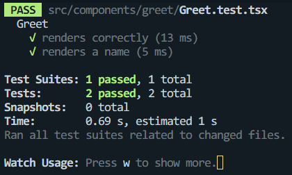
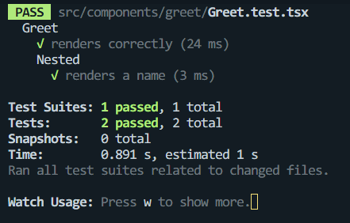
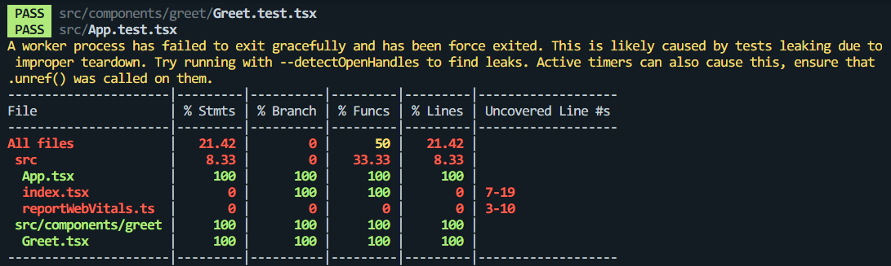
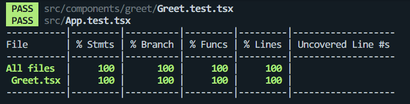
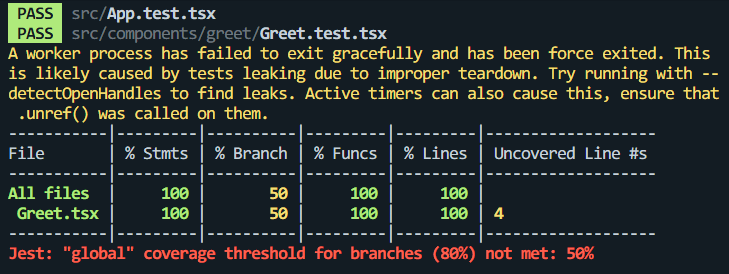
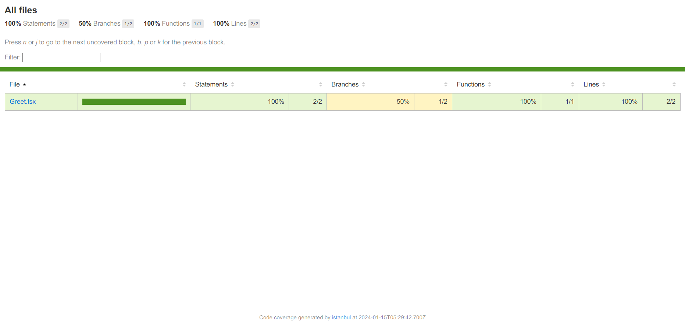
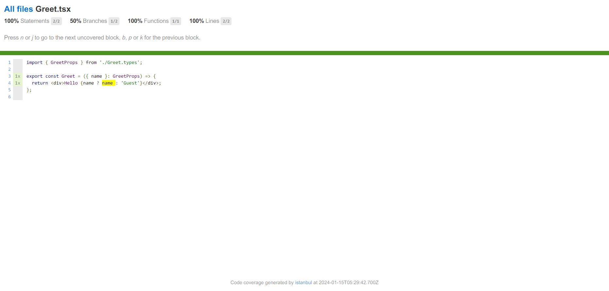

# 1. Testing이 필요한 이유

애플리케이션을 개발할 때, 사용자와 상호작용하여 기능이 제대로 수행될 수 있도록 만들어야 한다. 개발자가 스스로 직접 테스팅을 할 수 있지만 이것은 **반복적인 작업이 필요**하고, **시간이 걸리는 작업**이며 **실수를 할 가능성**이 있다.

테스팅 라이브러리를 이용하여 자동적인 테스팅을 하면 직접 테스팅을 하는 것에 비해 **시간을 덜 들일 수** 있으며, **좀 더 신빙성있고 일관적인 결과**를 얻어낼 수 있어 **견고한** 애플리케이션을 만들 수 있다.

# 2. Jest와 React Testing Library(RTL)

**Jest**

- 테스팅을 위한 프레임워크
- 테스트를 정의하고 실행할 수 있고 무엇이 성공하고 실패했는지 알려준다.

**React Testing Library**

- Virtual DOM을 이용하여 컴포넌트를 테스팅할 수 있게 해주는 라이브러리

CRA(create-react-app)로 생성된 프로젝트는 기본적으로 RTL과 Jest를 제공한다.

# 3. Test의 종류

- Unit Test
  - 함수나 클래스, 컴포넌트 등 기능적인 단위의 테스트
  - 빠르게 실행 가능하며 작성하기 쉽다.
- Integration Test
  - 여러 유닛 간 통합적으로 잘 동작하는지 검증하는 테스트
  - 유닛 테스트보다 조금 더 시간이 걸린다.
- E2E Test
  - 소프트웨어의 전체 혹은 큰 부분을 검증하는 테스트
  - 실제 브라우저나 앱에서 실행되며 사용자 경험을 테스트한다.
  - 통합 테스트보다 더 긴 실행 시간이 소요된다.

# 4. test 작성하기

```jsx
test(name, fn, timeout);
```

- `name`: 테스트의 이름
- `fn`: 테스트가 검증해야 할 것들에 대한 코드가 담긴 함수
- `timeout`: 테스트가 얼마 동안 실행되어야 하는지를 나타내는 속성 (optional)
  - default 5s
  - ex) 5000 → 5초 동안 테스트가 완료되지 않으면 타임아웃

```jsx
test("Greet renders correctly", () => {
  render(<Greet />); // Virtual DOM을 이용하여 Greet 컴포넌트를 렌더링
  const textElement = screen.getByText("Hello"); // screen에서 'Hello' 텍스트를 가진 노드 찾기
  expect(textElement).toBeInTheDocument(); // 해당 노드가 Document에 존재하는지 검증
});
```

- `test.only`: 이 테스트만 진행한다.
- `test.skip`: 테스트를 스킵한다.

## alternative

- `it`: test의 대안
  ```jsx
  describe("Greet", () => {
    it("renders correctly", () => {
      render(<Greet />);
      const textElement = screen.getByText("Hello");
      expect(textElement).toBeInTheDocument();
    });
  });
  ```
- `fit`: test.only의 대안
- `xit`: test.skip의 대안

# 5. Test Driven Development(TDD)

코드를 작성하기 전에 테스트를 먼저 작성하고, 그 후에 해당 테스트를 통과할 수 있도록 코드를 구현하는 방식

1. 특정한 기능에 대한 **테스트를 먼저 작성**하기
2. 테스트가 성공하도록 **코드 구현**하기
3. 테스트가 성공하는지 확인하며 **리팩토링**하기

# 6. Test 그룹화하기

```jsx
describe(name, fn);
```

- `name`: 그룹 이름
- `fn`: 테스트가 검증해야 할 것들에 대한 코드가 담긴 함수

```jsx
describe("Greet", () => {
  test("renders correctly", () => {
    render(<Greet />);
    const textElement = screen.getByText("Hello");
    expect(textElement).toBeInTheDocument();
  });

  test("renders a name", () => {
    render(<Greet name="cozups" />);
    const textElement = screen.getByText("Hello cozups");
    expect(textElement).toBeInTheDocument();
  });
});
```



`describe`는 중첩도 가능하다.

```jsx
describe("Greet", () => {
  test("renders correctly", () => {
    render(<Greet />);
    const textElement = screen.getByText("Hello");
    expect(textElement).toBeInTheDocument();
  });

  describe("Nested", () => {
    test("renders a name", () => {
      render(<Greet name="cozups" />);
      const textElement = screen.getByText("Hello cozups");
      expect(textElement).toBeInTheDocument();
    });
  });
});
```



# 7. Code Coverage

소프트웨어 테스트에서 사용하는 지표로, 테스트 케이스가 실행 시 코드의 어느 부분을 실행하는지 측정하여 테스트의 충분성을 평가하는 방법

**코드 커버리지 종류**

- **문장 커버리지(Statement Coverage):** 코드 내의 모든 문장이 실행되었는지 측정
- **브랜치** **커버리지(Branch Coverage):** 프로그램 내의 조건문(if, switch 등)에서 각 분기(branch)가 얼마나 실행되었는지를 측정
- **조건 커버리지(Condition Coverage):** 모든 조건식의 참/거짓 결과가 한 번씩 실행되었는지 측정
- **함수 또는 메소드 커버리지(Function/Method Coverage):** 각 함수나 메소드가 얼마나 실행되었는지를 측정한다. 함수 커버리지는 특정 기능이나 모듈이 테스트되었는지를 확인하는 데 사용된다.

## **코드 커버리지 실행 방법**

[Running Tests | Create React App](https://create-react-app.dev/docs/running-tests/#coverage-reporting)

```jsx
// package.json (CRA)
...
"scripts": {
    "start": "react-scripts start",
    "build": "react-scripts build",
    "test": "react-scripts test",
    "eject": "react-scripts eject",
    "coverage": "npm test -- --coverage --watchAll"
  },
...
```

- `--coverage` 옵션을 이용하여 커버리지 명령을 실행하고 전체에 대한 커버리지를 실행하기 위해 `--watchAll`옵션을 사용한다.
- `npm run coverage` 혹은 `yarn coverage` 명령어를 사용하여 실행한다.



코드 커버리지 실행 결과

## 특정 파일/폴더만 코드 커버리지 실행하기

[Configuring Jest · Jest](https://jestjs.io/docs/configuration#collectcoveragefrom-array)

index.tsx파일이나 reportWebVitals.ts는 주로 테스트 할 필요가 없으므로 src/components 폴더 속 테스트 파일만 코드 커버리지를 실행하기 위해 `--collectCoverageFrom` 옵션을 사용할 수 있다.

```jsx
// package.json
...
"scripts": {
    "start": "react-scripts start",
    "build": "react-scripts build",
    "test": "react-scripts test",
    "eject": "react-scripts eject",
    "coverage": "npm test -- --coverage --watchAll --collectCoverageFrom='src/components/**/*.{ts,tsx}'"
  },
...
```



## coverageThreshold

특정 수준의 코드 커버리지를 설정하고 이 수준 이하의 커버리지가 감지되면 빌드나 테스트를 실패하도록 하는 기능

```jsx
// package.json
...
"jest": {
    "coverageThreshold": {
      "global": {
        "branches": 80,
        "functions": 80,
        "lines": 80,
        "statements": -10
      }
    }
  },
...
```

브랜치 커버리지, 함수 커버리지, 라인 커버리지를 80%이상 달성해야 하고 구문 커버리지에서 실행되지 않는 구문이 10개 이하여야 성공한다.



브랜치 커버리지가 50%이므로 실패했음을 알려줌

코드 커버리지는 커버리지 결과에 대한 html 파일 또한 생성해준다.



파일을 선택하면 실행되지 않은 부분에 대하여 하이라이트를 해준다.


