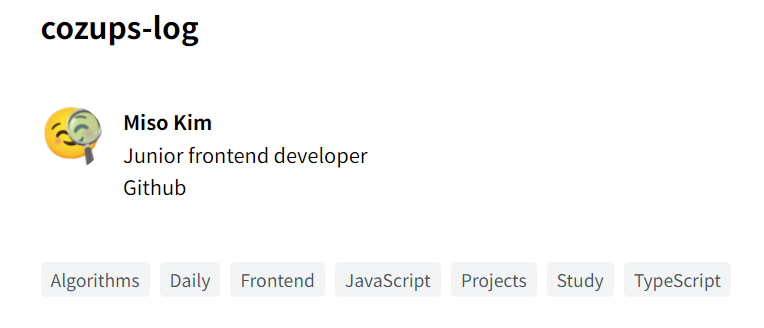
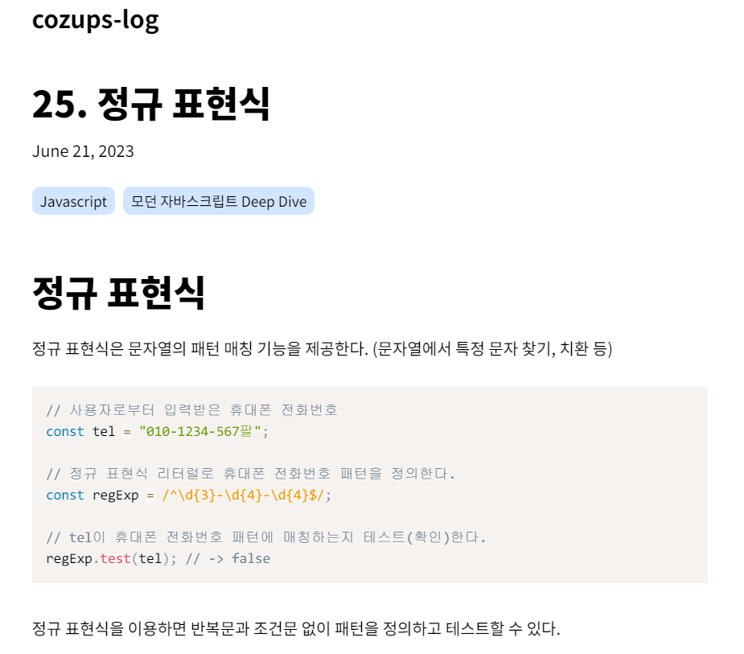
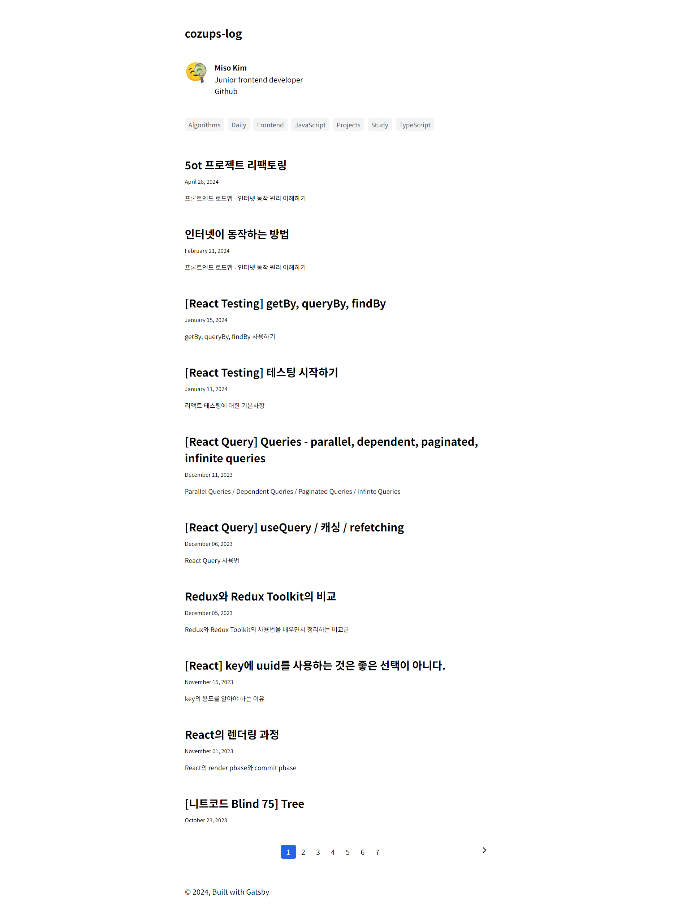
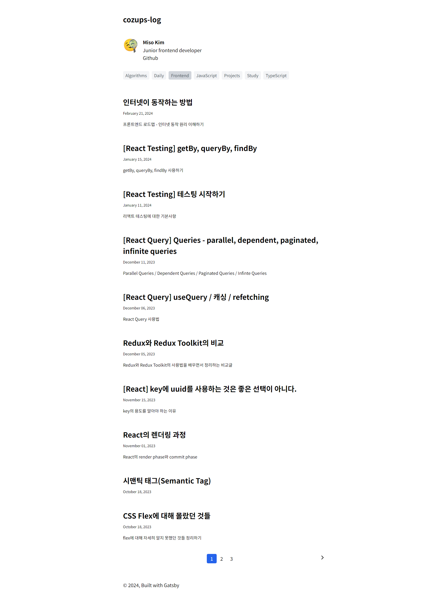

# Gatsby로 옮기게 된 이유

노션에 익숙해지다보니 블로그도 노션으로 작성하는 것을 선호했다. 그러나 노션이 최근 많이 느려졌다고 느껴졌고 노션에 글을 쓰면서도 상당한 렉을 경험하여 사용하는 데에 많은 불편함을 느꼈다.
morethanmin 님이 제작하신 [morethan-log](https://github.com/morethanmin/morethan-log)를 이용하여 노션의 글을 블로그로 연동하기도 해보았다. 뭔가 버그가 꼬인 것인지 글을 노션에 작성해도 블로그에 동기화 되지 않아 글을 쓸 때마다 새로 배포를 다시 해주어야 했다. 그리고 글 속의 코드블록들이 처음에 제대로 렌더링 되지 않는 문제도 있었다.
여러 가지로 불편함을 느끼고 있었던 차라 다른 방식으로 블로그를 사용할 수 있는 방법을 찾아보게 되었고 그 중 Gatsby를 이용하기로 했다.
Gatsby를 이용하면 React 베이스로 블로그를 커스터마이징 할 수 있고 정적 사이트 생성을 하기 때문에 SEO 측면에서의 장점도 챙길 수 있을 것 같았다.

# 해야할 일

1. Gatsby 템플릿을 이용하여 블로그 생성하기
2. 이전 블로그 글 가져오기
3. 배포
4. 부가적인 기능 구현하기

# 1. Gatsby 템플릿으로 블로그 생성하기

템플릿 중[ gatsby-starter-blog](https://www.gatsbyjs.com/starters/gatsbyjs/gatsby-starter-blog/)가 제일 노멀한 템플릿인 것 같아 이 템플릿을 사용하였다.

```
npm install gatsby-cli
npx gatsby new gatsby-starter-blog https://github.com/gatsbyjs/gatsby-starter-blog
```

# 2. 이전 블로그 글 가져오기

프로젝트 내 `content/blog` 내에 markdown 파일을 작성하여 글을 생성할 수 있다.

`gatsby-config.js` 를 살펴보면

```js
plugins: [
   ...
    {
      resolve: `gatsby-source-filesystem`,
      options: {
        path: `${__dirname}/content/blog`,
        name: `blog`,
      },
    },
```

`gatsby-source-filesystem` 플러그인을 이용하여 `content/blog` 내의 파일을 웹 사이트 안에서 사용할 수 있는 GraphQL 노드로 만든다.

따라서 이전에 노션에 작성해둔 글을 markdown 파일로 가져와 폴더 안에 넣는다.

# 3. 배포

배포는 간단히 netlify를 이용하여 배포한다.

# 4. 부가적인 기능 구현

## 1. 카테고리 추가

현재 템플릿에는 카테고리가 따로 없다. 그러나 많은 글을 구분하기 위해서 카테고리가 있는 것이 편하기 때문에 카테고리를 추가하였다.

1. 모든 md 파일의 frontmatter에 카테고리를 추가한다.
2. gatsby-node.js `createPages`에 카테고리 관련 코드를 추가한다.

```js
...
const categories = result.data.allMarkdownRemark.categoryList;
...

const categoryPosts = path.resolve(`./src/templates/category-posts.js`);
...

const result = await graphql(`
    {
      allMarkdownRemark(sort: { frontmatter: { date: ASC } }, limit: 1000) {
        categoryList: distinct(field: frontmatter___category)
        nodes {
          id
          fields {
            slug
          }
        }
      }
    }
  `);
...

if (categories.length > 0) {
    categories.forEach(category => {
      createPage({
        path: `/${category}/`,
        component: categoryPosts,
        context: { category },
      });
    });
  }
```

3. `src/templates` 폴더에 카테고리 페이지 템플릿을 작성한다. ([코드 링크](https://github.com/cozups/cozups-gatsby-blog/blob/master/src/templates/category-posts.js))
4. 홈 페이지와 카테고리 페이지에서 카테고리를 쿼리하여 출력한다.

```jsx
// components/categories.js
import * as React from "react";
import { Link } from "gatsby";

const Categories = ({ categories, current = "" }) => {
  return (
    <nav>
      <ul className="list-none flex gap-2 flex-wrap">
        {categories.map(category => (
          <li key={category}>
            <Link
              to={`/${category}`}
              className={`category-item ${current === category && "active"}`}
            >
              {category}
            </Link>
          </li>
        ))}
      </ul>
    </nav>
  );
};

export default Categories;
```

```jsx
// templates/blog-list.js
return (
  <Layout location={location} title={siteTitle}>
    <Bio />
    <Categories categories={categories} />
    ...
  </Layout>
);

export const pageQuery = graphql`
  {
    site {
      siteMetadata {
        title
      }
    }
    allMarkdownRemark(
      sort: {
        fields: [frontmatter___date, frontmatter___title]
        order: [DESC, DESC]
      }
    ) {
      categoryList: distinct(field: frontmatter___category)
      nodes {
        id
        excerpt
        fields {
          slug
        }
        frontmatter {
          date(formatString: "MMMM DD, YYYY")
          title
          description
        }
      }
    }
  }
`;
```

- 결과
  

## 2. 태그 표시 추가

1. 모든 md 파일에 tags를 추가한다.
2. 쿼리 문의 nodes 안 frontmatter에 tags도 추가한다.

```js
export const pageQuery = graphql`
  query BlogPostBySlug(
    $id: String!
    $previousPostId: String
    $nextPostId: String
  ) {
    site {
      siteMetadata {
        title
      }
    }
    markdownRemark(id: { eq: $id }) {
      id
      excerpt(pruneLength: 160)
      html
      frontmatter {
        title
        date(formatString: "MMMM DD, YYYY")
        description
        tags
      }
    }
    previous: markdownRemark(id: { eq: $previousPostId }) {
      fields {
        slug
      }
      frontmatter {
        title
      }
    }
    next: markdownRemark(id: { eq: $nextPostId }) {
      fields {
        slug
      }
      frontmatter {
        title
      }
    }
  }
`;
```

3. 불러온 tags를 렌더링한다.

```jsx
const BlogPostTemplate = ({
  data: { previous, next, site, markdownRemark: post },
  location,
}) => {
  const siteTitle = site.siteMetadata?.title || `Title`;
  const tags = post.frontmatter.tags || [];

  return (
    <Layout location={location} title={siteTitle}>
      <article
        className="blog-post"
        itemScope
        itemType="http://schema.org/Article"
      >
        ...
        <aside id="tags">
          {
            <ul>
              {tags.map(tag => (
                <li key={tag}>{tag}</li>
              ))}
            </ul>
          }
        </aside>
        ...
      </article>
      ...
    </Layout>
  );
};
```

- 결과
  

## 3. 페이지네이션

## 1) index 페이지

```js
// gatsby-node.js
...
const postsPerPage = 10;
const numPages = Math.ceil(posts.length / postsPerPage);
Array.from({ length: numPages }).forEach((_, i) => {
	createPage({
	  path: i === 0 ? `/` : `/page/${i + 1}`,
	  component: path.resolve("./src/templates/blog-list.js"),
	  context: {
		limit: postsPerPage,
		skip: i * postsPerPage,
		numPages,
		currentPage: i + 1,
	  },
	});
});
...
```

페이지네이션 코드를 `gatsby-node.js`파일에 구현한다. 이 코드는 페이지네이션의 각 페이지마다 blog-list 템플릿을 이용하여 페이지를 생성하는 코드이다.

```js
...

const BlogListTemplate = ({ data, location, pageContext }) => {
 ...

  const prevPageDisabled = pageContext.currentPage === 1;
  const nextPageDisabled = pageContext.currentPage === pageContext.numPages;
  const pageNumberList = Array.from(
    { length: pageContext.numPages < 10 ? pageContext.numPages : 10 },
    (_, index) => Math.floor(pageContext.currentPage / 10) + index + 1
  );

  return (
    ...
      <div className="flex justify-center">
        {!prevPageDisabled && (
          <Link to={pageContext.previousPagePath} className="text-black">
            {"<"}
          </Link>
        )}
        <ul className="list-none flex">
          {pageNumberList.map(pageNumber => (
            <li>
              <Link
                className={`text-black border-black border-2 px-2 ${
                  pageNumber === pageContext.currentPage && "page-activated"
                }`}
                to={pageNumber === 1 ? `/` : `/page/${pageNumber}`}
              >
                {pageNumber}
              </Link>
            </li>
          ))}
        </ul>
        {!nextPageDisabled && (
          <Link to={pageContext.nextPagePath} className="text-black">
            {">"}
          </Link>
        )}
      </div>
    </Layout>
  );
};

export default BlogListTemplate;

...

export const pageQuery = graphql`
  query ($skip: Int!, $limit: Int!) {
    site {
      siteMetadata {
        title
      }
    }
    categoryList: allMarkdownRemark {
      categories: distinct(field: frontmatter___category)
    }
    allMarkdownRemark(
      sort: {
        fields: [frontmatter___date, frontmatter___title]
        order: [DESC, DESC]
      }
      skip: $skip
      limit: $limit
    ) {
      nodes {
        id
        excerpt
        fields {
          slug
        }
        frontmatter {
          date(formatString: "MMMM DD, YYYY")
          title
          description
        }
      }
    }
  }
`;
```

`src/templates`폴더에 `blog-list.js`파일을 만들어 템플릿을 작성한다. `$skip`과 `$limit`을 이용하여 데이터의 일부분을 가져온다. 이 결과가 `data` prop으로 들어가게 되며 기존의 코드가 이를 렌더링 하게 된다. 우리가 추가해야 할 부분은 페이지 표시를 하는 컴포넌트 부분이다. 위에 적힌 코드가 이에 해당한다. 카테고리 페이지에도 적용해야 하므로 추후에 컴포넌트를 따로 분리하겠다.

그 후에 `src/pages`에서 `index.js`를 삭제한다. `index.js`를 삭제하는 이유는 `createPage` 메서드에 지정한 `path`옵션에 따라 페이지가 1일 때 우리는 블로그 기본 URL(cozups-log.netlify.app)에 접속하게 되는데, 이 때 `blog-list.js` 페이지와 `index.js` 페이지가 충돌하여 오류를 일으킨다. 따라서 `index.js` 페이지를 삭제해야 한다.

- 결과
  

## 2) 카테고리 페이지

index 페이지에 페이지네이션을 도입했다면 그 다음에는 카테고리 페이지에도 페이지네이션을 도입해야 한다. 따라서 `gatsby-node.js`와 `templates/category-posts.js`를 수정할 필요가 있다.

우선 쿼리문을 조금 바꿔야 한다.

```js
// gatsby-node.js
const result = await graphql(`
    {
      allMarkdownRemark(sort: { frontmatter: { date: ASC } }, limit: 1000) {
        categoryList: distinct(field: frontmatter___category)
        nodes {
          id
          fields {
            slug
          }
        }
        // 추가된 부분
        categoryPosts: group(field: frontmatter___category) {
          fieldValue
          nodes {
            id
            fields {
              slug
            }
            frontmatter {
              title
              date
            }
          }
        }
      }
    }
  `);
```

추가된 쿼리문은 frontmatter의 category에 따라 포스트들을 그룹화한다.

```json
[
  {
    "fieldValue": "category1",
    "nodes": [
      {
        "id": "1",
        "fields": { "slug": "/post-1" },
        "frontmatter": { "title": "Post 1", "date": "2022-01-01" }
      },
      {
        "id": "2",
        "fields": { "slug": "/post-2" },
        "frontmatter": { "title": "Post 2", "date": "2022-01-02" }
      }
    ]
  },
  {
    "fieldValue": "category2",
    "nodes": [
      {
        "id": "3",
        "fields": { "slug": "/post-3" },
        "frontmatter": { "title": "Post 3", "date": "2022-01-03" }
      }
    ]
  }
]
```

위와 같은 형태로 카테고리 별로 포스트들이 묶인다.

그리고 `createPage`를 사용하는 부분도 고쳐야 한다.

```js
// gatsby-node.js
const postsPerPage = 10;

if (categories.length > 0) {
  const postGroups = result.data.allMarkdownRemark.categoryPosts;

  postGroups.forEach(group => {
    const category = group.fieldValue;
    const posts = group.nodes;
    const numPages = Math.ceil(posts.length / postsPerPage);

    Array.from({ length: numPages }).forEach((_, i) => {
      createPage({
        path: i === 0 ? `/${category}/` : `/${category}/page/${i + 1}`,
        component: categoryPosts,
        context: {
          category,
          limit: postsPerPage,
          skip: i * postsPerPage,
          numPages,
          currentPage: i + 1,
        },
      });
    });
  });
}
```

index 페이지를 페이지네이션 하는 것과 비슷하게 구현한다.

그 후에, `templates/category-posts.js`파일을 수정해야 한다. `$skip`과 `$limit`을 이용하여 데이터 중 일부만 가져오는 쿼리로 바꿔야 하며 그 코드는 아래와 같다.

```js
export const pageQuery = graphql`
  query ($category: String!, $skip: Int!, $limit: Int!) {
    site {
      siteMetadata {
        title
      }
    }
    categoryList: allMarkdownRemark {
      categories: distinct(field: frontmatter___category)
    }
    categoryPosts: allMarkdownRemark(
      sort: {
        fields: [frontmatter___date, frontmatter___title]
        order: [DESC, DESC]
      }
      filter: { frontmatter: { category: { eq: $category } } }
      skip: $skip
      limit: $limit
    ) {
      nodes {
        id
        excerpt
        fields {
          slug
        }
        frontmatter {
          date(formatString: "MMMM DD, YYYY")
          title
          description
        }
      }
    }
  }
`;
```

그리고 페이지네이션의 페이지를 표시하는 부분을 추가해야 하는데 index 페이지와 중복되므로 따로 컴포넌트를 분리하였다.

```jsx
// src/components/pagination.js
import React from "react";
import { Link } from "gatsby";

import { MdArrowForwardIos, MdArrowBackIosNew } from "react-icons/md";

const Pagination = ({ path = "", pageContext }) => {
  const prevPageDisabled = pageContext.currentPage === 1;
  const nextPageDisabled = pageContext.currentPage === pageContext.numPages;
  const pageNumberList = Array.from(
    { length: pageContext.numPages < 10 ? pageContext.numPages : 10 },
    (_, index) => Math.floor(pageContext.currentPage / 10) + index + 1
  );

  return (
    <div className="pagination">
      {
        <Link
          to={
            pageContext.currentPage === 2
              ? `${path}/`
              : `${path}/page/${pageContext.currentPage - 1}`
          }
          className="text-black"
        >
          {!prevPageDisabled ? <MdArrowBackIosNew /> : ""}
        </Link>
      }
      <ul className="list-none flex">
        {pageNumberList.map(pageNumber => (
          <li key={`page/${pageNumber}`}>
            <Link
              className={`pagination-item ${
                pageNumber === pageContext.currentPage && "page-activated"
              }`}
              to={pageNumber === 1 ? `${path}/` : `${path}/page/${pageNumber}`}
            >
              {pageNumber}
            </Link>
          </li>
        ))}
      </ul>
      {
        <Link
          to={`${path}/page/${pageContext.currentPage + 1}`}
          className="text-black"
        >
          {!nextPageDisabled ? <MdArrowForwardIos /> : ""}
        </Link>
      }
    </div>
  );
};

export default Pagination;
```

이 컴포넌트를 템플릿에 적용한다. 그 결과 코드는 아래와 같다.

```jsx
// templates/category-posts.js
import * as React from "react";
import { Link, graphql } from "gatsby";
...
import Pagination from "../components/pagination";

const CategoryPostsTemplate = ({ data, location, pageContext }) => {
 ...
  return (
    <Layout location={location} title={siteTitle}>
      ...
      <ol style={{ listStyle: `none` }}>
        // posts 렌더링
        ...
      </ol>
      <Pagination path={`/${category}`} pageContext={pageContext} />
    </Layout>
  );
};

export default CategoryPostsTemplate;

export const pageQuery = graphql`
  query ($category: String!, $skip: Int!, $limit: Int!) {
    site {
      siteMetadata {
        title
      }
    }
    categoryList: allMarkdownRemark {
      categories: distinct(field: frontmatter___category)
    }
    categoryPosts: allMarkdownRemark(
      sort: {
        fields: [frontmatter___date, frontmatter___title]
        order: [DESC, DESC]
      }
      filter: { frontmatter: { category: { eq: $category } } }
      skip: $skip
      limit: $limit
    ) {
      nodes {
        id
        excerpt
        fields {
          slug
        }
        frontmatter {
          date(formatString: "MMMM DD, YYYY")
          title
          description
        }
      }
    }
  }
`;

```

- 결과
  
