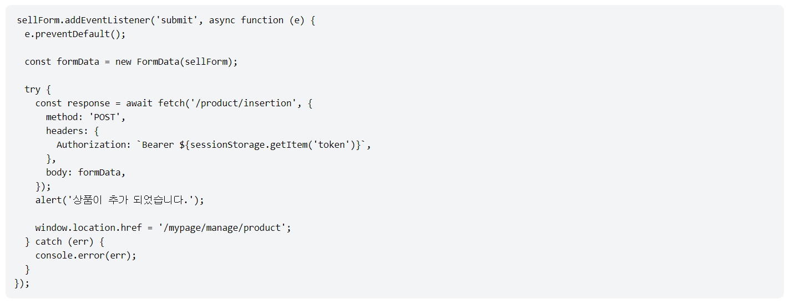
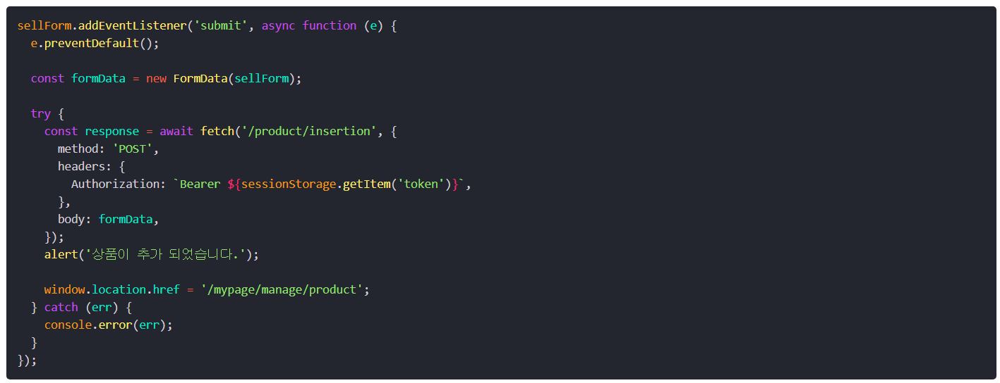

포트폴리오 사이트를 NextJS 기반으로 제작하고 있는데, 프로젝트 설명 글을 직접 마크업하자니 가독성이 굉장히 떨어졌다. 이중 리스트를 사용하는 경우 ul 태그 안에 또 ul 태그를 넣다보니 코드를 읽기 굉장히 복잡해졌다. 프로젝트를 markdown 파일로 정리하였기 때문에 이 파일 자체를 활용할 수 있는 방법을 찾아보니 mdx를 이용하면 markdown파일을 페이지로 렌더링할 수 있다는 것을 알게 되었다.

# mdx란?

MDX는 Markdown와 js의 조합으로, Markdown 파일 안에 js를 사용할 수 있게 해주는 포맷이다.

# @next/mdx 사용하기

```text
npm install @next/mdx @mdx-js/loader @mdx-js/react @types/mdx
```

@next/mdx 라이브러리를 설치한다.
그리고 이 라이브러리를 사용하기 위해서는 `next.config.mjs` 파일을 수정해야 한다.

```js
import nextMDX from "@next/mdx";

const withMDX = nextMDX({
  extension: /\.mdx?$/,
  options: {
    remarkPlugins: [],
    rehypePlugins: [],
  },
});

/** @type {import('next').NextConfig} */
const nextConfig = {
  pageExtensions: ["ts", "tsx", "js", "js", "md", "mdx"],
  experimental: {
    appDir: true,
    mdxRs: true,
  },
  images: {
    remotePatterns: [
      {
        protocol: "https",
        hostname: "**",
      },
    ],
  },
};

export default withMDX(nextConfig);
```

아래는 next.config.js이다. mjs파일에서 require를 사용하면 오류가 난다.

```js
const withMDX = require("@next/mdx")();

/** @type {import('next').NextConfig} */
const nextConfig = {
  // Configure `pageExtensions` to include MDX files
  pageExtensions: ["js", "js", "mdx", "ts", "tsx"],
  // Optionally, add any other Next.js config below
};

module.exports = withMDX(nextConfig);
```

그리고 app 폴더의 상위 디렉토리에 `mdx-components.tsx`를 작성하여야 한다.

```ts
import type { MDXComponents } from "mdx/types";

export function useMDXComponents(components: MDXComponents): MDXComponents {
  return {
    ...components,
  };
}
```

```text
  your-project
  ├── app
  │   └── my-mdx-page
  │       └── page.mdx
  └── package.json
```

위의 파일 구조처럼 markdown 페이지를 생성하면 markdown이 HTML로 맵핑된다.

# mdx 컴포넌트 커스터마이즈하는 방법

마크업 되는 html 태그들을 원하는 방법으로 맵핑하는 방법이 있다,
`mdx-components.tsx`파일에 다음과 같이 작성하면 커스터마이즈 할 수 있다.

```ts
import type { MDXComponents } from "mdx/types";
import Image, { ImageProps } from "next/image";

// This file allows you to provide custom React components
// to be used in MDX files. You can import and use any
// React component you want, including inline styles,
// components from other libraries, and more.

export function useMDXComponents(components: MDXComponents): MDXComponents {
  return {
    // Allows customizing built-in components, e.g. to add styling.
    h1: ({ children }) => <h1 style={{ fontSize: "100px" }}>{children}</h1>,
    img: props => (
      <Image
        sizes="100vw"
        style={{ width: "100%", height: "auto" }}
        {...(props as ImageProps)}
      />
    ),
    ...components,
  };
}
```

h1 태그에 스타일을 추가하여 반환하는 것과 img 태그를 next의 Image 태그로 최적화하여 반환하는 것을 볼 수 있다.

# MDX 페이지 내 코드 하이라이팅 기능 추가



위 이미지는 mdx 페이지의 코드 블록 부분이다. 하이라이팅 기능이 없으니 코드를 읽기가 어려워 syntax highlighting 기능을 넣고자 한다.

## [rehype-pretty-code](https://rehype-pretty-code.netlify.app/) 플러그인 설치

rehype-pretty-code 플러그인은 vscode가 지원하는 모든 언어들을 지원한다. 그리고 다양한 테마를 가지고 있어 커스터마이징 하기 좋다. 또한 코드 블록 내 코드를 따로 하이라이팅 할 수 있어 강조하고 싶은 부분이 있다면 이를 사용할 수 있다.

```text
npm install rehype-pretty-code shiki
```

MDX 내부에서 사용하기 위해서는 `next.config.mjs` 파일에서 플러그인을 추가한다.

```js
import nextMDX from "@next/mdx";
import rehypePrettyCode from "rehype-pretty-code";

const options = {
  theme: "andromeeda",
};

const withMDX = nextMDX({
  extension: /\.mdx?$/,
  options: {
    remarkPlugins: [],
    rehypePlugins: [[rehypePrettyCode, options]],
  },
});

/** @type {import('next').NextConfig} */
const nextConfig = {
  pageExtensions: ["ts", "tsx", "js", "js", "md", "mdx"],
  experimental: {
    appDir: true,
  },
  images: {
    remotePatterns: [
      {
        protocol: "https",
        hostname: "**",
      },
    ],
  },
};

export default withMDX(nextConfig);
```

옵션은 [공식 문서](https://rehype-pretty.pages.dev/#options)를 참조한다.

적용 후 화면은 다음과 같다.



라이브러리가 기본적으로 스타일링이 안 되어있기 때문에 따로 스타일링 하고 싶다면 css를 조정하면 된다.
