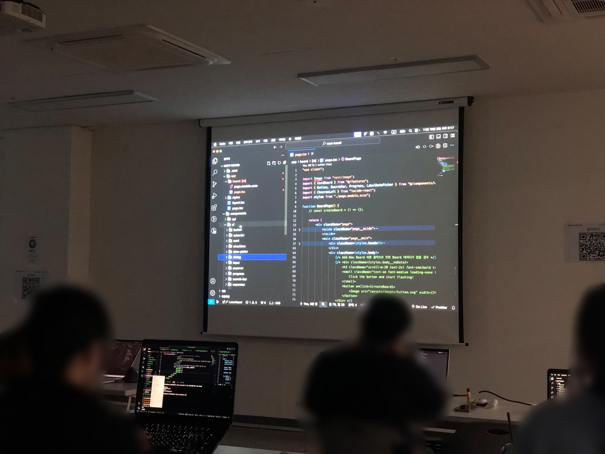
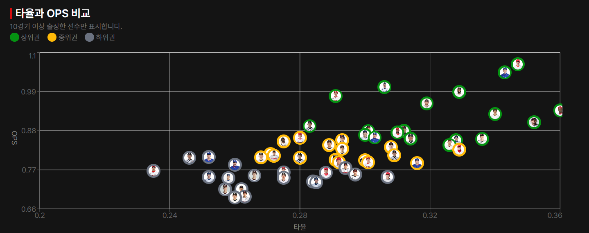

# 프론트엔드 프로젝트 캠프?

프론트엔드 개발 기술에 대해 다시 한번 공부하며 직접 팀 프로젝트에 참여할 수 있는 프로그램이다.

## 3주 간의 사전 교육

3주 동안 사전 교육을 통해 JavaScript, React, Next.js, TypeScript에 대해서 공부하는 시간을 가진다. 오전 9시부터 오후 6시까지 교육을 받는다.(한 번도 지각하지 않았다🤭) 강사님을 초빙하여 사전 교육을 진행하는데 [구디 사는 개발자](https://www.youtube.com/@9diin)님이 직접 오셔서 강의를 해주셨다. 정말 진심을 담아 교육을 해주시고 조언해주셔서 감사했다.

간단한 프로젝트들을 만들면서 공부를 하게 되는데, 나는 특히 레이아웃을 구성하는 방법을 가장 많이 배우게 되었다. 이전까지 여러 강의를 들으며 JavaScript를 활용한 기능 구현에는 익숙해졌기 때문에 기능적인 측면에서는 큰 어려움이 없었다. 하지만 대부분의 강의가 HTML과 CSS 코드를 템플릿처럼 제공하기 때문에, 직접 레이아웃을 설계해 보는 경험은 많지 않았다. 그래서 빈 프로젝트에서 처음부터 화면을 구성하는 것이 익숙하지 않았는데, 사전 교육을 통해 두 개 정도의 간단한 프로젝트를 만들면서 강사님의 레이아웃 구성 방식을 집중해서 살펴보았다. 이를 직접 적용하며 학습한 덕분에, 이제는 화면을 구성하는 데 큰 어려움이 없게 되었다.

## 7주 간의 팀 프로젝트 과정

이 캠프에서는 3개의 기업 프로젝트 중 한 가지를 골라 팀 프로젝트를 진행한다. 이번 과정에서는 KT, 와이리, 터빈크루 세 기업이 참여하였다.

KT 멘토님이 프론트엔드 개발자가 배워야할 대부분의 기본적 기술들을 배울 수 있다는 말에 혹해 KT 프로젝트를 선정하게 되었다.

원래는 Next.js를 배우고 싶은 마음에 이 프로젝트 캠프에 지원하게 되었지만 같이 참여하게 된 팀원들이 아직 프론트엔드에 익숙하지 않았고 내 입장에서도 React를 한번 더 꼼꼼하게 사용해보고 공부하는 것도 좋을 것 같아서 React로 프로젝트를 진행하게 되었다.

중간에 팀원이 빠져나가기도 하고, 개발이 익숙하지 않은 팀원들도 있어 협력해야 하는 부분들이 많았지만 팀원들 모두 너무 열심히하는 분들이었고 친절한 분들이었기에 팀 내 갈등 없이 순탄하게 프로젝트를 진행할 수 있었다.

난이도가 있는 코드들은 직접 사용법을 작성하여 팀원들과 공유하였고 이해가 가지 않는 부분들은 직접 코드의 흐름을 설명하면서 모두가 이해할 수 있도록 했다.

팀 프로젝트를 하면서 가장 어려웠던 것은 TypeScript 오류를 해결하는 것이었다. 자주 재사용되는 컴포넌트들은 공통 컴포넌트로 분리하고 설계했는데 컴포넌트의 props로 들어오는 데이터의 타입이 다양했기 때문에 꼬이는 오류들이 많았다. 이 오류를 해결하려고 책도 사고 강의도 들으면서 진행했다. 이 과정에서 여러 가지 키워드들에 대해 알게 되고 특히나 제네릭에 대해 조금이라도 더 익숙해지는 기회를 갖게 되었다.

그리고 recharts 라이브러리를 커스텀해서 직접 차트를 구현했는데 공식문서가 상당히 불친절하다... 설명이 적고 example을 참고해서 구현하는 것도 어느 정도 한계가 있었기 때문에 구글링을 많이 했다. 그 결과로 멋진 차트를 구현할 수 있었다. 이제는 공식 문서 보는건 정말 두렵지 않은 일이 되었다.

그 외에도 React Query, Zustand 등 처음 사용해보는 라이브러리들도 있었지만 공식 문서를 직접 보면서 사용하는데에는 어려움이 없었고 프로젝트에도 성공적으로 적용할 수 있었다.

새로운 기능을 많이 넣는다기보다 프로젝트의 목표에 맞게 구현하되 완성도 높은 프로젝트를 만드는 것을 목표로 했다. 그 노력을 알아주셨는지 발표를 했을 때 좋은 피드백을 받을 수 있었고 **우수상**을 수상하게 되었다! 어떤 의도로 개선점을 잡았는지 이해해주셔서 정말 기분이 좋았다.

### 팀 대표자

나는 이 팀의 팀 대표자를 맡게 되었다. 팀 대표자는 총무의 역할을 한다. 주최측에서 팀당 210만원의 수당을 지급하고 팀 대표자는 이 수당을 관리한다. 프로젝트에 관련된 비용만 사용할 수 있고 철저하게 증빙해야 한다. 이런 회계담당은 처음 해보기도 하고 금액이 커서 긴장을 많이 하고 진행했는데 다행히도 문제없이 증빙을 마치고 금액도 거의 다 사용하여 깔끔하게 마무리 되었다. 문제되는 건이 없게 정말 여러번 체크하면서 진행했다. 나에게 이런 꼼꼼함이 있었나 새로운 발견이기도 했다.

# 회고

새로운 사람들과 새로운 경험을 하고 싶었고 오랜만에 팀 프로젝트를 하면서 내 실력에 대한 점검을 하고 싶어 지원했던 프로젝트 캠프이다. 이 과정을 수료하면서 스스로를 점검할 수 있는 기회도 가졌고 좋은 동료들을 만나 대화를 하면서 얻은 것들도 많았다. 그리고 팀원들과 열심히 협업해서 우수상이라는 좋은 결과도 얻게 되어서 정말 값진 경험이었다! 나중에 또 팀프로젝트 하고 싶으면 다시 참여해봐도 좋을 것 같다.
