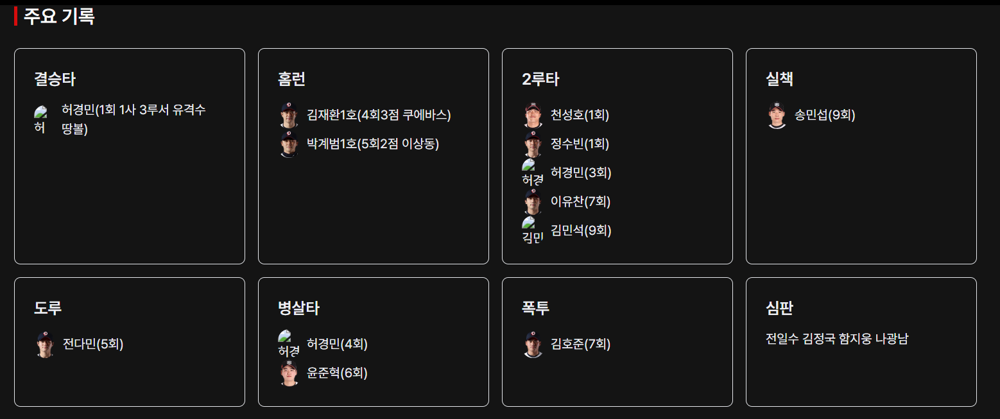
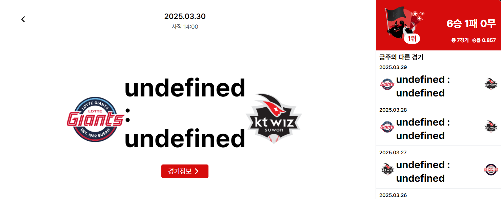
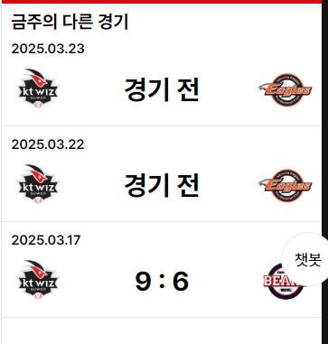

# 발견된 문제점

1. 박스 스코어 오류 - 404 에러 현상
2. 메인 페이지 오류
3. 카카오맵 API가 배포 환경에서 표시되지 않는 오류 → 카카오 맵 API 사용을 위해 카카오 디벨로퍼스 페이지에서 플랫폼 등록

---

# 1. 박스 스코어 오류 해결

## 문제 상황

박스 스코어 페이지에서 날짜 변경 시, 페이지를 새로고침 하도록 되어있다. 로컬에서는 문제가 없으나 배포 환경에서 404 오류가 발생하고 있다.

다른 팀원이 구현한 코드이므로 구조 파악 후 오류 원인 찾고 해결해야 한다.

## 구조 파악

```tsx
const { gameDate, gameKey } = useParams<{
  gameDate: string;
  gameKey: string;
}>();

const [boxscoreDate, setBoxscoreDate] = useState<string | undefined>(gameDate);
const [boxscoreKey, setBoxscoreKey] = useState<string | undefined>(gameKey);
```

params로 `gameDate`, `gameKey` 를 받아 상태 기본값으로 지정한다.

```tsx
const {
  recentMatchData,
  loading: recentLoading,
  error: recentError,
} = useGetRecentMatchScheduleQuery();
```

최근 경기 스케줄을 가져온다

```tsx
useEffect(() => {
  if (recentMatchData?.data.current && !gameDate && !gameKey) {
    setBoxscoreDate(String(recentMatchData.data.current.gameDate));
    setBoxscoreKey(String(recentMatchData.data.current.gmkey));
  }
  if (gameDate && gameKey) {
    setBoxscoreDate(gameDate);
    setBoxscoreKey(gameKey);
  }
}, [recentMatchData, gameDate, gameKey]);
```

`gameDate`와 `gameKey`가 주어졌는지 여부에 따라 박스 스코어를 표시할 경기의 날짜, 키 값을 설정하고자 하는 코드이다.

- `gameDate` 와 `gameKey`가 주어진 경우 → 해당 경기에 대한 박스 스코어
- 주어지지 않은 경우 → 최근 경기에 대한 박스 스코어

박스 스코어 페이지는 메인 페이지에서 ‘경기정보’ 버튼을 누르고 진입하는 경우, `gameDate`와 `gameKey`가 주어진 상태로 접근이 되고, 내비게이션 메뉴에서 직접 접근하는 경우에는 `gameDate`와 `gameKey`가 주어지지 않는다.

```tsx
const {
  data: matchData,
  isLoading,
  isError,
  error,
} = useGetBoxscoreQuery(boxscoreDate || "", boxscoreKey || "");

if (isError || recentError) {
  return (
    <div>
      <p>Error: {error?.message || recentError}</p>
    </div>
  );
}
```

경기 날짜와 키를 바탕으로 경기 정보를 가져오고 에러가 발생하는 경우 에러 메시지를 렌더링한다.

```tsx
const handleDateChange = (direction: "prev" | "next") => {
  if (matchData) {
    const targetSchedule =
      direction === "prev" ? matchData.schedule.prev : matchData.schedule.next;
    if (targetSchedule) {
      const targetDate = targetSchedule.gameDate.toString();
      const targetKey = targetSchedule.gmkey;
      window.location.href = `/game/regular/boxscore/${targetDate}/${targetKey}`;
    }
  }
};
```

- 경기 정보가 존재하는 경우,
- 이전 경기 `prev` 혹은 다음 경기 `next`를 새롭게 표시할 경기로 지정하고자 하는 역할을 하는 코드
- 이전 경기나 다음 경기가 존재하면 해당 경기에 대한 날짜와 키가 있는 url로 사용자를 보내고자 하는 것으로 보인다.

## 개선점

### 1. state를 사용할 필요가 없다.

경기날짜와 경기 키를 상태로 관리하고 있는데 이 컴포넌트에서는 params에서 바로 추출해서 사용하면 되므로 상태로 관리할 필요가 없다. 화살표를 이용해서 경기 정보를 바꾸더라도 url을 변경하여 사용자가 이동되기 때문에 계속 params에서 추출해서 사용하게 된다. 따라서 state에 관련한 코드와 useEffect 코드를 지울 수 있다.

### 2. handleDateChange 함수는 BoxScoreTab 컴포넌트에 선언될 필요가 없다.

이 함수는 자식 컴포넌트(`MatchBoard`)로 props 형태로 전달이 되고 있기 때문에 MatchBoard 컴포넌트 내부에서 선언하면 된다. 그러면 전달되는 props의 개수를 줄일 수 있다.

### 3. window.location.href를 사용하지 않기

당시에 이렇게 구현한 이유를 팀원께 여쭤봤을 땐, 경기날짜와 경기 키를 반영한 url로 이동되었음에도 페이지 내 데이터가 갱신이 되지 않아서 window.location.href를 통해 새로고침을 시켰다고 했다. 지금 state와 useEffect 관련 코드를 지우고 useNavigate를 이용하여 사용자를 갱신된 url로 이동시켰을 때 제대로 데이터가 반영된 것을 확인했다. 아마 state와 관련하여 코드가 꼬이지 않았을까 싶다.

### 4. MatchBoard에 전달되는 props가 너무 많다.

대부분 현재 경기 정보에 대한 데이터를 추출하여 props로 전달하고 있다. 현재 경기 정보만 1개의 props로 전달하고 MatchBoard 컴포넌트에서 뽑아 쓰면 된다. 10개의 props를 4개로 줄일 수 있었다.

### 5. 선수 이미지를 사용하는 ‘주요 기록’ 컴포넌트에서 오류가 발견되었다.

```
Uncaught Error: Rendered more hooks than during the previous render.
```

선수 이미지를 가져오는 hook을 사용할 때 오류가 나고 있다. 이 오류를 이전에도 많이 봤었는데 대부분 이유는 훅을 조건문 뒤에서 사용하거나 컴포넌트의 최상위에서 호출하지 않았기 때문이었다.

선수 이미지를 사용하는 컴포넌트에서 다음과 같은 문제를 찾았다.

```tsx
const handlePlayerImage = (playerName: string) => {
  let team = "";
  const name = playerName.replace(/\d+/g, "").trim(); //이름에서 숫자 제외

  // 홈 팀 타자, 투수 확인
  if (
    data.hbatters.find(batter => batter.name === name) ||
    data.hpitchers.find(pitcher => pitcher.name === name)
  ) {
    team = data.schedule.current.homeKey;
  }

  // 원정 팀 타자, 투수 확인
  if (
    data.vbatters.find(batter => batter.name === name) ||
    data.vpitchers.find(pitcher => pitcher.name === name)
  ) {
    team = data.schedule.current.visitKey;
  }

  const {
    data: playerImage,
    isLoading,
    isError,
    error,
  } = usePlayerImage(team, name);

  if (isLoading) return <div>Loading...</div>;
  if (isError || !playerImage) {
    console.log(error?.message);
    return (
      
    );
  }

  return (
    
  );
};
```

`usePlayerImage` 가 선수 이미지를 가져오는 쿼리 훅이다. 그런데 **훅을 함수 안에서 사용하고 있기 때문에 문제**가 생겼다. 선수가 홈 팀 선수인지, 원정 팀 선수인지 알아낸 후에 이미지를 가져오려고 한 것인데 훅은 **최상위에서 호출해야** 하기 때문에 문제가 생겼다.

주요 기록으로부터 데이터들을 다 분류 시켜둔 이후에 선수 이미지가 필요한 것들을 종합해 쿼리하는 것이 옳은 순서로 보인다.

선수 이미지가 필요한 데이터를 정리하기 위해서

1. 주요 기록 별 선수들의 이름을 추출한다. `천성호(1회) 정수빈(1회) 허경민(3회) 이유찬(7회) 김민석(9회)` 이러한 형태를 띄므로 `천성호, 정수빈, 허경민, 이유찬, 김민석`으로 추출될 수 있도록 한다.
2. 각 선수의 팀을 알아낸다. API를 호출할 때 팀 정보가 필요하기 때문에 알아내야 한다. 해당 경기에 출전한 선수들이기 때문에 KT 기록 내에 있는 선수라면 KT 선수이고 아닌 경우에는 상대 팀 선수이다.
3. 해당 선수의 이름과 팀 정보가 담긴 배열을 가지고 useQueries를 통해 이미지를 병렬적으로 가져온다.



문제 없이 이미지가 호출되는 것을 볼 수 있다. API를 통해 호출되는 선수들의 이미지는 작년 시즌을 기준으로 크롤링 된 데이터이다. 일부 선수들은 이제 막 FA로 이적되었기 때문에 DB에 업데이트 되지 않아 엑스박스가 뜬다.

---

# 2. 메인 페이지 오류



이 현상을 발견한 시점 기준 날짜는 3월 19일이다. 그러나 메인 페이지에 표시되는 경기 날짜는 3월 30일이다. 아직 진행된 경기의 결과가 아니므로 정보가 없어 undefined가 잔뜩 표시된다.

원인은 해당 달의 경기 스케줄을 기준으로 메인 페이지에 표시하고 있기 때문이다. 메인 페이지에 표시될 경기는 ‘최근 경기’를 기준으로 표시되어야 한다.

## 구조 파악

```tsx
useGetRecentMatchScheduleQuery();
const [matchIndex, setMatchIndex] = useState<number>(0);
const { recentMonth, currentMonth } = useMatchStore();
const { matchData, isLoading, isSuccess, isError, error } =
  useGetMatchScheduleQuery({
    currentMonth: recentMonth || currentMonth,
  });

useEffect(() => {
  if (isSuccess) {
    setMatchIndex(matchData.length - 1);
  }
}, [isSuccess, matchData.length]);
```

이게 현재의 코드인데, 최근 경기 스케줄을 가져오는 useGetRecentMatchScheduleQuery 훅을 호출하여 전역 상태인 `recentMonth`에 최근 경기의 달을 저장하고 있다. 그 후에 특정 달에 대한 경기 스케줄을 가져오고 경기 결과의 마지막 요소를 가리키도록 인덱스 설정을 하고 있다.

원래 메인 페이지에 표시되는 경기 정보는 최근 경기를 보여주도록 의도되어 있다. 그리고 화살표를 통해 전후경기에 대한 정보를 확인할 수 있고, 사이드에서 금주의 경기를 확인할 수 있도록 의도되었다.

개발 당시 뭔가 잘못 생각하고 코드를 설계한 것 같다. 해당 달의 경기를 가지고 인덱싱해서 표시하도록 작성이 되어있는데 이를 고쳐야한다.

### 방법

1. 메인에 표시되는 경기는 최근 경기 API를 이용하여 날짜를 가져오고, 경기 정보를 렌더링하기 위해 필요한 데이터는 박스스코어 API로 데이터 요청
2. 전후 경기에 대한 정보는 사용자가 화살표 버튼을 눌렀을 때 해당 경기가 표시 되도록 함. (prefetching을 이용하여 로딩 UI 노출 감소)
3. 금주의 경기를 위해 해당 달의 경기 정보는 그대로 사용한다. 이 달의 경기 정보는 recentMatches 컴포넌트에서 불러오도록 수정한다.

## 개선점

### 1. 메인에 경기를 표시하는 방법 변경

기존의 방식은 한 달의 경기 스케줄을 가져온 후 인덱싱하는 방법이었다. 그 이유는 데이터를 한 번에 불러와서 경기를 찾게 되면 여러 번의 데이터 호출이 필요 없을 것이라 생각했다. 이미 시즌이 다 끝나고나서 개발을 하다보니 최근 경기 정보를 그 달의 마지막 경기로 착각하고 개발을 했던 것 같다. 그 결과, 시즌이 시작되고 나서 아직 진행하지 않은 경기의 정보를 보여주도록 화면이 표시되고 있었다.

따라서, 최근 경기 날짜를 가져온 후 그 날짜를 가지고 박스 스코어 데이터를 가져와서 화면에 표시하도록 변경하였다.

```tsx
const [gameDate, setGameDate] = useState<string | undefined>(undefined);
const [gameKey, setGameKey] = useState<string | undefined>(undefined);
const {
  data: recentMatchData,
  loading: recentLoading,
  error: recentError,
  isSuccess: recentSuccess,
} = useGetRecentMatchScheduleQuery();

const {
  data: boxscoreData,
  isLoading: boxscoreLoading,
  isError: boxscoreError,
  prefetchBoxscoreQuery,
} = useGetBoxscoreQuery(gameDate || "", gameKey || "");

useEffect(() => {
  if (recentSuccess) {
    setGameDate(recentMatchData?.current.displayDate);
    setGameKey(recentMatchData?.current.gmkey);
  }
}, [recentSuccess, recentMatchData]);
```

`prefetchBoxscoreQuery`를 이용해서 전후 경기의 정보를 prefetch함으로써 로딩 UI 노출 횟수를 줄이도록 구현하였다.

### 2. 금주의 경기

금주의 경기는 이번 달 경기 정보를 불러와서 현재 경기를 기준으로 그 주의 다른 경기를 표시한다. `RecentMatches` 라는 컴포넌트에서 렌더링하는데, 이번 달 경기를 부모 컴포넌트에서 불러오던 것을 `RecentMatches` 컴포넌트 내부에서 API 호출을 하도록 변경하였다.

여기서도 경기가 진행되지 않는 경기들에 대한 예외 처리가 빠져있었기 때문에 데이터 내부의 `outcome`이라는 프로퍼티를 확인하여 경기 전인 경우에는 ‘경기 전’이라고 표시될 수 있도록 변경하였다.



## 그 외의 문제

- 화살표를 통해 경기 정보를 바꿀 때, 전후 경기 연결이 잘못되어 있어 제대로 이동이 되지 않는 경우가 있다. 이것은 데이터 상의 문제이고 데이터 자체가 KT로부터 넘어오기 때문에 직접 해결할 수 없는 문제였다.
