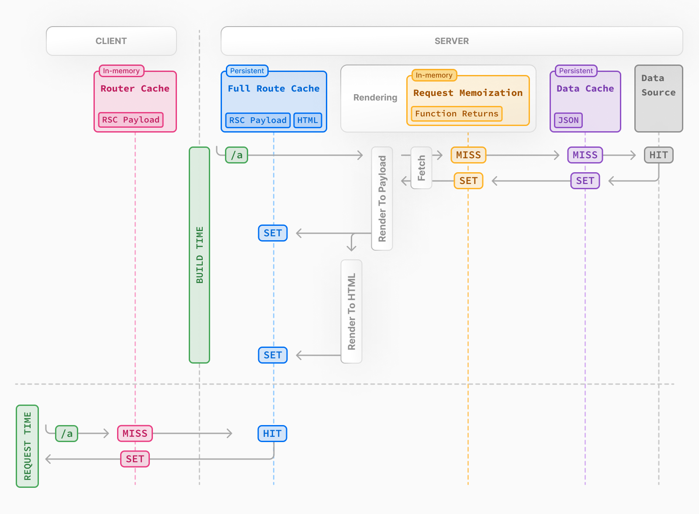
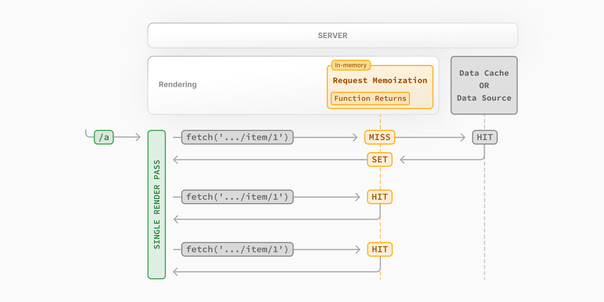
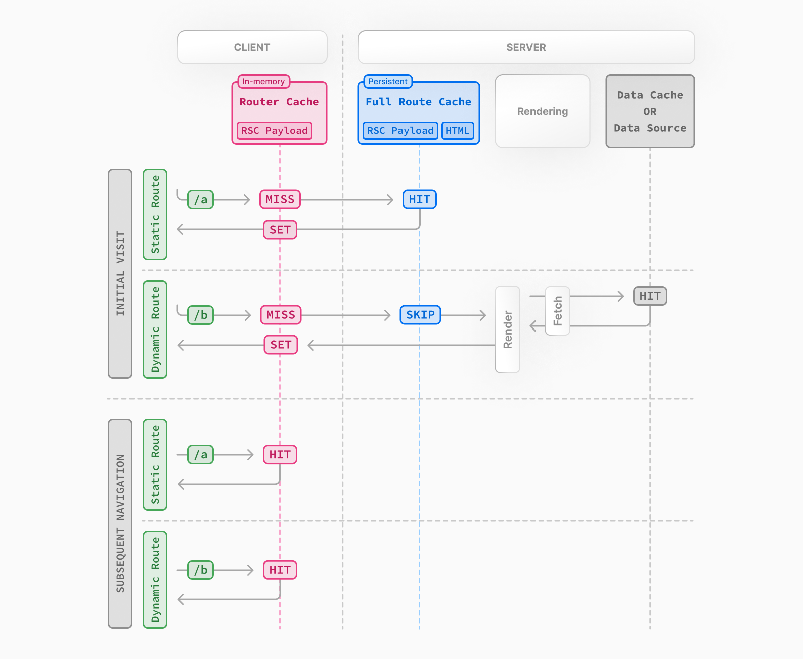

Next.js는 렌더링 작업과 데이터 요청을 캐싱하여 애플리케이션의 성능을 향상시키고 비용을 절감합니다. 따라서 Next.js가 제공하는 캐싱을 잘 활용하면 좋은 성능의 애플리케이션을 구현할 수 있습니다.

# 캐싱의 종류

Next.js는 4 종류의 캐싱을 제공합니다.

1. Request Memoization
2. Data Cache
3. Full Route Cache
4. Route Cache



Request Memoization, Data Cache, Full Route Cache는 서버 측에서 제공하는 캐시이고 Route Cache는 클라이언트 측에서 제공하는 캐시입니다.

각각 무슨 역할을 하는 캐시인지 정리해보도록 하겠습니다.

# 1. Request Memoization

한국말로 번역하면 ‘요청 메모이제이션’입니다. 여기서 의미하는 ‘요청’은 무엇일까요? 동일한 URL로 동일한 옵션을 사용한 fetch 요청을 의미합니다. 즉, **동일한 페이지 렌더링 내의 여러 컴포넌트에서 같은 경로로 데이터를 요청할 때** 요청 결과를 캐싱해두었다가 제공한다는 것입니다.

## 캐시 수명

서버 요청이 시작되어 렌더링을 마칠 때까지 존재하며 렌더링을 마치고 클라이언트에 HTML을 전송하면 초기화 됩니다.

## 얻는 효과

여러 컴포넌트에서 같은 데이터를 필요로 할 때, 트리 상단에서 아래로 props로 전달할 필요가 없습니다. 즉 같은 페이지 내 다른 컴포넌트에서 fetch 요청을 다시 보내면 이미 캐싱된 데이터를 바로 제공받을 수 있습니다.



## 주의할 점

- 요청 메모이제이션은 fetch 요청 중 GET 요청에만 적용됩니다.
- React 컴포넌트 트리에 포함되는 곳에서만 캐싱을 활용할 수 있습니다. Route Handler와 같이 React 컴포넌트 트리에 포함되지 않는 곳에서는 요청 메모이제이션을 사용할 수 없습니다.
- fetch가 아닌 데이터 요청(다른 데이터베이스 클라이언트 등)을 사용할 때는 React.cache를 통해 메모이제이션을 진행할 수 있습니다.

# 2. Data Cache

**서버 요청**과 **배포** 간에 데이터 페치를 지속적으로 **유지**하는 내장 데이터 캐시를 의미합니다. 즉, 요청 메모이제이션과 다르게 페이지 간, 그리고 요청 간 캐시를 제공할 수 있음을 의미합니다.

기본적으로 fetch를 사용하는 요청은 캐시가 되지 않습니다. 따라서 cache옵션이나 revalidate 옵션을 사용하여 캐시에 대한 설정을 해야합니다.

## 옵션

- ‘force-cache’: 응답 결과를 데이터 캐시에 저장하고 메모이제이션 합니다.
- ‘no-store’: 매 서버 요청마다 데이터 소스에 접근하여 데이터를 가져옵니다. 그러나 요청 메모이제이션은 적용됩니다.

## 데이터 캐시와 요청 메모이제이션의 차이점

**요청 메모이제이션**은 **단일 요청의 효율**을 높이는 것이고, **Data Cache**는 **여러 요청 간의 효율**을 높입니다.

예를 들어, 페이지 A와 B에서 동일한 데이터 D를 사용한다고 가정해보겠습니다. 요청 메모이제이션은 단일 요청에 대한 캐시를 제공합니다. 즉 하나의 렌더링을 하는 과정에서만 유효합니다. 하나의 페이지 A를 렌더링 할 때 페이지 내부의 여러 컴포넌트에서 데이터 D를 사용할 때 캐시를 활용하는 것입니다. 페이지 A에 대한 렌더링을 마치고나서는 요청에 대한 캐시가 초기화되고 페이지 B를 렌더링하려고 데이터 D를 가져오는 작업에서는 새로 캐시를 하게 됩니다.

그러나 데이터 캐시는 페이지 A를 렌더링 할 때 사용한 데이터 D에 대한 캐시를 유지하고 있어 페이지 B를 렌더링 할 때도 데이터 D를 가져오는 요청을 보내지 않고도 바로 데이터 D를 가져와 렌더링할 수 있습니다.

## 캐시 수명

들어오는 요청과 배포 간에 지속되며 따로 재검증을 하거나 선택 해제하지 않는 한 유지됩니다.

## 캐시 재검증

캐시된 데이터는 두 가지 방법으로 재검증 될 수 있습니다.

- 시간 기반 재검증: 일정 시간이 지나면 재검증합니다.
- 온디맨드 재검증: 태그 기반, 경로 기반으로 필요할 때 재검증할 수 있습니다.

### 시간 기반 재검증

next.revalidate 옵션을 이용하거나 Route Segment Config 옵션을 통해 특정 시간이 지나면 캐시 재검증을 수행할 수 있습니다.

```tsx
// 최대 한 시간마다 재검증
fetch("https://...", { next: { revalidate: 3600 } });
```

### 온디맨드 재검증

데이터 경로(revalidatePath)나 캐시 태그(revalidateTag)를 이용하여 필요할 때 재검증을 거칠 수 있습니다.

```tsx
revalidatePath("/");
```

```tsx
// 특정 태그가 있는 항목을 재검증
revalidateTag("a");
```

# 3. Full Route Cache

Next.js는 빌드 타임이나 재검증 시, **경로의 렌더링 결과(RSC 페이로드와 HTML)를 서버에 캐시**합니다. 이는 요청마다 서버에서 렌더링하는 대신 캐시된 경로를 제공할 수 있는 최적화로, 페이지 로드를 더 빠르게 만듭니다.

Full Route Cache를 이해하기 위해서는 Next.js가 페이지를 렌더링하는 방식을 이해해야 합니다.

## Next.js가 페이지를 렌더링하는 방식

- Next.js는 React API를 이용하여 렌더링을 조율합니다.
- React 서버 컴포넌트를 React Server Component Payload라는 이진 데이터 형식으로 렌더링합니다.
  - RSC 페이로드는 서버 컴포넌트의 렌더링 결과, 클라이언트 컴포넌트가 렌더링 되어야 할 위치의 플레이스홀더 및 해당 자바스크립트 파일에 대한 참조, 클라이언트 컴포넌트로 전달될 props 정보를 포함합니다.
- RSC 페이로드와 클라이언트 컴포넌트 자바스크립트 명령을 수행하여 서버에서 HTML을 렌더링 합니다.
  - 클라이언트 컴포넌트의 자바스크립트 코드를 수행한다는 의미가 아닙니다. 클라이언트 컴포넌트를 브라우저에서 실행하기 위해 **필요한 자바스크립트 파일의 경로 및 로드 명령**을 HTML에 포함한다는 의미입니다.

## 서버 사이드 렌더링 이후에는…

- 클라이언트에서 HTML은 컴포넌트의 ‘상호작용이 없는 초기 미리보기’를 제공하는데 사용됩니다.
- 그 후에 RSC 페이로드를 이용하여 **서버가 보낸 컴포넌트 구조**와 **클라이언트가 예상하는 컴포넌트 구조**를 서로 비교하여 동일하게 맞추는 과정을 수행합니다.
- 그리고 클라이언트에서 실행할 자바스크립트 코드를 실행하여 애플리케이션을 상호작용이 가능하게 만듭니다.
- React Server Component Payload는 클라이언트 측 Router Cache에 저장됩니다.
  - 이 Router Cache는 이전에 방문한 경로를 저장하고 미래의 경로를 프리페치하여 탐색 경험을 향상시키는 데 사용됩니다.
  - 후속 탐색 또는 프리페치 중에 Next.js는 React Server Components Payload가 Router Cache에 저장되어 있는지 확인합니다. 그렇다면 서버에 새 요청을 보내는 것을 건너뜁니다.

### 정적 렌더링과 동적 렌더링

경로가 빌드 시 캐시되는지 여부는 정적으로 렌더링되는지 동적으로 렌더링되는지에 따라 다릅니다. 정적 경로는 기본적으로 캐시되지만, 동적 경로는 요청 시 렌더링되며 캐시되지 않습니다.



동적 렌더링은 사용자에게 개인화된 데이터가 있거나 요청 시에만 알 수 있는 정보(예: 쿠키 또는 URL의 검색 매개변수)가 있는 경로에 유용합니다.렌더링 중에 동적 함수 또는 캐시되지 않은 데이터 요청이 발견되면, Next.js는 전체 경로를 동적으로 렌더링하도록 전환합니다.

- 동적 함수: 사용자의 쿠키, 현재 요청 헤더 또는 URL의 검색 매개변수와 같이 요청 시에만 알 수 있는 정보에 의존하는 함수
  - `cookies()`, `headers()`, `unstable_noStore()`, `unstable_after()`, `searchParams` props
    - `unstable_noStore` 함수: 정적 렌더링을 선택적으로 제외하고 특정 컴포넌트가 캐시되지 않도록 선언적으로 설정
    - `unstable_after` 함수: 함수는 응답이 완료된 후 작업을 실행하도록 예약

# 4. 클라이언트 사이드 Router Cache

하나의 라우트 세그먼트를 구성하는 구성 요소(레이아웃, 페이지, 로딩 등)들의 RSC 페이로드를 브라우저 메모리에 저장해두고 사용하는 캐시입니다.

Next.js는 **방문한 경로 세그먼트를 캐시**하고 **사용자가 탐색할 가능성이 있는 경로를 prefetch**합니다. 이는 즉시 뒤로/앞으로 탐색을 가능하게 하고, 탐색 간 전체 페이지 리로드를 없애며, React 상태 및 브라우저 상태를 유지합니다.

## Router Cache를 사용하면

- 레이아웃: 레이아웃의 RSC 페이로드를 캐시합니다. 즉 같은 레이아웃을 사용하는 페이지 A에서 페이지 B로 이동하더라도 캐시된 레이아웃을 재사용하고 변경된 페이지 영역만 새로 가져오거나 렌더링합니다.
- 로딩 상태: `loading.js`와 같은 파일의 렌더링 결과를 캐시합니다. 만약 새로운 페이지의 데이터를 즉시 사용할 수 없다면(예: 서버에서 재검증이 필요할 때), 브라우저는 서버 응답을 기다리는 대신 캐시된 로딩 상태를 즉시 표시합니다.
- 페이지: 기본적으로 캐시되지 않습니다.
  - 일반적인 클라이언트 측 탐색(예: `<Link>` 클릭) 시, 페이지 세그먼트의 RSC 페이로드는 Router Cache에 저장되지만, 기본적으로 즉시 만료됩니다(stale). 페이지 데이터가 가장 최신 상태여야 하기 때문에, 기본적으로 최신 데이터를 보장하기 위해 캐시를 사용하지 않습니다.
  - 그러나 브라우저 상에서 앞으로 가기, 뒤로 가기를 눌렀을 땐 Router Cache에 저장된 RSC 페이로드를 재사용합니다.

# 결론

Next.js가 제공하는 캐싱에 대해 잘 이해하면 좋은 성능의 애플리케이션을 구현할 수 있습니다. 실제로 프로젝트를 하며 모든 페이지가 동적 렌더링이 되는 문제를 겪었고 그 과정에서 Next.js의 캐싱에 대해 이해하는 과정이 필요했습니다. 동적 함수인 cookies 함수가 루트 레이아웃에서 사용되었을 때 모든 페이지가 동적으로 렌더링 되는 문제를 발견하고 해결할 수 있었습니다.
그 외에도, 조금 더 캐시를 잘 활용할 수 있는 부분이 있는지 살펴보고 개선하기 위해 캐싱에 대한 내용을 정리해보았습니다.
