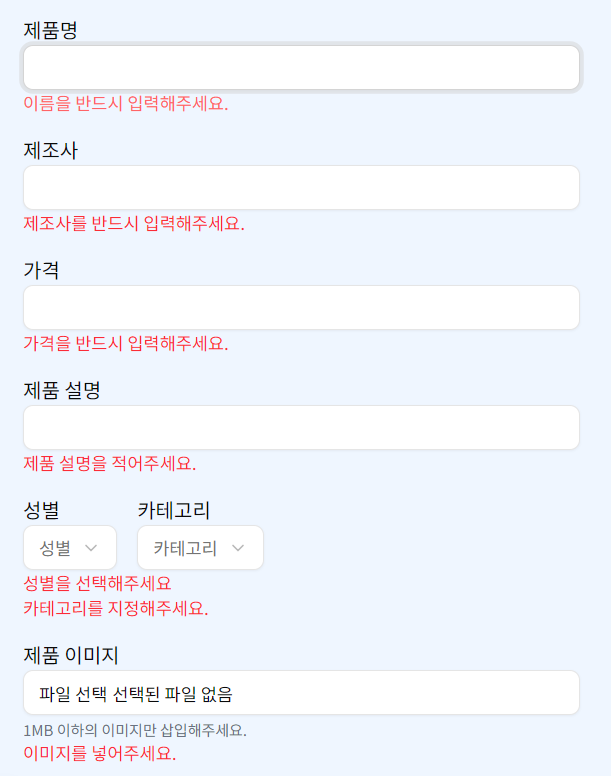

# 기존 방식

기존에는 form과 `useActionState`를 통해 폼을 관리했다. 이 방식을 사용하면 서버에서 유효성 검사를 진행할 수 있다.

클라이언트 유효성 검사를 따로 구현하지 않았으므로 올바른 형식의 데이터가 아니더라도 불필요하게 서버 요청을 하게 된다.

클라이언트 유효성 검사를 사용해서 클라이언트 단에서 1차로 요청을 방지하고, 안정성을 위해 서버에서 한 번 더 검사하는 방식으로 폼 관리 방식을 바꾸었다.

# react-hook-form으로 바꾸자

```tsx
const {
  register,
  handleSubmit,
  formState: { errors },
  control,
  reset,
} = useForm<ProductFormData>({ resolver: zodResolver(productFormSchema) });
```

react-hook-form(이하 RHF)과 zod를 함께 사용하여 클라이언트 유효성 검사 로직을 구현했다.

## zod 스키마

```tsx
import { z } from "zod/v4";

export const productFormSchema = z.object({
  name: z.string().trim().min(1, "이름을 반드시 입력해주세요."),
  brand: z.string().trim().min(1, "제조사를 반드시 입력해주세요."),
  price: z.string().trim().min(1, "가격을 반드시 입력해주세요."),
  description: z.string().trim().min(1, "제품 설명을 적어주세요."),
  category: z
    .string("카테고리를 지정해주세요.")
    .trim()
    .min(1, "카테고리를 지정해주세요."),
  sex: z.string("성별을 선택해주세요").trim().min(1, "성별을 선택해주세요"),
  image: z
    .file("이미지를 넣어주세요.")
    .mime(["image/gif", "image/jpeg", "image/png", "image/webp"])
    .refine(file => file.size <= 1024 * 1024, "1MB 이하의 이미지를 넣어주세요"),
});

export type ProductFormData = z.infer<typeof productFormSchema>;
```

RHF의 resolver가 이 스키마를 가지고 유효성 검사를 진행하게 된다.

### 결과



# 실제 폼 제출은 useTransition과 함께

```tsx
const [isPending, startTransition] = useTransition();

const onSubmit: SubmitHandler<ProductFormData> = data => {
  const formData = generateFormData(data);

  startTransition(async () => {
    const result = await insertProduct(formData);

    if (result.success) {
      setPickedImage(null);
      setSex("men");
      reset();
      toast.success("제품이 추가되었습니다.");
      invalidateCache();
    }

    if (result.errors) {
      toast.error("제품 추가 중 문제가 발생하였습니다.", {
        description: result.errors.message,
      });
    }
  });
};
```

공식 문서에 따르면 `useTranstion`은 UI의 일부를 백그라운드에서 렌더링 할 수 있도록 해주는 훅이다.

## useTransition의 장점

### 1. 트랜지션을 사용하는 동안 사용자의 인터랙션을 차단하지 않는다.

비용이 큰 작업을 수행할 때, 상태를 사용하면 작업이 끝날 때까지 사용자의 인터랙션은 차단된다. `useTransition`은 이런 점을 보완하기 위해 백그라운드에서 작업을 수행하고 사용자의 인터랙션을 차단하지 않는다.

[useTransition – React](https://ko.react.dev/reference/react/useTransition#examples)

이 링크의 예제 코드를 살펴보면 차이를 명확하게 알 수 있다.

### 2. useEffect를 사용하지 않고도 사이드 이펙트를 수행할 수 있다.

`useTransition`을 사용하지 않으면 서버 액션으로부터 반환된 값을 상태로 관리하고 사용자에게 toast 알림을 보내기 위해 `useEffect`를 사용해야 했다. `useTransition`은 상태 업데이트와 더불어 사이드 이펙트까지 수행할 수 있기 때문에 `useEffect`를 사용하지 않고도 `startTransition` 함수 안에서 결과를 알릴 수 있다.

# RHF을 쓰면서 느낀 장점

- **간편한 폼 상태 관리**: 수동으로 상태를 선언하고 이벤트 핸들러를 작성할 필요 없이 register를 통해 폼 필드를 등록하고 상태를 관리할 수 있다.
- **복잡한 로직 지원**: `Controller` 컴포넌트를 사용하면 Shadcn UI의 `Select` 같은 컴포넌트도 RHF의 폼 상태에 통합할 수 있다. 필드 props(value, onChange 등)를 통해 자동으로 값을 추적하고 업데이트하므로 별도로 상태를 선언하고 관리할 필요가 없어 코드가 간결해졌다.

### Selector 선택값 버그 해결

Shadcn UI의 `Selector`를 단독으로 사용할 때는 `reset()` 호출 후에도 UI가 이전 선택값을 표시하는 버그가 있었다. `Controller`로 감싸면 RHF가 폼의 전체 생명주기를 관리하면서 `reset()` 호출 시 `field.value`를 제대로 업데이트하여 이 문제가 해결되었다.

# RHF로 바꾸면서 생각해본 것

클라이언트 측 유효성 검사를 통과한 데이터만 서버로 전송되기 때문에 불필요한 네트워크 요청이 줄어든다. 다만 클라이언트와 서버 양쪽에서 유효성 검사를 수행하는 것에 대한 오버헤드가 우려되었다.

하지만 다음과 같은 이유로 합리적인 선택으로 판단되었다.

- 클라이언트 측 유효성 검사를 추가해도 그 오버헤드는 미미하다.
- 불필요한 서버 요청을 줄일 수 있다.
- 서버 측에서 유효성 검사를 진행하는 것은 데이터 무결성 측면에서 중요하다.

# react-hook-form과 zod를 이용해서 이미지를 검사하기

제품이나 프로필 사진을 업데이트 할 때 이미지를 입력하게 된다. 이 때, 이미지 파일을 삽입했는데도 불구하고 `File` 타입이 아니라는 검사 실패 결과가 계속해서 나타났다.

type이 파일인 input에 파일을 넣게 되면 `FileList` 객체가 값으로 들어간다. 그러나 zod가 검사하는건 파일 자체이기 때문에 따로 `File`을 추출하는 작업을 해야 한다.

```tsx
<Controller
  name="image"
  control={control}
  render={({ field }) => (
    <Input
      name={field.name}
      type="file"
      accept="image/*"
      className="bg-white"
      onChange={e => {
        const file = e.target.files?.[0];
        field.onChange(file);
        onChangeImage(e);
      }}
    />
  )}
/>
```

---

## 마치며

React Hook Form과 Zod의 조합은 폼 관리를 크게 개선시켜주었다. 특히 유효성 검사를 통한 타입 안정성, 폼 상태 관리가 하나의 흐름으로 통합되어 개발 경험이 훨씬 좋아졌다. 복잡한 폼을 다루는 프로젝트라면 적극 추천한다.
